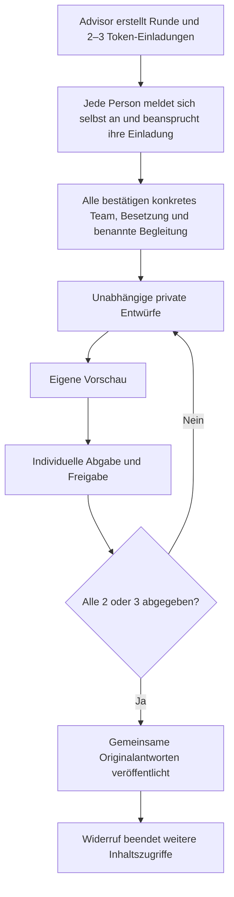

# Phase 7.5b – Advisor / Accelerator Team Intake MVP

Stand: 03.10.2026. Grundlage: aktueller Code, laufende lokale Supabase-DB und die drei Phase-7.5-Audit-/Produktdokumente. Der Branch basiert auf `24ad674` (aktueller `origin/main` beim Audit) plus dem vorausgehenden Dokumentationscommit `2c9d5b7`. Keine Assessment-Items, Dimensionen, Scores, Legacy-Auswertungen oder Phase-8-Instrumente geändert.

## 1. Reviewer-Entscheidung und vorangehender Audit

Das vorhandene Org-Modell (`advisor_orgs`, `advisor_org_members`) und `has_advisor_person_access` ermöglichen organisationsweite Nutzung wirksamer Org-Freigaben. Diese Semantik wird für Team Context ausdrücklich **nicht** übernommen.

Eine kleine Zuordnung `team_intake_reviewers(round_id, user_id)` reicht aus; eine allgemeine Berechtigungsplattform ist nicht nötig:

- Persönlicher Halter: exakt der erstellende Advisor.
- Organisation: Ersteller plus ausdrücklich ausgewählte aktive Mitglieder. Alle Empfänger stehen vor Bestätigung und Abgabe namentlich in der Runde. Andere aktive Org-Mitglieder haben weder Metadaten- noch Inhaltszugriff.
- Bei jedem Reviewer-Read werden Zuordnung, aktive Organisation und aktuelle aktive Org-Mitgliedschaft geprüft. Eine entzogene Reviewer-Mitgliedschaft beendet die ganze Runde dauerhaft. Wiederaufnahme eines Mitglieds reaktiviert keine alte Freigabe.
- Die Reviewer-Liste ist eingefroren. Neue Reviewer benötigen eine neue Runde und neue Founder-Zustimmungen. Keine öffentliche Verwaltungs-/Zuweisungsfunktion für nachträgliche Rechteausweitung.
- Founder können nicht zugleich Reviewer derselben Runde sein; auch der Token-Claim prüft dies erneut.

Die bestehenden persönlichen/Org-Profilfreigaben, Legacy-A/B-Team-Invites und Team-Reviews behalten ihre bisherige Semantik. Ein Intake verleiht keine Profil-, Assessment- oder Setup-Rechte.

## 2. Datenmodell und Migration

Neue additive Migration: `supabase/migrations/20261104120000_team_context_intake.sql`. Keine historischen Migrationen geändert, keine vorhandenen Daten umgedeutet.

| Tabelle | Zweck |
|---|---|
| `team_intake_rounds` | Eigener Vorgang mit Teamreferenz, eingefrorenem Vorhabennamen, Selection/Development, persönlichem oder Org-Halter, Ersteller, Status, Zeitpunkten und festem `schema_version = 1` |
| `team_intake_reviewers` | Exakter Empfängerkreis der Begleitung |
| `team_intake_participants` | Zwei/drei Einladungsslots; E-Mail, später User-ID, Hash, Ablauf-, Claim- und Bestätigungszeitpunkt |
| `team_intake_answers` | Je Autor einmal: Teamgeschichte, freiwillige modusspezifische Perspektive, individuelle Abgabe |
| `team_intake_pair_answers` | Gerichtete Perspektive Autor → anderes eingefrorenes Mitglied; keine Selbstreferenz |
| `team_intake_private_notes` | Separater freiwilliger Gesprächswunsch und kurze vertrauliche Notiz |

Die Team-ID darf vor der Einladung/Bestätigung fehlen. Vor Antworten ist ein konkretes `founder_team` mit genau dieser bestätigten Besetzung zwingend. Ein anderes Vorhaben bekommt einen eigenen Team-/Rundenkontext; keine Ableitung allein aus dem globalen A/B-Beziehungspaar. Bestehende kanonische Founder-Teams werden wiederverwendet, wenn wirksamer Teamzugang besteht und sämtliche eingegebenen E-Mail-Adressen exakt zur Mitgliedschaft passen.

Vorhandene Teams werden dem Advisor nur angeboten bei einer beidseitig freigegebenen A/B-Advisor-Beziehung, vollständig freigegebenem Team-Setup oder einem bereits veröffentlichten Intake mit weiterhin wirksamem Reviewer-Zugriff. Einzelne Personenfreigaben werden nicht zu vermeintlichen Teamrechten zusammengesetzt. Für vorhandene Teams müssen ebenfalls alle E-Mail-Adressen eingegeben werden; die Auswahl legt keine weiteren Account-Adressen offen.

## 3. Intake- und Einladungslebenszyklus



- Neue Route `/advisor/intake/new`, Übersicht `/team-intake`, Runde `/team-intake/[roundId]`, Token-Claim `/team-intake/invite/[token]`.
- Dashboard und Advisor-Dashboard erhalten einen kleinen Team-Context-Einstieg. Intake-Routen sind `noindex, nofollow` und in `robots.ts` ausgeschlossen.
- 24 zufällige Tokenbytes, SHA-256 nur in der DB, 14 Tage Gültigkeit, einmaliger Claim. E-Mail muss mit einer bereits bestätigten Auth-E-Mail übereinstimmen. Keine unauthentifizierte Vorschau von Namen/Teamdaten.
- Ohne Konto nutzt die Einladung das bestehende Magic-Link-Registrierungsmuster. Der präzise Intake-Tokenpfad wurde in die bestehende Account-Erlaubnis aufgenommen. Post-Login kehrt zum Intake zurück und erzwingt keine fachfremden Assessments oder persönliche Profildaten.
- Der Advisor erzeugt keine Accounts und keine Antworten. Ein nicht angenommenes Slot ist keine Founder-Mitgliedschaft. Erst alle bestätigten Claims erzeugen ein neues kanonisches Team oder öffnen die bestehende Runde.
- E-Mails folgen dem vorhandenen `lib/email/send*Email.ts`-/Resend-Muster. Sie enthalten ausschließlich generischen Zweck und persönlichen Einladungslink, keine Antworten oder privaten Hinweise.
- Versandfehler rollen die gespeicherte Einladung nicht zurück. Der Ersteller sieht den Versandstatus und kann den persönlichen Link weitergeben. Für noch nicht angenommene Slots kann er einen neuen Token erzeugen; der alte ist dann ungültig. Rohlinks werden nur in dieser autorisierten Versandantwort angezeigt, nicht gespeichert oder geloggt.
- Pro Ersteller maximal 30 neue Runden pro Tag. Kein allgemeines Notification-System, keine Queue, kein Reminder-Cron.

## 4. Zwei und drei gleichberechtigte Founder

Eine Runde enthält genau zwei oder drei eindeutige E-Mail-Adressen und später eindeutige User-IDs. Jede Person beansprucht und bestätigt ausschließlich ihren eigenen Slot. Niemand stimmt stellvertretend zu. Eine vierte Person wird abgewiesen.

Bei zwei Foundern entstehen zwei gerichtete Perspektiven. Bei drei Foundern sechs: A→B, A→C, B→A, B→C, C→A, C→B. Pro Person gibt es einen gemeinsamen Faktenblock und einen kurzen Block je Gegenüber, keine sechs vollständigen Fragebögen. Ein fehlender dritter Beitrag bleibt „noch nicht abgegeben“; zwei von drei ergeben keinen vollständigen Report.

## 5. Faktenkern

Überschrift: **Wie seid ihr als Gründungsteam zusammengekommen?**

- **Je Autor teamweit:** Entstehung der konkreten Besetzung, ungefährer Beginn der Arbeit am Vorhaben, ob das Vorhaben schon vorher existierte, optionaler Kontext.
- **Je Autor und Gegenüber:** Woher bekannt, ungefähr seit wann, vorherige gemeinsame Arbeit ja/nein, kurzer Kontext bei Ja. So kann A B seit Jahren und C erst seit Monaten kennen.
- Nur dieser kurze Kern ist zur Abgabe erforderlich. Ungefähre Angaben oder „nicht genau bekannt“ sind möglich. Bei „Anders“ bzw. früherer Zusammenarbeit wird eine kurze Erläuterung verlangt.
- Auswahlmöglichkeiten werten weder Herkunft noch Bekanntschaftsdauer. Es gibt keine Nachweis-, Qualitäts- oder Reifelogik.
- Die DB akzeptiert nur festgelegte Schlüssel, Typen und Auswahlwerte. Freitexte sind auf 1.500 Zeichen begrenzt; keine freie JSON-Ablage für beliebige Zusatzdaten.

## 6. Selection und Development

Selection: freiwillige Wertschätzung, konkreter Beitrag/Stärke und Ergänzung je Gegenüber; einmal je Autor Gründungsmotivation sowie offene Themen und optionaler Text. „Aktuell nichts davon“ und „lieber im Gespräch“ sind jeweils exklusive Auswahlmöglichkeiten.

Development: freiwillig, was gut funktioniert, was teamweit klarer werden sollte, Wertschätzung der Arbeitsweise, Ergänzung im Alltag, Klarheit im Paar und noch wenig genutzte Stärke.

In einer späteren Development-Runde desselben Teams kann jede Person ihre **eigenen Fakten** aus einer früheren, weiterhin zugänglichen veröffentlichten Runde bewusst übernehmen. Andere Personen, Reflexionen, private Hinweise und Freigaben werden nicht kopiert. Die aktuelle Besetzung und die neue Freigabe bleiben zwingend.

## 7. Gemeinsamer und vertraulicher Bereich

Entwürfe lesen ausschließlich ihre Autoren. Reviewer sehen vor vollständiger Veröffentlichung nur Namen/Besetzung und organisatorischen Fortschritt. Auch Kategorien offener Punkte sowie Existenz oder Inhalt privater Hinweise sind nicht in Metadaten enthalten.

Die eigene Vorschau zeigt die eigenen gemeinsamen Antworten und den klar abgetrennten vertraulichen Hinweis. Die explizite Abgabe umfasst die gemeinsame Freigabe nach allen Abgaben und die separate Freigabe des optionalen Hinweises ausschließlich für die benannte Begleitung. Abgegebene Antworten sind unveränderlich.

`get_team_intake_report` liest ausschließlich gemeinsame Tabellen. `get_team_intake_private_notes` ist ein separater, veröffentlichungs- und reviewerpflichtiger Read. Der gemeinsame Report-Renderer erhält keine privaten Daten. Keine privaten Inhalte in E-Mails, Logs, Vorschau-Metadaten oder generierten Synthesen.

## 8. Report

Originalperspektiven statt Interpretation:

1. Teamname, Besetzung, Modus und Veröffentlichungsstand.
2. Paarweise Vorgeschichte und frühere gemeinsame Arbeit, immer mit Richtung „A über B“.
3. Entstehung des Teams, je Autor.
4. Wertschätzung und wahrgenommene Beiträge, je Richtung.
5. Gründungsmotivation bzw. aktuelle Zusammenarbeit, je Autor.
6. Offene Punkte, je Autor.
7. Ein allgemeiner Gesprächshinweis ohne Ableitung aus privaten Inhalten.

Keine Mehrheitslogik, kein Zusammenfassen unterschiedlicher Angaben zu einer vermeintlichen Wahrheit. Freiwillige Auslassungen heißen neutral „Keine Angabe“. Keine KI, kein Score, kein Ranking, keine Erfolgsprognose. Bestehende persönliche Profile werden in diesem MVP nicht zusätzlich eingebettet; dadurch entstehen auch keine indirekten neuen Profilrechte.

## 9. Freigaben, RLS und Transaktionssicherheit

Alle sechs neuen Tabellen haben RLS und keinerlei direkte Tabellenrechte für `anon` oder `authenticated`. Öffentliche Schreib-/Lesewege sind enge, authentifizierte RPCs mit `security definer` und leerem `search_path`. Interne Helper sind nicht clientseitig ausführbar. Es gibt keine frei übergebbare handelnde User-ID: Autor und Zugriff werden aus `auth.uid()` abgeleitet.

Composite-FKs binden Antworten und Paarrichtungen an Runde und eingefrorene Teilnehmer. Vor jedem Schreib-/Inhalts-Read wird die aktuelle Teammitgliedschaft mit der gesamten eingefrorenen Besetzung verglichen. IDs allein sind kein Berechtigungsnachweis. Unbekannte/fremde Runden werden im App-Reader mit `notFound()` behandelt.

Bestätigung, Speichern und Abgabe sperren zuerst das kanonische Team, dann die Runde. Die letzte Abgabe veröffentlicht in derselben Transaktion nur bei vollständigen, freigegebenen Beiträgen aller Mitglieder. Widerruf serialisiert auf derselben Runde und kann durch eine konkurrierende Abgabe nicht rückgängig gemacht werden. Getrennte HTTP-Transaktionen prüfen diese Rennen zusätzlich zu pgTAP.

## 10. Lifecycle und Widerruf

- Runde: `inviting → draft → published`, aus jedem aktiven Stand `revoked`.
- Beitrag: eigener Entwurf, anschließend `submitted_at`; keine stillen Nachbearbeitungen nach Freigabe.
- Teammitglied hinzu/weg: Trigger widerruft die betroffenen alten Runden. Neue Besetzung benötigt neue Runde. Ein vorübergehender Austritt mit anschließendem Wiedereintritt reaktiviert keine Freigabe.
- Aktive Org-/Reviewer-Zugehörigkeit wird live geprüft. Entzug eines benannten Reviewers widerruft die gesamte Runde; allgemeine Org-Suspendierung unterbindet Reviewer-Reads für die Dauer der Suspendierung.
- Widerruf beendet **alle zukünftigen Inhalts-Reads**, auch private und eigene Antwort-Reads; reine organisatorische Metadaten bleiben für Beteiligte erreichbar. Einladungstoken werden ungültig.
- Account-Löschung entfernt konservativ die vollständigen betroffenen Intake-Runden einschließlich Aussagen über die gelöschte Person, E-Mail-Snapshots und privater Texte. Dies gilt auch bei Löschung eines benannten Reviewers/Erstellers; keine verweisten sensiblen Inhalte.
- Bereits gelesene oder extern gespeicherte Inhalte sind technisch nicht rückholbar. Aufbewahrungsdauer bleibt eine spätere Datenschutz-/AGB-Entscheidung; es gibt keine Behauptung unbegrenzter Aufbewahrung und noch keinen automatischen Retention-Cron.

## 11. Tests

Die Tests verwenden ausschließlich lokale, isolierte Accounts und `.invalid`-Adressen. Resend ist im Browserlauf deaktiviert, in Unit-Tests gemockt. Keine echten Testmails an Nutzer.

- `supabase/tests/team_context_intake.sql`: echte RPC-/Grant-/Lifecycle-Prüfungen innerhalb eines zurückgerollten pgTAP-Tests. AB/ABC; bestehende, später registrierte und gemischte Accounts; falsche/unbestätigte E-Mail, Ablauf, Rotation, Replay, Widerruf; neue/bestehende Teams, mehrere Vorhaben; Selbst-/Fremdreferenz, private Entwürfe, Veröffentlichung, Org-Reviewer, Org-Suspendierung, Teamaustritt, Account-Löschung und anonymer Zugriff.
- `web/scripts/test-team-intake-concurrency.mjs`: echte parallele letzte Abgaben bei zwei/drei Foundern sowie letzte Abgabe gegen Widerruf. Eigene lokale Testkonten und Teams werden im `finally` entfernt. Aufruf aus `web`: `node scripts/test-team-intake-concurrency.mjs`.
- App-Tests: Parser mit serverseitig abgeleiteten Zielen, getrennte Modi, DE/EN-Wörterbücher, neue Account-/Login-Rückkehr, Resend-Erfolg/Fehler/fehlende Konfiguration, tatsächlicher Report-Renderer für AB/ABC in beiden Sprachen und Modi; Originaltexte, neutrales Fehlen, HTML-Escaping und Ausschluss privater Felder.
- Browser-E2E bestanden: persönlicher Advisor → zwei Founder (Selection) sowie drei Founder (Development), jeweils individuelle Token-Claims, alle Besetzungsbestätigungen, Formulare, eigene Vorschau, Abgaben, Warten und Veröffentlichung. Reviewer sieht nach erster bzw. zweiter von drei Abgaben nur Fortschritt. Privater Testtext fehlt beim Founder und erscheint erst nach Veröffentlichung beim Advisor.
- Formulare bei 320 × 650, Reports für Founder und Advisor bei 320/375/768/1440 × 650 geprüft, kein horizontaler Überlauf und keine Browserfehler. Englischer Report, `noindex/nofollow`, Widerruf durch Founder und anschließend entfallene Advisor-Inhalte ebenfalls im Browser geprüft. Testkonten/-teams/-runden und Auth-State-Dateien danach entfernt.
- Registrierung: tatsächliche lokale Auth-Signups für die E2E-Konten; zusätzlich Browserprüfung des registrierungsfähigen Login-Einstiegs ohne Sitzung. Der komplette Magic-Link-Mailklick für zuvor unbekannte Accounts wurde nicht im Browser durchgespielt. Spätere Registrierung, E-Mail-Bestätigung und Claim bei zunächst leeren/gemischten Besetzungen sind echte DB-Tests. Org-Reviewer, bestehende Teams und Faktenübernahme sind DB-geprüft, nicht als zusätzlicher Browser-E2E behauptet.
- Legacy-Regression durch die vollständige App-/DB-Suite bestanden; kein erneuter manueller Browserdurchlauf aller alten Einladungstypen. `npm run ci:check`: **2.687 App-Tests bestanden**, TypeScript und Production-Build erfolgreich, **1.659 DB-Tests in 130 Dateien bestanden**. Davon 15 neue App-Tests und 102 neue pgTAP-Checks für diesen Intake. Der separat ausgeführte Befehl `npx supabase test db` bestand ebenfalls mit **1.659 Tests in 130 Dateien**.

## 12. Bewusst verbleibende Lücken

- Kein Programm-, Batch-, Bewerbungsstatus-, Ranking- oder CRM-Modell.
- Keine psychometrischen Daten und keine automatische Verbindung zu Phase 8 oder Legacy-Scores.
- Keine spätere Reviewer-Erweiterung derselben Runde, keine Wiederöffnung veröffentlichter Antworten. Korrekturen benötigen neue Runde; bei falscher Besetzung Widerruf und neue Einladung.
- Keine automatische Erinnerung, kein Digest und kein Intake-Abschlussmailing. Versandstatus beschreibt die Provider-Annahme; Zustell-/Bounce-Tracking ist nicht Teil des MVP.
- Keine automatische Löschfrist, kein Export und kein privater Gesprächs-Thread.
- Nicht jede bestehende historische Teamdarstellung ist auswählbar: kanonische Teamreferenz plus wirksamer Teamzugang bleiben Voraussetzung. Die alten A/B-Invites werden nicht zum Drei-Founder-Modell umgebaut.

## 13. Konfiguration und Auslieferung

Keine neue Env-Variable. Vorhandene `RESEND_API_KEY`, `RESEND_FROM_EMAIL`, optional `RESEND_FROM_NAME` und `RESEND_REPLY_TO_EMAIL` sowie die bestehende öffentliche App-Origin-Konfiguration (`NEXT_PUBLIC_SITE_URL`, alternativ `NEXT_PUBLIC_APP_URL` / `SITE_URL` / `APP_URL`, bestehende Priorität) werden wiederverwendet. Supabase Auth nutzt den bestehenden Magic-Link-/Callback-Flow.

**DB-Migration vor Code ausliefern.** Aus dem Repository-Root, nach Prüfung des verknüpften Produktionsprojekts und der ausstehenden Migrationen:

```sh
git switch codex/phase-7-5b-team-intake
npx supabase db push --dry-run
npx supabase db push
git switch main
git merge --ff-only codex/phase-7-5b-team-intake
git push origin main
```

Der Push auf `main` löst das vorhandene Vercel-Deployment aus. Es wurde weder nach Production gepusht noch dort eine Migration ausgeführt. Falls `main` durch die parallele Phase 8 weitergelaufen ist, zuerst integrieren und erneut prüfen; `--ff-only` verhindert einen unbeabsichtigten Merge.
