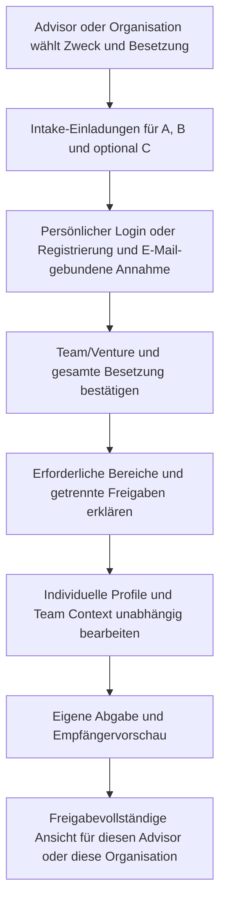

# Phase 7.5 – Team Intake: Produktspezifikation zur Entscheidung

Status: **Entwurf, keine Implementierungsfreigabe und kein finaler Fragenkatalog.** Grundlage ist der [auditierte Ist-Zustand](advisor-team-intake-current-state.md); technische Arbeitspakete stehen im [Gap-Plan](advisor-team-intake-gap-plan.md). Alle nachfolgenden Empfehlungen sind Produktvorschläge, keine empirisch validierten Auswahlverfahren. Phase 8 bleibt für das wissenschaftliche Arbeitsprofil zuständig.

## 1. Produktgrenze

Made2Found soll strukturiert darstellen, wie ein konkretes Founder-Team entstanden ist, was die Beteiligten miteinander erlebt haben und wie sie ihre Zusammenarbeit jeweils beschreiben. Eine Aussage von A über B ist eine datierte Perspektive in einem Teamkontext, keine Eigenschaft von B und kein psychometrischer Fremdwert.

Selection und Development verwenden dieselbe grundlegende Datenstruktur und unterschiedliche Zwecke. Das Ergebnis sind nachvollziehbare Aussagen und Gesprächspunkte, keine Empfehlung „aufnehmen/ablehnen“. Es gibt keine Team-Kompatibilitätsformel, Founder-Qualitätszahl, Erfolgsvorhersage, gewichtete Evidenzsumme oder automatische Sortierung nach Eignung. Auch Vollständigkeit, Dauer des Kennens und Anzahl gemeinsamer Projekte sind keine versteckten Qualitätsindikatoren.

## 2. Zwei Modi: gemeinsamer Kern, getrennte Vertiefung

**Empfehlung zur Entscheidung:** Ein gemeinsamer kleiner Faktenkern zur Vorgeschichte, dazu klar bezeichnete Selection- bzw. Development-Vertiefungen. Keine identischen langen Formulare unter zwei Überschriften und keine automatische Wiederverwendung vertraulicher Antworten zwischen Modi.

| | Selection | Team Development |
| --- | --- | --- |
| Zweck | Kontext für ein menschlich geführtes Aufnahmegespräch | Reflexion und konkrete nächste Absprachen |
| Adressat | Vorab benannter Advisor oder Organisation als Auswahlinstanz | Team und gegebenenfalls ausdrücklich freigegebene Begleitung |
| Schwerpunkt | Gemeinsame Erfahrung, Rollen in konkreten Vorhaben, Entstehungsentscheidung, noch ungeprüfte Annahmen | Wiederkehrende Zusammenarbeit, Stärken, Missverständnisse, Klärungsbedarf |
| Ergebnis | Quellenansicht und Interviewagenda; Entscheidung außerhalb der Auswertung | Gemeinsame Perspektivenansicht und freiwillige Gesprächs-/Setup-Anschlüsse |
| Zeitbezug | Eine benannte Bewerbungs-/Intake-Runde, ohne hier ein Bewerbungs-CRM vorauszusetzen | Eine datierte Reflexionsrunde; spätere Wiederholung als neuer Stand |
| Wechsel | Entwicklungsteilnahme übernimmt keine Selection-Freigabe | Selection-Antworten werden nicht automatisch ins Development kopiert |

### Informationsauswahl – noch keine Fragenformulierungen

Die Einschätzungen zu sozial erwünschten Antworten sind Designrisiken, keine gemessenen Eigenschaften dieser Zielgruppe. Konkrete Beispiele können Aussagen nachvollziehbarer machen, beweisen aber weder Wahrheit noch Teamqualität.

| Information | Ebene | Selection-Relevanz | Antwort-/Interpretationsrisiko | Geeigneter erster Kanal | Development |
| --- | --- | --- | --- | --- | --- |
| Zeitraum und Kontext des Kennenlernens | Je Paar, von beiden unabhängig | Herkunft und Gelegenheit zum Kennenlernen einordnen | Lange Bekanntschaft kann ungerecht als Qualitätsersatz gelesen werden; Erinnerungen können abweichen | Kurzer Faktenblock mit ungefährer Zeitangabe | Hintergrund, nur bei Bedarf aktualisieren |
| Frühere gemeinsame Arbeit: Art, Dauer, eigene Rolle | Je Paar | Konkrete gemeinsame Erfahrung von einer Absicht unterscheiden | Unterschiedliche Definition von „gearbeitet“; geschönte Projekterzählung | Kurzer strukturierter Eintrag plus knapper Kontext; „noch keine“ gleichwertig | Anschluss an beobachtete Arbeitsmuster |
| Teamweite gemeinsame Vorhaben/Erlebnisse | Je Person einmal | Nicht jede Erfahrung fand nur im Zweierpaar statt | Doppelzählung desselben Projekts; Alleingänge als Teamleistung darstellen | Einmalige Team-Perspektive, beteiligte Personen nennen | Gemeinsame Lernanlässe |
| Entscheidung, mit genau dieser Besetzung zu gründen | Je Person einmal, optionale Bezüge auf andere | Erwartung, Anlass und offene Annahmen verstehen | Hohe Gefahr einer überzeugend formulierten Bewerbungsstory | Kurzer Kontext; Gründe im Interview vertiefen | Prüfen, was heute noch trägt oder sich geändert hat |
| Wertschätzung / beobachteter Beitrag der anderen Person | Gerichtete Perspektive A→B | Ergänzende Fremdperspektive, kein Gütesiegel | Pauschales gegenseitiges Lob, Loyalitätsdruck, sprachliche Gewandtheit | Optionaler kurzer konkreter Bezug; keine Adjektiv-/Ratingliste | Zentraler Reflexionsbereich |
| Wahrgenommene Stärke / Ergänzung | Gerichtete Perspektive | Ansatzpunkt für Nachfragen zu Rollen und tatsächlichen Beispielen | Stereotype Rollen, Zuschreibung statt Beobachtung | Kurze Perspektive mit Beispielmöglichkeit; Abgrenzung zu Capability/Ownership | Nicht genutzte Beiträge und mögliche neue Zusammenarbeit |
| Ungeklärte Vereinbarungen und Annahmen | Je Person einmal; Beziehung nur wenn konkret betroffen | Agenda für Aufnahmegespräch und spätere Absprachen | Verschweigen aus Angst vor Ablehnung; Offenheit wird als Defizit gelesen | Themenkategorien/kurzer freiwilliger Kontext; sensible Details ins vertrauliche Gespräch | Zentral, anschließend gegebenenfalls Founder Setup |
| Gemeinsam bewältigte schwierige Situation | Paar oder Team, ohne Pflicht zur doppelten Erzählung | Konkreter Interviewanlass zu Handlungen und Lernen | Dramatisierung, Schuldzuweisung, Informationen über Dritte | **Primär Interview**, optional nur Anlass/Thema vorab | Moderierte Reflexion, keine Erfolgsbewertung |
| Wiederkehrende Missverständnisse / Unterschiede | Gerichtete oder teamweite Perspektive | Nur kontextbezogen im Gespräch, kein Screening-Merkmal | Negative Zuschreibung und Selektionsdruck | **Nicht verpflichtend im Selection-Formular** | Kurze freiwillige Situationsbeschreibung, Schwerpunkt auf Klärung |
| Noch ungenutzte Stärke / gewünschte Klarheit | Gerichtete Perspektive bzw. je Person einmal | Allenfalls Entwicklungsausblick | Spekulative Aussagen über andere | Eher Interview | Geeigneter Development-Schwerpunkt |

Nicht vorsehen: Ratings zur Beziehungsstärke, Sympathie, Vertrauenswürdigkeit oder „Founder-Potenzial“; erzwungene Konfliktgeschichten; Uploadpflicht von Belegen; Erhebung fremder privater Lebensgeschichten. „Noch nicht gemeinsam erlebt“, „weiß ich nicht“ und „möchte ich im Gespräch klären“ müssen darstellbar sein, ohne daraus ein negatives Urteil abzuleiten.

## 3. Unabhängiges Antworten

Jede Person bekommt einen eigenen Bereich und verfasst ausschließlich ihre eigenen Antworten. Niemand antwortet stellvertretend, auch kein Advisor. Ein gemeinsames Editieren oder früh sichtbare Partnerantworten würden die gewünschte unabhängige Perspektive aufheben.

Empfohlener Ablauf einer Runde:

1. Zweck, benannte Beteiligte, verantwortlicher Advisor/Org, Sichtbarkeitsbereiche und Umgang mit späterem Widerruf werden vor Beginn angezeigt.
2. Private Entwürfe: Andere Founder und Advisor sehen weder Text noch automatisch erzeugte Zusammenfassungen. Ein minimaler organisatorischer Fortschritt darf nur im vorab erklärten Umfang angezeigt werden.
3. Jede Person prüft ihre Antworten mit Empfängervorschau und gibt sie ausdrücklich für diese Runde frei. Absenden, Teambeitritt und Personenfreigabe sind unterschiedliche Entscheidungen.
4. Gemeinsame Inhalte werden erst nach Abgabe/Freigabe aller benannten Beteiligten gemeinsam sichtbar. Dadurch beeinflussen frühe Antworten nicht spätere Erstantworten. Ein unvollständiger Fall wird nicht still als vollständiger Teamreport dargestellt.
5. Änderungen nach Veröffentlichung sind als neuer Stand zu kennzeichnen; vorherige Partneransichten beeinflusste Überarbeitungen dürfen nicht als unabhängige Erstperspektiven erscheinen. Kein lautloses Überschreiben eines bereits betrachteten Reports.

Für Selection können organisatorische Fristen sinnvoll sein. Eine abgelaufene Frist ersetzt weder Zustimmung noch Abgabe. Ein fehlender Beitrag erzeugt einen organisatorischen Status, keinen Risikoindikator. Die Frage, ob ein Accelerator bei unvollständigen freiwilligen Angaben trotzdem ein Interview führt, bleibt seine Entscheidung.

## 4. Fachliche Referenz und konzeptionelles Modell

**Empfehlung:** Team Context gehört zu einer Erhebungsrunde eines konkreten `founder_team`, mit eingefrorener beteiligter Besetzung, Modus, Zweck und Freigabeadressat. Innerhalb der Runde sind zwei Aussagearten zu unterscheiden:

- **Teamweite Perspektive:** Team X + Runde R + Autor A; beispielsweise eigene Gründungsmotivation oder offene Teamvereinbarung.
- **Relationale Perspektive:** Team X + Runde R + Autor A + Gegenüber B. Das ungeordnete Paar A↔B ist die Gruppierung für die Anzeige; A→B und B→A bleiben getrennte Urheberschaften.

Das ist ein fachliches Referenzmodell, **kein SQL-Entwurf und keine Festlegung konkreter Tabellennamen**. Später wären Eindeutigkeit je Runde/Autor/Gegenüber/Informationsfeld, gültige Mitgliedschaft, kein Selbstbezug, feste Halteridentität und scopegebundene Veröffentlichung serverseitig durchzusetzen.

| Kandidat | Beurteilung |
| --- | --- |
| `person_core` | Ungeeignet: keine dauerhafte Eigenschaft einer Person |
| Nur `founder_team_id` | Guter Container, aber allein fehlen Autor, Gegenüber, Besetzung und Zeitstand |
| Team-Mitgliedspaar plus gerichtete Antworten | Bevorzugte relationale Referenz; gleiche Personen können in verschiedenen Vorhaben verschiedene Kontexte haben |
| `relationships.id` | Als Herkunftslink möglich; wegen global eindeutiger Paaridentität und einzelner unveränderlicher Teamzuordnung kein alleiniger Schlüssel |
| Einladung / Assessment | Einladung ist ein Zugangsvorgang, Assessment ein anderer Erhebungsbereich; beides würde Teamgeschichte an den falschen Lebenszyklus binden |
| `advisor_team_reviews.id` | Kann ein ausdrücklicher Konsum-/Zustimmungskontext werden; ist heute auch eine hypothetische Gruppe von bis zu acht Personen und deshalb kein kanonisches Founder-Team |

Ein `founder_team` muss **vor dem ersten relationalen Antwortentwurf eindeutig feststehen**, aber nicht bereits vor dem Versenden der Einladung. Bis Accounts und Besetzung bestätigt sind, ist ein Einladungsvorgang noch keine Behauptung über eine bestehende Teammitgliedschaft. Bei bestehenden Teams wird ausdrücklich genau dieses Team gewählt und durch Mitglieder bestätigt; nicht anhand von E-Mail-Paaren, Namen oder „neuester Beziehung“ geraten.

## 5. Zwei und drei Founder ohne sechs vollständige Formulare

Jede Person hat **einen Intake-Durchlauf**:

| Teamgröße | Teamweiter Teil | Kurze relationale Teile | Bericht |
| --- | --- | --- | --- |
| A/B | A einmal, B einmal | A→B und B→A | Ein Paarabschnitt plus zwei teamweite Perspektiven |
| A/B/C | A einmal, B einmal, C einmal | A→B, A→C; B→A, B→C; C→A, C→B | Paarabschnitte AB, AC, BC plus drei teamweite Perspektiven |

Kennenlernen und konkrete Wertschätzung sind paarbezogen. Eigene Gründungsmotivation, teamweite offene Vereinbarungen und ein gemeinsames Dreierprojekt werden pro Autor nur einmal erfasst. Ein Ereignis, das nur AB betrifft, wird nicht als Erfahrung von C dargestellt. Die UI wiederholt nur die kurzen relevanten Paarblöcke, nicht Zweckklärung, Biografie, kompletten Faktenkern und alle Teamfragen sechsfach.

Es gibt keine Mehrheitsauswertung „zwei gegen einen“. C sieht AB-Antworten nur, wenn der zuvor erklärte gemeinsame Team-Bereich genau diese Sichtbarkeit umfasst; die technische Mitgliedschaft allein genügt nicht. Für einen verständlichen ersten Development-Flow wird ein klarer gemeinsamer Bereich für alle benannten Teammitglieder vorgeschlagen, statt unsichtbarer Paar-Sonderrechte. Sensible Inhalte gehören in den getrennten privaten Kanal, sofern dieser beschlossen wird.

Ein drittes Mitglied wird nicht nachträglich in einen bestehenden Zweierreport hineingerechnet. Es braucht eine neue bzw. neu bestätigte Besetzung und Runde. Bei Austritt, Account-Löschung oder Teamwechsel darf kein neuer Zugriff auf frühere Antworten entstehen; alte gemeinsame Ansichten müssen nach der noch festzulegenden Aufbewahrungs-/Widerrufsregel gesperrt oder als erlaubter historischer Stand behandelt werden. Keine automatische Verkleinerung einer vereinbarten Dreiergruppe auf zwei.

## 6. Datenschutz und Sichtbarkeitsmodelle

Die folgende Bewertung ist eine Produkt-/Zugriffsabwägung, keine Festlegung einer rechtlichen Grundlage. Auswahlkontext und Machtgefälle lassen sich durch einen Consent-Button nicht auflösen. Zweck, notwendige/freiwillige Angaben, Empfänger, Aufbewahrung, Export und Löschung müssen vor Umsetzung fachlich und datenschutzseitig festgelegt werden.

| Modell | Vertrauen / Ehrlichkeit / soziale Erwünschtheit | Konfliktpotenzial | Datenschutz / Umsetzung | Selection | Development |
| --- | --- | --- | --- | --- | --- |
| **A: alle Founder sehen gegenseitig alle Antworten** | Sehr klarer Empfängerkreis; Offenheit über schwierige Punkte kann sinken, weil Partner mitlesen | Unmoderierte persönliche Kritik kann eskalieren; konkrete beobachtete Situationen helfen, ohne dies zu garantieren | Einfach verständlich, aber keine heimlichen Ausnahmen; verzögerte gemeinsame Veröffentlichung nötig | Für begrenzte gemeinsame Fakten geeignet, nicht als Zwangskanal für vertrauliche Bedenken | Guter gemeinsamer Kern bei ausdrücklich akzeptierter Team-Sichtbarkeit |
| **B: Advisor sieht alles, Founder nur Synthese** | Kann Vertraulichkeit versprechen, schafft aber Informationsasymmetrie und mögliche Unsicherheit über Darstellung | Synthese kann Aussagen zuspitzen; bei zwei/drei Personen ist Zuschreibung oft rekonstruierbar | Zusammenfassung ist **keine Anonymisierung**. Abgeleitete Inhalte müssen dieselben Rechte respektieren | Nicht als Default empfohlen; private Interviewhinweise besser klar getrennt | Schlechte Basis für gemeinsame Reflexion ohne Einsicht in die eigenen dargestellten Aussagen |
| **C: Sichtbarkeit je Frage wählbar** | Hohe Kontrolle, aber schwer zu überblicken; Auswahl selbst kann sozialen Druck erzeugen | Unvollständige Perspektiven können als Ausweichen interpretiert werden | Hohe Komplexität bei Vorschau, Vergleich, Export, Widerruf und Synthese; Datenlücken dürfen nicht verraten werden | Spätere Option bei nachgewiesenem Bedarf, kein MVP-Default | Ebenfalls erst später, wenn gröbere Bereiche nicht ausreichen |
| **D: getrennte Inhalte für Advisor-privat und gemeinsamen Report** | Klare Zweckgrenze; getrennte private Kontaktaufnahme möglich, ohne ein vertrauliches Gesamtformular zu behaupten | Weniger unbeabsichtigte Weitergabe, aber Gefahr einer „geheimen Akte“; Darstellung muss offen erklären, dass der Kanal existiert | Getrennte Freigaben, Empfänger und Ableitungen. Private Inhalte dürfen nie in gemeinsamen Synthesen auftauchen | Bevorzugter Entwurf: kleiner gemeinsamer Kern und optionaler vertraulicher Gesprächskontext | Gemeinsamer Kern wie A; optionaler persönlicher Gesprächswunsch statt verdeckter Partnerbewertung |

**Empfehlung zur Entscheidung:** D als klarer Rahmen, A für den gemeinsamen Bereich. Zunächst keine feldweise Sichtbarkeitsmatrix C und keine rein zusammenfassende Founder-Ansicht B. Private Advisor-Antworten bleiben für die verfassende Person einsehbar; „privat“ bedeutet gegenüber anderen Foundern, nicht gegenüber dem Autor. Der gemeinsame Bericht zeigt nicht an, ob eine bestimmte Person private Inhalte abgegeben hat.

Privater Kanal heißt konkret: Auswahl eines **namentlich benannten persönlichen Empfängers** oder ausdrücklich benannter Organisation. Bei Org-Halter gelten heute alle aktiven Org-Mitglieder als mögliche Empfänger; das darf nicht als „nur deine Advisorin“ beschrieben werden. Beschränkung auf ein ausgewähltes Reviewer-Team wäre eine zusätzliche Berechtigungsentscheidung und fehlt heute.

Weitere Produktregeln für die spätere Umsetzung:

- Ein Personen-Grant, Teambeitritt, Relationship-Advisor-Zugang oder bestehender Review ersetzt keine Team-Context-Freigabe.
- Freigegeben wird eine benannte Runde mit erklärtem Zweck; neue Runde, andere Besetzung, anderer Modus oder anderer Halter benötigen erneute Bestätigung.
- Widerruf wirkt auf künftige Reads, Exporte und daraus erzeugte Ansichten. Bereits gelesene oder exportierte Inhalte lassen sich nicht technisch zurückholen; das darf die UI nicht versprechen.
- Rohantworten und vertrauliche Hinweise gehören weder in Benachrichtigungs-E-Mails noch Logs oder frei erreichbare Report-Links. Ein späterer Export muss dieselbe Empfängergrenze und den Status zum Exportzeitpunkt respektieren.
- Private Advisor-Notizen sind persönliche Arbeitsnotizen, keine stillen Kopien aller Founder-Antworten. Aufbewahrung und Löschung solcher Notizen sind separat zu klären.
- Keine Analyse privater Nachrichten, keine IP-/Verhaltensdaten, keine Kontaktgraphen und keine Pflicht zur Nennung unbeteiligter Dritter als „Beweis“.

## 7. Team-Context-Report

Der erste Report braucht keine automatische Textinterpretation. Er stellt freigegebene Aussagen nebeneinander und kennzeichnet Autor, Gegenüber, Runde und Stand. Gleiche Begriffe oder ähnliche Zeitangaben sind keine Bestätigung der Wahrheit und keine Beziehungsbewertung.

Vorgeschlagene Gliederung:

1. **Eure Verbindung:** Team, benannte Besetzung, Modus, Stand und Umfang der Ansicht.
2. **Wie ihr euch kennt:** AB, gegebenenfalls AC/BC; jeweils die zwei unabhängigen Angaben zur Vorgeschichte.
3. **Was ihr gemeinsam gemacht habt:** Paarerfahrungen und teamweite Vorhaben getrennt, ohne Ereignisse zusammenzurechnen.
4. **Was ihr aneinander schätzt:** A über B und B über A; bei drei Foundern dieselbe klare Zuordnung je Paar.
5. **Welche Beiträge ihr wahrnehmt:** Beobachtete Ergänzungen neben den Aussagen, getrennt von individuellen Capability- und Ownership-Daten.
6. **Warum ihr zusammen gründen wollt:** Jeweils eigene Perspektive, kein künstlicher gemeinsamer Konsenssatz.
7. **Noch offene Punkte:** Freigegebene Klärungsthemen als Agenda, keine Liste vermeintlicher Defizite.
8. **Für das Gespräch:** Menschlich ausgewählte Nachfragen mit sichtbarem Quellenbezug.

Ein fehlender oder nicht verfügbarer freigegebener Beitrag wird neutral als fehlende Perspektive behandelt, ohne vertrauliche Ablehnungsgründe zu verraten. Eine vorhandene Perspektive wird nicht als vollständiger Paarvergleich ausgegeben.

Optionale spätere neutrale Synthesen wie „Ihr beschreibt eure gemeinsame Vorgeschichte ähnlich“ oder „Ihr setzt unterschiedliche Schwerpunkte darauf, was euch als Team verbindet“ sind nur zulässig, wenn die dargestellten Quellen diese Aussage tragen. Für den ersten Stand genügen Originalangaben; manuelle Notizen des Advisors werden als solche getrennt gekennzeichnet. Eine automatische Freitext-Synthese wäre ein eigenes, zu prüfendes Erweiterungspaket. Sie darf niemals privat zurückgehaltene Quellen nutzen.

Nicht zulässig: „starke/riskante Beziehung“, „gutes Founder-Team“, Konfliktwahrscheinlichkeit, semantische Ähnlichkeit als Rangwert, Ampeln aus Unterschiedlichkeit oder Lob sowie das Zusammenzählen positiver Aussagen. **Unterschied ist kein Problem; Gleichheit ist kein Qualitätsnachweis.**

## 8. Anschluss an den langfristigen Gesamt-Teamreport

Die zehn Schichten bleiben getrennt, mit Quelle, Zeitstand und Zugriffsprüfung je Schicht:

| Schicht | Rolle im künftigen Bericht |
| --- | --- |
| Founder A / Founder B / gegebenenfalls C | Freigegebene individuelle Profile, gleichwertige Darstellung aller |
| Wissenschaftliche Arbeitsprofile | Nur das später tatsächlich in Phase 8 freigegebene Instrument und dessen Grenzen; heute keine Validierungsbehauptung |
| Fähigkeiten / Erfahrung | Eigene Angaben mit freigegebener Tiefe, keine aus Team-Context-Lob erfundenen Kompetenzen |
| Rollen / Ownership | Verantwortungswunsch versus gemeinsam bestätigte Zuständigkeit ausdrücklich unterscheiden |
| Motivation / Direction | Individuelle Richtung getrennt von Motivation zur konkreten Teamgründung |
| Team Context | Unabhängige relationale und teamweite Perspektiven dieser Runde |
| Venture Alignment | Angaben zum ausdrücklich gewählten Venture, je Person und gültigem Stand |
| Founder Setup | Nur gemäß bestehender zusätzlicher Freigabe; bestätigte Absprachen nicht mit offenen Erzählungen gleichsetzen |
| Gesprächspunkte | Quellengebundene Agenda, ohne automatisches Selection-Urteil |

Die ersten zwei Founder-Schichten sind im obigen Profilblock zusammengefasst; fachlich entspricht dies den zehn vom Auftrag benannten Schichten, ergänzt um C. Ein fehlender oder nicht freigegebener Baustein darf nicht durch ältere Antworten oder andere Quellen ersetzt werden. Team Context kann unabhängig von Phase 8 pilotiert werden; der Gesamtbericht darf deshalb bis dahin keinen Abschluss einer neuen psychometrischen Schicht voraussetzen.

## 9. Künftiger Accelerator-Einladungsflow

Empfohlener Flow, noch nicht umgesetzt:

- **Team bereits vorhanden:** Einladung referenziert es ausdrücklich. Mitglieder bestätigen Besetzung und gewählten Zweck; kein neues Team nur wegen eines neuen Advisors.
- **Kein Team / noch keine Accounts:** Advisor kann einen Einladungsvorgang für E-Mail-Adressen vorbereiten, aber keine Auth-Konten, Antworten oder vollzogenen Mitgliedschaften für andere erzeugen. Erst bestätigte Accounts und bestätigte Besetzung werden einem kanonischen Team zugeordnet.
- **Gemischter Fall:** Bestehende Accounts werden angemeldet, neue registrieren sich; beide durchlaufen dieselbe Zweck-/Freigabeklärung. Ein vorhandener Grant ist keine Zustimmung zur neuen Runde.
- **Drei Founder:** Drei gleichberechtigte Slots mit getrennten Tokens; keine versteckte Hauptperson A, die für B/C zustimmt. Ablehnung oder Änderung einer Person führt zur Klärung der Besetzung, nicht zur stillen Auswertung der Restgruppe.
- **Wiederverwendung vorhandener Profile:** Nur freigegebene, passende Instrument-/Venture-Stände mit bewusstem Bezug auf diese Runde; nicht automatisch alte Basisantworten verlangen. Welche Module Pflicht sind, wird im Intake erklärt. Phase 8 bestimmt später die wissenschaftliche Schicht.
- **Beschränkung:** Der erste Intake benötigt keinen Batch-Verwalter und keine CRM-Pipeline. Organisationshalter und spätere Programmzuordnung sind konzeptionell unterscheidbar zu halten.

## 10. Programme und Batches als spätere Option

Langfristig kann `Organisation → Programm → Batch/Cohort → Team-Intake` die Nutzung strukturieren. Ein Team kann an mehreren Programmen oder zu mehreren Zeitpunkten teilnehmen; seine Founder-Profile und seine Teamgeschichte werden dafür nicht zu neuen Personenobjekten kopiert. Programmzugehörigkeit verleiht nie automatisch Inhaltsrechte.

Ein späterer manueller Bewerbungs-/Selection-Status wäre getrennt von Einladungs-, Antwort- und Consent-Status. Eine menschliche Aufnahmeentscheidung ist weder ein Reportwert noch eine aus Vollständigkeit berechnete Empfehlung. Diese Phase spezifiziert kein CRM und keine automatische Bewerberrangliste.

## 11. Zehn Produktentscheidungen vor Umsetzung

Die Empfehlungen oben sind Vorschläge. Folgende Entscheidungen sind noch ausdrücklich offen:

1. **Inhaltsumfang:** Gemeinsamer Faktenkern mit getrennten Selection-/Development-Vertiefungen oder zwei vollständig getrennte Erhebungen? Empfehlung: gemeinsamer kleiner Kern, getrennte Vertiefungen.
2. **Founder-Sichtbarkeit:** Sollen alle benannten Teammitglieder nach gemeinsamer Freigabe die gemeinsamen Originalantworten sehen, einschließlich AB-Angaben bei einem Dreierteam? Empfehlung: ja, klar vorab erklärt; keine versteckten Paarrechte im ersten Stand.
3. **Advisor-privater Kanal:** Soll es einen optionalen getrennten Bereich geben, und welche Themen gehören ausschließlich ins vertrauliche Gespräch statt in ein Formular? Empfehlung: getrennten Gesprächskontext erlauben, keine verpflichtende geheime Partnerbewertung.
4. **Halter und Reviewer:** Darf eine Organisation mit allen aktiven Mitgliedern Empfänger sein oder müssen Fälle auf ausdrücklich benannte Reviewer begrenzt werden? Empfehlung: bestehende persönliche/Org-Halter bewusst wählen; engeres Reviewer-Modell nur bei tatsächlichem Bedarf, dann vor Intake umsetzen.
5. **Zeitpunkt der Team-Erzeugung:** Muss ein Team vor Einladung bestehen oder darf es nach Annahme und Besetzungsbestätigung entstehen? Empfehlung: beides unterstützen; vor relationalen Antworten muss es eindeutig feststehen.
6. **Nicht-Nutzer und bestehende Accounts:** Dürfen Advisor einen Intake mit E-Mail-Adressen noch nicht registrierter Founder vorbereiten? Empfehlung: ja, ohne Konten oder Mitgliedschaften stellvertretend anzulegen; bestehende Teamzuordnung bestätigen lassen.
7. **Drei-Founder-Umfang:** Soll der erste Release zwei und drei Founder mit einem Teamteil plus kurzen gerichteten Paarblöcken abdecken? Empfehlung: ja; keine sechs vollständigen Fragebögen und keine Mehrheitsbewertung.
8. **Pflicht, Frist und Sichtbarwerden:** Welche minimalen Angaben sind für Selection nötig, welche freiwillig, und darf ein Advisor vor vollständiger Freigabe mehr als organisatorischen Fortschritt sehen? Empfehlung: minimale Pflicht, übrige Inhalte freiwillig, gemeinsame Inhalte erst nach allen Freigaben.
9. **Lebenszyklus:** Welche Aufbewahrungsdauer, Exportrechte und Folgen von Widerruf, Austritt oder Account-Löschung gelten für eingereichte Antworten und private Advisor-Notizen? Empfehlung: pro Zweck festlegen, zukünftige Zugriffe sofort wirksam begrenzen, keine Rückholung bereits exportierter Inhalte versprechen.
10. **Erster Lieferumfang:** Zunächst Intake + Team Context + bestehende freigegebene Berichtsteile oder schon ein einheitlicher Gesamtreport samt Programm-/Batch-Verwaltung? Empfehlung: schmaler Intake ohne CRM; Phase-8-Schicht und Programmbetrieb später getrennt ergänzen.
