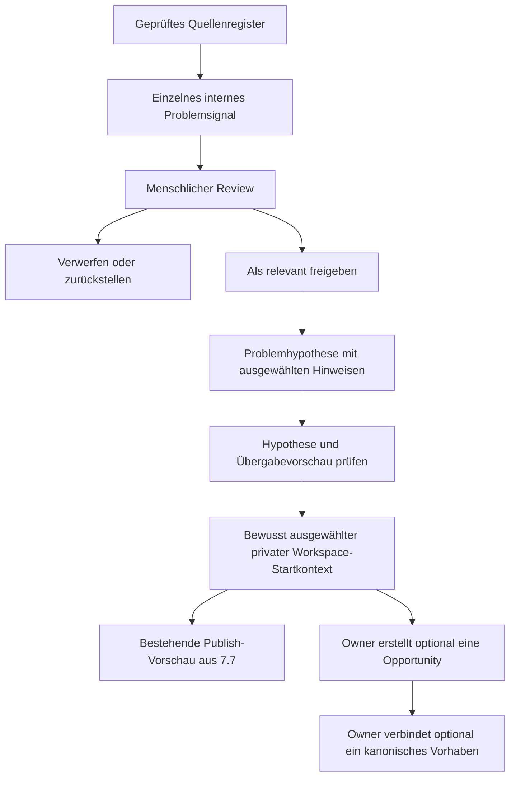

# Problem Radar – Produktspezifikation, Phase 7.8a

**Status: Entwurf für spätere Umsetzung. Nichts hiervon wird in 7.8a erhoben oder implementiert.** Technische Basis: [Ist-Zustand](problem-radar-current-state.md). Stufen, Release-Gates und offene Produktentscheidungen: [Umsetzungsplan](problem-radar-implementation-plan.md).

## 1. Zweck, Sprache und Grenzen

Radar macht beobachtete Probleme nachvollziehbar, nicht Personen auffindbar. Es liefert eine interne Arbeitsgrundlage, keine Aussage über Marktgröße, Nachfrage, Geschäftserfolg oder Gründerqualität.

Keine öffentliche Radaransicht, kein automatisches Problem-/Opportunity-/Venture-Erzeugen, keine Nutzerbenachrichtigungen, kein FIND/Capability-Matching, kein Personenprofil, keine Rankings. Signalzahlen sind weder Repräsentativität noch unabhängige Zustimmung. Auch eine kleine oder fehlende Signalsammlung wird nicht negativ bewertet.

Nur ausdrücklich freigegebene **öffentliche** Quellen. Private Gruppen, private Nachrichten, geschlossene Communities, Login-/Paywall-Umgehung und automatisches Kopieren langer Beiträge sind ausgeschlossen. Eine offizielle API mit technischem API-Schlüssel kann zulässig sein, wenn ausschließlich der freigegebene öffentliche Datenumfang gelesen wird; der Schlüssel erlaubt keinen Zugriff auf private Nutzerbereiche. Bei Ausfall einer API kein Fallback auf HTML-Scraping.

## 2. Quellenregister und Aufnahme-Gate

Vorgeschlagenes eigenes Objekt `radar_sources`, ohne konkrete Drittquellen im Repository:

| Gruppe | Minimale Felder / Vertrag |
| --- | --- |
| Identität | `id`, `name`, `domain`, genau definierter `endpoint` bzw. zulässiger Pfadbereich, `source_type` |
| Quellentyp | `rss`, `public_api`, `public_web`, `public_forum`, `public_repository_issues`, `public_review_source`, `other` |
| Abrufvertrag | `retrieval_method`: `manual_url`, `rss`, `official_api`, `approved_http`; konkrete Adapter-/Policy-Version; keine automatische Methodenumstellung |
| Öffentlichkeit | `is_public`; zusätzlich `permission_state`: pending/approved/denied, `reviewed_by`, `reviewed_at`, `review_due_at` |
| Betriebszustand | `status`: active/paused/withdrawn; nur active **und** aktuell approved dürfen gesammelt werden |
| Themenkontext | kleine Themen-/Zielgruppen-Tags, Region (auch unbekannt), `source_language` (Sprachcode oder `und`) |
| Quellenart | direkte Äußerung / redaktionell / aggregiert / gemischt / unbekannt; primär / sekundär / unbekannt; ohne Qualitätszahl |
| Freigabenachweis | Policy-/ToS-/API-/Lizenz-Verweise, kurze interne Prüfnote, zulässiger Datenumfang, Excerpt-Erlaubnis, erlaubte Hosts/Pfade/Redirect-Ziele und Limits |
| Betrieb, später R2 | letzter Versuch, letzter erfolgreicher Abruf, letzter Fehlercode/Zeitpunkt, `next_attempt_at`, Fehlerfolge, opake API-Cursor/ETag/Last-Modified nur soweit nötig |

`source_type` und Abrufmethode sind unabhängig: Ein Forum kann z. B. ausschließlich über einen freigegebenen RSS-Feed genutzt werden. Öffentlich erreichbar, robots-erlaubt und inhaltlich nützlich sind drei unterschiedliche Feststellungen. Ein Review-Haken ohne nachvollziehbare geprüfte Bedingungen genügt nicht.

Neue Quellen beginnen pausiert und pending. Domain/Endpoint/Adapter/Scope-Änderungen machen die bisherige Abruffreigabe ungültig. API-Keys liegen später ausschließlich im Secret-Store; im Register höchstens eine Secret-Referenz, keine Tokens in URLs. Politik-/robots-Prüfungen sind selbst Abrufe und benötigen später ebenfalls den abgesicherten Fetch-Weg.

### Manueller Einstieg

R1 nimmt eine URL nur unter einer bereits geprüften Quelle an. Admin öffnet die externe Quelle selbst im Browser, prüft sie und schreibt die eigene knappe Zusammenfassung. **Der Server lädt weder URL noch OpenGraph, Titel, Favicon oder Link-Preview automatisch.** Unbekannte Domains gehen erst durch das Quellen-Gate. Eine URL-Eingabe ist keine Abrufgenehmigung. Manuelle Kurzfassung kann ohne Originaltextarchiv erstellt werden.

## 3. Problemsignal

Eigenes internes Objekt `radar_signals`; kein `network_problem`, kein Account und keine Assessment-Antwort.

| Feldgruppe | Vorschlag |
| --- | --- |
| Herkunft | `id`, `source_id`, normalisierte `source_url`, kurzer bereinigter `source_title`, `source_date` optional, `captured_at`, optional `last_seen_at` |
| Sprache | `source_language`, `summary_language`; Originalsprache bleibt unverändert gekennzeichnet |
| Eigene Darstellung | `summary` (z. B. max. 800 Zeichen), `problem_observation` (max. 1.000), `affected_context` (max. 400), wenige korrigierbare Tags |
| Optionales Zitat | `excerpt` standardmäßig NULL; nur nach spezifischer Quellenfreigabe und tatsächlicher Notwendigkeit. Vorschlag technische Obergrenze 160 Zeichen, **keine rechtlich sichere Freigrenze** |
| Nachvollziehbarkeit | Erfassungsart manual/adapter/model-assisted, Adapter-/Modell-/Prompt-Version falls relevant, Inhaltsrevision, erzeugt/geprüft durch, Prüfzeit |
| Review | `review_status`, kurze Entscheidung/Grund, Sicherheits-/Sensibilitätsmarkierung; keine Original-PII in der Notiz |
| Identität/Änderung | stabile öffentliche Quell-Item-ID falls vorhanden, `url_fingerprint`, optional Fingerprint eines zulässigen normalisierten Minimalauszugs, erkannte Dublette/Ursprungsgruppe |
| Verfügbarkeit | erreichbar / ungeprüft / vorübergehend nicht erreichbar / entfernt; davon getrennt Nutzung freigegeben / gesperrt / zurückgezogen |

Titel/URLs können bereits Personenbezug enthalten. Auch sie müssen minimiert werden; keine vollständige Roh-URL zusätzlich speichern, wenn der bereinigte Verweis genügt. Semantisch notwendige Queryparameter werden nicht blind abgeschnitten. Nicht sicher bereinigbare oder nur über personenbezogene Details verständliche Funde werden nicht übernommen bzw. bis zur Entscheidung gesperrt.

Keine Nutzernamen-, Avatar-, Autorenprofil-, Kontakt-, Social-Graph- oder Personenentität. Externe Autoren werden niemals Made2Found-Nutzer oder Workspace-Mitglieder. Ein fremder Autor ist auch nicht die interne `created_by`-Identität: Diese benennt ausschließlich die handelnde Admin-/Collector-Instanz.

Original-Response/HTML/JSON, vollständige Forenbeiträge und Artikel werden nicht als Roharchiv persistiert. Bei späteren Collectors ist begrenzte flüchtige Verarbeitung etwas anderes als dauerhafte Speicherung; auch sie braucht eine zulässige Methode und ein Datenbudget. Kein Dump in Jobpayload, Logs, Fehlertracker, Model-Prompt-Archive oder Testfixtures mit echten Daten.

**R2 benötigt kein LLM:** Ein RSS/API-Collector darf zunächst nur einen ungeprüften Kandidaten mit zulässigen minimalen Quellenmetadaten anlegen. Eigene Zusammenfassung/Beobachtung können bei `new` noch fehlen; erst der Mensch formuliert sie für die Freigabe. Im manuellen R1-Formular werden sie direkt eingegeben. DB-Übergänge nach `relevant` verlangen die geprüften Kontextfelder. RSS-Volltext darf niemals als vermeintlich „eigene Zusammenfassung“ in diese Felder kopiert werden. Quell-Item-IDs identifizieren Beiträge/Issues, keine Autorenprofile.

## 4. Review und Admin-UI

Bestehende `platform_admins` und `is_platform_admin()` verwenden. Vorgeschlagene interne Route `/admin/problem-radar`, Session-Guard + DB-Prüfung, `noindex/nofollow`, später robots disallow, keine Sitemap. Die normale Moderationsseite bleibt unverändert.

Signalzustände:

- `new`: erfasst, keine fachliche Freigabe.
- `reviewed`: angesehen/bereinigt, Relevanzentscheidung noch offen.
- `relevant`: Reviewer hat die aktuelle Fassung ausdrücklich als nutzbaren Hinweis freigegeben.
- `discarded`: nicht verwenden, begrenzter Grund ohne private Textkopie.

Sensible/gesperrte Quelle oder Signalrevision ist ein **separates Nutzungshindernis**, kein versteckter Relevanzwert. Kein solches Signal darf als aktuelle Evidence oder Workspace-Startkontext ausgegeben werden. Wesentliche Änderung von Zusammenfassung, Beobachtung, Quellenumfang oder personenbezogenem Kontext setzt die Freigabe zurück und betroffene Hypothesen auf erneuten Review. Ein Collector überschreibt nie still die freigegebene Fassung; bei geänderter Quelle nur einen Änderungsmarker bzw. neuen ungeprüften Vorschlag ohne Rohtextarchiv.

Liste: Status, kurze eigene Beobachtung, Quelle/Quellentyp, Sprache, bekanntes Quelldatum oder „unbekannt“, Erfassungsdatum und Sensibilitäts-/Verfügbarkeitskennzeichen. Filter Status/Quelle/Sprache, optional Thema; zunächst 25 pro Seite, fester Tie-Breaker. Keine Sortierung nach angeblicher Marktattraktivität.

Detail: Quelle als ausdrücklicher externer Link (`noopener noreferrer`, `no-referrer`), Herkunft und Grenzen, eigene Kurzfassung, Tags, Entscheidung, Zuweisung zu Hypothese oder neue Hypothese. Kein eingebetteter Remote-Inhalt, Trackingpixel, Screenshot-Proxy oder automatisches Link-Preview. Notizen als Plaintext. Relevanz heißt „für eine Arbeitsannahme nutzbar“, nicht „wahr“ oder „validiert“.

Alle Mutationen speichern Actor/Zeitpunkt/Revision. Kleine zweckgebundene Review-Ereignisse enthalten Aktion und Grundcode, keine frühere sensible Volltextfassung. Versionsvergleich verhindert das versehentliche Überschreiben paralleler Reviews. Keine allgemeine Case-Management-Plattform.

## 5. Problemhypothese und Evidence

Vorgeschlagen: `radar_hypotheses` plus `radar_hypothesis_signals` als explizite n:m-Zuordnung. Eine Hypothese kann mehrere Hinweise haben; ein Signal kann mehreren klar bezeichneten Fragestellungen dienen, zählt innerhalb einer Hypothese aber nur einmal.

Hypothese: Titel, eigene vorsichtige Problemformulierung, betroffene Gruppe/Kontext, `hypothesis_language`, geografischer Kontext, offene Fragen/Gegenbeobachtungen, Revision, Status `draft`/`reviewed`/`archived`, Reviewer/Zeitpunkt. Erst eine menschlich geprüfte Revision ist übergabefähig. Ein einzelner Hinweis darf eine ausdrücklich dünn belegte Arbeitsannahme anregen; mehrere ähnliche Beiträge beweisen weder Unabhängigkeit noch Nachfrage.

Evidence-Ansicht zeigt ausschließlich freigegebene, nicht gesperrte Hinweise und erklärt die Berechnung:

| Anzeige | Zähl-/Darstellungsregel |
| --- | --- |
| Hinweise | eindeutige aktive Signal-IDs nach exakter Deduplizierung; getrennt von ausgeschlossenen/fehlenden Hinweisen |
| Registerquellen / Domains | beides separat zählen; mehrere Endpunkte derselben Domain sind nicht automatisch verschiedene Stimmen |
| Unabhängige Ursprünge | nur manuell nachvollziehbare Ursprungsgruppen; sonst „Unabhängigkeit unbekannt“. Crossposts/Zitate desselben Originals zusammenfassen |
| Zeitraum | min/max bekannter `source_date`; Zahl der Hinweise ohne Quelldatum zusätzlich anzeigen. Capture-Datum ist kein erfundenes Veröffentlichungsdatum |
| Letzte Beobachtung | letztes bekanntes Quelldatum; letzten erfolgreichen Abruf separat anzeigen, nicht als neuen Problembefund zählen |
| Themen / Gruppen | nachvollziehbare korrigierte Tags mit Verweis auf die konkreten Hinweise; keine LLM-Behauptung ohne Herkunft |
| Geografie / Sprache | bekannt/unbekannt, aus Quellenkontext, keine personenbezogene Ortsableitung; Sprachabdeckung sichtbar |
| Grenzen / Widerspruch | Auswahlbias, fehlende Abdeckung, abhängige Quellen, Gegenbeobachtungen, unzugängliche/entfernte Hinweise explizit |

Keine zusammengefasste Punktzahl, Sterne, Ampel für Marktchancen oder automatische Vertrauensklassifikation. Häufige Begriffe sind eine Beschreibung des Materials, keine Qualitätsgewichtung. Anzahl erzeugter Workspaces/Ventures ist kein Erfolgsnachweis.

## 6. Deduplizierung und Clusterhilfe

| Variante | Komplexität/Kosten | Fehlerrisiko | Nachvollziehbarkeit | Datenschutz | Wartung / Empfehlung |
| --- | --- | --- | --- | --- | --- |
| A: URL-/Item-ID-/Fingerprint | Niedrig; DB-Unique-Key/kleine Hashes | Mehrere Signale auf einer Seite, URL-Änderungen und Mirror können falsch zusammenfallen/entgehen | Hoch bei offener Kanonisierungsregel | Hash ist keine Anonymisierung; URL kann PII/Token tragen | MVP: exakte Dubletten blockieren, bestehende Reviewentscheidung erhalten |
| B: Tags/Keywords | Niedrig bis mittel; keine Modellkosten | Synonyme, Negation, sprachübergreifende Fälle, häufige Wörter | Hoch, konkrete gemeinsame Tags zeigen | Nur minimierte eigene Texte/Tags | Optional MVP-Sortierhilfe; Reviewer ordnet zu, keine automatische Merge-/Relevanzentscheidung |
| C: Embeddings | Mittel bis hoch; Modellbetrieb, Index, Re-Embedding, Evaluationskosten | Sprach-/Domänenbias, nahe Vektoren sind keine gleiche Ursache | Begrenzt, Kandidaten mit Textbeispielen erklären | Vektoren können Informationen tragen; Löschung/Versionierung und Anbieterzweck nötig | Später R6, nur bereinigte freigegebene eigene Kurzfassungen; kein Rohtext-Vektorarchiv |
| D: LLM-Gruppierung | Hoch/variable Aufrufkosten, Modellevaluation und Versionspflege | Halluzination, Prompt Injection, unstete Kategorien, erfundene Kausalität | Nur mit IDs/Belegen und menschlicher Prüfung | Anbieter/Hosting/Retention gesondert prüfen; keine sensiblen Originale | Nicht MVP; lediglich Vorschläge, niemals Job-/Publish-/Kontaktwerkzeuge |

**Empfehlung:** A plus manuelle Zuordnung; B höchstens als erklärbare „ähnliche Tags“-Liste. Kein Similarity Score im Produkt. C/D erst mit einem getrennten DE/EN-Evaluationssatz (Dubletten, Gegenbeispiele, Negation, unabhängige Ursachen), Fehlermessung und abschaltbarer Vorschlagsfunktion.

Identität: bevorzugt `(source_id, stable_public_item_id)`, sonst `(source_id, normalized_url_fingerprint)`. Bei Feed-/Sammelseiten keine Zwangszusammenlegung mehrerer Items auf ihre gemeinsame Landingpage. URL-Kanonisierung versionieren: Scheme/Host normalisieren, Fragmente und ausdrücklich bekannte Trackingparameter entfernen; inhaltsbestimmende Parameter bewahren. Keine automatische Host-/Pfad-/www-Gleichsetzung ohne Quellenregel. Optional HMAC-Fingerprint für minimale Takedown-/Dedupe-Sperrmerker; auch dieser braucht Zweck und Löschfrist. Inhalts-Hash nur aus zulässigem minimiertem Material, kein Anlass zum Volltextspeichern.

Exakte Wiederholung aktualisiert gegebenenfalls `last_seen_at`, erzeugt weder neue Evidence noch neue Review-Freigabe. Semantische Ähnlichkeit verbindet Kandidaten, löscht aber keine eigenständigen Quellen und überschreibt keine Reviewerentscheidung.

## 7. Übergabe in Phase 7.6/7.7

Vorschlag für R5: Admin prüft Hypothesenrevision und wählt bewusst Titel, Startbeschreibung und einzelne freigegebene Quellenbezüge in einer Vorschau. Ziel ist zunächst ein **neuer eigener** privater Workspace. Der handelnde Account muss zusätzlich die normale aktive CONNECT-Mitgliedschaft besitzen; Adminstatus erzeugt diese nicht. Kein freier `owner_user_id`, keine automatische Übergabe an einen fremden Account und keine neue Ownership-Transfer-Funktion.

Die Übergabe muss atomar erfolgen: Eligibility/Revision/Quellenzustände prüfen → `create_problem_workspace()` im Sessionkontext → bewusst ausgewählten Startkontext/Referenzen schreiben → Herkunft und Idempotenzbezug festhalten. Doppelklick derselben bestätigten Übergabe erzeugt keinen zweiten Raum. Ein späterer zweiter Raum braucht eine eigene bewusste Übergabeentscheidung.

Hypothese bleibt eine Annahme: gegebenenfalls `assumption`-Entry, nicht „beobachtete Tatsache“. Ausgewählte kurze redaktionelle Signalbeschreibungen können als Observation/Perspective mit Source-Link starten, klar als externe Quelle gekennzeichnet; der interne Autor ist die übergebende Person, nicht der externe Urheber. Keine Originalautoren, Accounts oder Mitglieder kopieren. Kein Quellregister-, Adminnotiz- oder Collectordiagnostik-Export in den Workspace.

Eigene schmale Herkunftsrelation (z. B. `radar_workspace_handoffs` mit Hypothesenrevision und ausgewählten Signalrevisionen/erzeugten Entry-IDs), keine Umdeutung von `source_problem_id` oder `published_problem_id`. Workspace-Mitglieder erhalten nur den freigegebenen Startkontext, keinen Radar-Adminzugriff. Admins sehen über den Handoff nicht automatisch spätere private Workspace-Inhalte oder Mitglieder.

**Takedown ist eine Freigabevoraussetzung dieser Übergabe**, kein späterer Zusatz: Importierte Bestandteile bleiben als solche referenziert. Ein gesperrter Quellenbezug darf nicht durch eine neue Übergabe oder neue Publikationsfreigabe aus dieser Herkunft weitergereicht werden. Noch unveränderte, eindeutig markierte Importbestandteile müssen gezielt sperr-/redigierbar sein, ohne allgemeine Admin-Reads/Edits auf fremde Workspaces. Bereits vom Owner eigenständig umformulierte Texte und bereits manuell publizierte Fassungen erfordern eine ausdrückliche Prüfung; eine Volltextkopie lässt sich nicht durch bloßes Entfernen eines FK zurückholen. R5 darf erst starten, wenn der begrenzte Sperr-/Korrekturvertrag samt Tests feststeht.

Veröffentlichung ausschließlich: Radar-Review → private Bearbeitung → vorhandene 7.7-Preview/Bestätigung. Die Problemmaske bleibt eine bewusste Owner-Formulierung; kein automatisches Vorbefüllen aus Radar. Opportunities und Ventures sind weiterhin ausschließlich spätere Owner-Handlungen im Workspace, keine Collector-/LLM-Aktionen.

## 8. Weekly Collection – späterer technischer Vertrag

Noch keine Cron-Konfiguration. Zukünftige getrennte Route z. B. `/api/cron/problem-radar`, wöchentlich zu einem festgelegten UTC-Zeitpunkt. Exemplarisch Montag 06:00 UTC ist nur ein Vorschlag, keine aktivierte Schedule und keine lokale Sommerzeitgarantie.

- Derselbe fail-closed Bearer-Secret-Ansatz wie heute; fehlendes Secret 503, falsches 401; dynamisch/kein Cache. Kein Secret in Querystrings.
- Nur fällige aktive, aktuell freigegebene Sources; kein frei übergebbares Fetch-Ziel über Cronparameter.
- Persistenter `radar_collection_runs`-/`radar_source_runs`-Vertrag: Lauf-ID, Wochenfenster, Source/Adapter-/Policy-Version, Attempts, begrenzte Kennzahlen, Fehlercode, Claim/Lease, nächster Versuch. Keine Response-Bodies.
- Unique-Key pro Source und geplantem Fenster verhindert parallele Doppelplanung. Claim mit Lock, Ablauf und **versuchsgebundenem Lease-Token**; alter Worker darf nach Übernahme keine Ergebnisse/Cursor mehr committen.
- Signal-Upsert zusätzlich über Item-ID/Fingerprint; Cursor nur mit erfolgreich committed Item-Batch fortschreiben. Wiederholung darf verworfene/takedown-gesperrte Funde nicht neu beleben.
- Quelle für Quelle isolieren; kleine Batches, je Host begrenzte Parallelität, Deadline vor dem Plattformlimit, begrenzte Requests/Bytes/Items. Erfolg einer Quelle wird nicht durch den Ausfall einer anderen zurückgerollt.
- Konkrete Startbudgets als technische Vorschläge: 1 Request gleichzeitig je Host, 10 Sekunden je Request, höchstens 1 MiB dekomprimierte Antwort und 50 Items je Source-Slice, z. B. 5 Sources je Invocation. Nur einsetzen, wenn Quelle/Parser/Plattform dieses Budget tragen; strengere Quellenlimits gewinnen.
- Timeouts/429/ausgewählte 5xx: beschränkte Retries mit Backoff/Jitter, gültiges `Retry-After` respektieren. 401/403/Policy-Änderung: pausieren und menschlich prüfen, keine neue Abrufmethode. 404/410: Verfügbarkeit kennzeichnen, nicht mit „kein Problem vorhanden“ verwechseln.
- Bei einem **wöchentlichen** Trigger ist `next_attempt_at` allein kein zeitnaher Retry: MVP führt fällige Versuche im nächsten Wochenlauf oder nach ausdrücklichem Admin-Start fort. Falls später Tages-/Stunden-SLA nötig, separaten beschränkten Drainer bewusst beschließen; nicht heimlich einen zweiten Cron voraussetzen.
- Nach begrenzter Zahl erfolgloser Versuche manuell prüfen; abgebrochener letzter Versuch muss terminal/reviewable werden, nicht endlos running bleiben. Quelle nie dauerhaft verhungern lassen: fällige älteste zuerst, Fortsetzung mit Cursor.

UI pro Quelle: letzter Erfolg, letzter Versuch, neutraler Fehlercode, nächster Versuch, pausiert/gesperrt. Rückgabe/Logs: nur interne Run-/Source-IDs, Zähler, Dauer, Fehlerklasse; keine URLs mit Tokens, Quellentexte oder Personen. Ausfall einer Quelle bedeutet unvollständige Sammlung, nicht sinkende Problemrelevanz.

## 9. Sicherheits- und Compliance-Design

Dies ist eine konservative technische Architektur, **keine juristische Freigabe** und keine Behauptung über die Zulässigkeit konkreter Quellen. Es wurden keine Drittbedingungen abgerufen. Vor jedem tatsächlichen Quellenstart müssen Verantwortliche die einschlägigen Bedingungen prüfen.

| Thema | Technische Produktregel / Gate |
| --- | --- |
| robots.txt / Site Policies | Später je Abrufmethode prüfen und dokumentieren; unklare/unzulässige Bereiche nicht automatisch abrufen. Ein Allow-Eintrag ersetzt keine inhaltliche/API-/Nutzungsfreigabe. Fehler bei Policyprüfung führt zum Aussetzen, nicht zum Ausweichen |
| API/ToS/Lizenz | Nur dokumentierter öffentlicher Scope; Limits, erlaubte Speicherung/Weitergabe, Namensnennung und Widerruf prüfen. Geänderte Bedingungen sperren automatische Folgeabrufe bis erneut geprüft |
| Personenbezug | Kein Personenprodukt; unnötige Namen, Kontakt-/Profilmerkmale auch aus Titel, URL, Excerpt, Tags entfernen. Sensible Funde nicht an Modell/Handoff weitergeben. Keine medizinischen/sonstigen sensiblen Einzelfallgeschichten als Rohdatensammlung |
| Copyright / Textspeicherung | URL + minimierte Metadaten + eigenständige Kurzfassung als Default. Excerpt nur konkret begründet/freigegeben; keine Zeichenanzahl als Rechtfertigung. Auch eine nahe Paraphrase wird nicht allein durch Umbenennung automatisch zulässig |
| Quelle löschen | Source zuerst stoppen; abhängige Signals/Hypothesen/Handoffs ermitteln. Keine unkontrollierte Cascade in Nutzer-Workspaces/öffentliche Probleme. Sensible Payloads löschen/redigieren; minimaler nicht-inhaltlicher Tombstone nur zweckgebunden und befristet |
| Vorübergehend unerreichbar | Kein Volltextarchiv als Ersatz aufbauen. Letzten verifizierten Zeitpunkt anzeigen; keine Aktualität erfinden. Vor neuer Übergabe erneut prüfen; bei ungeklärter Nutzbarkeit nicht exportieren |
| Widerruf/Takedown | Collection sofort stoppen, betroffene Hinweise aus nutzbarer Evidence nehmen, Hypothesen auf erneuten Review, neue Exporte sperren; über Herkunftsbezüge gezielte Korrektur statt stiller Kopien. Bereits veröffentlichte/ausgeführte Exporte sind nicht technisch vollständig rückholbar |
| Logging | Feste Fehlercodes, interne technische IDs, Zähler und Zeiten. Keine Response-Bodies, Quellenauszüge, Prompt-/Answer-Volltexte, E-Mail-Adressen, API-Keys oder ungefilterte Fetch-Exceptions |
| Retention | Vor erstem Import festlegen und automatisierbar machen; kein unbegrenztes Archiv. Vorschlag zur Entscheidung: neue/ungeprüfte Signale 30 Tage, verworfene minimierte Daten 30 Tage, relevante Signale/Hypothesen 180 Tage bis erneuter Prüfung, technische Source-Runs 30 Tage. Quelle kann kürzere Frist verlangen. Keine automatische Verlängerung allein durch Cron/`last_seen_at` |
| Derivate/Backups | Löschung umfasst Excerpts, Kurzfassungen mit problematischem Personenbezug, künftige Embeddings, Vorschläge und kontrollierte Importkopien. Backup-Restore muss Sperren/Löschliste vor erneutem Serving beachten; kein Versprechen sofortiger physischer Entfernung aus sämtlichen Backups |
| SSRF/Egress | Keine private/Loopback/Link-local/Metadata-IP, keine Zugangsdaten-URL, nur freigegebene Scheme/Ports/Hosts/Pfade. DNS-Auflösung und jedes Redirectziel erneut prüfen; DNS-Rebinding berücksichtigen bzw. Egress technisch begrenzen. Link-Validator aus 7.6 reicht nicht |
| Parser/Remote-Inhalte | Keine Skript-/HTML-Ausführung, keine Headless-Browser-Scrapes, keine XML-Externentitäten/DTD, keine eingebetteten Ressourcen/Anhänge nachladen. Byte-/Dekompressions-/Zeitlimits und erlaubte Content-Types |
| Prompt Injection | Externe Texte sind nicht vertrauenswürdige Daten. Spätere Modelle bekommen ausschließlich minimierten freigegebenen Input, keine Secrets, Tools oder Schreibrechte; Output-Schema/ID-Zugehörigkeit prüfen. Texttrennung allein ist kein vollständiger Schutz |

## 10. Sprachen und spätere Modellhilfe

`source_language`, `summary_language` und `hypothesis_language` getrennt halten. DE/EN zuerst in der UI; Sprachcode/`und` statt ausschließlich deutschem Schema. Quelldatum/-titel nicht still übersetzen oder durch Erfassungszeit ersetzen. Eigene spätere Übersetzung mit Ursprung/Revision kennzeichnen; keine zweite unabhängige Evidence zählen.

Ein späteres Modell darf Kurzfassungen, Tags oder Zuordnungskandidaten **vorschlagen**. Es darf weder Quellen freigeben, glaubwürdig einstufen, Reviewstatus setzen, Personen anlegen, benachrichtigen, veröffentlichen noch Opportunity/Venture erzeugen. Kein generatives System mit autonomem Browse-/Write-Zyklus. Menschliche DB-geprüfte Freigaben bleiben die verbindlichen Übergänge.
