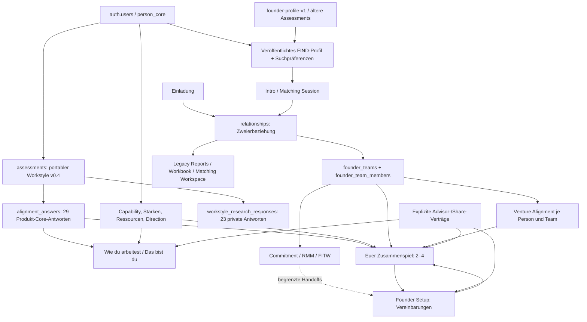

# Phase 9.0 – ALIGN-Systemaudit

Stand: 04.10.2026. Auditierter Branch: `feat/workstyle-reporting-v04`. Commit: `ea95212bd3fdb96d24b75e535950ee89e781a45b`.

**Nur Bestandsaufnahme.** Dieses Dokument ist die einzige neu angelegte Repository-Datei. Keine Produktdatei, Migration, Datenzeile oder Konfiguration wurde verändert. Kein Deployment, Push, Merge oder Commit.

## 1. Executive Summary

MADE2FOUND hat bereits fast alle Bausteine der gewünschten Journey. Die zentrale Aufgabe ist deren Zusammenführung in der Navigation und in den Datenverträgen, nicht der Bau eines weiteren ALIGN-Systems.

Das aktuelle v0.4-Reporting ist eine eigenständige, deterministische Produktprojektion des vorhandenen Assessment-Stacks: Einzelprofil, 2–4-Personen-Teamreport, Workstyle-Grafik, Capability-Komponenten, Venture-Antworten, bestätigtes Founder Setup, Freigaben und Print sind implementiert. Der übrige Produktfluss behandelt dagegen an mehreren Stellen weiterhin ältere Instrumente als aktuellen Einstieg. Insbesondere bedeuten „Wie du arbeitest“, „Arbeitsprofil“, „Alignment“ und „Matchingreport“ je nach Route etwas anderes.

Die wichtigsten gesicherten Befunde:

1. **Aktuelle Darstellung und Erhebung laufen auseinander.** `/me/profile` zeigt v0.4 primär. Die ALIGN-Navigation, Profil-Vollständigkeitsprüfung und Teile des Invite-Flows führen weiter zum 16-Item-`founder-profile-v1`; `CURRENT_INSTRUMENT_ID` bleibt `founder-compatibility-v1` für die klassische Base-/Values-/Report-Welt.
2. **FIND liest noch alte Arbeitsweise-Signale.** Der aktuelle Suchmodus berechnet Themenhinweise aus `founder-profile-v1`. Ein zweiter älterer Signalpfad liest `founder-compatibility-v1`. v0.4 ist nicht stillschweigend eingebunden. Das ist Versionsschutz, aber noch keine kohärente Produktjourney.
3. **Es gibt drei Workbook-nahe Strukturen.** Das große Legacy-Workbook, dessen Drei-Themen-Vertiefung und der eigenständige FIND-Matching-Arbeitsraum mit sieben Vereinbarungsfeldern. Keiner dieser beiden kleinen Pfade ist ein nachgelagerter Pflichtschritt des neuen v0.4-Teamreports.
4. **Founder Setup ist bereits das stärkste gemeinsame Vereinbarungsregister.** 20 Themen, Arbeitsnotizen, Diskussionen, Revisionen, Bestätigungen, Historie, Dokumentansicht und separate Advisor-Freigaben existieren. Ein neues Operating-Agreement-System wäre eine Doppelstruktur.
5. **Multi-Founder ist modulabhängig.** Team-DB und neues Reporting unterstützen vier Mitglieder. Intake unterstützt zwei oder drei. Commitment und ältere Reports sind paarbezogen. RMM/FITW sind in der Oberfläche Zweier-Erlebnisse; RMM hat zusätzlich eine nicht durchgängig integrierte Dreier-DB-Logik.
6. **Die Rechte sind geschichtet, nicht automatisch.** Teammitgliedschaft, Person-Advisor-Grant, Teamreview, Setup-Grant, ALIGN-Share und Research-Consent sind unterschiedliche Verträge. Diese Trennung ist sinnvoll und muss bei jeder Vereinfachung erhalten bleiben.
7. **Snapshots sind nicht gleich Archive.** Neue Workstyle-Snapshots bleiben unverändert gespeichert, werden aber bei verändertem aktuellen Input oder Freigabestand nicht mehr ausgeliefert. Historische Legacy-Report-Payloads folgen einem anderen Vertrag.

### Prüfgrundlage und Grenzen

- Aktueller Code: Routen, Aufrufer, Reader, Actions, Komponenten, Registries, Navigation und relevante Tests wurden durchsucht und zentrale Pfade gelesen. Ein statischer Index erfasste 717 TS-/TSX-Dateien als Suchgrundlage; dies ist keine Behauptung, jede Zeile sei manuell geprüft.
- **Aktuelle lokale DB:** Metadaten von 151 öffentlichen Tabellen/Views und 442 Funktionen wurden aus `pg_catalog` gelesen, einschließlich RLS, Constraints, Triggern, Funktionskörpern und EXECUTE-Rechten. Sicherheits- und Übergangsfunktionen wurden gezielt mit dem Code abgeglichen. Alle SQL-Abfragen liefen in `BEGIN READ ONLY`.
- Letzte lokal verzeichnete Migration: `20261114120000`, davor `20261113121000` und `20261113120000`. Die Datumspräfixe sind Repository-/DB-IDs; aus ihnen wird kein tatsächliches Veröffentlichungsdatum abgeleitet.
- Lokaler Datenbestand: 3 abgeschlossene `founder-compatibility-v1`-Assessments, 2 abgeschlossene `founder-profile-v1`-Assessments. Je **0** Legacy-Workbooks, Workbook-Advisors, Matching-Workspaces/-Agreements, Setup-Revisionen, klassische Report-Runs, Matching-Report-Runs, Produkt-Snapshots, Intake-Runden und Collaboration-Runden. Daraus folgt **nichts** über Produktionsdaten oder tatsächliche Nutzung.
- Lokale Itembank: v1/v0.2 = 37 Definitionen, v2/v0.3 = 36, v3/v0.4 = 52. Capability: 11 Familien, 54 Bereiche; Sourcing 21 `internal_only`, 11 `component`, 22 `depends`.
- Keine Produktionsabfrage. Keine Browser-Interaktion, die Sessions, Reveal-Receipts, Assessments oder Workspaces erzeugt. Mehrere vermeintliche Leseseiten können beim Öffnen schreiben; daher ist dies ausdrücklich ein Code-/DB-Vertragsaudit, kein erneut ausgeführter E2E-Smoke-Test.
- Testdateien wurden als Evidenz gelesen, Tests/Build/Lint wurden in diesem Audit **nicht erneut ausgeführt**. Frühere grüne Ergebnisse in der Phase-8-Dokumentation sind historische Prüfberichte, keine heutigen Messergebnisse.
- `ACTIVE_CURRENT` bedeutet aktuell implementierter Entwicklungsstand, nicht nachgewiesene Produktionsauslieferung oder psychometrische Validierung.

## 2. Aktuelle ALIGN-Architektur



Die durchgezogenen Verbindungen bezeichnen vorhandene Daten-/Navigationspfade, nicht automatische Freigaben. Eine vollständig lineare Journey existiert nicht: FIND ist optional, bestehende Teams können direkt einsteigen, Vertiefungen sind situativ, Setup ist direkt erreichbar.

Die zentrale Identität ist `auth.users.id`, weitergeführt als `person_core.user_id`, Assessment-Owner und `founder_team_members.user_id`. `profiles` ist kein zweites Personenuniversum, enthält aber historische/projektionsbezogene Felder, Produktrollen und Avatarinformationen. `relationships` ist weiterhin ein eindeutiges Personenpaar mit `user_a_id`/`user_b_id` und optionaler Zuordnung zu genau einem Founder-Team. Das Team hat eine echte n:m-Mitgliedschaft, aktuell mit DB-Grenze vier.

**Strukturelle Grenze:** Der Unique-Vertrag eines Personenpaars in `relationships` und sein einzelnes `founder_team_id` sind kein vollständiges Modell beliebig vieler gemeinsamer Ventures desselben Paars. Mehrere Teams einer Person sind vorgesehen; mehrere parallele Teamkontexte desselben Relationship-Paars brauchen eine spätere Vertragsentscheidung. Nicht im Audit umbauen.

Zentrale Quellen: [Instrument-IDs](../../../web/src/features/instruments/instruments.ts), [Profil-Readmodel](../../../web/src/features/reporting/profileReadModel.ts), [Team-Homebase](../../../web/src/features/teams/founderTeamHomebaseData.ts), [Produkt-Reader](../../../web/src/features/reporting/workstyle/data.ts), [Reportmigration](../../../supabase/migrations/20261114120000_workstyle_product_reporting.sql).

## 3. Modulinventar und Status

Status bezeichnet die Funktion, nicht bloß das Vorhandensein einer Datei. `LEGACY_HIDDEN` heißt ohne regulären Einstieg bzw. eingeklappt, nicht unzugänglich. `DEAD_CODE` wird nur bei konkreter Referenzprüfung verwendet. `UNKNOWN` kennzeichnet unbewiesene Laufzeit-/Produktionsnutzung. Weitere Seiten und technische Unterbausteine stehen im Routen- und Quellenanhang.

| ID | User-facing Modul / Status | Zielgruppe und Ebene | Instrument / Datenquelle | Output und nächster Schritt | Aktuell sinnvoll? |
|---|---|---|---|---|---|
| M01 | Über dich / `ACTIVE_CURRENT` | Person, Founder und freigeschaltete Produktrollen | `person_core`, `profiles` | Identität/Foto/Sichtbarkeit → Fähigkeiten, Stärken, Ressourcen, Gesamtprofil | Ja; Editor vom Readmodel unterscheiden |
| M02 | Das bist du / `ACTIVE_CURRENT` | Person | Profil-Readmodel, v0.4, bestätigte Personendaten | Zusammenhängendes Profil → Bearbeiten, Workstyle, Print, Vorhaben | Ja, zentrale Personenansicht |
| M03 | Wie du arbeitest v0.4 / `ACTIVE_CURRENT` | Person; explizit freigegebener Advisor | Pretest v3, Item v0.4, Manifest 3.0.0 | Sechs Bereiche, Signature, Texte, Share/Snapshot/Print | Ja; neue Referenz |
| M04 | Workstyle Development Instrument / `EXPERIMENTAL` | Person mit Research-Consent | v1/v2/v3, versionierte Itembank und Sessions | Antworten, Feedback → Abschluss/Produktprofil | Ja als Entwicklungsinstrument; kein validierter Test |
| M05 | Research-Administration / `ACTIVE_CURRENT` | bestehende Adminrolle | Consent-gefilterte, versionierte Research-Sessions | Kennzahlen/CSV → Forschungsauswertung | Ja, getrennt vom Advisor |
| M06 | Founder-Arbeitsprofil / `ACTIVE_BUT_LEGACY` | Person | `founder-profile-v1`, 16 Items | WorkMap/Antworten/Freigabe → Vorhaben/Nebeneinander | Historisch ja; als aktueller Erhebungseinstieg widersprüchlich |
| M07 | Basis / Werte / `ACTIVE_BUT_LEGACY` | Person und Einladungsparteien | `founder-compatibility-v1`, `assessment_answers` | alte Einzel-/Paarreports → Workbook | Noch aktive Abhängigkeiten; nicht löschen |
| M08 | ALIGN-v2/v2.1 Pilot / `LEGACY_VISIBLE` | eingeloggte Founder im Pilotpfad | v2.1; DB mittlerweile `archived` | Antworten, alter Vergleich, Suchthemen | Historischer Pilot; weiterhin direkt erreichbar |
| M09 | Was du aufbauen willst / `ACTIVE_CURRENT` | Person **im Vorhaben** | `venture-alignment-v1`, 42 aktive Items | Antworten, Bestätigung, Freigabe → Vergleich/Setup | Ja; Registry nennt `draft`, produktiv genutzt |
| M10 | Nebeneinander / `ACTIVE_BUT_LEGACY` | zwei verbundene/freigebende Personen | altes Founderprofil + Venture | Antwortvergleich, Erwartungslücken, DeepDiveCards → Setup | Venture-Detail nützlich; alter Workstyle ersetzt |
| M11 | Euer Zusammenspiel / `ACTIVE_CURRENT` | Team 2–4; berechtigter Advisor | `workstyle-report/1.0.0` | Teammuster, Komponenten, Venture, Setup, Agenda → Setup | Ja, primärer neuer Teamreport |
| M12 | Klassischer Matchingreport / `ACTIVE_BUT_LEGACY` | Invitation-Paar | `report_runs`, alte Base/Values-Scores | Paarvergleich/Print → Workbook-Intro | Historie behalten; aktuelle Rolle ablösen |
| M13 | FIND-Matchingreport / `ACTIVE_BUT_LEGACY` | Matching-Session-Paar | `matching_report_runs`, `founder_alignment_v1` | Paarvergleich → Matching Workspace | Noch aktiver FIND-Handoff |
| M14 | Großes Workbook / `LEGACY_VISIBLE` | Invitation-Paar; historische Advisor-Felder | `founder_alignment_workbooks.payload` | Reflexion/Notizen/alte Bestätigungen/Print | Beschlossen: `DELETE_LATER` |
| M15 | Alignment vertiefen, Drei-Themen-Pilot / `PARTIAL` | Paar innerhalb Team | derselbe Workbook-Payload wie M14 | Klärung + Zwei-Personen-Notizhandoff → Setup | Prompts nützlich; separate Produktstufe redundant |
| M16 | Matching Workspace / `PARTIAL` | aktives Matching-Paar | `matching_workspace_agreements` | sieben Notiz-/Vereinbarungsfelder; zurück zum alten Report | Paralleler Entwurfsspeicher ohne Setup-Abschluss |
| M17 | Team Homebase / `ACTIVE_CURRENT` | aktuelle Teammitglieder | Teams, Paarbeziehungen, Module | Übersicht → Report, Setup, Rollen, Library, Labs | Ja; Altpfade erzeugen Unklarheit |
| M18 | Commitment Lab / `ACTIVE_CURRENT` | Relationship-Paar innerhalb Team | Lab, Founder-Entries, Diskussion | Kapazitäts-/Erwartungsreflexion → Setup | Ja, eigenständige Gesprächsvorbereitung |
| M19 | Read My Mind / `ACTIVE_CURRENT` | in UI zwei Founder | versionierte Collaboration-Packs | Self/Guess/Need, Reveal, Gesprächsmarker | Ja, wechselseitiges Verstehen |
| M20 | Founder in the Wild / `ACTIVE_CURRENT` | zwei Founder | versionierte situative Packs | Move/Matters/Need, ggf. Guess, Reveal/Debrief | Ja, situatives Team-Learning |
| M21 | Founder Setup / `ACTIVE_CURRENT` | Team, separate Advisor-Lesesicht | Items/Revisionen/Bestätigungen/Diskussion | bestätigte Vereinbarungen, Historie, Dokument | Ja, System of Record |
| M22 | Founder Library / `ACTIVE_CURRENT` | Founder, Teamkontext | statische Registry + DE/EN-Inhalte | Begriffe, Hilfen, Setup-Themenlinks | Ja, Wissensschicht; kein Assessment |
| M23 | Capability / Komponenten / `ACTIVE_CURRENT` | Person, Paar, Team, Advisor-Scopes | Taxonomie, Entries, private Evidence | Anwendung/Ownership getrennt, Komponentenkarte | Ja; keine neue Rollen-Taxonomie nötig |
| M24 | Stärken / Antrieb / Ressourcen / `ACTIVE_CURRENT` | Person; teilweise Advisor-Scopes | bestätigte Entries/Statements/Resources | Selbstbeschreibung → Gesamtprofil | Ja; Vorschläge sind noch keine Aussagen |
| M25 | FIND / `ACTIVE_CURRENT` mit Legacy-Signalen | veröffentlichte Founderprofile | Discovery-Projektion, Suchpräferenzen, zwei alte Signalpfade | Kontakte/Intros → Matching-Session | Ja; Workstyle-Vertrag abstimmen |
| M26 | Advisor Personen-/Gruppenreview / `ACTIVE_CURRENT` | Advisor, Organisation, freigebende Personen | Person-Grants, Teamreviews, getrennte Shares | Person-/Gruppensicht, Notizen, Folgeaufgaben → freigegebene Teams | Ja, Pilotbausteine vorhanden |
| M27 | Advisor Relationship-Report/-Session / `ACTIVE_BUT_LEGACY` | freigegebenes Paar + Advisor | relationship_advisors, alte Reports/Impulsdaten | Snapshot/Session/Dokument | Historie und bestehende Betreuung behalten |
| M28 | Team Intake / `ACTIVE_CURRENT` | 2–3 Founder + benannte Reviewer | versioniertes Intake-Schema 1, gemeinsame/paarbezogene Angaben | veröffentlichte Teamkontextsicht → Homebase/Betreuung | Ja; kein Vierer-Intake |
| M29 | Geplante Check-ins / `PARTIAL` als Vorläufer | künftiges Team Development | R12/Review-Inhalte/erneute Runden, kein Terminmodell | derzeit kein 30/90/180/365-Prozess | `MISSING_FUTURE` |
| M30 | Debug-/Beispielreports / `EXPERIMENTAL` bzw. `LEGACY_HIDDEN` | Entwicklung/Demo | Fixtures/alte Engines | Vorschau/Diagnose | Hilfsmittel, kein Produktpfad |

### Erreichbarkeit, Freigaben, Sprachen und Print

`DE/EN` heißt vorhandene UI-/Content-Zweige, keine vollständige sprachliche Laufzeitabnahme. „Browser“ meint vorhandene Druckmöglichkeit/CSS, nicht serverseitige PDF-Erzeugung.

| Module | Regelmäßiger Einstieg | Advisor | FIND-Relevanz | Print | Sprache |
|---|---|---|---|---|---|
| M01/M02 | Global ALIGN, Profilaktionen | eigene scoped Sicht statt fremdem `/me` | kanonische Identität/Projektion | M02 kurz/lang | DE/EN, v0.4-Inhalt DE |
| M03/M04 | Gesamtprofil/Workstyle-Link; Research-Route | Produktantworten nur Share; Research nein | aktuell kein v0.4-Signal | M03 Browser und Profilprint | DE |
| M05 | Admin-Architektur | nein, Admin ist andere Rolle | nein | CSV statt PDF | überwiegend DE |
| M06 | Global ALIGN und `AlignNav` | scoped Share, in Personensicht historisch | **ja**, aktuelle FIND-Themen | WorkMap im Profilprint historisch | Instrument DE |
| M07/M12 | Invite/Dashboard/alte Reports | bestehender Relationship-/Person-Vertrag | ältere optionale Signalschicht | Browser | DE/EN |
| M08 | Pilot-/Versionsnavigation, direkte URL | eigene V2.1-Lesesicht | eigene ältere Topic-Projektion | kein neuer dedizierter PDF-Vertrag | Instrument DE |
| M09/M10 | ALIGN-Unterseiten, Vorhaben-/Partnerlinks | explizite Assessment-Shares | keine automatische Übernahme der Venture-Rohdaten | M09 im neuen Teamreport; sonst kein eigener PDF-Stack | Instrument DE |
| M11 | Teamnavigation, Advisor-Review | Teamzugriff **und** individuelle Shares | erst nach Teamkontext, kein Discoveryinput | Browser A4 + Snapshot | DE |
| M14/M15 | Legacy-Report → Intro; Homebase | Haupt-Workbook sperrt Advisor; historische Daten bleiben | nein | eigener Workbook-Print | DE/EN |
| M13/M16 | FIND-Intro → Matchingreport → Workspace | kein allgemeiner Advisor-Workspace-Grant | nachgelagerter privater Paarraum | Report Browser; Workspace kein spezieller Printflow | DE/EN |
| M17/M21/M22 | Connections/Homebase/Teamnavigation | Setup separat; Homebase nicht allgemein durch Teamreview freigegeben | nein | Setup-Dokument | DE/EN |
| M18 | Homebase je Relationship | kein Rohdaten-Advisor-Vertrag | nein | keine dedizierte Print-/Snapshotroute | DE/EN |
| M19/M20 | Homebase/Collaboration-Karten | kein Rohdaten-Advisor-Vertrag | nein | keine dedizierte Print-/Snapshotroute | DE/EN |
| M23/M24 | Profileditor/Interview/Gesamtprofil, Rollen | Capability/Depth/Strengths/Direction scoped | Bereiche explizit offenlegbar; übriges nicht automatisch | Gesamtprofil, neue Matrix | überwiegend DE/EN |
| M26/M27 | Advisor-Dashboard/Einladungen/Review | jeweiliger eigener Vertrag | private Notizen niemals | alte Snapshot-/Session-/Dokumentrouten; neuer Report separat | DE/EN, v0.4 DE |
| M28 | Advisor Intake / Team Context | benannte Reviewer + publizierte bestätigte Runde | nein | kein eigener dedizierter Intake-PDF-Flow gefunden | DE/EN |

## 4. Routenkarte

Die folgende Karte zeigt die Produktzusammenhänge. Der Anhang listet die konkreten Page-/Route-Dateien samt direkten Feature-Imports; Route Groups wie `(product)` gehören nicht zur URL.

```text
Signup / Login / Welcome / Dashboard
  ├─ /profile                          Person bearbeiten
  │   ├─ ?step=identity|evidence|areas|ownership|strengths|resources|sichtbarkeit
  │   ├─ /profile/interview[/sort]      Capability-Evidence / bestätigte Vorschläge
  │   ├─ /profile/direction            Antrieb / bestätigte Aussagen
  │   └─ /profile/compare/[userId]      Capability-Paarvergleich
  ├─ /me/profile                       Das bist du
  │   ├─ /me/profile/workstyle          v0.4, Share, Snapshot, Print
  │   └─ /me/profile/print?mode=short|full[&legacy=...]
  ├─ /research/workstyle-pretest        Entwicklungsinstrument v1/v2/v3
  ├─ /founder-alignment/profil[/antworten]             altes 16-Item-Profil
  ├─ /founder-alignment/vorhaben[/antworten|/bestaetigen]?venture=...
  ├─ /founder-alignment/vergleich/[partnerId]?venture=...
  ├─ /me/base → /me/values → /me/report                klassische Assessments
  ├─ /invite/new → /join/*, /invite/[sessionId]/*, /session/[sessionId]/*
  │   └─ /report/[sessionId] → /founder-alignment/workbook/intro
  │       └─ /founder-alignment/workbook[?deepDiveStep=...][/print]
  ├─ /discovery[/suche|/profile|/searches|/saved|/intros]
  │   └─ /discovery/intros/[introRequestId]/matching
  │       └─ /matching/[matchingSessionId]/report → /workspaces/[workspaceId]
  ├─ /connections → /teams/[teamId]
  │   ├─ /workstyle                    Euer Zusammenspiel
  │   ├─ /roles                        vorhandene Capability-/Verantwortungssicht
  │   ├─ /setup[/[itemKey]|/document]   gemeinsame Vereinbarungen
  │   ├─ /commitment-lab/[relationshipId]
  │   ├─ /collaboration-lab/read-my-mind[/[roundId]/reveal/[position]]
  │   ├─ /collaboration-lab/founder-in-the-wild[/[roundId]/reveal/[position]]
  │   └─ /founder-library
  ├─ /founder-library[/[slug]]
  └─ /advisor/dashboard
      ├─ /advisor/person/[userId], /advisor/group, /advisor/review/[reviewId]
      ├─ /advisor/report, /advisor/snapshot, /advisor/session[/document]
      ├─ /advisor/intake/new → /team-intake/[roundId]
      └─ /advisor/invite/[token], /invite/person-access/[token],
         /invite/advisor-org/[token], /team-invite/[token], /team-intake/invite/[token]
```

`/founder-alignment/suche` ist ein Übergang zum FIND-Suchpfad, kein Anlass für ein zweites Suchprodukt. `/founder-alignment/prepare-conversation` ist ein Legacy-Workbook-Redirect. Pilot-/Versions-/Debug-Routen sind separat im Anhang erfasst. Das neue Reporting legt keine neue Invitation- oder Matching-Session-Architektur an.

## 5. Datenmodellkarte und Verträge

| Ebene | Tabellen / persistierte Objekte | Reader/Writer und wichtige Grenze |
|---|---|---|
| Person | `auth.users`, `person_core`, `profiles` | `personCoreData/Actions`; kanonische Identität, getrennte Projektionen |
| Capability | `capability_families`, `capability_areas`, `person_capability_entries`, `person_capability_evidence` | Owner-Actions, `get_disclosed_capability`, Advisor-Reader; Evidence privat |
| Interview/Vorschläge | `capability_interview_sessions`, `capability_interview_turns`, Turn-Area-Verknüpfung, `capability_area_proposals`, `person_strength_proposals`, `direction_statement_proposals`, `ai_jobs` | Interview-/Analyse-Actions; erst explizite Bestätigung erzeugt Personeninhalt |
| Stärken/Antrieb/Ressourcen | `person_strengths`, `direction_statements`, `person_resources` | Owner-Reader, scoped Advisor, bestätigte Ressourcen im Profil |
| Legacy Assessment | `instruments`, `questions`, `choices`, `assessments`, `assessment_answers` | Base/Values-Engine, klassische Reports |
| Aktuelles ALIGN | `assessments`, `alignment_answers`, `alignment_item_views` | Scope-/Instrument-Reader; Person vs `venture_id`; Missing als eigener Zustand |
| Workstyle | `workstyle_item_versions`, `workstyle_pretest_sessions`, `alignment_answers`, `workstyle_research_responses` | serverseitiger Start/Resume/Save/Submit; versionierte Definitionen und getrennte private Antworten |
| Research | obige Session-Consent-Felder, zusätzlich `research_consent_preferences`, `research_events`, `research_events_analytics_v1` | allgemeine Research-Präferenz ersetzt **nicht** instrumentbezogene Zustimmung |
| Sharing | `alignment_shares`, `alignment_share_hidden_blocks` | effektiver Share + ggf. Advisor-Lifecycle; Blockausschlüsse serverseitig |
| Beziehung/Einladung | `invitations`, `invitation_modules`, `invitation_matching_inputs`, `relationships` | Join-/Accept-/Report-Handoffs; Relationship ist Paar |
| Team | `founder_teams`, `founder_team_members` | RLS-Mitgliedschaft, Trigger/RPCs, maximal vier; kein `founder_a_id`-Teamschema |
| FIND | `founder_discovery_profiles`, `founder_search_preferences`, `saved_searches`, Discovery-Saves/-Intros/-Messages, `discovery_preference_sets`, `discovery_theme_preferences`, `discovery_theme_items`, Topic-Mappings | Veröffentlichung, Suchfilter, private Präferenzen, alte abgeleitete Signale |
| Matching | `matching_sessions`, `matching_session_participants`, `matching_session_modules`, `matching_session_inputs`, `discovery_matching_starts` | aktiver Teilnehmervertrag; Snapshot der verwendeten Assessment-IDs |
| Reports | `report_runs`, `matching_report_runs`, `person_alignment_snapshots`, `workstyle_product_snapshots` | unterschiedliche Snapshot-Semantik, siehe Abschnitt 8 |
| Legacy Workbook | `founder_alignment_workbooks`, `founder_alignment_workbook_advisors` | Payload/Legacy-Advisor-Bridge; keine neue Setup-Revision |
| Matching Workspace | `matching_workspaces`, `matching_workspace_agreements` | `prepared` / `draft`; Paarentwurf |
| Commitment | `commitment_labs`, `commitment_lab_founder_entries`, `commitment_lab_discussion_entries` | Paarzugriff, expliziter begrenzter Setup-Handoff |
| Collaboration | `collaboration_experience_*`: Packs, Promptversionen, Antwortverträge, Runden, Teilnehmer, Prompts, Assignments, Responses, Reveal-Receipts, Marker | gleicher technischer Stack für RMM und FITW, getrennte Experience-Keys |
| Setup | `founder_team_setup_items`, `founder_team_setup_revisions`, `founder_team_setup_confirmations`, `founder_team_setup_discussion_entries` | Arbeitsstand ≠ vorgeschlagene Revision ≠ bestätigte Vereinbarung |
| Advisor | `relationship_advisors`, `advisor_section_impulses`, `advisor_team_invites`, `advisor_person_grants`, `advisor_person_invites`, `advisor_team_reviews`, `advisor_team_review_members`, `advisor_orgs/members/invites`, `advisor_private_notes`, `advisor_follow_ups` | mehrere ausdrücklich getrennte Scopes und Lebenszyklen |
| Setup-Advisor | `founder_team_advisor_setup_grants`, `founder_team_advisor_setup_consents` | eigenes Team-Einverständnis, nicht aus Review oder Intake ableiten |
| Intake | `team_intake_rounds/reviewers/participants/answers/pair_answers/private_notes` | Publish erst mit passendem bestätigtem Roster; Widerruf/Änderung sperren Lesesicht |

**Views:** Es gibt keine universelle neue `team_report`-View. Relevante vorhandene Views sind `relationship_advisor_backfill_unresolved` und `research_events_analytics_v1`; die drei `connect_discovery_*`-Views gehören zu CONNECT. Produktberichte entstehen über RPCs und TypeScript-Readmodels. `alignment_item_views` ist trotz Namens eine Tabelle, keine SQL-View.

**RLS:** Owner-Antworten und explizit geteilte ALIGN-Antworten sind getrennte Policies. Teammitglieder sehen Teammetadaten, nicht automatisch alle Assessments. `workstyle_product_snapshots` ist für Clients RPC-only. Zahlreiche `SECURITY DEFINER`-Funktionen bilden die eigentliche Zugriffsgrenze; RLS allein beschreibt deshalb nicht den vollständigen Vertrag. Die relevanten live vorhandenen Funktionen/Policies/Trigger stehen im Anhang.

## 6. Personendatenkarte

| Information | Entstehung | Primäre Quelle | Anzeige / Weitergabe | Einordnung und Überschneidung |
|---|---|---|---|---|
| Identität, Headline, Bio, Ort, Remote | `/profile?step=identity`, Onboarding | `person_core` | `/me/profile`, veröffentlichte FIND-/CONNECT-Projektion, Advisor-Base | personbezogen; `profiles` und Projektionen enthalten redundante Kopien |
| Produktrolle Founder/Advisor | Signup/Produktzugang/Profil | `profiles.roles` und Zugangslogik | Navigation und Berechtigung | keine Capability, kein Teamjob |
| Avatar/Foto | Profileditor | `profiles.avatar_id/avatar_url`, Sichtbarkeit in Person Core | Profil/Member-Präsentation | unverändert, nicht Teil der Workstyle-Auswertung |
| Workstyle aktuell | `/research/workstyle-pretest` | v3-Assessment + 29 erlaubte `alignment_answers` | neuer Einzel-/Teamreport und freigegebene Advisor-Sicht | portable Personenantworten; keine Venture-Zusage |
| Workstyle historisch | `/me/base`, `/founder-alignment/profil`, ältere Pilots | unterschiedliche Instrumente/Antworttabellen | alte Reports/WorkMap; weiter aktive Erhebungspfade | echte konkurrierende Einstiege, keine automatische v0.4-Konvertierung |
| Stärken | Profil/Interview, bestätigte Vorschläge | `person_strengths` | Profil/Print, scoped Advisor | personbezogen; nicht aus Workstyle-Typen erzeugt |
| Capability-Bereiche | Evidence/Interview/Zuordnung | `person_capability_entries.area_id` | Profil, FIND bei Disclosure, Paar-/Teamkarte, Advisor | Fähigkeit/Erfahrung; nicht Rolle |
| Anwendungserfahrung | Profileditor `areas` | `application_level` 1–5 oder NULL | ausgeschriebene Stufen, Tiefe ab `DEPTH_LEVEL=4` | keine Leistungsnote; keine Ersetzung von Ownership |
| Ownership-Wunsch | `/profile?step=ownership` | `ownership_wish` | Profil, Teamkomponenten, ggf. tiefere Disclosure | personbezogener Wunsch; erst Setup macht gemeinsame Zuständigkeit daraus |
| Wachstum | Ownership-Wunsch und ausdrücklich geringe Anwendung bei Übernahmewunsch | `grow_into`, Readout-Regeln | Wachstum im Gesamtprofil/Matrix | abgeleitete Sicht, kein weiterer Fragebogen nötig |
| Ressourcen/Netzwerk/Zugänge | manuell `/profile?step=resources`, bestätigte Extraktionsvorschläge | `person_resources`: `network`, `access`, `offer` | bestätigte Einträge im Gesamtprofil/Print | nicht automatisch öffentlich oder FIND-Suchsignal |
| Antrieb/Direction/Why | `/profile/direction`, eigener Interview-Kind | `direction_statements`, Vorschläge/Interviewturns | Profil/Print, Direction-Advisor-Scope | Personenaussage, getrennt von Venture-Ziel und Exitwunsch |
| Branchenwissen | Profilangaben + Capability/Evidence | `person_core.industries/expertise`, Capability | veröffentlichte Projektion/FIND-Filter | Tags sagen etwas anderes als belegte Anwendung; Überschneidung sprachlich sichtbar |
| Interessen | verstreute Freitexte/Direction/Profilkontext | kein einheitliches eigenständiges kanonisches Interessenmodell gefunden | vorhandene Texte/Tags | `UNKNOWN` als eigenständiger Datenvertrag; nicht aus Branchen oder Research ableiten |
| Verfügbarkeit/Commitment für Suche | FIND-Profil | `founder_discovery_profiles` | Discovery-Karte/Filter | Suchkontext, nicht bindende Zusage für ein bestimmtes Team |
| Zeit/Geld/Ziele eines Vorhabens | `/founder-alignment/vorhaben?venture=...` | Assessment mit `venture_id` | freigegebene Venture-/Teamansicht | eindeutig vorhabensbezogen |

`/profile` ist der Editor, `/me/profile` die zusammengeführte Leseansicht. Das ist keine unnötige doppelte Erfassung. Doppelungen entstehen dort, wo Legacy-Arbeitsprofil und v0.4 gleichzeitig als aktueller Bogen angeboten werden, oder verschiedene Commitmentfelder ohne Kontext erscheinen.

**Synchronisation:** Der aktuelle Person-Core-Trigger propagiert kanonische Felder nach `profiles`, `founder_discovery_profiles` und `network_profiles`. In den geprüften Zuweisungen wird `coalesce(new_field, existing_field)` verwendet. Das verhindert leeres Überschreiben, kann aber beim bewussten Leeren eines Core-Felds einen alten Projektionswert erhalten. Kein Nachweis, dass alte Workstyle-Antworten v0.4 überschreiben; das gefundene Risiko betrifft veraltete Identitätsprojektionen. Bei einer späteren Korrektur Löschsemantik und Veröffentlichung gemeinsam prüfen, nicht die Synchronisation pauschal ersetzen.

Ein weiterer konkreter Rest: [aboutYouData.ts](../../../web/src/features/profile/aboutYouData.ts) prüft für die Arbeitsprofil-Station weiterhin `FOUNDER_PROFILE_INSTRUMENT_ID`. Ein fertiges v0.4-Profil allein erfüllt diese alte Statusprüfung nicht.

## 7. Workstyle Legacy gegenüber v0.4

| Instrument / Engine | Ist-Zustand | Historischer Wert / funktionale Ersetzung | Empfehlung |
|---|---|---|---|
| `founder-compatibility-v1` | DB `active`, `CURRENT_INSTRUMENT_ID`; Base/Values, alte Einzel-/Paarreports, Einladung und ältere Discovery-Signale | sechs alte Dimensionen: company_logic, decision_logic, work_structure, commitment, risk_orientation, conflict_style; **nicht** identisch mit den sechs v0.4-Bereichen | aktive Neueinstiege später umstellen; historische Reader und Antworten behalten |
| `founder-alignment-v2` | DB `archived`, frühere Registry/Engine/Debug | Entwicklungsfassung | `HISTORICAL_ONLY` |
| `founder-alignment-v2-1` | DB `archived`; `/founder-alignment/pilot` beschreibt es im Code noch als Testfassung und rendert QuestionnaireV21 | alte 36-Fragen-Pilotwelt, gemischter fachlicher Zuschnitt | `LEGACY_VISIBLE`; Status/Erreichbarkeit später abstimmen, keine automatische Löschung |
| `founder-profile-v1` | DB `draft`, real angebotener 16-Item-Bogen; WorkMap, Synthese, FIND-Themen | fachlich durch v0.4 ersetzt, technisch weiterhin aktiv | Erhebung/Navigation `ADAPT`; historische Lesesicht behalten |
| Workstyle pretest v1 | DB `draft`, 20 Core + A/B/C, 37 Itemdefinitionen | separate Version/Consent, keine Umdeutung | `HISTORICAL_ONLY` für Produktvergleich; Research-Auswertung erhalten |
| Workstyle pretest v2 | DB `draft`, 30 Core + 6 Research, keine A/B/C | separate Version/Consent | ebenso |
| Workstyle pretest v3 / v0.4 | DB `draft`, 52 Screens: 29 produktfreigegebene Core + 23 private | neue fachliche und Reporting-Referenz | `KEEP` |

Die DB-Statuswerte sind keine zuverlässige Produktnavigation: „draft“ kann aktiv angeboten werden; „archived“ kann noch eine Pilot-Page haben. Das ist ein dokumentierter Code-/DB-Widerspruch, kein Anlass, Statuswerte im Audit zu ändern.

**v0.4-Grenze:** `scientific_status='core'`, `usage='core'`, `research_only=false`, exakt passende Instrument-/Manifest-/Itemversion. DEC, FS, Research und `core_research` werden nicht durch ihre bloße Nähe zum Core produktiv. Die Produktreader lesen keine Research-Rohdaten. Missing bleibt Missing. Latest-completed wird vor Kompatibilitäts-/Shareprüfung bestimmt; kein Fallback auf ein älteres freigegebenes Profil.

**Darstellung:** Detail-Signature zeigt Rohkategorien; FC bleibt qualitative Richtung, Behavioral benannte Reaktion. Die kompakte Übersicht nutzt dokumentierten unteren ordinalen Median geeigneter Items, ausschließlich für die Anzeige. Die Interpretation verwendet konkrete Itemmuster, nicht diesen Median. Keine Scores, Normierung oder Matchdistanz im neuen Bericht.

**Altgrafiken:** `WorkMap` bleibt an alten Profil-/Venture- und historischen Person-/Advisorstellen erreichbar. `SelfReportView` und `FounderMatchingView` verwenden alte Score-/Dimensionsmodelle. `AlignmentRadarChart.tsx` hat bei repositoryweiter Symbolsuche keinen Aufrufer außer seiner Definition: **DEAD_CODE-Kandidat mit hoher statischer Evidenz**, kein belegter user-facing Radar im neuen Reporting. Kein Löschen aufgrund des Namens allein.

## 8. Reports, Snapshots und Print

| Report | Route / Modell | Daten und Scores | Snapshot / Print | Entscheidung |
|---|---|---|---|---|
| Gesamtprofil | `/me/profile`, `profileReadModel` | v0.4 primär; historische WorkMap/SelfReport eingeklappt; Capability/Direction/Ressourcen | `/me/profile/print?mode=short|full`, Legacy optional | `KEEP` |
| Einzel-Workstyle | `/me/profile/workstyle`, `IndividualWorkstyle` | ausschließlich freigegebene v0.4-Core-Antworten | `workstyle_product_snapshots`, Browserprint | `KEEP` |
| Neuer Teamreport | `/teams/[teamId]/workstyle`, `TeamWorkstyleReport` | aktuelle Mitglieder, Core, disclosed Capability, same-venture Alignment, bestätigtes Setup | gleiche Snapshotfamilie, A4-CSS | `KEEP` |
| Alter Einzelreport | `/me/report`, `/report/[sessionId]/individual`, `SelfReportView` | alte sechs Scores und Values; als eigenständige Route noch aktuell lesbar | alte Assessment-/Reportbezüge, Browserprint | `HISTORICAL_ONLY`; Neueinstiege später ersetzen |
| Invitation-Matchingreport | `/report/[sessionId]`, `FounderMatchingView` | `compareFounders`, alte Dimensionen/Values; Rohpositionen aus Scorewerten, Statusklassen | `report_runs` eindeutig je Invitation, Print | `REPLACE_WITH_NEW_REPORT` für neue Journey; historische Payloads behalten |
| FIND-Matchingreport | `/matching/[matchingSessionId]/report` | alte Paarlogik, Payload `reportType=founder_alignment_v1` | `matching_report_runs` eindeutig je Session, Print | ebenso, Handoff zu Teamkontext nötig |
| Nebeneinander | `/founder-alignment/vergleich/[partnerId]` | alte Founderprofil- plus aktuelle Venture-Antworten; keine globale Passungszahl | live Readmodel, DeepDiveCards → Setup | Workstyle ersetzen; Venture-Detail `KEEP_AND_CONNECT_BETTER` |
| Advisor alte Reports | `/advisor/report`, `/advisor/snapshot`, `/advisor/session`, `/advisor/session/document` | Relationshipfreigabe, alte Report- und Impulsdaten | bestehende Dokument-/Drucksichten, keine eigenständige generische `report_snapshots`-Tabelle | historische Betreuung behalten, neue Reports sichtbar verbinden |
| Workbookdruck | `/founder-alignment/workbook/print` | großer Legacy-Payload einschließlich historischer Strukturen | live Payload-Print; kein eigenständiges versioniertes Snapshotregister | `DELETE_LATER` erst nach Historienentscheidung |
| Setup-Dokument | `/teams/[teamId]/setup/document` | bestehender Setup-Lesestand/Bestätigungsmodell | Browserdruck/Dokument | `KEEP` |

**Alte Scores sind noch user-facing wirksam**, auch wenn nicht überall eine Zahl ausgeschrieben wird: `FounderMatchingView` übergibt `scoreA/scoreB` mit `valueScale="founder_percent"` an `ComparisonScale` und verwendet Distanz-/Statusinterpretationen. Die Balkenpositionen sind Score-Ableitungen. Daraus folgt nicht, dass dort ein globaler Compatibility-Prozentwert angezeigt wird. `rankingScore` in FIND ist intern berechnet; im aktuell gelesenen Suchseitenpfad werden maximal zwei Themenhinweise angezeigt, nicht dieser Zahlenwert, und die geprüfte DB-Liste sortiert nach `published_at`, nicht nach ihm.

### Zwei verschiedene Readiness-Verträge

- `get_workstyle_team_inputs` plus `checkWorkstyleTeamReadiness`: vorbereitender, versionsbewusster Reader für v1/v2/v3. Verlangt zusätzlich vollständiges erforderliches Venture Alignment aller Personen. Kein Produktions-Page-Aufrufer von `getWorkstyleTeamInputs` außerhalb seines Moduls gefunden; als vorbereitete interne API einordnen, nicht als UI-Gate.
- `get_workstyle_product_team` plus `validProductTeam`: heutiger Reportpfad. Verlangt 29 sichtbare v0.4-Core-Antworten pro aktuellem Mitglied. Venture Alignment ist **optional** und wird sonst als offen dargestellt. Setup/Capabilities sind ebenfalls getrennt freigegebene Ergänzungen. Das ist die tatsächliche produktive Reportlogik.

Nicht dieselbe Statusmeldung aus beiden Verträgen ableiten. Quellen: [Vorbereitungsreader](../../../web/src/features/instruments/workstyle/teamReadiness.ts), [Produktmodell](../../../web/src/features/reporting/workstyle/model.ts), aktuelle DB-Funktionen.

### Snapshot-Semantik

`person_alignment_snapshots` ist ein aktualisierter personenbezogener Score-/Values-Snapshot, kein append-only Zeitarchiv. `report_runs`/`matching_report_runs` speichern Legacy-Payloads mit Input-Assessment-IDs und einem eindeutigen Run je Invitation/Session. Sie sind kein universeller n-member Reportstore.

`workstyle_product_snapshots` speichert Schema `workstyle-report/1.0.0`, `generated_at`, Viewer, Subject oder Team und erlaubten Produktinput. Darin liegen Instrument, Manifest, Itemversionen, Mitglieder/Kontext, Capability-Einträge, konkrete Taxonomie/Sourcing, Alignment-Instrument/Manifest und bestätigtes Setup. Eine separate Capability-Taxonomieversionsnummer fehlt; die Definitionen werden eingefroren.

`get_workstyle_product_snapshot` prüft erneut den aktuellen erlaubten Input und verlangt JSON-Gleichheit. Widerruf, neues Profil, andere Mitglieder, andere Taxonomie oder geänderte freigegebene Daten können den alten Snapshot unlesbar machen. Das ist eine strenge Widerrufssicherung, **kein dauerhaft abrufbares historisches Archiv**. Es wird kein Research-Payload kopiert. Nicht unterstellen, alle alten und neuen Snapshotarten seien austauschbar.

### Print, PDF, Accessibility

Der neue Report nutzt HTML/SVG/CSS, `@page A4`, Druckränder, umbrechende Komponenten, sichtbare Rohantworten, Formen/Konturen/Initialen und Text statt bloßer Farbcodes. Kein Raster-Screenshot als Grafik. Einzelreport, Profilkurz-/langfassung und Teamreport sind druckbar. Legacy besitzt eigene Printklassen und Workbook-/Advisor-Dokumentrouten. In den geprüften Produktpfaden bedeutet PDF überwiegend Browser-„Drucken als PDF“, nicht einen neuen PDF-Backenddienst.

Die neue Berichtssprache ist DE; vorhandene DE/EN-Shells übersetzen diese Instrumenttexte nicht automatisch. Die Phase-8-Dokumentation berichtet bereits Desktop-/Mobile-/A4-Prüfungen; in diesem Audit nicht erneut durchgeführt. Ein späterer Navigationseingriff muss diese vorhandenen Printpfade erhalten. Quellen: [report.css](../../../web/src/features/reporting/workstyle/report.css), [WorkstyleSignature](../../../web/src/features/reporting/workstyle/WorkstyleSignature.tsx), [Phase-8-Prüfbericht](../phase-8/phase-8.5a-v3-product-reporting.md).

## 9. LEGACY WORKBOOK DELETION MAP

**Entscheidung bleibt: vollständig aus dem aktiven Produkt entfernen, aber erst in einer eigenen Phase.** Aktuell gibt es reale Code-, Daten- und Account-Lifecycle-Abhängigkeiten. Die lokale Zahl null ersetzt keine Produktions-Bestandsprüfung.

### Gegenstand und Inhalt

Hauptpfade: `/founder-alignment/workbook`, `/workbook/intro`, `/workbook/print`, Redirect `/founder-alignment/prepare-conversation`, Debug-Workbookseiten. Schlüssel ist `invitation_id`, Kontext `pre_founder|existing_team`, nicht ein generischer Teamrevision-Key.

Zehn Steps: `vision_direction`, `roles_responsibility`, `decision_rules`, `commitment_load`, `collaboration_conflict`, `ownership_risk`, `values_guardrails`, `alignment_90_days`, `alignment_open_points`, `advisor_closing`. Darstellung variiert nach Teamkontext und Rolle.

Payload enthält individuelle und gemeinsame Reflexionen, Agreementtexte, `founderAApproved/founderBApproved`, strukturierte Outputs, `workspaceV2.entries`, historische Legacy-Founder-Einträge, Advisor-Notizen/Abschluss, Reaktionen und Follow-up. Diese Inhalte existieren nicht automatisch im Founder Setup. Zwei alte Checkboxen sind keine Setup-Revision mit Zustimmung sämtlicher aktueller Mitglieder.

### Lösch-/Erhaltungsplan als Auditentscheidung

| Gegenstand | Später einfach entfernbar? | Vorher erforderlich / erhalten |
|---|---|---|
| Workbook-Pages, Intro, Debug-Vorschauen, reine Layout-/Chrome-Bauteile | erst nach Linkbereinigung und Wahl eines historischen Readers | Links aus Reports, Homebase, Marketing, E-Mails und Feedbackmodul auflösen |
| `FounderAlignmentWorkbookClient`, Workbook-Navigation/-Rendering/-Content/-Reaction | nicht pauschal | Drei-Themen-Vertiefung hängt am selben Stack; gewünschte Prompts und Leselogik vorher abtrennen oder ebenfalls archivieren |
| `founderAlignmentWorkbook.ts` Normalisierung/Payloadtypen | nein | alter JSON-Payload hat mehrere Generationen; ohne Normalisierung sind historische Stände unvollständig/anders lesbar |
| `founderAlignmentWorkbookData/Actions`, PilotDraft/Impulslogik | nicht isoliert | Reader lesen alte Reports/Assessments; Actions und Druckpfad gemeinsam berücksichtigen |
| `founder_alignment_workbooks` | nein | historische Antworten, Vereinbarungen, Advisor-Inhalte erhalten/gezielt exportieren; keine stille automatische Umwandlung in bestätigtes Setup |
| `founder_alignment_workbook_advisors` | nein | Legacy-Bridge nach `relationship_advisors`, Token-/Approvalhistorie und Account-Löschung prüfen |
| `relationship_advisors` | **nicht Workbook-only** | aktiv für Advisor-Report, Setupfreigabe und paarbezogenen neuen Reportzugriff; behalten |
| `advisor_section_impulses` | **nicht Workbook-only** | Advisor-Berichts-/Sessionlogik prüfen und behalten, sofern dort genutzt |
| `report_runs`, `matching_report_runs`, Assessments, Invitations, Relationships | **nicht Workbook-only** | bestehende Reports/Einladungen/Teamzuordnung; niemals zusammen mit Workbook pauschal entfernen |
| `matching_workspaces`, `matching_workspace_agreements` | separates Modul | eigene Migrations-/Archiventscheidung, nicht als Workbooktabelle behandeln |
| `founder_team_setup_*` | aktuelles System | vollständig behalten; Handoff-RPC ggf. später stilllegen |
| `handoff_workbook_deep_dive_note_if_empty` | nach Ende des Drei-Themenpfads | existierende übernommene Working Notes behalten; sie sind nicht mehr Workbook-only |
| `delete_founder_account_data`, Scrub-/Residue-Funktionen | nicht blind löschen | live Abhängigkeit zu Workbooktabellen/-JSON; Accountlöschung konsistent weiterführen |
| `relationship_advisor_backfill_unresolved` | historischer Migrationskontrollpfad | unresolved Fälle vor Abschalten der Legacy-Bridge prüfen |
| SQL-Migrationshistorie | nein | nicht rückwirkend aus Repo entfernen; spätere additive Archiv-/Dropmigration separat prüfen |

### Konkrete Verweise und Übergaben

- Alte Invitation-Reports führen zum Workbook-Intro; Homebase zeigt klassische Report-/Workbook-/Workspace-Verknüpfungen und daraus gelesene Vereinbarungen.
- `founderAlignmentWorkbookData.ts` verwendet `scoreFounderAlignment`, V2-Mapping/Scoring und `buildFounderAlignmentReport`; der Reportinput ist nicht v0.4.
- `workbookDeepDivePilot.ts` und `workbookDeepDiveHandoffActions.ts` benutzen denselben Payload für die reduzierte Vertiefung.
- `relationshipAdvisorAccess.ts::syncRelationshipAdvisorFromLegacyInvitation` liest `founder_alignment_workbook_advisors` und überträgt in den aktuellen Relationship-Advisor-Vertrag. Das ist eine tatsächliche Integrationsabhängigkeit.
- Die Workbook-Hauptroute leitet Advisor-Kontexte zur Advisor-Berichtsansicht um; `advisorToken` führt über Advisor-Invite. Das alte Vorhandensein von Advisorfeldern bedeutet **nicht**, dass die heutige Workbook-UI für Advisor offen ist.
- `advisorReportPageData.ts`/Advisor-Snapshot berücksichtigen noch Workbookkontext/-verfügbarkeit. `profile/actions.ts` revalidiert die Workbookroute. Marketing-/E-Mail-/Feedbacktexte enthalten weitere Referenzen.
- Live DB: `delete_founder_account_data`, `scrub_deleted_advisor_from_workbook_payload`, `workbook_payload_has_advisor_personal_data` und Updated-at-Trigger referenzieren Workbookdaten. Die Accountlöschung prüft danach verbliebene Advisor-Payloadreste.
- Der aktuelle generische Account-Export exportiert **keine** Workbookpayloads, Setup-Revisionen oder vollständigen ALIGN-Antworten. Er ist somit kein bereits vorhandener vollständiger Workbook-Archivexport. Das ist ein technischer Umfangsbefund, keine rechtliche Bewertung.

### Testabhängigkeiten

Unitgruppen: `founderAlignmentWorkbookData`, `founderAlignmentWorkbookPilot`, `founderAlignmentWorkbookPilotDraft`, `workbookDeepDivePilot`, Workbook-Content/Rendering/Print/Chrome/Reaction-Tests, `advisorWorkbookRemoval`. `test:founder-compat` nennt Workbooktests ausdrücklich. SQL: `workbook_deep_dive_handoff.sql`, Account-Deletion-/Advisor-Consent-Tests und Workbook-/Relationship-Migrationstests. Vollständige Dateiliste im Anhang.

**Historische Lesbarkeit:** Ja, potenziell existieren Nutzerstände, die ohne Legacy-Reader nicht mehr korrekt darstellbar wären. Gesichert ist die Speicher-/Normalisierungsfähigkeit; Produktionsvorkommen ist `UNKNOWN`. Vor späterer Entfernung braucht es einen lesenden Produktionsbestandsnachweis, Archiv-/Exportentscheidung, Auflösung aller aktiven CTAs und erst dann Stilllegung von Schreibpfaden und Tabellen. Kein Legacy-Payload darf als bereits gemeinsam bestätigte aktuelle Vereinbarung ausgegeben werden.

## 10. Kleines Workbook – getrennte Bewertung

Die Frage „das kleine Workbook hinter dem neuen Matchingreport“ beschreibt den heutigen Code nicht eindeutig. Es gibt zwei Kandidaten:

### A. Drei-Themen-Vertiefung „Alignment vertiefen“

Route `/founder-alignment/workbook/intro?invitationId=...`, danach `/founder-alignment/workbook?...&deepDiveStep=decision_rules|collaboration_conflict|alignment_open_points`. Kein eigenes Instrument und keine eigene Sessiontabelle. Das Intro begrenzt den großen Workbook-Editor auf drei Themen.

Input: älterer Paarreport plus gespeicherte Reflexions-/Workspace-Einträge. Interaktion: Unterschiede und Klärungspunkte aufgreifen, konkrete Gesprächs-/Arbeitsnotiz formulieren. Output: Workbook-Payload; für Entscheidungen und Konflikt genau ein expliziter Handoff in ein **leeres** Setup-Working-Note-Feld. Keine automatische Bestätigung, kein Überschreiben bestehender Notizen. Bei mehr als zwei Mitgliedern nur Link; der Enumname `three_founder_link_only` umfasst im Code auch vier.

**Einzigartiger Nutzen:** ein sehr kurzer Übergang vom Befund zur formulierten Gesprächsfrage/Notiz. **Kein einzigartiger dauerhafter Datenjob:** neue Reportagenda und Setup-Diskussion decken Befund → Klärung → Vereinbarung bereits ab. Commitment bearbeitet speziell Belastbarkeit und Erwartungen; RMM Fehlannahmen über andere; FITW situative Reaktionen. Das kleine Workbook liefert keinen zusätzlichen Erkenntnistyp vergleichbarer Eigenständigkeit.

**Empfehlung `MERGE_LATER` / `MERGE_OR_REMOVE_LATER`:** gute Prompts und explizite Notizübernahme als Einstieg in vorhandenes Setup erhalten, die separate Workbook-Stufe samt Legacy-Paarreportabhängigkeit später auflösen. Keine neue Mini-Workbook-Tabelle und keine Pflichtschleife „Report → dieselben Themen noch einmal → Setup“.

### B. Sieben-Themen-Matching-Workspace

Route `/workspaces/[workspaceId]`, nach `/matching/[matchingSessionId]/report`. Input ist ein vorbereitetes Matching-Workspace mit Session-/Report-/Relationshipbezug. Sieben Abschnitte: `roles`, `commitment`, `decisions`, `conflict`, `communication`, `equity_conversation`, `next_90_days`; je Notiz und Vereinbarungsentwurf mit Zeitstempel. Status bleibt `draft`, keine Revisionen/einstimmigen Bestätigungen. Hauptnavigation zurück zum alten Report; kein gleichwertiger sicherer Setup-Handoff im Pagepfad gefunden.

`createOrGetMatchingWorkspaceAgreement` wird beim Seitenladen aufgerufen: selbst ein GET kann einen Entwurf erzeugen. Dieser Raum ist **nicht** der private CONNECT-Problemworkspace unter `/connect/workspaces`.

**Empfehlung `MERGE_LATER`:** Entwürfe später in einen expliziten Setup-Übergang überführen bzw. historisch lesbar halten. Kein weiterer Agreementstore nötig. Im Ist-Zustand ein `MISSING_HANDOFF`, keine abgeschlossene Vereinbarungsjourney.

### Vergleich mit den übrigen Modulen

| Modul | Einzigartiger Job gegenüber kleinem Workbook |
|---|---|
| Neuer Teamreport | stellt aktuelle erlaubte Person-/Teamdaten zusammen, erzeugt Agenda ohne Notizpflicht |
| Commitment Lab | strukturierte persönliche Reflexion zu Kapazität, Bedeutung von Commitment, schwierigen Situationen |
| Founder Setup | gemeinsam bestätigte, versionierte Vereinbarungen und Dokumentationsreferenzen |
| RMM | Unterschied zwischen Selbstbeschreibung und fremder Erwartung, plus Bedürfnis |
| FITW | Reaktion und Prioritäten in konkreten Drucksituationen, gemeinsamer Debrief |

**Klare Entscheidungsempfehlung:** Kein eigenständiges kleines Workbook als reguläre nächste Produktstufe weiterentwickeln. Nutzbare Gesprächsprompts bewahren und in vorhandene Report-/Setup-Verbindungen integrieren. Erst danach Legacy-Workbook entfernen.

## 11. Venture Alignment

Quelle: [venture-alignment-registry-v1.json](../../../web/docs/venture-alignment-registry-v1.json), `registryVersion=1.0.0`, `scope=venture_alignment`, DB/Registry `draft`. Es gibt **43 Definitionen, 42 aktive Items**. `S01` bleibt retired; keine Umrechnung seiner alten Mehrfachauswahl in S01a–f. Der vollständige aktuelle Wortlaut-/Format-/Missing-/Optionsbestand steht im Anhang dieses Audits.

| Abschnitt | Aktive IDs | Inhalt / Ebene |
|---|---|---|
| Zusammenarbeit, Spielraum, Information | U01/U03/U04/U05, K01/K03/K04 | gewünschte Autonomie, Budgetspielraum, Umplanung, Updates; individuelle Erwartung an dieses Vorhaben |
| Ziele und Richtung | S01a–f, S01_top, S02/S03/S04/S06 | Tragfähigkeit/Wachstum/Wirkung/Verkauf/Anspruch/Unabhängigkeit, Beteiligung, Finanzierung, 12-Monatsziele, künftige Rolle |
| Ressourcen und Zusagen | R01/R02/R03/R04/R05/R06/R09/R10/R12 | Stunden, Partnererwartung, Zeitfenster, Auszahlung, Haupttätigkeit, Meilensteinreaktion, Priorität, erneute Besprechung |
| Entscheidungs-/Teamregeln | G01/G04/G05 | Bereichsentscheidung, Deadlockwege, Einstimmigkeit; gewünschte Regeln, noch keine Vereinbarung |
| Risiko/Absicherung | B01/B04/B05 | privates Verlustrisiko, Reserve in Monaten, Bedingungen vor größerem Schritt |
| Zielkonflikte | W01–W06 | Finanzplanung, Rollenanforderung, Wirkung/Überschuss, Mitsprache/Tempo, Reserve/Test, Bonusverteilung |
| Grenzen | L01/L02/L03 | nicht akzeptable Vorgehensweisen, Erkennen der Grenze, Klärungsweg |

Alle Antworten gehören im aktuellen Stack zu `assessments(user_id, instrument_id, venture_id)`; `venture_id` verweist auf den bestehenden Founder-Team-Kontext. Ein eigener `ventures`-Neubau ist nicht nötig. `resolveVenture` nutzt existierende Mitgliedschaften, fragt bei mehreren Ventures nach und kann für Solo-Founder über `create_solo_venture` ein Team/Vorhaben anlegen. Der Solo-Kontext kann bei passender erster Einladung übernommen werden.

`confirmVentureAnswers` setzt `answers_confirmed_at`. Das ist eine individuelle Sichtungsbestätigung, **keine Teamzustimmung**. Antworten gelten auch ohne diese Bestätigung. Andere Personen benötigen einen wirksamen Assessment-Share, blockweise Einschränkung bleibt möglich.

**Mehrpersonen-Grenze R02:** Der Wortlaut adressiert eine einzelne andere Person. `solePartnerName` setzt nur bei genau einem Mitmitglied einen Namen ein. Der neue Teamreport markiert R02 bei 3+ als „Empfängerbezug gemeinsam klären“ statt einen Teamwert zu erfinden. Die Erhebung selbst bleibt damit semantisch paarbezogen, obwohl der Storage teambezogen ist.

Überlappung zu Workstyle: U05/ORG (Anpassung), K01/VOICE (Sichtbarkeit), G01/G04/VOICE (Dissens/Entscheidung), B05/EL/EVI (vor Handeln prüfen), W-Szenarien (Prioritäten unter konkreten Bedingungen). Der Unterschied ist überwiegend sinnvoll: **typisches persönliches Verhalten** gegenüber **gewünschter Regel/Erwartung für dieses Venture**. K01 ist sprachlich allgemeiner als sein Speicherkontext; diese Restunschärfe dokumentieren, nicht automatisch ins Workstyleinstrument verschieben.

Der neue Teamreport vergleicht sichtbare Antwortinhalte ohne Overall Alignment Score. Nicht sichtbare/fehlende Angaben bleiben offen. Kein stiller Zugriff auf ein anderes Venture und kein automatisches Produkt- oder FIND-Signal aus privaten Risikogrenzen.

## 12. Commitment Lab

Route `/teams/[teamId]/commitment-lab/[relationshipId]`. Quellen: [Model](../../../web/src/features/commitmentLab/commitmentLabModel.ts), Data/Actions im selben Ordner, SQL `commitment_lab_v1.sql` und live Handoff-Funktion.

Tatsächliche Inputs: verfügbare Stunden heute und in schwierigen Wochen, Verpflichtungskategorien (Anstellung, Selbständigkeit, Ausbildung, Familie/Pflege, anderes Projekt, Sonstiges), Änderungsnotiz, Reality Fit, persönliche Bedeutung von Commitment (Priorität, Verlässlichkeit, Transparenz, Verantwortung, Neuverhandlung), Reflexionsfelder, schwierige Situation/gewünschte Alternative und maximal drei Gesprächsmarker. Vier Szenarien: Motivation/Fortschritt, Zeit/Umstände, attraktive Alternative, Teamverantwortung; jeweils eigenes Handeln und Erwartung.

Speicher: `commitment_labs`, `commitment_lab_founder_entries`, `commitment_lab_discussion_entries`. `CommitmentLabSnapshot` ist ein TypeScript-Lesemodell, **kein zusätzlicher unveränderlicher DB-Snapshot**. Das Lab gehört einer Relationship innerhalb des Teams; `participantNames`/Readiness sind paarbezogen.

Beide Founder müssen ihren Teil vollständig haben, bevor bestimmte gemeinsame Auswertungen/Marker als bereit gelten. Die RLS lässt jedoch beiden Relationshipparteien die Entries lesen; keine pauschale Behauptung, sämtliche Rohantworten seien bis zum gemeinsamen Reveal unsichtbar. Andere Teammitglieder und Advisor erhalten dadurch keinen automatischen Rohdatenzugriff.

Handoff: `handoff_commitment_lab_reflection_if_empty` sperrt die Teamzeile, prüft Paarzugehörigkeit, genau zwei aktuelle Mitglieder, den Zusammenhang von Lab/Relationship/Team und die Ziele `time_commitment` oder `changing_commitment`. Es wird ausschließlich eine leere Setup-Arbeitsnotiz befüllt. Bei 3/4 keine automatische Übernahme. Keine Vereinbarung ohne Setup-Revision/-Bestätigung.

**Funktion ist bereits weitgehend sauber getrennt:** Lab = `REFLECTION / DISCUSSION`; Setup = `SYSTEM OF RECORD / AGREEMENT`. Venture-R01/R06/R09/R10 liefert konkrete aktuelle Zusagen/Erwartungen, das Lab deren Reflexion und Belastbarkeit. Behalten und besser vom Report/Setup aus verknüpfen; keine Zusammenlegung der Rohdatenspeicher.

## 13. Read My Mind

Nutzerproblem: „Ich glaube zu wissen, wie du eine Situation siehst; stimmt das und was brauchst du von mir?“ Das ist ein anderer Erkenntnistyp als zwei unabhängig erhobene Workstyleprofile nebeneinanderzustellen.

Versionierte Packs, jeweils v1 mit fünf Prompts: `easy_start`, `how_we_work`, `when_things_get_tricky`. Inhalt u. a. stiller Arbeitstag, Updates, Zwischenstände, Fokus, schlechter Tag; selbständig starten, Einbezug, gut genug, Verzögerung, Entscheidung wieder öffnen; Deadline, Feedback, nach Streit, Grenze „nicht jetzt“, Uneinigkeit vor Kunde. Self/Guess können Single-/Multi-Choice sein; Need ist je Prompt optional im Vertrag oder verpflichtend vorhanden.

Technik: gemeinsame `collaboration_experience_*`-Tabellen, Experience `read_my_mind`; versionierte Antwortverträge, Runden/Teilnehmer, Prompt-Assignments mit Target-ID, gesperrte eigene Antworten, gemeinsame Vollständigkeitsprüfung, explizites Reveal je Prompt, persönliche Reveal-Receipts und Gesprächsmarker. Reveal-Öffnung ist eine Mutation. Kein ungesichertes gemeinsames `SELECT *` auf private Antworten.

UI/Readmodel unterstützt **genau zwei aktuelle Mitglieder**, hält teilweise frühere abgeschlossene Zweier-Runden lesbar. Die live Create-RPC erlaubt dagegen **2 oder 3** und kennt Rotation für Dreier-Assignments. Das ist `PARTIAL` für 3, kein belegter vollständiger Dreierflow. Vier ist kein aktueller RMM-Fall.

Output: Self/Guess/Need nebeneinander, Gesprächsmarkierungen und Gesprächsfragen. `GuessTallyCard`/`get_collaboration_guess_tally` zählen Treffer beim Einschätzen über Runden. Das ist eine spielbezogene Trefferbilanz, kein v0.4-Score oder Matchscore; wegen Zahlen/vergleichender Wahrnehmung fachlich separat prüfen. Sie darf nicht als Eignungs-/Kompatibilitätsmaß in Reports/FIND übernommen werden.

Wiederholbarkeit: mehrere Runden/Packs, Einladung/Handoff, Abbrechen/Ablehnen, Verlauf. Kein 30/90-Terminplan oder longitudinaler Teamhealth-Index. Handoff meint hier vor allem **Übergabe an die andere teilnehmende Person** und Revealbereitschaft, nicht automatische Speicherung in Founder Setup. In der geprüften Reveal-Übersicht kein generischer Setup-Notiztransfer. Kein Research-, FIND- oder Advisor-Report-Input.

Empfehlung: `KEEP_AND_CONNECT_BETTER`; nicht als zweiten Workstyletest entfernen. Quelle: [Content](../../../web/src/features/collaborationLab/readMyMindContent.ts), [Data](../../../web/src/features/collaborationLab/readMyMindData.ts), Model/Actions und Reveal-Pages im Anhang.

## 14. Founder in the Wild

Eigenständiges situatives Team-Learning im selben Collaboration-Stack, Experience `founder_in_the_wild`.

- `under_pressure_v1`, fünf Situationen: Pitch kippt, Kunde bis Freitag, vier Monate Runway, wiederholt gebrochene Zusage, Pivot. Antworten `move`, `matters`, `need`; **kein Guess** in diesem historischen Pack.
- `when_it_gets_personal_v1`, fünf Situationen: ungleicher Einsatz, externes Angebot, Beteiligung fühlt sich falsch an, ohne mich entschieden, Tiefpunkt. Zusätzlich `guess` von Anfang an im Packvertrag.

Die Packversion schützt alte Vollständigkeitsverträge: Guess wurde nicht rückwirkend in bestehende Runden eingeschoben. Das ist eine gute vorhandene Versionierungspraxis. Runden haben Teilnehmer/Assignments, gesperrte Antworten, Handoffstatus, Reveal-Receipts, Marker, Completion/Abbruch. UI und Reader sind Paarmodelle; Homebase zeigt bei mehr als zwei nur den Zweierhinweis.

Reveal zeigt konkrete gewählte Reaktion, dahinterstehende Priorität und Wunsch an den anderen. Debrief zählt gleiche/andere erste Reaktionen; Guess-Packs verwenden ebenfalls Trefferbilanz. Keine psychometrische Zusammenrechnung und kein Speichern als portables Workstyleprofil. Die Rohdaten werden nicht dem neuen Produktreport hinzugefügt.

Abgrenzung: Workstyle = typische persönliche Antwortmuster; RMM = Selbstbild/Fremderwartung; FITW = Entscheidung und Bedürfnis in einer gemeinsam vorstellbaren Situation; Commitment = Verbindlichkeit/Kapazität; Setup = Vereinbarung. Inhaltliche Berührung ist kein Grund, diese Ebenen zu vermischen.

Kein allgemeiner Advisor-Lesepfad oder Setup-Handoff der Rohantworten in den geprüften Seiten. Abschluss führt in den Runden-/Teamkontext. Empfehlung `KEEP_AND_CONNECT_BETTER`; 3/4-Unterstützung wäre echte zusätzliche Arbeit, kein bloßes Freischalten eines Buttons. [Content](../../../web/src/features/founderInTheWild/founderInTheWildContent.ts), Data/Model/Actions im selben Ordner.

## 15. Founder Setup

20 tatsächlich vorhandene Themen aus [founderSetupCatalog.ts](../../../web/src/features/teams/founderSetupCatalog.ts), auch im aktuellen DB-Checkconstraint:

| Phase | Themen |
|---|---|
| `before` | Rollen/Verantwortung, Entscheidungsrechte, Zeit/Commitment, Kommunikation, Konflikt/Deadlock, Equity, Vesting, Beiträge/Ausgaben |
| `founded` | Vergütung, persönliches finanzielles Risiko, Rechtsform, Founder Agreements, IP, Nebentätigkeiten, Konten/Zugänge |
| `later` | längere Abwesenheit, verändertes Commitment, Founder Exit, Nachfolge, Wettbewerb nach Exit |

Es existieren Kategorie, Phase, `critical|standard`-Themengewicht und Legal-Note-Metadaten. Diese sind Priorisierungen von Vereinbarungsthemen, keine Workstyle-Ampel. Nicht mit einer Risikoanalyse der Personen gleichsetzen.

Arbeitszustand: `open|discussing` und `working_note`. Revision: `clarified|documented|not_relevant`, Notiz, Dokumentreferenz, Vorschlagende/r, Zeitstempel, bestätigter/abgelöster Stand. Bestätigungen werden je Revision und Person gespeichert. Aktueller und pending Revisionspointer sind getrennt. Diskussion besitzt eigene Einträge/Antwortbezüge. Das erlaubt echte Historie und neue Verhandlung, statt einen einzigen Agreementtext zu überschreiben.

Die Produktreport-Projektion zeigt nur bestätigte, nicht abgelöste Revisionen, denen alle **aktuellen** Teammitglieder zugestimmt haben. Ein neu hinzugekommenes Mitglied darf keine alte Paarvereinbarung automatisch als seine Vereinbarung erhalten. Setup-Advisor-Zugriff benötigt eigene Grants/Consents; Teamreview oder Research reicht nicht. Bei geänderter Mitgliedschaft muss der aktuelle Einwilligungsstand erneut passen.

Print/Dokument: `/teams/[teamId]/setup/document`. Vorhandene Founder-Agreement-/Operating-Agreement-Inhalte sind Setup-Themen, Dokumentationsreferenzen und Librarywissen; kein Bedarf für eine zweite Vertragsdatenbank. Ein dedizierter automatisierter Review-Zyklus ist nicht vorhanden. R12 im Venturebogen fragt einen Wiederbesprechungszeitpunkt; Notizen können Reviewabsprachen enthalten, sind aber keine geplanten Check-ins.

Handoffs existieren bereits aus Venture-DeepDiveCards, kleinem Workbook und Commitment Lab, mit unterschiedlichen Reifegraden. `KEEP`, anschließend Übergänge verständlicher machen.

## 16. Collaboration / Zusammenarbeit stärken

„Collaboration Lab“ ist im aktuellen Code ein gemeinsamer Bereich/Stack, kein weiteres unabhängiges Assessment neben RMM und FITW. Es gibt produktive Runden-, Antwort-, Reveal-, Benachrichtigungs- und Verlaufskomponenten, also deutlich mehr als einen Teaser. Die Homebase und Dashboard-Spotlights führen dorthin.

Zusätzliche Gesprächsformate existieren im neuen Report (Agenda), Venture-DeepDiveCards, Commitment Lab, Workbook und Setup-Diskussion. Eine weitere generische „Zusammenarbeit stärken“-Datenbank würde diese Funktionen duplizieren. Ein verbindendes Themenrouting wäre eine spätere Navigations-/CTA-Arbeit, keine neue Messlogik.

## 17. Spätere Check-ins

**`MISSING_FUTURE`:** Kein eigenständiger 30/90/180/365-Check-in-Prozess, kein Teamhealth-Zeitreihenmodell, kein automatischer Agreement-/Commitment-Review-Scheduler in den geprüften ALIGN-Modulen gefunden.

Vorläufer nicht mit Umsetzung verwechseln: `alignment_90_days` im Workbook und `next_90_days` im Matching Workspace sind Planungsfelder; R12 fragt einen Reviewzeitpunkt; Setup kann revidiert werden; Collaboration kann wiederholt werden; Advisor-Follow-ups können manuelle nächste Schritte abbilden. Keines davon erzeugt bereits die verlangte zeitgesteuerte Team-Development-Journey. Wiederholung eines Instruments ist außerdem kein freigegebener longitudinaler Vergleich zwischen unterschiedlichen Instrumentversionen.

Kein Neubau im Audit. Erst nach konsistenter Report-/Setup-Journey spezifizieren, mit bestehenden Revisionen/Runden als Ausgangspunkt.

## 18. Capability / Komponenten und Rollenbegriffe

Die bestehenden Daten sind differenzierter als eine Rollenliste: 11 Familien/54 Bereiche, Anwendung 1–5/NULL, Ownershipwunsch `own|contribute|grow_into|prefer_other|prefer_external|unclear`, Sourcing `internal_only|component|depends|unclassified`. In der lokalen Taxonomie sind alle 54 Bereiche einem der ersten drei Werte zugeordnet; `unclassified` bleibt ein zulässiger technischer Zustand.

| Begriff | Tatsächlicher Ort | Bedeutung / nicht verwechseln mit |
|---|---|---|
| PRODUCT ROLE | `profiles.roles`, Produktzugang | Founder/Advisor etc.; keine funktionale Kompetenz |
| NETWORK ROLE | CONNECT-Profil-/Netzwerkrollen | Art der Teilnahme/Angebote im Netzwerk; keine Teamverpflichtung |
| FUNCTIONAL ROLE | FIND `own_roles/seeking_roles`, ältere Rollenfelder | grobe funktionale Selbst-/Suchbeschreibung; kein Ersatz für Capabilitytiefe |
| CAPABILITY | `person_capability_entries`, Taxonomie/Evidence | Anwendung/Erfahrung in einem Bereich |
| OWNERSHIP | `ownership_wish` | persönlicher Verantwortungswunsch; noch keine gemeinsame Rollenverteilung |
| COMPONENT/SOURCING | `capability_areas.sourcing` | intern tragen / extern lösbar / kontextabhängig |
| VEREINBARTE ROLLE | Setup `roles_responsibilities` | von Teammitgliedern bestätigte Vereinbarung |

`buildCapabilityReadout` beschreibt Kombinationen: Erfahrung plus Abgabewunsch, übernehmen plus geringe Anwendung, hineinwachsen, beitragen, offen. `buildFounderProfileCoverage`/`CoverageMap` zeigen **Erhebungsabdeckung** (benannt, Stufe vorhanden, vollständig beantwortet, unbesprochen), nicht Teamfähigkeit oder Produktreife. Die neue `componentRows`-/`ComponentMatrix`-Logik stellt Personen nebeneinander und zählt nur `own` als Übernahmewunsch. `grow_into` und `contribute` werden nicht heimlich zu Abdeckung.

`OPEN_INTERNAL` und `SINGLE_POINT_OF_FAILURE` erfordern vollständig sichtbare Ownershipangaben; fehlende Freigabe wird `INSUFFICIENT_DATA`. „Eine Person möchte intern tragen“ ist kein Risikoetikett für diese Person. „Extern lösbar“ bedeutet Sourcingoption, nicht vorhandener Lieferant. Erfahrung und Ownership bleiben eigenständige Zellinhalte.

Faltin-Bezug im neuen Report: Komponentenprinzip, kein behauptetes fixes Founder-Rollenmodell. Vorhandene Person-/Paar-/Team-Komponentenansichten teilen dieselbe Taxonomie, aber unterschiedliche Zwecke und Freigaben. Keine neue Taxonomie nötig. Quellen: [Types](../../../web/src/features/capability/capabilityTypes.ts), [Readout](../../../web/src/features/capability/capabilityReadout.ts), [Coverage](../../../web/src/features/reporting/founderProfileCoverage.ts), [Komponentenmodell](../../../web/src/features/reporting/workstyle/componentsModel.ts).

## 19. PERSON → FIND DATA CONTRACT MAP

Die Kategorien sind Produkt-/Technikverträge, keine Rechtsberatung: **A** veröffentlichte Discoveryangabe; **B** zusätzliche ausdrückliche Freigabe/Opt-in; **C** privater Personen-/Teamkontext, nicht automatisch FIND; **D** Research, niemals FIND. Ein öffentlicher Freitext darf nicht als Einwilligung zur Weitergabe anderer privater Daten interpretiert werden.

| Quelle | Heutige FIND-Nutzung | Vertrag / Grenze | Befund |
|---|---|---|---|
| `person_core` Identität/Headline/Bio/Ort/Expertise/Branchen | über veröffentlichte `founder_discovery_profiles`-Projektion | A, Founder-/Publicationchecks; nicht Rohzugriff auf fremden Core | vorhandener kanonischer Ursprung |
| Suchprofil Rollen, Verfügbarkeit, Venturephase/-ziel, Start, Remote, Interessen an Kontakt | direkte Profil-/Filterfelder | A für veröffentlichtes Profil; eigene Suchkriterien privat | kein Zugriff auf konkretes Venture-Assessment nötig |
| Capability-Bereiche | Suche nach Area-IDs, Disclosure-Reader | B: `areas` oder `areas_depth_on_contact`; `private` ausgeschlossen | echter vorhandener FIND-Mappingpfad |
| Capability-Anwendung / Ownership | bei `areas_depth_on_contact` und erlaubtem Kontakt-/Teamkontext | B; Such-Area-Filter wertet weder Tiefe noch Ownership als Score | Können/Wollen nicht automatisch öffentlich |
| Evidence / Interviewrohtexte / pending Proposals | kein FIND-Suchinput gefunden | C | nicht aus Area-Freigabe ableiten |
| `founder-profile-v1` | aktueller Suchmodus: `discovery_theme_distances` → `judgeAll` → Themenhinweise | abgeleitete alte Workstyleinformationen bei veröffentlichtem Kandidaten; **kein individueller ALIGN-Share-Check im RPC** | ausdrücklicher Abstimmungs-/Sicherheitsprüfpunkt |
| eigene neue Suchthemenpräferenzen | `discovery_preference_sets`, `discovery_theme_preferences`, Richtung/Wichtigkeit | eigene Angaben; fremde Präferenzen nur serverseitig für gegenseitige Hinweise | keine fremden Richtungen/Gewichte im Browser |
| `founder-compatibility-v1` | ältere optionale `discoveryAssessmentSignals`-Pipeline | B: `discovery_v2_alignment_enabled`, Dimensionen und Einwilligungsfelder | noch aufgerufen; im aktuellen Page-Rendering nicht identisch mit den sichtbaren neuen Matchpoints |
| Workstyle v0.4 Produktcore | **kein aktueller FIND-Signalpfad** | später B nur nach klarer Entscheidung; Teamshare ist keine Discoveryfreigabe | nicht durch Instrumentkonstantenwechsel freischalten |
| Workstyle Research / DEC / FS / core_research | kein FIND-Reader gefunden | **D** | strikte Grenze erhalten |
| Venture-Alignment-Rohantworten, Geld-/Risikogrenzen | nicht Teil des geprüften FIND-Such-RPC | C, selbst bei Teamfreigabe | Discovery-Venturefelder sind eigenständige Suchprojektion |
| Founder Setup | kein FIND-Input | C | bestätigte Vereinbarung bleibt teamprivat |
| Commitment-/RMM-/FITW-Rohdaten | kein FIND-Input | C | Reveal innerhalb Runde ist keine Veröffentlichung |
| Advisor-Notizen / Intake-Privatnotizen | kein FIND-Input | C | Reviewer-/Advisorvertrag niemals auf FIND erweitern |
| Direction/Stärken/bestätigte Ressourcen | keine automatische Einbindung in den geprüften Suchfilter gefunden | C, außer separat veröffentlichte Inhalte | keine angenommene Nutzung nur weil im Gesamtprofil sichtbar |

### Präziser Alt-Signalbefund

`discovery_theme_distances` ist `SECURITY DEFINER`, für `authenticated` ausführbar. Es prüft Authentifizierung, kein Self-Match, Discovery-Founder-Zugang und aktives Kandidatenprofil. Danach liest es abgeschlossene **`founder-profile-v1`**-Antworten, schließt Missing/außerordentliche Optionen aus und gibt je Thema `comparable`, `total`, `mean_distance` zurück. Im aktuellen Funktionskörper fehlen `alignment_share_is_effective`, Hidden-Block-Filter und ein separates Kandidaten-Opt-in für diesen Themenpfad. Die unabhängigen Consentfelder der älteren Discovery-Signalpipeline dürfen deshalb nicht als Schutz dieses RPC behauptet werden.

Das Servermodul begründet bewusst, nur abgeleitete Abstände statt Rohantworten weiterzugeben. Trotzdem handelt es sich um Informationen aus privaten Antworten; der RPC ist direkt aufrufbar. **Risiko:** Produktversprechen „nur explizit geteilt“ und tatsächlicher Discovery-Vertrag sind nicht automatisch deckungsgleich. Ein Missbrauch wurde nicht ausprobiert; eine Rechtsverletzung wird nicht behauptet. Vor einer v0.4-FIND-Anbindung zuerst diesen Vertrag ausdrücklich entscheiden und testen. Quellen: [matchData](../../../web/src/features/find/matchData.ts), [Themes](../../../web/src/features/find/discoveryThemes.ts), `supabase/tests/discovery_theme_distances.sql`, live DB-Definition.

Der aktuelle Suchseitenpfad zeigt maximal zwei Matchpoints je Karte. Die DB-Kandidatenliste sortiert nach Veröffentlichungszeit. Ein intern vorhandener `rankingScore` ist kein Beweis für sichtbare Ranglisten oder Compatibility-Prozente. Der zweite alte Signalreader ist noch im Datenlader aktiv; sein Resultat darf nicht ohne Rendernachweis als aktueller sichtbarer v0.4-Befund beschrieben werden.

## 20. Advisor / Accelerator

| Teil | Tatsächlicher Vertrag | Pilotbewertung |
|---|---|---|
| Person View | `advisor_person_grants`: Base, Alignment-Report, Capability, Capability-Depth, Strengths, Direction; subject entscheidet | tragfähiger vorhandener Baustein |
| Neuer Workstyle in Person View | zusätzlich wirksamer Assessment-Share; gleicher `IndividualWorkstyle`-Renderer; alte Profile eingeklappt | implementiert, kein Researchzugriff |
| Organisation | aktive Org/Mitgliedschaft, persönliche/orgbezogene Grants, Einladungen | keine automatische allgemeine Founderfreigabe durch Acceleratorzugehörigkeit |
| Group/Team Review | `advisor_team_reviews` + einzelne Memberentscheidungen; persönlicher oder Org-Zugriff | gemeinsamer Kontext, kein automatischer Selection-Score |
| Neuer Teamreport | `can_read_workstyle_team`: passender aktiver Review mit exakt aktuellem Teamroster oder zugelassener Zweier-Relationship-Advisor; danach jeder Core separat geteilt | 2–4 lesbar, aber kein allgemeiner Zugang zu sämtlichen Homebase-Modulen |
| Capability im Advisor-Teamreport | eigener Capability-Scope/Depthreader | keine Ableitung aus Workstylefreigabe |
| Setup | eigener einstimmiger Setupgrant, bestätigte Inhalte | getrennt, wichtig für vertrauliche Vereinbarungen |
| Alte Relationship-Reports | linked, nicht widerrufen, beide Founder approved; Legacy-Bridge | weiterhin betreuungsrelevant, historisch zu erhalten |
| Private Notizen / Follow-ups | Advisor-eigene Daten | keine Rückprojektion in Founderprofil/FIND |
| Intake Selection | Entstehung, Motivation, offene Themen; paarweise Wertschätzung/Ergänzung/Beitrag; optional vertraulicher Hinweis | eigenständiger Gesprächs-/Kontextinput, keine Eignungsrangliste |
| Intake Development | Entstehung, was gut funktioniert/Teamklarheit; paarweise Klarheit/ungenutzte Stärken | für Teamgespräch sinnvoll; kein automatischer Teamhealth-Score |

**Intake-Sicherheit:** 2–3 Teilnehmende, benannte Reviewer, gehashte Einladungstokens, Claim/Bestätigung/Abgabe, nur publizierter aktueller Roster lesbar, Widerruf. `get_team_intake_report` liefert gemeinsame und paarbezogene Antworten; `get_team_intake_private_notes` erfordert zusätzlich Reviewerstatus. Teamgründung/Zuordnung wird in vorhandene `founder_teams` integriert. Intake = Kontextaufnahme, nicht Erlaubnis zum Lesen sämtlicher Workstyle-, Setup- oder Labdaten.

**B2B-pilotfähig als Codebausteine:** Person-Grants, Orgzuordnung, Teamreview, Auswahl-/Entwicklungskontext, private Notizen, neue freigegebene Reports, Setup-Lesesicht. **Nicht als durchgängig fertig behaupten:** Vierer-Intake fehlt; Profile/Reports haben gemischte Generationen und Sprachen; unterschiedliche Grants brauchen verständliche Aufforderungen; Advisor-Report kann zu einer Homebase zurückverlinken, für die der Advisor keinen allgemeinen Mitgliedszugriff besitzt. Ein umfassender Accelerator-Auswahl-/Entwicklungsworkflow mit Check-ins ist nicht vorhanden. Keine Production-/Pilot-Abnahme durch dieses Audit.

## 21. Multi-Founder-Matrix

| Modul | 2 | 3 | 4 | Struktur / harte Stellen |
|---|---|---|---|---|
| Team-/Membership-DB | ja | ja | ja | n:m; `enforce_founder_team_member_limit` maximal vier, Teamzeilenlock |
| Einladung/Relationship | Paar | paarweise innerhalb Team | paarweise innerhalb Team | `user_a_id/user_b_id`, inviter/invitee; kein neuer generischer Self-Service-Zusammenführungsflow |
| Neuer Workstyle-Teamreport | ja | ja | ja | Arrays/Member-IDs, identische v0.4-Version, Team-Level-Muster |
| Vorbereitender Workstyle-Reader | ja | generisch | generisch | mindestens zwei, zusätzlich vollständiges Venture; nicht heutiger Produkt-Page-Gate |
| Venture-Antworten | ja | ja mit R02-Grenze | ja mit R02-Grenze | pro Person und Team; R02 adressiert Einzelpartner |
| Nebeneinander | ja | Paaransicht | Paaransicht | `nameA/nameB`, Partner-ID |
| Alte Matchingreports | ja | kein Gesamtreport | kein Gesamtreport | `participantA/B`, `scoresA/B`, Paar-Relationship/Session |
| Großes/kleines Workbook | ja | nur Paarbestand / Setup-Link | nur Paarbestand / Setup-Link | `founderA/B`, zwei Approvals; kein gemeinsamer Mehrpersonenvertrag |
| Matching Workspace | ja | Paarentwurf | Paarentwurf | Session-/Relationship-bezogen |
| Commitment Lab | ja | Paar innerhalb Team | Paar innerhalb Team | Handoff schreibt nur bei Teamgröße zwei |
| RMM | ja | DB-Start vorbereitet, UI unsupported | unsupported | ein `partner`; DB Rotation bei drei, Frontendprüfung `length !== 2` |
| FITW | ja | unsupported | unsupported | ein `partner`, genau zwei Teilnehmer |
| Founder Setup | ja | ja | ja | generisches Bestätigungsmodell aktueller Mitglieder |
| Capability-Komponentenkarte | ja | ja | ja | generische Memberarrays, keine Paar-Explosion |
| Advisor Person/Group/Review | ja | gruppenfähig | gruppenfähig | Reviewroster/Scopes; neue Report-ACL separat |
| Klassischer Advisor Team Invite | ja | nein | nein | `founder_a_*`/`founder_b_*` in `advisor_team_invites` |
| Advisor Team Intake | ja | ja | **nein** | live `create_team_intake`: 2–3; Pair-Answers innerhalb Runde |
| Library | ja | ja | ja | Kontextwissen, keine Größenlogik |

**Konsequenz für tatsächliche Journey:** „Viererreport funktioniert“ bedeutet nicht „jedes Modul und jeder Invitepfad unterstützt vier“. Der neue Report hat diese Grenze nicht verursacht; sie liegt in älteren Paar-/Intakeverträgen. Keine Tabellen neu erfinden und keine Trigger umgehen.

## 22. Navigation / Informationsarchitektur

`ProductShell` hat ALIGN mit „Das bist du“, „Founder-Arbeitsprofil“, „Connections“ und Library. Der Arbeitsprofil-Link zeigt auf `/founder-alignment/profil`. `AlignNav` nennt denselben alten Bogen „Wie du arbeitest“ und ergänzt „Was du aufbauen willst“. Gleichzeitig heißt die neue v0.4-Darstellung unter `/me/profile/workstyle` ebenfalls „Wie du arbeitest“.

Teamnavigation verknüpft Homebase, Setup, Library, Alignment-Anker, Rollen und neuen Workstyle-Report. Der Alignment-Anker in der Homebase zeigt aber weiter relationshipweise klassische Reports, Matchingreports, Workbook und Workspace. Dadurch wirkt „Alignment“ wie mehrere gleichwertige Ergebnisse statt wie aktueller Report plus Historie.

FIND ist bereits eigener Navigationsbereich. „Wonach du suchst“ wurde aus `AlignNav` entfernt; dies ist eine gelungene Zuständigkeitstrennung. Profilbearbeitung und Gesamtprofil sind zwei sinnvolle Ansichten, sollten aber gleiche Vollständigkeits-/Aktualitätsquellen verwenden.

### Konkrete IA-Befunde

- `LEGACY_DETOUR`: Dashboard/Invite-Vervollständigung → alte Base/Values oder 16-Item-Profil → alter Report, obwohl v0.4 das aktuelle Gesamtprofil prägt.
- `DUPLICATE STEP`: wiederholte Erfassung ähnlicher Arbeitsweise ohne Versions-/Historienentscheidung im Einstieg.
- `UNCLEAR CTA`: „Wie du arbeitest“ führt je nach Navigationsleiste auf zwei Instrumentgenerationen.
- `MISSING_HANDOFF`: FIND-Matchingreport/Workspace führt nicht durchgehend in den neuen Teamreport/Setup-Kontext.
- `LEGACY_DETOUR`: alter Report → Workbook-Intro → großer Editor mit Pilotfilter.
- `GOOD FLOW`: neuer Report → bestehendes Founder Setup; Venture-DeepDiveCards verlinken konkrete Setupthemen.
- `MISSING_HANDOFF`: RMM/FITW markieren Gesprächspunkte, aber erzeugen keine konsistente gemeinsame Setup-Gesprächsagenda; kein Grund für automatischen Rohdatentransfer.
- `UNCLEAR CTA`: neuer Teamreport verlangt alle Core-Shares, aber mehrere andere Bereitschafts-/Grantzustände sind im System verteilt.
- `DEAD END` für bestimmte Zielgruppen: Viererteam kann Report/Setup, aber nicht Intake/RMM/FITW vollständig verwenden; Advisor besitzt nicht automatisch Homebasezugang hinter einem Zurück-Link.
- Kein belegter toter `#`-Workbookbutton im aktiven FIND-Report: `FounderMatchingView` unterdrückt den Legacy-Workbook-CTA bei Session-Reportkontext. Ein `workbookHref="#"` als übergebener Wert allein belegt deshalb keinen sichtbaren Dead Button.

## 23. Datenüberschneidungen

| Thema | Erfassung A | Erfassung B | Erfassung C / weitere | Echte Ebenen oder Duplikat? |
|---|---|---|---|---|
| Commitment | FIND Verfügbarkeit/Commitment | Venture R01/R04–R10 | Lab; Setup time/changing_commitment; alte Base/Workbook | Suche vs Zusage vs Reflexion vs Vereinbarung sinnvoll; alte parallele Agreementtexte redundant |
| Rollen | FIND own/seeking_roles | Capabilitybereiche/Ownership | Venture S06; Setup roles; Workbook/Workspace | funktionale Suche, Können/Wollen, Zukunftswunsch, gemeinsame Regel unterscheiden |
| Ownership | persönlicher Wunsch | Teamkomponenten | Setup-Verantwortung; Workbook roles | Wunsch ≠ Abdeckung ≠ bestätigte Zuständigkeit; letzter Legacy-Speicher doppelt |
| Entscheidungen | Workstyle EVI/EXP | Venture U/G | RMM/FITW, Setup decision_rights, Workbook | Muster, gewünschte Regel, Szenario, Vereinbarung sind verschiedene Jobs |
| Konflikt | Workstyle VOICE | Venture G04/L03 | RMM/FITW, Workbook conflict, Setup conflict_deadlock | Ausdrucks-/Reaktionsweise ≠ vereinbarter Eskalationsweg |
| Arbeitsweise | v0.4 | founder-profile-v1 | alte sechs Dimensionen | echte konkurrierende Instrumentgenerationen; kein aktueller Mehrwert durch Doppelbefragung |
| Autonomie | Venture U01/U03/U04/U05 | RMM how_we_work | Setup Rollen/Entscheidungen; alte Workstyle-/FIND-Signale | Erwartung/Fehlannahme/Regel trennen; alte Signalnamen nicht als v0.4 ausgeben |
| Erwartungen | Venture R02/K03 | RMM Guess/Need | Commitment expectation, FITW need, Intake | unterschiedliche Partner-/Szenariokontexte, nicht alles Personmerkmal |
| Risiko | Venture B01/B04/B05 | Setup personal_financial_risk | FITW Runway; alte risk_orientation | persönliche Grenze im Venture ≠ hypothetische Reaktion ≠ Vereinbarung |
| Vision | Person Direction | Venture S01–S04 | FIND venture_goal, Workbook vision | persönlicher Antrieb vs konkrete Ziele vs Suchkurzprofil; Workbookzieltext potenziell redundant |
| Kommunikation | Venture K | RMM Alltag/Feedback | VOICE, Setup communication, Workspace | Verhalten, Bedarf und Regel unterscheiden; Workspace-Agreement dupliziert Setup |
| Review | Venture R12 | Setuprevisionen | Workbook 90 Tage, Workspace next_90_days, Advisor Follow-up | Reviewabsicht/Planung vorhanden; automatisierter Check-in fehlt |

Die fachlich sinnvollen Mehrfachperspektiven nicht durch einen einzigen Fragebogen ersetzen. Vorrangig redundant sind **mehrere aktuelle Arbeitsprofilgenerationen** und **mehrere dauerhafte Vereinbarungseditoren**.

## 24. Experience-Matrix

| Experience | Nutzerproblem | Input → Interaktion → Output | Speicher / nächster Schritt | Ebene / Datenschutz | Unique Value / Overlap | Empfehlung |
|---|---|---|---|---|---|---|
| Das bist du | verstreute Selbstangaben verstehen | bestätigte Personendaten → lesen/bearbeiten → Gesamtbild | bestehende Personentabellen → FIND/Team/Print | Person, privat/scoped | Zusammenführung ohne neue Erhebung | `KEEP` |
| Workstyle v0.4 | eigene Arbeitsmuster beschreiben | gemeinsame versionierte Items → antworten → deterministischer Report | Core + private Research getrennt → Share/Team | Person, explizite Freigabe | neue gemeinsame Referenz | `KEEP` |
| Altes Arbeitsprofil | gleiche heutige Frage mit altem Instrument | 16 Items → WorkMap → alte Such-/Vergleichssignale | alte Assessments → Vorhaben | Person, Share/Discoveryvertrag | fachlich ersetzt | `HISTORICAL_ONLY` nach Umstellung der aktiven Abhängigkeiten |
| Base/Values | historische Selbst-/Paaranalyse | alte Items → Scores/Values → alter Report | assessment_answers/report_runs → Workbook | Person/Paar | aktive Altflows, kein v0.4-Ersatz | `ADAPT` |
| FIND | sinnvolle Gesprächspartner entdecken | veröffentlichte Profile + private Suche → filtern/Intro → Kontakt | Discovery/Matching → Teamkontext | veröffentlichte Projektion, zusätzliche Freigaben | vorgelagerte Discovery, keine Teamdiagnose | `KEEP_AND_CONNECT_BETTER` |
| Euer Zusammenspiel | erlaubte Teaminhalte gemeinsam sehen | Core/Capabilities/Venture/Setup → lesen → Muster/Agenda | bestehende Produktreader/Snapshots → Setup/Vertiefung | Team 2–4 + Grants | zentraler neuer Report | `KEEP` |
| Altes Matching | frühere Paarstände lesen | Base/Values → Paarvergleich → altes Reportpayload | report_runs/matching_report_runs | Paar | Historie, aktiver Einstieg redundant | `HISTORICAL_ONLY` / neue CTAs `ADAPT` |
| Großes Workbook | ausführliche Paarreflexion dokumentieren | alter Report → zehn Steps → Notizen/alte Agreements | Workbookpayload | Paar/historischer Advisor | historischer Inhalt; mehrere heutige Nachfolger | `DELETE_LATER` |
| Kleines Workbook | Befund in Klärung überführen | alter Report → drei Themen → Working Note | derselbe Payload → Setup | Paar; kein Mehrpersonenagreement | Prompts nützlich, Speicher/Produktstufe redundant | `MERGE_LATER` |
| Matching Workspace | nach FIND Agreemententwurf notieren | Paarreport → sieben Felder → Draft | eigene Agreementtabelle → zurück zum Report | Paarprivat | kein einzigartiger Record-Vertrag gegenüber Setup | `MERGE_LATER` |
| Venture Alignment | konkrete Erwartungen offenlegen | Vorhabenfragen → individuelle Antworten → Vergleich | venturebezogenes Assessment → Report/Setup | Person im Team, Share | Kontext statt Persönlichkeit | `KEEP_AND_CONNECT_BETTER` |
| Commitment Lab | Zusage/Belastbarkeit reflektieren | Kapazität/Szenarien → individuell + Gespräch → gemeinsame Reflexion | Lab/Entries/Discussion → Setup | Paarprivat | Reflection statt Agreement | `KEEP_AND_CONNECT_BETTER` |
| RMM | Fehlannahmen verstehen | Self/Guess/Need → Reveal → Gesprächsmarker | Collaboration-Runde → Gespräch/weitere Runde | Teilnehmerprivat | Metaperspektive, kein zweiter Workstyle | `KEEP_AND_CONNECT_BETTER` |
| FITW | Reaktionen unter konkretem Druck besprechen | Move/Matters/Need → Reveal/Debrief → Gespräch | gleicher Stack → Teamkontext | Teilnehmerprivat | situatives Lernen | `KEEP_AND_CONNECT_BETTER` |
| Founder Setup | Vereinbarungen verlässlich festhalten | Notiz/Diskussion → Revision/Zustimmung → bestätigter Stand | Setup-Tabellen → Dokument/erneute Revision | Team, separater Advisorgrant | System of Record | `KEEP` |
| Library | Begriffe/Optionen verstehen | Begriff → Erklärung → passendes Thema | statisch → Setup | keine privaten Antwortdaten | Wissenshilfe | `KEEP` |
| Capability | Erfahrung und Wunsch sichtbar machen | Evidence/Entries → bestätigen/ordnen → Readout/Matrix | Person-Capability → Profil/Team/FIND bei Freigabe | Evidence privat | Können ≠ Wollen ≠ Sourcing | `KEEP` |
| Advisor Review | erlaubte Personen-/Teamkontexte begleiten | Grants → Lesen/Notizen → Gespräch/Follow-up | Advisor + erlaubte Reports | scope-/rosterabhängig | Betreuung ohne automatische Eignung | `KEEP_AND_CONNECT_BETTER` |
| Intake | Teamherkunft und Sichtweisen aufnehmen | gemeinsame/paarbezogene Angaben → bestätigen/publish → Kontextreport | Intake → Team/Advisor | 2–3, benannte Reviewer, Privatnotizen separat | Selection/Development-Kontext | `ADAPT` für Größen-/Handoffkonsistenz |
| Check-ins | Veränderungen später prüfen | aktuell kein vollständiger Prozess | noch kein eigener Vertrag | Zukunft | keine Duplikatbehauptung | `NEEDS_DECISION`, `MISSING_FUTURE` |

## 25. Tatsächliche End-to-End-Journeys und Brüche

Die folgende Rekonstruktion folgt den implementierten Links und Datenoperationen. Wo es mehrere historische Zweige gibt, wird kein idealisierter einziger Flow behauptet.

### A. Solo-Founder

| Route → Aktion | gespeicherte Daten | nächster CTA / Befund |
|---|---|---|
| Signup/Welcome → Profil vervollständigen | Auth, Rollen/Zugang, Person Core/Profilprojektion | `/profile` / Dashboard – `GOOD FLOW` |
| `/profile` → Identität, Capability, Stärken, Ressourcen, Direction | bestehende Personenquellen | `/me/profile` – `GOOD FLOW` |
| `/me/profile/workstyle` → vorhandenes Profil lesen oder Pretestlink | Readmodel; bei Start v3-Session/Consent | `/research/workstyle-pretest` – existiert, aber nicht alleiniger globaler Arbeitsprofileinstieg |
| `/research/workstyle-pretest` → Consent, beantworten, abschließen | 29 Core / 23 privat, Version/Resume/Feedback | neuer Einzelreport – `GOOD FLOW` innerhalb neuen Stacks |
| Global ALIGN „Arbeitsprofil“ / Profilstatus | weiter `founder-profile-v1` | `DUPLICATE STEP`, `LEGACY DETOUR` |
| `/founder-alignment/vorhaben` → Solo-Kontext wählen/anlegen, antworten | founder_team mit einem Mitglied, venturebezogenes Assessment | Antworten/Bestätigung; Teamvergleich noch nicht möglich – sachlich korrekter Solozustand |
| FIND-Profil veröffentlichen → Suche/Intro | Discoveryprofil/Präferenzen/Intro | klassischer Matchingstart – `MISSING_HANDOFF` zur neuen Reportgeneration |

### B. Zwei-Founder-Team

Einladung oder angenommenes FIND-Intro → Relationship/Matching-Session → bestehende Teamzuordnung bzw. Übernahme passender Solo-Venture. Join-Entscheidung kann vorhandene alte Profile übernehmen oder zu alter Base/Values-/Founderprofil-Vervollständigung führen. Gespeichert werden Invitation-/Matching-Inputs mit Assessmentbezug. CTA führt heute häufig zum **alten** Paarreport.

Von Connections/Homebase kann das Team den neuen `/teams/[teamId]/workstyle` öffnen. Beide brauchen aktuelle v0.4-Core-Antworten und gegenseitige wirksame Shares; bloße Einladung reicht nicht. Danach sind Workstylemuster darstellbar. Venture-Antworten desselben Teams und Capabilitytiefe kommen nur soweit erlaubt hinzu. Setup kann unabhängig begonnen werden; bestätigte Inhalte erscheinen später im Report. `GOOD FLOW`, sobald dieser Kontext erreicht ist.

Vertiefung ist optional: Commitmentpaar, RMM oder FITW; im alten Reportzweig Workbook/Workspace. Commitment-/Workbook-Notizübernahme funktioniert nur bei leerem Setupziel und zwei Mitgliedern. `GOOD FLOW` für den begrenzten sicheren Handoff; `DUPLICATE STEP` bei paralleler dauerhafter Agreementpflege.

### C. Drei-Founder-Team

Teammodell, Homebase, Setup und neuer Report sind vorhanden. Advisor Intake kann drei Personen aufnehmen und einen Teamkontext publizieren. Der gewöhnliche Founder-Invite ist weiterhin paarbezogen; kein belegter vollständiger Self-Service-Flow zum freien Zusammenführen beliebiger Beziehungen/Teams wurde gefunden. Bestehende service-/triggerbasierte Teamzuordnung ist nicht dasselbe wie ein angebotener Membermanager.

Für den neuen Report alle drei v0.4-Profile und erforderliche personbezogene Shares. Venture R02 bleibt ungeklärter Partnerbezug. Setup verlangt aktuelle Mitgliedszustimmung. Alte Reports/Workbook/Commitment bleiben Paarprojektionen; Commitmentübernahme nur Link. RMM-DB kann drei, UI stoppt; FITW stoppt. `GOOD FLOW` für Report/Setup, `MISSING_HANDOFF` bzw. bewusst nicht unterstützte Vertiefungen.

### D. Vier-Founder-Team

DB-Maximum vier und Report-/Setup-/Komponentenlogik sind implementiert und durch vorhandene Tests abgedeckt. Der lokale Auditbestand enthält kein reales Viererteam zum heutigen Durchklicken. Regulärer Intake ist auf drei begrenzt; alte Invite-/Relationshipflüsse sind paarbezogen. Daher **kein durchgehend verifizierter öffentlicher Vierer-Onboardingpfad** aus dem Code ableitbar.

Bei bestehendem gültigem Viererteam: vier kompatible v0.4-Profile plus Shares → Teamreport → Setup. Ein fünftes Mitglied wird vom Trigger abgewiesen. RMM/FITW nicht nutzbar, Commitment paarweise und ohne automatischen Setup-Handoff. `GOOD FLOW` innerhalb Report/Setup; `MISSING_HANDOFF` beim Erwerb/Erweitern des Teamkontexts und `DEAD END` für nicht unterstützte Module.

## 26. Technische Risiken und Verifikationsstand

| Priorität | Befund | Evidenz / Folge | Art der späteren Arbeit |
|---|---|---|---|
| Hoch | FIND-Themen-RPC leitet aus altem privatem Assessment ohne individuellen ALIGN-Share/Hidden-Block-Check ab | live `discovery_theme_distances`; anderer Vertrag als neue Produktreports | Datenfreigabevertrag entscheiden, gezielte Zugriffstests; nicht bloß Version austauschen |
| Hoch | Mehrere aktive Workstyle-Einstiege und Vollständigkeitsquellen | ProductShell, AlignNav, aboutYouData, CURRENT_INSTRUMENT_ID | Navigation/CTA und Statusquelle angleichen; historische Inputs erhalten |
| Hoch | Membership4 vs Intake3 vs Labs2 | live Trigger/Create-RPC + UI-Gates | kleinste konsistente nächste Ausweitung definieren; keine pauschale Freischaltung |
| Hoch | Legacy-Workbook-Löschung trifft aktuelle Advisor-/Accountpfade | Legacy-Bridge, Accountdelete/Scrub, Homebase, Handoff | separate kontrollierte Stilllegungsphase |
| Mittel | zwei Readinessbegriffe | Vorbereitungsreader verlangt Venture vollständig; Produktreport macht Venture optional | aktuelle Zuständigkeit benennen, keine zweite Reportlogik hinzufügen |
| Mittel | Snapshot unlesbar nach Datenänderung | current-input equality | Produktbegriff/Archivbedarf klären; Widerrufsschutz nicht abschwächen |
| Mittel | Paarrelationship einzigartig, ein Teambezug | DB Unique(user_low,user_high), founder_team_id | Mehrventure desselben Paars separat prüfen, nicht heutigen n-member-Report umbauen |
| Mittel | v2.1 archiviert, Pilotroute bietet weiterhin Questionnaire an | live instruments vs Page/Kommentare | historischen Einstieg und Schreibvertrag klären |
| Mittel | Workbook-Handoff zählt Mitglieder ohne denselben Teamzeilenlock wie Commitment | live Funktionskörper | mögliche Race-Grenze prüfen; keine erfolgreiche Umgehung im Audit behauptet |
| Mittel | alte Projektionswerte können nach Leeren erhalten bleiben | Person-Core-Coalesce | Lösch-/Syncsemantik gezielt testen |
| Mittel | normaler Account-Export deckt viele neue Antwort-/Agreementquellen nicht ab | accountExport feste Tabellenliste | separater Vollständigkeitsvertrag; kein vorhandenes Workbookarchiv unterstellen |
| Mittel | Advisor-Teamreport ≠ Zugriff auf gesamte Homebase | Report-RPC-Grants vs Member-only-Reader | zielgruppengerechte Rück-/Weiterlinks, Rechte beibehalten |
| Mittel | alte Score-/Statusmodelle weiterhin erreichbar | SelfReportView/FounderMatchingView/Discovery | historisch kennzeichnen; keine v0.4-Umrechnung |
| Niedrig/Prüfung | private Guess-Trefferbilanz und FITW Gleichheitszählung | GuessTallyCard/Reveal | Sprach-/Zweckgrenze zu Matchscore dokumentieren |
| Niedrig/Prüfung | neue Reports DE in DE/EN-Shell | aktuelle Komponenten/DB language=de | keine eigenmächtige Instrumentübersetzung |
| Unbekannt | Produktionsstände, Nutzung, reale orphan/legacy Fälle | absichtlich keine Remoteabfrage | vor Löschphase lesender Bestandsabgleich |

**Cross-Team und Advisor:** Neue Produktreader prüfen Teamzugriff und jeden fremden Assessmentshare; Venturefilter entspricht Team-ID. Capability-Disclosure und Setup-Grant bleiben separat. `alignment_share_is_effective` berücksichtigt Revocation und vorhandene Advisor-Person-Grant-Lifecycles; es ist kein pauschaler „Advisorrolle darf alles“-Check. Für Org- und direkte Grants bestehen unterschiedliche Readerpfade. Änderungen müssen positive **und negative** Fälle pro Vertrag prüfen, nicht nur die Page verstecken.

**Researchgrenze:** getrennte Tabelle, Items nach Version/Status allowlisted, keine Reads aus Research im neuen Report-/FIND-/Advisor-Produktpfad gefunden. Dies ist starke statische/DB-Evidenz, keine Behauptung eines vollständigen Penetrationstests aller 442 Funktionen. Adminrecht ist nicht Advisorrecht. Researchwiderruf und Produktsharewiderruf sind verschieden; Core bleibt gemäß bestehendem Produkt-/Researchvertrag getrennt.

**Migrationen:** Neue Schemaänderungen wurden nicht erzeugt. Vorhandene historische Migrationen bleiben unverändert. Neue Code-/DB-Versionen wurden nicht remote angewandt.

### Vorhandene Tests, nicht erneut ausgeführt

- Produktreport: `productReport.test.ts`, `supabase/tests/workstyle_product_reporting.sql`: 2/3/4, Versionen, Missing, Researchausschluss, Komponenten, Share/Advisor/Snapshot/Setup.
- Workstyle: v1/v2/v3-Unit-/DB-Tests, Consenttrennung, Versionen/Antwortformate/Resume.
- Rechte: alignment shares/scoped shares, Advisor Person/Org/Teamreview/Setup, Relationship-Consent, privilegierte Funktionsgrants.
- Team/Setup: Foundation, Mitgliederpräsentation, Setuprevisionen/-diskussion, Handoffs, Accountdeletion.
- FIND: Theme-Distances, Präferenzen, Discovery V2, Consent, Intro/Matching, Journeykontinuität, Capability-Disclosure.
- Labs: Commitment, RMM-Lifecycle/Multipack/Handoff/Reveal, FITW/Guess/Handoff.
- Legacy Workbook: große Content-/Rendering-/Reaction-/Print-Testgruppe; nicht als überflüssig löschen, solange Reader benötigt werden.

Die letzte Phase-8-Dokumentation nennt 2.761 Anwendungstests, 140 SQL-Dateien/2.206 pgTAP-Tests, grünen Typecheck/Build und 42 Lintwarnungen. Diese Zahlen werden **nur als damaliger Bericht** wiedergegeben. In Phase 9.0 gibt es keine neu ermittelte grüne Suite. Im Audit geprüft wurden Metadaten, Quellverweise und abschließend die Beschränkung auf diese eine Datei.

## 27. KEEP / ADAPT / MERGE / DELETE-LATER

| Entscheidung | Gegenstand | Minimalinvasiver Eingriff später |
|---|---|---|
| `KEEP` | v0.4-Instrument/Core-/Researchtrennung und neuer Report | vorhandenen Code behalten, keine Neuentwicklung/Umdeutung |
| `KEEP` | Person Core und ProfileReadModel | bestehende Quellen nutzen, Status-/CTA-Konsistenz gezielt verbessern |
| `KEEP` | Teams/Members und Setuprevisionen | bestehendes Schema nutzen, Größe je abhängigen Flow prüfen |
| `KEEP` | Capability-Taxonomie/Ownership/Sourcing | vorhandene drei Achsen erhalten |
| `KEEP_AND_CONNECT_BETTER` | Venture, Commitment, RMM, FITW, Library, Advisor | konkrete nächste Schritte verbinden, keine Rohdaten pauschal weiterreichen |
| `ADAPT` | globale Navigation, Invite-/Dashboardstatus, alte aktuelle Report-CTAs | UI/CTA anpassen und aktuelle Datenquelle nennen |
| `ADAPT` / `NEEDS_DECISION` | FIND-Arbeitsweisesignale | expliziter Discovery-Vertrag; erst danach mögliche Datenquellenumstellung |
| `ADAPT` | Intake-/Roster-/Member-Onboarding | existierende Semantik für 3/4 konsistent erweitern, kein paralleles Invite-System |
| `HISTORICAL_ONLY` | alte Workstyle-/Base-/Valuesreports, v1/v2 Researchversionen | historische Reader/Versionen behalten, aus aktuellen Pflichten herausnehmen |
| `MERGE_LATER` | Drei-Themen-Workbook | Prompts/Notizübergang in bestehendes Report-/Setuprouting, Payloadhistorie erhalten |
| `MERGE_LATER` | Matching Workspace Agreementdraft | Entwürfe gezielt übernehmen/archivieren, Setup als Record |
| `DELETE_LATER` | großes Workbook | nach Dependency-/Archivarbeit aktive Oberfläche, Writer und später obsolete Tabellen entfernen |
| `DELETE_LATER` Kandidat | unreferenzierte Altgrafik/isolierte Debugfixtures | erst vollständigen Import-/Historienbedarf prüfen |
| `NEEDS_DECISION` | spätere Check-ins und langfristiges Snapshotarchiv | tatsächlich neuer Prozess erst nach Konsolidierung |

Es gibt **keine** belastbare Empfehlung, heute eine komplette Tabelle nur wegen leerem lokalen Bestand als „obsolete“ zu löschen. „Später löschbar“ bedeutet nach Entfernung aller aktiven Reader, Trigger/RPC-Abhängigkeiten und historischen Datenpflichten.

## 28. Minimalinvasives Zielbild

Die Arbeitshypothese passt weitgehend, mit zwei Präzisierungen: FIND ist für bestehende Teams optional; Vertiefung/Commitment sind bedarfsabhängig und keine Pflichtstrecke vor jeder Setup-Vereinbarung.

```text
PERSON: Das bist du
  vorhandenes Person Core + v0.4 + Capability + Stärken + Antrieb
        ↓ optional
FIND: Mit wem könnte ein Gespräch sinnvoll sein?
  veröffentlichte Projektion + klarer Discovery-Freigabevertrag
        ↓ vorhandenes Intro / Einladung / Teamzuordnung
TEAM: Euer Zusammenspiel
  aktueller erlaubter Report, frühere Reports als Historie
        ↓ passender Gesprächsanlass statt weiterer Vollbefragung
VERTIEFUNG: RMM / FITW / Venture-Detail / Commitment Lab
  Erkenntnistypen erhalten, freiwillige gezielte Übergaben
        ↓ explizite Notiz / Diskussion, keine automatische Vereinbarung
FOUNDER SETUP: Was vereinbart ihr?
  bestehende Revisionen, aktuelle Mitgliedszustimmung, eigener Advisorgrant
        ↓ spätere Phase
CHECK-INS: Was hat sich verändert?
```

Advisor ist eine separat freigegebene Perspektive auf diese Ebenen, keine Abkürzung um ihre Einwilligungen. Research validiert das Instrument und bleibt außerhalb von Discovery/Teamdiagnose. Das Komponentenprinzip bleibt bestehende Taxonomie plus persönliche Anwendung/Ownership, nicht ein neues Founderrollenmodell.

## 29. Empfohlene nächste Phasen in Reihenfolge

1. **Phase 9.1 – Aktuelle ALIGN-Journey verbinden und Verträge sichtbar machen.** V0.4 als konsistente aktuelle Workstylequelle in Navigation, Profilstatus, Dashboard und passenden Invite-/Report-Handoffs verwenden. Alte Assessments/Reports ausdrücklich historisch lesen. Unterschiede zwischen Produktreportbereitschaft, Venture-Offenheit und Freigaben verständlich machen. Zuerst den vorhandenen FIND-Signal-/Einwilligungsvertrag entscheiden; keine unbemerkte v0.4-Anbindung. Umfang: bestehende Reader/CTAs/Statusquellen, keine neue Instrument-/Teamarchitektur.
2. **Phase 9.2 – Teamgröße und Onboarding konsistent machen.** Bestehende Join-/Relationship-/Intake-Zuordnung für tatsächliche 3/4-Journeys prüfen und minimal erweitern. RMM/FITW dürfen weiter klar als Paarvertiefung begrenzt bleiben, bis ein eigenständiges Mehrpersonendesign entschieden ist. Viererreport nicht wegen dieser Altgrenzen zurückbauen.
3. **Phase 9.3 – Workbook-Konsolidierung und historischer Ausstieg.** Nutzbare Drei-Themenprompts und Matchingdrafts mit Setup verbinden, historische Datenverträge/Advisorbridge/Accountlöschung absichern, aktive Legacylinks entfernen; danach großes Workbook entsprechend bestehender Entscheidung stilllegen. Separate Review-/Migrationsfreigabe vor tatsächlicher Datenänderung.
4. **Phase 9.4 – Vertiefung und Advisor-Team-Development verbinden.** Reportagenda → passende vorhandene Experience → freiwillige Setup-Diskussion/Notiz. Keine automatische Weitergabe privater Labdaten. B2B-Pilot mit realen Grant-/Rosterfällen und Print-/DE/EN-Abnahme.
5. **Später – Check-ins/Reassessment und Archivpolitik.** Erst jetzt wiederkehrende Reviews und gegebenenfalls langfristige freigabekonforme Historie auf vorhandenen Revisionen/Runden definieren. Kein neuer Gesamtscore.

### Kurzantworten A–G

**A – Weiter als erwartet:** Setup mit 20 Themen/Revisionen/Zustimmungen; wiederverwendbarer Collaboration-Stack mit echten Reveals; getrennte Person-/Team-/Advisorfreigaben; Capability-Anwendung/Ownership/Sourcing; versionierter scorefreier v0.4-Report inklusive Print.

**B – Fünf größte Produktunklarheiten:** mehrere aktuelle Arbeitsprofil-Einstiege; verschiedene Matching-/Readinessbegriffe; drei Workbook-nahe Räume; unterschiedliche Teamgrößen; FIND-/Advisor-/Researchfreigaben mit unterschiedlichen Verträgen.

**C – Fünf vergleichsweise kleine Kohärenzverbesserungen:** v0.4-Einstieg und Profilstatus angleichen; aktuellen Teamreport klar vor historische Reports setzen; bestehende Setup-Handoffs gezielt verlinken; Modulgröße und fehlende Freigabe konkret benennen; FIND-Themensignale samt Instrument-/Freigabegrenze eindeutig einordnen. Letzteres kann eine Vertragsänderung erfordern und ist nicht bloß Copy.

**D – Nicht neu bauen:** Personidentität, v0.4/Registry/Researchspeicher, Reports/Signature, Teammitgliedschaft, Setup-Agreementstore, Capabilitytaxonomie, Collaboration-Rundenstack, Advisor-Grants.

**E – Später entfallen:** großes Legacy-Workbook; kleine Workbook-Produktstufe nach Übernahme nützlicher Prompts; paralleler Matching-Agreementeditor nach Sicherung der Drafts; alte aktuelle Workstyle-Einstiege; isolierte ungenutzte Vorschau-/Grafikbauteile nach Referenzprüfung. Historische Antwort-/Reportdaten nicht mit der Oberfläche verwechseln.

**F – Kleines Workbook:** als separate dauerhafte Stufe redundant. Der kurze Befund-zu-Notiz-Übergang ist sinnvoll, sollte aber in vorhandenes Report-/Setuprouting integriert werden. RMM/FITW/Commitment behalten eigenständige Erkenntnisjobs.

**G – Nächste tatsächliche Implementierung:** Phase 9.1, bestehende Journey und Freigabe-/Versionsverträge aufeinander abstimmen. Kein weiteres Reporting neu konzipieren, keine neuen Check-ins vorziehen.

## Anhang – technische Inventare und Nachweise

Die folgenden Inventare sind aus den aktuellen Quelldateien und lokalen DB-Metadaten abgeleitet. Sie ergänzen die fachliche Klassifikation oben. Eine Referenzliste allein beweist weder Laufzeitnutzung noch Dead Code. Fehlende statische RPC-Erkennung wird durch die separat geprüften DB-Verträge ergänzt.

### A. Konkrete Page-/HTTP-Routen

Enthalten sind ALIGN, Person, FIND, Team, Advisor, Research und die zugehörigen Join-/Account-Schnittstellen. CONNECT-Unterprodukte sind nur an ihren Personen-/Teamübergängen Gegenstand dieses Audits. Route-Dateien sind die verbindliche Auflösung; Queryparameter stehen in den Hauptabschnitten.

| URL | Page-/Route-Datei | direkte Feature-Einstiege (Auszug) |
|---|---|---|
| `/admin/research/workstyle-pretest/export` | [route.ts](../../../web/src/app/(product)/admin/research/workstyle-pretest/export/route.ts) | `moderation/access`, `instruments/workstyle/analytics`, `instruments/workstyle/data` |
| `/admin/research/workstyle-pretest` | [page.tsx](../../../web/src/app/(product)/admin/research/workstyle-pretest/page.tsx) | `moderation/access`, `instruments/workstyle/analytics`, `instruments/workstyle/data` |
| `/advisor/dashboard` | [page.tsx](../../../web/src/app/(product)/advisor/dashboard/page.tsx) | `advisor/PersonInviteSection`, `advisor/AdvisorOrgSection`, `advisor/orgData`, `dashboard/advisorTeamInviteActions` … |
| `/advisor/group` | [page.tsx](../../../web/src/app/(product)/advisor/group/page.tsx) | `advisor/orgData`, `advisor/teamReviewActions`, `advisor/teamReviewData`, `advisor/orgData` … |
| `/advisor/intake/new` | [page.tsx](../../../web/src/app/(product)/advisor/intake/new/page.tsx) | `team-intake/data`, `team-intake/InviteForm` |
| `/advisor/invite/[token]` | [page.tsx](../../../web/src/app/(product)/advisor/invite/[token]/page.tsx) | `reporting/founderAlignmentWorkbookActions`, `profile/profileData`, `research/ResearchPageTracker` |
| `/advisor/invite/continue` | [route.ts](../../../web/src/app/(product)/advisor/invite/continue/route.ts) | `security/pendingTokenCookies` |
| `/advisor/invite/prepare` | [route.ts](../../../web/src/app/(product)/advisor/invite/prepare/route.ts) | `security/pendingTokenCookies` |
| `/advisor/person/[userId]` | [page.tsx](../../../web/src/app/(product)/advisor/person/[userId]/page.tsx) | `reporting/workstyle/data`, `reporting/workstyle/IndividualWorkstyle`, `advisor/AdvisorNotebook`, `advisor/notebookData` … |
| `/advisor/report` | [page.tsx](../../../web/src/app/(product)/advisor/report/page.tsx) | `navigation/ProductShell`, `reporting/AdvisorReportProductView`, `reporting/advisorTeamTargets`, `reporting/advisorReportPageData` … |
| `/advisor/review/[reviewId]` | [page.tsx](../../../web/src/app/(product)/advisor/review/[reviewId]/page.tsx) | `advisor/AlignmentSideBySide`, `advisor/AdvisorNotebook`, `advisor/notebookData`, `advisor/teamReviewDetailData` … |
| `/advisor/session/document` | [page.tsx](../../../web/src/app/(product)/advisor/session/document/page.tsx) | `teams/PrintButton`, `reporting/advisorSectionImpulses`, `reporting/advisorReportPageData`, `reporting/advisorWorkspaceData` |
| `/advisor/session` | [page.tsx](../../../web/src/app/(product)/advisor/session/page.tsx) | `navigation/ProductShell`, `reporting/ReportActionButton`, `reporting/advisorSectionImpulses`, `reporting/advisorReportPageData` … |
| `/advisor/snapshot` | [page.tsx](../../../web/src/app/(product)/advisor/snapshot/page.tsx) | `navigation/ProductShell`, `reporting/PrintReportButton`, `reporting/advisorTeamTargets`, `reporting/founderAlignmentWorkbook` … |
| `/beispiel-auswertung` | [page.tsx](../../../web/src/app/(product)/beispiel-auswertung/page.tsx) |  |
| `/connections` | [page.tsx](../../../web/src/app/(product)/connections/page.tsx) | `account/AccountDeletionNoticeList`, `account/accountDeletionNotices`, `profile/ProfileAvatar`, `connections/founderConnectionsData` |
| `/dashboard` | [page.tsx](../../../web/src/app/(product)/dashboard/page.tsx) | `navigation/ProductShell`, `dashboard/DashboardDevSection`, `dashboard/DashboardHeroConstellation`, `dashboard/DashboardJourneyLine` … |
| `/debug/advisor-report-preview` | [page.tsx](../../../web/src/app/(product)/debug/advisor-report-preview/page.tsx) | `reporting/AdvisorReportPreview`, `reporting/advisorReportPreviewData` |
| `/debug/alignment-v2/[module]` | [page.tsx](../../../web/src/app/(product)/debug/alignment-v2/[module]/page.tsx) | `instruments/v2/AlignmentNav`, `instruments/v2/AlignmentQuestionnaire`, `instruments/v2/alignmentQuestionnaireData`, `instruments/instruments` … |
| `/debug/alignment-v2/compare/[partnerId]` | [page.tsx](../../../web/src/app/(product)/debug/alignment-v2/compare/[partnerId]/page.tsx) | `instruments/v2/AlignmentNav`, `instruments/v2/DiscoveryVerdicts`, `instruments/v2/AlignmentComparisonView`, `instruments/v2/alignmentComparisonData` … |
| `/debug/alignment-v2/discovery` | [page.tsx](../../../web/src/app/(product)/debug/alignment-v2/discovery/page.tsx) | `instruments/v2/AlignmentNav`, `instruments/v2/DiscoveryTopicsForm`, `instruments/v2/discoveryTopics`, `instruments/v2/discoveryTopicActions` |
| `/debug/alignment-v2/report` | [page.tsx](../../../web/src/app/(product)/debug/alignment-v2/report/page.tsx) | `instruments/v2/AlignmentNav`, `instruments/v2/AlignmentReportView`, `instruments/v2/alignmentReportData`, `instruments/instruments` … |
| `/debug/base-questionnaire-preview` | [page.tsx](../../../web/src/app/(product)/debug/base-questionnaire-preview/page.tsx) | `questionnaire/QuestionnaireDebugPreview`, `questionnaire/questionnaireShared`, `questionnaire/QuestionnaireClient`, `scoring/founderCompatibilityRegistry` |
| `/debug/conversation-guide-preview` | [page.tsx](../../../web/src/app/(product)/debug/conversation-guide-preview/page.tsx) | `reporting/DebugConversationGuidePreview`, `reporting/DebugFounderPreviewModeSwitch`, `reporting/debugFounderPreviewData` |
| `/debug/founder-dynamics-timeline` | [page.tsx](../../../web/src/app/(product)/debug/founder-dynamics-timeline/page.tsx) | `reporting/FounderDynamicsTimelinePreview`, `reporting/founderDynamicsTimelinePreviewData` |
| `/debug/founder-matching-preview` | [page.tsx](../../../web/src/app/(product)/debug/founder-matching-preview/page.tsx) | `reporting/buildExecutiveSummary`, `reporting/founderMatchingEngine`, `reporting/FounderMatchingView`, `reporting/founderMatchingSelection` … |
| `/debug/founder-scoring` | [page.tsx](../../../web/src/app/(product)/debug/founder-scoring/page.tsx) | `reporting/buildExecutiveSummary`, `scoring/founderScoringDebug` |
| `/debug/individual-report` | [page.tsx](../../../web/src/app/(product)/debug/individual-report/page.tsx) | `reporting/IndividualReportPageContent`, `reporting/PrintReportButton`, `reporting/debugIndividualReportData` |
| `/debug/self-report-assessment-audit` | [page.tsx](../../../web/src/app/(product)/debug/self-report-assessment-audit/page.tsx) | `reporting/selfReportAssessmentAudit` |
| `/debug/self-report-selection-audit` | [page.tsx](../../../web/src/app/(product)/debug/self-report-selection-audit/page.tsx) | `reporting/selfReportSelection` |
| `/debug/workbook-advisor-preview` | [page.tsx](../../../web/src/app/(product)/debug/workbook-advisor-preview/page.tsx) | `reporting/FounderAlignmentWorkbookClient`, `reporting/DebugFounderPreviewModeSwitch`, `reporting/DebugWorkbookViewerSwitch`, `reporting/debugFounderPreviewData` |
| `/debug/workbook-existing-team` | [page.tsx](../../../web/src/app/(product)/debug/workbook-existing-team/page.tsx) | `reporting/FounderAlignmentWorkbookClient`, `reporting/DebugFounderPreviewModeSwitch`, `reporting/DebugWorkbookViewerSwitch`, `reporting/debugFounderPreviewData` |
| `/discovery/[profileId]` | [page.tsx](../../../web/src/app/(product)/discovery/[profileId]/page.tsx) | `capability/DisclosedCapability`, `capability/capabilityData`, `discovery/discoveryData`, `discovery/discoveryAccess` … |
| `/discovery/intros/[introRequestId]/matching` | [page.tsx](../../../web/src/app/(product)/discovery/intros/[introRequestId]/matching/page.tsx) | `discovery/discoveryMatchingStartActions`, `discovery/discoveryAccess`, `discovery/discoveryMatchingStartData`, `discovery/discoveryMatchingStartFeedback` … |
| `/discovery/intros` | [page.tsx](../../../web/src/app/(product)/discovery/intros/page.tsx) | `discovery/discoveryIntroActions`, `discovery/discoveryConversationActions`, `discovery/discoveryAccess`, `discovery/discoveryIntroData` … |
| `/discovery` | [page.tsx](../../../web/src/app/(product)/discovery/page.tsx) | `discovery/FindTabs`, `discovery/discoveryActions`, `discovery/DiscoverySavedSearchForm`, `discovery/FounderDiscoveryCard` … |
| `/discovery/profile` | [page.tsx](../../../web/src/app/(product)/discovery/profile/page.tsx) | `discovery/discoveryConfig`, `discovery/discoveryActions`, `discovery/discoveryAccess`, `discovery/discoveryPresentation` … |
| `/discovery/saved` | [page.tsx](../../../web/src/app/(product)/discovery/saved/page.tsx) | `discovery/FindTabs`, `discovery/discoveryAccess`, `discovery/FounderDiscoveryCard`, `discovery/discoverySavesData` … |
| `/discovery/searches` | [page.tsx](../../../web/src/app/(product)/discovery/searches/page.tsx) | `connect/savedSearchData`, `discovery/savedSearchActions`, `discovery/discoveryAccess`, `ui/ConfirmSubmitButton` … |
| `/discovery/suche` | [page.tsx](../../../web/src/app/(product)/discovery/suche/page.tsx) | `discovery/discoveryActions`, `discovery/discoveryData`, `find/PracticalSearchForm`, `find/CapabilityPicker` … |
| `/founder-alignment/pilot/compare/[partnerId]` | [page.tsx](../../../web/src/app/(product)/founder-alignment/pilot/compare/[partnerId]/page.tsx) | `instruments/v21/NavV21`, `instruments/v21/ComparisonViewV21`, `instruments/v21/ConversationCardsView`, `instruments/v21/ExpectationGapsView` … |
| `/founder-alignment/pilot/discovery` | [page.tsx](../../../web/src/app/(product)/founder-alignment/pilot/discovery/page.tsx) | `instruments/v21/NavV21`, `instruments/v21/DiscoveryTopicsFormV21`, `instruments/v21/DiscoveryVerdictsV21`, `instruments/v21/discoveryTopicsV21` … |
| `/founder-alignment/pilot` | [page.tsx](../../../web/src/app/(product)/founder-alignment/pilot/page.tsx) | `instruments/v21/QuestionnaireV21`, `instruments/v21/questionnaireDataV21`, `instruments/instruments`, `instruments/v21/NavV21` |
| `/founder-alignment/pilot/report` | [page.tsx](../../../web/src/app/(product)/founder-alignment/pilot/report/page.tsx) | `instruments/v21/ReportViewV21`, `instruments/v21/readoutV21`, `instruments/v21/progressV21`, `instruments/v21/ShareFormV21` … |
| `/founder-alignment/prepare-conversation` | [page.tsx](../../../web/src/app/(product)/founder-alignment/prepare-conversation/page.tsx) | `reporting/buildExecutiveSummary` |
| `/founder-alignment/profil/antworten` | [page.tsx](../../../web/src/app/(product)/founder-alignment/profil/antworten/page.tsx) | `instruments/align/AlignNav`, `instruments/align/navState`, `instruments/v21/ReportViewV21`, `instruments/align/AlignMaps` … |
| `/founder-alignment/profil` | [page.tsx](../../../web/src/app/(product)/founder-alignment/profil/page.tsx) | `instruments/align/AlignNav`, `instruments/align/navState`, `instruments/align/Questionnaire`, `instruments/align/questionnaireData` … |
| `/founder-alignment/suche` | [page.tsx](../../../web/src/app/(product)/founder-alignment/suche/page.tsx) |  |
| `/founder-alignment/vergleich/[partnerId]` | [page.tsx](../../../web/src/app/(product)/founder-alignment/vergleich/[partnerId]/page.tsx) | `instruments/align/AlignNav`, `instruments/align/navState`, `instruments/v21/ComparisonViewV21`, `instruments/v21/ExpectationGapsView` … |
| `/founder-alignment/versionen` | [page.tsx](../../../web/src/app/(product)/founder-alignment/versionen/page.tsx) | `instruments/v21/NavV21`, `instruments/v21/VersionChoiceView`, `instruments/instruments` |
| `/founder-alignment/vorhaben/antworten` | [page.tsx](../../../web/src/app/(product)/founder-alignment/vorhaben/antworten/page.tsx) | `instruments/align/AlignNav`, `instruments/align/navState`, `instruments/v21/ReportViewV21`, `instruments/align/AlignMaps` … |
| `/founder-alignment/vorhaben/bestaetigen` | [page.tsx](../../../web/src/app/(product)/founder-alignment/vorhaben/bestaetigen/page.tsx) | `instruments/align/AlignNav`, `instruments/align/navState`, `instruments/align/ConfirmClient`, `instruments/align/ConfirmVentureAnswers` … |
| `/founder-alignment/vorhaben` | [page.tsx](../../../web/src/app/(product)/founder-alignment/vorhaben/page.tsx) | `instruments/align/AlignNav`, `instruments/align/navState`, `instruments/align/Questionnaire`, `instruments/align/VentureHeader` … |
| `/founder-alignment/workbook/intro` | [page.tsx](../../../web/src/app/(product)/founder-alignment/workbook/intro/page.tsx) | `navigation/ProductShell`, `reporting/FounderAlignmentWorkbookIntro`, `reporting/buildExecutiveSummary`, `reporting/founderAlignmentWorkbookData` … |
| `/founder-alignment/workbook` | [page.tsx](../../../web/src/app/(product)/founder-alignment/workbook/page.tsx) | `navigation/ProductShell`, `reporting/FounderAlignmentWorkbookClient`, `reporting/ReportActionButton`, `reporting/advisorTeamTargets` … |
| `/founder-alignment/workbook/print` | [page.tsx](../../../web/src/app/(product)/founder-alignment/workbook/print/page.tsx) | `reporting/PrintReportButton`, `reporting/buildExecutiveSummary`, `reporting/founderAlignmentWorkbookData`, `reporting/workbookContent/workbookContent` … |
| `/founder-library/[slug]` | [page.tsx](../../../web/src/app/(product)/founder-library/[slug]/page.tsx) | `founderLibrary/founderLibraryRegistry` |
| `/founder-library` | [page.tsx](../../../web/src/app/(product)/founder-library/page.tsx) | `dashboard/dashboardRoleData`, `founderLibrary/FounderLibraryView` |
| `/invite/[sessionId]/basis-complete` | [page.tsx](../../../web/src/app/(product)/invite/[sessionId]/basis-complete/page.tsx) | `research/ResearchPageTracker`, `research/ResearchTrackedLink`, `reporting/actions`, `onboarding/invitationFlow` |
| `/invite/[sessionId]/done` | [page.tsx](../../../web/src/app/(product)/invite/[sessionId]/done/page.tsx) | `navigation/DelayedRedirect`, `research/ResearchPageTracker`, `research/ResearchTrackedLink`, `reporting/actions` … |
| `/invite/[sessionId]` | [page.tsx](../../../web/src/app/(product)/invite/[sessionId]/page.tsx) |  |
| `/invite/[sessionId]/resume` | [route.ts](../../../web/src/app/(product)/invite/[sessionId]/resume/route.ts) | `onboarding/invitationFlow` |
| `/invite/advisor-org/[token]` | [page.tsx](../../../web/src/app/(product)/invite/advisor-org/[token]/page.tsx) |  |
| `/invite/new` | [page.tsx](../../../web/src/app/(product)/invite/new/page.tsx) | `dashboard/CoFounderInviteForm`, `dashboard/MatchingStartBlock`, `instruments/align/InviteVersionNote`, `instruments/align/invitationVersion` |
| `/invite/person-access/[token]` | [page.tsx](../../../web/src/app/(product)/invite/person-access/[token]/page.tsx) |  |
| `/login` | [page.tsx](../../../web/src/app/(product)/login/page.tsx) | `auth/authRedirects`, `auth/betaAccess`, `auth/postAuthRedirect`, `auth/MagicLinkForm` … |
| `/matching/[matchingSessionId]/report` | [page.tsx](../../../web/src/app/(product)/matching/[matchingSessionId]/report/page.tsx) | `navigation/ProductShell`, `reporting/FounderMatchingView`, `reporting/founderAlignmentReportPayload`, `reporting/founderDimensionMeta` … |
| `/messages/[conversationId]` | [page.tsx](../../../web/src/app/(product)/messages/[conversationId]/page.tsx) | `connect/conversationAccess`, `connect/connectActions`, `connect/connectData`, `connect/ConnectMarkConversationRead` … |
| `/messages` | [page.tsx](../../../web/src/app/(product)/messages/page.tsx) | `connect/ConnectAvatar`, `connect/conversationAccess`, `connect/connectData`, `notifications/WaitingNotices` … |
| `/profile/compare/[userId]` | [page.tsx](../../../web/src/app/(product)/profile/compare/[userId]/page.tsx) | `capability/capabilityComparison`, `capability/capabilityData`, `capability/capabilityComparisonData`, `capability/CapabilityComparisonView` |
| `/profile/direction` | [page.tsx](../../../web/src/app/(product)/profile/direction/page.tsx) | `direction/directionInterviewActions`, `direction/directionInterviewData`, `direction/directionInterviewGuide`, `direction/DirectionProposals` … |
| `/profile/interview` | [page.tsx](../../../web/src/app/(product)/profile/interview/page.tsx) | `capability/capabilityInterviewActions`, `capability/capabilityInterviewData`, `capability/capabilityInterviewGuide`, `capability/capabilityTypes` … |
| `/profile/interview/sort` | [page.tsx](../../../web/src/app/(product)/profile/interview/sort/page.tsx) | `capability/capabilityData`, `capability/capabilityInterviewActions`, `capability/ProposalWatcher`, `capability/InterviewSummaryView` … |
| `/profile` | [page.tsx](../../../web/src/app/(product)/profile/page.tsx) | `connect/ConnectSubmitButton`, `capability/capabilityActions`, `capability/CapabilityReadoutSection`, `capability/StrengthsSection` … |
| `/research/workstyle-pretest` | [page.tsx](../../../web/src/app/(product)/research/workstyle-pretest/page.tsx) | `instruments/workstyle/WorkstylePretestV2`, `instruments/workstyle/data`, `instruments/workstyle/WorkstylePretest` |
| `/session/[sessionId]/a` | [page.tsx](../../../web/src/app/(product)/session/[sessionId]/a/page.tsx) |  |
| `/session/[sessionId]/b` | [page.tsx](../../../web/src/app/(product)/session/[sessionId]/b/page.tsx) |  |
| `/session/[sessionId]/values` | [page.tsx](../../../web/src/app/(product)/session/[sessionId]/values/page.tsx) |  |
| `/start` | [page.tsx](../../../web/src/app/(product)/start/page.tsx) | `auth/authRedirects`, `auth/betaAccess`, `auth/EmailCodeForm`, `auth/pendingEmailCookie` … |
| `/team-intake/[roundId]` | [page.tsx](../../../web/src/app/(product)/team-intake/[roundId]/page.tsx) | `team-intake/Report`, `team-intake/data`, `team-intake/actions`, `team-intake/InviteForm` … |
| `/team-intake/invite/[token]` | [page.tsx](../../../web/src/app/(product)/team-intake/invite/[token]/page.tsx) | `team-intake/data`, `team-intake/actions`, `team-intake/Answers` |
| `/team-intake` | [page.tsx](../../../web/src/app/(product)/team-intake/page.tsx) | `team-intake/data`, `team-intake/model` |
| `/teams/[teamId]/collaboration-lab/founder-in-the-wild/[roundId]` | [page.tsx](../../../web/src/app/(product)/teams/[teamId]/collaboration-lab/founder-in-the-wild/[roundId]/page.tsx) | `collaborationLab/ReadMyMindEndControl`, `founderInTheWild/FounderInTheWildPromptForm`, `founderInTheWild/founderInTheWildActions`, `founderInTheWild/founderInTheWildData` |
| `/teams/[teamId]/collaboration-lab/founder-in-the-wild/[roundId]/reveal/[position]` | [page.tsx](../../../web/src/app/(product)/teams/[teamId]/collaboration-lab/founder-in-the-wild/[roundId]/reveal/[position]/page.tsx) | `founderInTheWild/founderInTheWildActions`, `collaborationLab/ConversationMarkerButton`, `ui/SubmitButton`, `founderInTheWild/founderInTheWildData` |
| `/teams/[teamId]/collaboration-lab/founder-in-the-wild/[roundId]/reveal` | [page.tsx](../../../web/src/app/(product)/teams/[teamId]/collaboration-lab/founder-in-the-wild/[roundId]/reveal/page.tsx) | `founderInTheWild/founderInTheWildActions`, `founderInTheWild/founderInTheWildData`, `collaborationLab/GuessTallyCard`, `collaborationLab/guessTally` |
| `/teams/[teamId]/collaboration-lab/founder-in-the-wild` | [page.tsx](../../../web/src/app/(product)/teams/[teamId]/collaboration-lab/founder-in-the-wild/page.tsx) | `founderInTheWild/founderInTheWildActions`, `founderInTheWild/founderInTheWildData`, `founderInTheWild/founderInTheWildRoutes`, `founderInTheWild/founderInTheWildContent` … |
| `/teams/[teamId]/collaboration-lab/read-my-mind/[roundId]` | [page.tsx](../../../web/src/app/(product)/teams/[teamId]/collaboration-lab/read-my-mind/[roundId]/page.tsx) | `collaborationLab/readMyMindActions`, `collaborationLab/ReadMyMindEndControl`, `collaborationLab/ReadMyMindExperienceVisuals`, `collaborationLab/ReadMyMindPromptForm` … |
| `/teams/[teamId]/collaboration-lab/read-my-mind/[roundId]/reveal/[position]` | [page.tsx](../../../web/src/app/(product)/teams/[teamId]/collaboration-lab/read-my-mind/[roundId]/reveal/[position]/page.tsx) | `collaborationLab/readMyMindActions`, `collaborationLab/ConversationMarkerButton`, `ui/SubmitButton`, `collaborationLab/readMyMindData` … |
| `/teams/[teamId]/collaboration-lab/read-my-mind/[roundId]/reveal` | [page.tsx](../../../web/src/app/(product)/teams/[teamId]/collaboration-lab/read-my-mind/[roundId]/reveal/page.tsx) | `collaborationLab/readMyMindActions`, `collaborationLab/readMyMindData`, `collaborationLab/GuessTallyCard`, `collaborationLab/guessTally` |
| `/teams/[teamId]/collaboration-lab/read-my-mind` | [page.tsx](../../../web/src/app/(product)/teams/[teamId]/collaboration-lab/read-my-mind/page.tsx) | `collaborationLab/readMyMindContent`, `collaborationLab/readMyMindActions`, `collaborationLab/readMyMindData`, `collaborationLab/readMyMindPackNavigation` … |
| `/teams/[teamId]/commitment-lab/[relationshipId]` | [page.tsx](../../../web/src/app/(product)/teams/[teamId]/commitment-lab/[relationshipId]/page.tsx) | `reporting/ReportActionButton`, `teams/FounderTeamNavigation`, `commitmentLab/CommitmentLabInputs`, `commitmentLab/CommitmentLabSnapshotCard` … |
| `/teams/[teamId]/founder-library` | [page.tsx](../../../web/src/app/(product)/teams/[teamId]/founder-library/page.tsx) | `founderLibrary/FounderLibraryView`, `teams/FounderTeamNavigation`, `teams/founderTeamHomebaseData` |
| `/teams/[teamId]` | [page.tsx](../../../web/src/app/(product)/teams/[teamId]/page.tsx) | `profile/ProfileAvatar`, `collaborationLab/ReadMyMindHomebaseCard`, `founderInTheWild/FounderInTheWildHomebaseCard`, `founderLibrary/FounderLibraryHomebaseCard` … |
| `/teams/[teamId]/roles` | [page.tsx](../../../web/src/app/(product)/teams/[teamId]/roles/page.tsx) | `capability/CapabilityTeamReadoutView`, `capability/capabilityTeamData`, `teams/FounderTeamNavigation`, `teams/founderTeamHomebaseData` |
| `/teams/[teamId]/setup/[itemKey]` | [page.tsx](../../../web/src/app/(product)/teams/[teamId]/setup/[itemKey]/page.tsx) | `collaborationLab/ConversationPointsCard`, `collaborationLab/collaborationConversationPoints`, `founderLibrary/GlossaryText`, `reporting/ReportActionButton` … |
| `/teams/[teamId]/setup/document` | [page.tsx](../../../web/src/app/(product)/teams/[teamId]/setup/document/page.tsx) | `teams/founderSetupCatalog`, `teams/founderSetupData`, `teams/PrintButton` |
| `/teams/[teamId]/setup` | [page.tsx](../../../web/src/app/(product)/teams/[teamId]/setup/page.tsx) | `teams/founderSetupCatalog`, `teams/founderSetupData`, `teams/founderSetupModel`, `teams/FounderSetupStatusChip` … |
| `/teams/[teamId]/workstyle` | [page.tsx](../../../web/src/app/(product)/teams/[teamId]/workstyle/page.tsx) | `reporting/workstyle/data`, `reporting/workstyle/actions`, `reporting/workstyle/TeamWorkstyleReport`, `reporting/PrintReportButton` … |
| `/workspaces/[workspaceId]` | [page.tsx](../../../web/src/app/(product)/workspaces/[workspaceId]/page.tsx) | `navigation/ProductShell`, `matchingCore/matchingWorkspaceAgreementActions`, `matchingCore/matchingWorkspaceAgreementData`, `matchingCore/matchingWorkspaceAgreementFeedback` … |
| `/api/account/export` | [route.ts](../../../web/src/app/api/account/export/route.ts) | `account/accountExport` |
| `/api/invitations/[invitationId]/ensure-report-run` | [route.ts](../../../web/src/app/api/invitations/[invitationId]/ensure-report-run/route.ts) | `reporting/actions` |
| `/api/invitations/[invitationId]/join-decision` | [route.ts](../../../web/src/app/api/invitations/[invitationId]/join-decision/route.ts) | `onboarding/invitationFlow`, `reporting/actions` |
| `/api/invitations/[invitationId]/use-existing-profile` | [route.ts](../../../web/src/app/api/invitations/[invitationId]/use-existing-profile/route.ts) | `reporting/actions` |
| `/api/maintenance/report-runs/backfill` | [route.ts](../../../web/src/app/api/maintenance/report-runs/backfill/route.ts) | `reporting/actions` |
| `/api/profile/photo/[...path]` | [route.ts](../../../web/src/app/api/profile/photo/[...path]/route.ts) |  |
| `/api/research/track` | [route.ts](../../../web/src/app/api/research/track/route.ts) | `research/server` |
| `/auth/callback/client` | [page.tsx](../../../web/src/app/auth/callback/client/page.tsx) | `auth/authRedirects` |
| `/auth/callback` | [route.ts](../../../web/src/app/auth/callback/route.ts) | `auth/authRedirects`, `auth/connectSignup`, `auth/postAuthRedirect` |
| `/auth/confirm` | [route.ts](../../../web/src/app/auth/confirm/route.ts) | `auth/authRedirects`, `auth/connectSignup`, `auth/postAuthRedirect` |
| `/auth/landing` | [route.ts](../../../web/src/app/auth/landing/route.ts) | `auth/authRedirects`, `auth/authSessionHygiene`, `auth/connectSignup`, `auth/postAuthRedirect` |
| `/join/continue` | [route.ts](../../../web/src/app/join/continue/route.ts) | `security/pendingTokenCookies` |
| `/join` | [page.tsx](../../../web/src/app/join/page.tsx) | `i18n/PublicLanguageSwitcher` |
| `/join/prepare` | [route.ts](../../../web/src/app/join/prepare/route.ts) | `security/pendingTokenCookies` |
| `/join/start` | [route.ts](../../../web/src/app/join/start/route.ts) | `onboarding/inviteFlowDebug`, `profile/profileCompletion`, `profile/profileData`, `onboarding/invitationFlow` |
| `/join/welcome` | [page.tsx](../../../web/src/app/join/welcome/page.tsx) | `onboarding/invitationFlow`, `onboarding/inviteFlowDebug`, `i18n/PublicLanguageSwitcher`, `profile/ProfileBasicsForm` … |
| `/me/base/complete` | [page.tsx](../../../web/src/app/me/base/complete/page.tsx) | `assessments/actions`, `onboarding/invitationFlow`, `questionnaire/QuestionnaireCompletionShell` |
| `/me/base` | [page.tsx](../../../web/src/app/me/base/page.tsx) | `assessments/actions`, `assessments/matchingBindings`, `questionnaire/founderCompatibilityBaseQuestionnaire`, `reporting/actions` … |
| `/me/profile` | [page.tsx](../../../web/src/app/me/profile/page.tsx) | `reporting/workstyle/IndividualWorkstyle`, `ai/resourceExtraction`, `ai/personResources`, `direction/directionInterviewGuide` … |
| `/me/profile/print` | [page.tsx](../../../web/src/app/me/profile/print/page.tsx) | `reporting/workstyle/IndividualWorkstyle`, `ai/resourceExtraction`, `capability/capabilityTypes`, `direction/directionInterviewGuide` … |
| `/me/profile/workstyle` | [page.tsx](../../../web/src/app/me/profile/workstyle/page.tsx) | `reporting/workstyle/data`, `reporting/workstyle/actions`, `reporting/workstyle/IndividualWorkstyle`, `reporting/workstyle/model` … |
| `/me/report` | [page.tsx](../../../web/src/app/me/report/page.tsx) | `reporting/actions`, `reporting/PrintReportButton`, `research/ResearchPageTracker`, `reporting/IndividualReportPageContent` … |
| `/me/values/complete` | [page.tsx](../../../web/src/app/me/values/complete/page.tsx) | `assessments/actions`, `onboarding/invitationFlow`, `questionnaire/QuestionnaireCompletionShell` |
| `/me/values` | [page.tsx](../../../web/src/app/me/values/page.tsx) | `assessments/actions`, `assessments/matchingBindings`, `reporting/actions`, `questionnaire/QuestionnaireClient` … |
| `/report/[sessionId]/individual` | [page.tsx](../../../web/src/app/report/[sessionId]/individual/page.tsx) |  |
| `/report/[sessionId]` | [page.tsx](../../../web/src/app/report/[sessionId]/page.tsx) | `navigation/ProductShell`, `reporting/FounderMatchingView`, `reporting/actions`, `reporting/buildFounderAlignmentReport` … |
| `/team-invite/[token]` | [page.tsx](../../../web/src/app/team-invite/[token]/page.tsx) | `onboarding/invitationFlow`, `dashboard/advisorTeamInviteActions`, `dashboard/advisorTeamInviteData`, `i18n/PublicLanguageSwitcher` |
| `/welcome` | [page.tsx](../../../web/src/app/welcome/page.tsx) | `profile/ProfileBasicsForm`, `auth/authRedirects`, `profile/profileData`, `i18n/PublicLanguageSwitcher` … |

### B. Komponenten, Reader, Actions und Reportmodelle

Dieses Dateiinventar enthält alle nicht-testbezogenen TS-/TSX-Dateien der unten genannten Featuregruppen am auditierten Commit. Der Modulstatus folgt Abschnitt 3. Verzeichnisse bündeln aktive, historische und technische Hilfsfunktionen; eine Datei wird deshalb nicht pauschal als aktiv oder tot klassifiziert. Imports, Tabellen-/RPC-Zugriffe und exportierte Funktionen wurden als Suchindex verwendet.

<details>
<summary>profile – 34 Quelldateien</summary>

- [AboutYouStation.tsx](../../../web/src/features/profile/AboutYouStation.tsx)
- [CvImportField.tsx](../../../web/src/features/profile/CvImportField.tsx)
- [LinkedInField.tsx](../../../web/src/features/profile/LinkedInField.tsx)
- [LinkedInLink.tsx](../../../web/src/features/profile/LinkedInLink.tsx)
- [OwnResourcesSection.tsx](../../../web/src/features/profile/OwnResourcesSection.tsx)
- [ProfileAvatar.tsx](../../../web/src/features/profile/ProfileAvatar.tsx)
- [ProfileBasicsForm.tsx](../../../web/src/features/profile/ProfileBasicsForm.tsx)
- [ProfilePhotoField.tsx](../../../web/src/features/profile/ProfilePhotoField.tsx)
- [ResourceKindFields.tsx](../../../web/src/features/profile/ResourceKindFields.tsx)
- [SectionMarkToggle.tsx](../../../web/src/features/profile/SectionMarkToggle.tsx)
- [WelcomeAlignmentVisual.tsx](../../../web/src/features/profile/WelcomeAlignmentVisual.tsx)
- [aboutYou.ts](../../../web/src/features/profile/aboutYou.ts)
- [aboutYouData.ts](../../../web/src/features/profile/aboutYouData.ts)
- [actions.ts](../../../web/src/features/profile/actions.ts)
- [avatarImage.ts](../../../web/src/features/profile/avatarImage.ts)
- [avatarLibrary.ts](../../../web/src/features/profile/avatarLibrary.ts)
- [avatarStorage.ts](../../../web/src/features/profile/avatarStorage.ts)
- [cvIndustries.ts](../../../web/src/features/profile/cvIndustries.ts)
- [cvMatching.ts](../../../web/src/features/profile/cvMatching.ts)
- [displayNameWrite.ts](../../../web/src/features/profile/displayNameWrite.ts)
- [identityReadiness.ts](../../../web/src/features/profile/identityReadiness.ts)
- [linkedInData.ts](../../../web/src/features/profile/linkedInData.ts)
- [linkedInVisibility.ts](../../../web/src/features/profile/linkedInVisibility.ts)
- [memberPhotoData.ts](../../../web/src/features/profile/memberPhotoData.ts)
- [onboardingActions.ts](../../../web/src/features/profile/onboardingActions.ts)
- [onboardingCompletion.ts](../../../web/src/features/profile/onboardingCompletion.ts)
- [personCoreActions.ts](../../../web/src/features/profile/personCoreActions.ts)
- [personCoreData.ts](../../../web/src/features/profile/personCoreData.ts)
- [photoActions.ts](../../../web/src/features/profile/photoActions.ts)
- [profileCompletion.ts](../../../web/src/features/profile/profileCompletion.ts)
- [profileData.ts](../../../web/src/features/profile/profileData.ts)
- [profileRoles.ts](../../../web/src/features/profile/profileRoles.ts)
- [resourceActions.ts](../../../web/src/features/profile/resourceActions.ts)
- [sectionMarkActions.ts](../../../web/src/features/profile/sectionMarkActions.ts)

</details>

<details>
<summary>capability – 29 Quelldateien</summary>

- [CapabilityAreaPicker.tsx](../../../web/src/features/capability/CapabilityAreaPicker.tsx)
- [CapabilityComparisonView.tsx](../../../web/src/features/capability/CapabilityComparisonView.tsx)
- [CapabilityReadoutSection.tsx](../../../web/src/features/capability/CapabilityReadoutSection.tsx)
- [CapabilitySnapshotStart.tsx](../../../web/src/features/capability/CapabilitySnapshotStart.tsx)
- [CapabilityTeamReadoutView.tsx](../../../web/src/features/capability/CapabilityTeamReadoutView.tsx)
- [DisclosedCapability.tsx](../../../web/src/features/capability/DisclosedCapability.tsx)
- [InterviewSortForm.tsx](../../../web/src/features/capability/InterviewSortForm.tsx)
- [InterviewSummaryView.tsx](../../../web/src/features/capability/InterviewSummaryView.tsx)
- [ProposalWatcher.tsx](../../../web/src/features/capability/ProposalWatcher.tsx)
- [StrengthsSection.tsx](../../../web/src/features/capability/StrengthsSection.tsx)
- [capabilityActions.ts](../../../web/src/features/capability/capabilityActions.ts)
- [capabilityComparison.ts](../../../web/src/features/capability/capabilityComparison.ts)
- [capabilityComparisonData.ts](../../../web/src/features/capability/capabilityComparisonData.ts)
- [capabilityData.ts](../../../web/src/features/capability/capabilityData.ts)
- [capabilityEvidenceWrite.ts](../../../web/src/features/capability/capabilityEvidenceWrite.ts)
- [capabilityInterviewActions.ts](../../../web/src/features/capability/capabilityInterviewActions.ts)
- [capabilityInterviewData.ts](../../../web/src/features/capability/capabilityInterviewData.ts)
- [capabilityInterviewGuide.ts](../../../web/src/features/capability/capabilityInterviewGuide.ts)
- [capabilityInterviewSummary.ts](../../../web/src/features/capability/capabilityInterviewSummary.ts)
- [capabilityProposalData.ts](../../../web/src/features/capability/capabilityProposalData.ts)
- [capabilityReadout.ts](../../../web/src/features/capability/capabilityReadout.ts)
- [capabilityTeamData.ts](../../../web/src/features/capability/capabilityTeamData.ts)
- [capabilityTeamReadout.ts](../../../web/src/features/capability/capabilityTeamReadout.ts)
- [capabilityTypes.ts](../../../web/src/features/capability/capabilityTypes.ts)
- [capabilityVocabularyFromFiles.ts](../../../web/src/features/capability/capabilityVocabularyFromFiles.ts)
- [narrativeAnalysis.ts](../../../web/src/features/capability/narrativeAnalysis.ts)
- [narrativeAnalysisModel.ts](../../../web/src/features/capability/narrativeAnalysisModel.ts)
- [strengthActions.ts](../../../web/src/features/capability/strengthActions.ts)
- [strengthData.ts](../../../web/src/features/capability/strengthData.ts)

</details>

<details>
<summary>direction – 11 Quelldateien</summary>

- [DirectionProposals.tsx](../../../web/src/features/direction/DirectionProposals.tsx)
- [DirectionStatements.tsx](../../../web/src/features/direction/DirectionStatements.tsx)
- [directionAnalysisModel.ts](../../../web/src/features/direction/directionAnalysisModel.ts)
- [directionFacetsFromFiles.ts](../../../web/src/features/direction/directionFacetsFromFiles.ts)
- [directionInterviewActions.ts](../../../web/src/features/direction/directionInterviewActions.ts)
- [directionInterviewData.ts](../../../web/src/features/direction/directionInterviewData.ts)
- [directionInterviewGuide.ts](../../../web/src/features/direction/directionInterviewGuide.ts)
- [directionProposalData.ts](../../../web/src/features/direction/directionProposalData.ts)
- [directionRulesAnalysis.ts](../../../web/src/features/direction/directionRulesAnalysis.ts)
- [directionStatementActions.ts](../../../web/src/features/direction/directionStatementActions.ts)
- [directionStatementData.ts](../../../web/src/features/direction/directionStatementData.ts)

</details>

<details>
<summary>interviews – 4 Quelldateien</summary>

- [InterviewAnswerForm.tsx](../../../web/src/features/interviews/InterviewAnswerForm.tsx)
- [SpeakButton.tsx](../../../web/src/features/interviews/SpeakButton.tsx)
- [interviewAudio.ts](../../../web/src/features/interviews/interviewAudio.ts)
- [interviewKinds.ts](../../../web/src/features/interviews/interviewKinds.ts)

</details>

<details>
<summary>assessments – 2 Quelldateien</summary>

- [actions.ts](../../../web/src/features/assessments/actions.ts)
- [matchingBindings.ts](../../../web/src/features/assessments/matchingBindings.ts)

</details>

<details>
<summary>questionnaire – 13 Quelldateien</summary>

- [DisplayNameStep.tsx](../../../web/src/features/questionnaire/DisplayNameStep.tsx)
- [DisplayNameStepB.tsx](../../../web/src/features/questionnaire/DisplayNameStepB.tsx)
- [ForcedChoiceQuestion.tsx](../../../web/src/features/questionnaire/ForcedChoiceQuestion.tsx)
- [QuestionnaireClient.tsx](../../../web/src/features/questionnaire/QuestionnaireClient.tsx)
- [QuestionnaireCompletionShell.tsx](../../../web/src/features/questionnaire/QuestionnaireCompletionShell.tsx)
- [QuestionnaireDebugPreview.tsx](../../../web/src/features/questionnaire/QuestionnaireDebugPreview.tsx)
- [ValuesQuestionnaire.tsx](../../../web/src/features/questionnaire/ValuesQuestionnaire.tsx)
- [actions.ts](../../../web/src/features/questionnaire/actions.ts)
- [actionsB.ts](../../../web/src/features/questionnaire/actionsB.ts)
- [founderCompatibilityBaseQuestionnaire.ts](../../../web/src/features/questionnaire/founderCompatibilityBaseQuestionnaire.ts)
- [founderCompatibilityBaseQuestionnaireTranslations.ts](../../../web/src/features/questionnaire/founderCompatibilityBaseQuestionnaireTranslations.ts)
- [questionnaireShared.ts](../../../web/src/features/questionnaire/questionnaireShared.ts)
- [valuesQuestionnaireTranslations.ts](../../../web/src/features/questionnaire/valuesQuestionnaireTranslations.ts)

</details>

<details>
<summary>instruments – 109 Quelldateien</summary>

- [align/AlignAnnounce.tsx](../../../web/src/features/instruments/align/AlignAnnounce.tsx)
- [align/AlignCard.tsx](../../../web/src/features/instruments/align/AlignCard.tsx)
- [align/AlignMaps.tsx](../../../web/src/features/instruments/align/AlignMaps.tsx)
- [align/AlignNav.tsx](../../../web/src/features/instruments/align/AlignNav.tsx)
- [align/ConfirmClient.tsx](../../../web/src/features/instruments/align/ConfirmClient.tsx)
- [align/ConfirmVentureAnswers.tsx](../../../web/src/features/instruments/align/ConfirmVentureAnswers.tsx)
- [align/DeepDiveCards.tsx](../../../web/src/features/instruments/align/DeepDiveCards.tsx)
- [align/InviteVersionNote.tsx](../../../web/src/features/instruments/align/InviteVersionNote.tsx)
- [align/PreviousVersionNote.tsx](../../../web/src/features/instruments/align/PreviousVersionNote.tsx)
- [align/Questionnaire.tsx](../../../web/src/features/instruments/align/Questionnaire.tsx)
- [align/ShareForm.tsx](../../../web/src/features/instruments/align/ShareForm.tsx)
- [align/VentureHeader.tsx](../../../web/src/features/instruments/align/VentureHeader.tsx)
- [align/WorkProfileSynthesisView.tsx](../../../web/src/features/instruments/align/WorkProfileSynthesisView.tsx)
- [align/advisorView.ts](../../../web/src/features/instruments/align/advisorView.ts)
- [align/answerActions.ts](../../../web/src/features/instruments/align/answerActions.ts)
- [align/behaviourItems.ts](../../../web/src/features/instruments/align/behaviourItems.ts)
- [align/comparisonData.ts](../../../web/src/features/instruments/align/comparisonData.ts)
- [align/conversationCards.ts](../../../web/src/features/instruments/align/conversationCards.ts)
- [align/dashboardData.ts](../../../web/src/features/instruments/align/dashboardData.ts)
- [align/deepDive.ts](../../../web/src/features/instruments/align/deepDive.ts)
- [align/invitationVersion.ts](../../../web/src/features/instruments/align/invitationVersion.ts)
- [align/mapRows.ts](../../../web/src/features/instruments/align/mapRows.ts)
- [align/navState.ts](../../../web/src/features/instruments/align/navState.ts)
- [align/needsConfirmation.ts](../../../web/src/features/instruments/align/needsConfirmation.ts)
- [align/questionBlocks.ts](../../../web/src/features/instruments/align/questionBlocks.ts)
- [align/questionnaireData.ts](../../../web/src/features/instruments/align/questionnaireData.ts)
- [align/registries.ts](../../../web/src/features/instruments/align/registries.ts)
- [align/reportData.ts](../../../web/src/features/instruments/align/reportData.ts)
- [align/screens.ts](../../../web/src/features/instruments/align/screens.ts)
- [align/shareActions.ts](../../../web/src/features/instruments/align/shareActions.ts)
- [align/shareData.ts](../../../web/src/features/instruments/align/shareData.ts)
- [align/ventureActions.ts](../../../web/src/features/instruments/align/ventureActions.ts)
- [align/ventureResolution.ts](../../../web/src/features/instruments/align/ventureResolution.ts)
- [align/whatAges.ts](../../../web/src/features/instruments/align/whatAges.ts)
- [align/workProfileSynthesis.ts](../../../web/src/features/instruments/align/workProfileSynthesis.ts)
- [connectedPartners.ts](../../../web/src/features/instruments/connectedPartners.ts)
- [displayName.ts](../../../web/src/features/instruments/displayName.ts)
- [instruments.ts](../../../web/src/features/instruments/instruments.ts)
- [v2/AlignmentAnswerField.tsx](../../../web/src/features/instruments/v2/AlignmentAnswerField.tsx)
- [v2/AlignmentComparisonView.tsx](../../../web/src/features/instruments/v2/AlignmentComparisonView.tsx)
- [v2/AlignmentNav.tsx](../../../web/src/features/instruments/v2/AlignmentNav.tsx)
- [v2/AlignmentQuestionnaire.tsx](../../../web/src/features/instruments/v2/AlignmentQuestionnaire.tsx)
- [v2/AlignmentReportView.tsx](../../../web/src/features/instruments/v2/AlignmentReportView.tsx)
- [v2/DiscoveryTopicsForm.tsx](../../../web/src/features/instruments/v2/DiscoveryTopicsForm.tsx)
- [v2/DiscoveryVerdicts.tsx](../../../web/src/features/instruments/v2/DiscoveryVerdicts.tsx)
- [v2/InstrumentTransitionNotice.tsx](../../../web/src/features/instruments/v2/InstrumentTransitionNotice.tsx)
- [v2/ReportMark.tsx](../../../web/src/features/instruments/v2/ReportMark.tsx)
- [v2/alignmentAgenda.ts](../../../web/src/features/instruments/v2/alignmentAgenda.ts)
- [v2/alignmentAnswerActions.ts](../../../web/src/features/instruments/v2/alignmentAnswerActions.ts)
- [v2/alignmentAnswersV2.ts](../../../web/src/features/instruments/v2/alignmentAnswersV2.ts)
- [v2/alignmentComparison.ts](../../../web/src/features/instruments/v2/alignmentComparison.ts)
- [v2/alignmentComparisonData.ts](../../../web/src/features/instruments/v2/alignmentComparisonData.ts)
- [v2/alignmentProgress.ts](../../../web/src/features/instruments/v2/alignmentProgress.ts)
- [v2/alignmentQuestionnaireData.ts](../../../web/src/features/instruments/v2/alignmentQuestionnaireData.ts)
- [v2/alignmentReadout.ts](../../../web/src/features/instruments/v2/alignmentReadout.ts)
- [v2/alignmentRegistryV2.ts](../../../web/src/features/instruments/v2/alignmentRegistryV2.ts)
- [v2/alignmentReportData.ts](../../../web/src/features/instruments/v2/alignmentReportData.ts)
- [v2/alignmentShareActions.ts](../../../web/src/features/instruments/v2/alignmentShareActions.ts)
- [v2/contextRegistryV2.ts](../../../web/src/features/instruments/v2/contextRegistryV2.ts)
- [v2/conversationCardsV2.ts](../../../web/src/features/instruments/v2/conversationCardsV2.ts)
- [v2/discoveryTopicActions.ts](../../../web/src/features/instruments/v2/discoveryTopicActions.ts)
- [v2/discoveryTopics.ts](../../../web/src/features/instruments/v2/discoveryTopics.ts)
- [v2/discussionMarkActions.ts](../../../web/src/features/instruments/v2/discussionMarkActions.ts)
- [v2/instrumentTransition.ts](../../../web/src/features/instruments/v2/instrumentTransition.ts)
- [v2/instrumentTransitionActions.ts](../../../web/src/features/instruments/v2/instrumentTransitionActions.ts)
- [v2/rewordingsV2.ts](../../../web/src/features/instruments/v2/rewordingsV2.ts)
- [v2/validateAlignmentAnswer.ts](../../../web/src/features/instruments/v2/validateAlignmentAnswer.ts)
- [v21/AnswerFieldV21.tsx](../../../web/src/features/instruments/v21/AnswerFieldV21.tsx)
- [v21/ComparisonViewV21.tsx](../../../web/src/features/instruments/v21/ComparisonViewV21.tsx)
- [v21/ConversationCardsView.tsx](../../../web/src/features/instruments/v21/ConversationCardsView.tsx)
- [v21/DiscoveryTopicsFormV21.tsx](../../../web/src/features/instruments/v21/DiscoveryTopicsFormV21.tsx)
- [v21/DiscoveryVerdictsV21.tsx](../../../web/src/features/instruments/v21/DiscoveryVerdictsV21.tsx)
- [v21/ExpectationGapsView.tsx](../../../web/src/features/instruments/v21/ExpectationGapsView.tsx)
- [v21/MarkV21.tsx](../../../web/src/features/instruments/v21/MarkV21.tsx)
- [v21/NavV21.tsx](../../../web/src/features/instruments/v21/NavV21.tsx)
- [v21/QuestionnaireV21.tsx](../../../web/src/features/instruments/v21/QuestionnaireV21.tsx)
- [v21/ReportViewV21.tsx](../../../web/src/features/instruments/v21/ReportViewV21.tsx)
- [v21/ShareFormV21.tsx](../../../web/src/features/instruments/v21/ShareFormV21.tsx)
- [v21/TransitionAnnounce.tsx](../../../web/src/features/instruments/v21/TransitionAnnounce.tsx)
- [v21/VersionArchiveCard.tsx](../../../web/src/features/instruments/v21/VersionArchiveCard.tsx)
- [v21/VersionChoiceView.tsx](../../../web/src/features/instruments/v21/VersionChoiceView.tsx)
- [v21/advisorAlignmentV21.ts](../../../web/src/features/instruments/v21/advisorAlignmentV21.ts)
- [v21/answerActionsV21.ts](../../../web/src/features/instruments/v21/answerActionsV21.ts)
- [v21/answersV21.ts](../../../web/src/features/instruments/v21/answersV21.ts)
- [v21/comparisonDataV21.ts](../../../web/src/features/instruments/v21/comparisonDataV21.ts)
- [v21/comparisonV21.ts](../../../web/src/features/instruments/v21/comparisonV21.ts)
- [v21/conversationCardsV21.ts](../../../web/src/features/instruments/v21/conversationCardsV21.ts)
- [v21/dashboardVersionData.ts](../../../web/src/features/instruments/v21/dashboardVersionData.ts)
- [v21/discoveryActionsV21.ts](../../../web/src/features/instruments/v21/discoveryActionsV21.ts)
- [v21/discoveryTopicsV21.ts](../../../web/src/features/instruments/v21/discoveryTopicsV21.ts)
- [v21/expectationsV21.ts](../../../web/src/features/instruments/v21/expectationsV21.ts)
- [v21/itemViewActions.ts](../../../web/src/features/instruments/v21/itemViewActions.ts)
- [v21/markActionsV21.ts](../../../web/src/features/instruments/v21/markActionsV21.ts)
- [v21/progressV21.ts](../../../web/src/features/instruments/v21/progressV21.ts)
- [v21/questionnaireDataV21.ts](../../../web/src/features/instruments/v21/questionnaireDataV21.ts)
- [v21/readoutV21.ts](../../../web/src/features/instruments/v21/readoutV21.ts)
- [v21/registryV21.ts](../../../web/src/features/instruments/v21/registryV21.ts)
- [v21/shareActionsV21.ts](../../../web/src/features/instruments/v21/shareActionsV21.ts)
- [v21/transitionActionsV21.ts](../../../web/src/features/instruments/v21/transitionActionsV21.ts)
- [v21/transitionV21.ts](../../../web/src/features/instruments/v21/transitionV21.ts)
- [v21/versionChoiceV21.ts](../../../web/src/features/instruments/v21/versionChoiceV21.ts)
- [workstyle/WorkstylePretest.tsx](../../../web/src/features/instruments/workstyle/WorkstylePretest.tsx)
- [workstyle/WorkstylePretestV2.tsx](../../../web/src/features/instruments/workstyle/WorkstylePretestV2.tsx)
- [workstyle/actions.ts](../../../web/src/features/instruments/workstyle/actions.ts)
- [workstyle/analytics.ts](../../../web/src/features/instruments/workstyle/analytics.ts)
- [workstyle/answers.ts](../../../web/src/features/instruments/workstyle/answers.ts)
- [workstyle/data.ts](../../../web/src/features/instruments/workstyle/data.ts)
- [workstyle/registry.ts](../../../web/src/features/instruments/workstyle/registry.ts)
- [workstyle/teamReadiness.ts](../../../web/src/features/instruments/workstyle/teamReadiness.ts)

</details>

<details>
<summary>scoring – 8 Quelldateien</summary>

- [founderBaseNormalization.ts](../../../web/src/features/scoring/founderBaseNormalization.ts)
- [founderBaseQuestionMeta.ts](../../../web/src/features/scoring/founderBaseQuestionMeta.ts)
- [founderCompatibilityAnswerRuntime.ts](../../../web/src/features/scoring/founderCompatibilityAnswerRuntime.ts)
- [founderCompatibilityRegistry.ts](../../../web/src/features/scoring/founderCompatibilityRegistry.ts)
- [founderCompatibilityScoringV2.ts](../../../web/src/features/scoring/founderCompatibilityScoringV2.ts)
- [founderMatching.ts](../../../web/src/features/scoring/founderMatching.ts)
- [founderScoring.ts](../../../web/src/features/scoring/founderScoring.ts)
- [founderScoringDebug.ts](../../../web/src/features/scoring/founderScoringDebug.ts)

</details>

<details>
<summary>reporting – 156 Quelldateien</summary>

- [AdvisorReportPreview.tsx](../../../web/src/features/reporting/AdvisorReportPreview.tsx)
- [AdvisorReportProductView.tsx](../../../web/src/features/reporting/AdvisorReportProductView.tsx)
- [AlignmentRadarChart.tsx](../../../web/src/features/reporting/AlignmentRadarChart.tsx)
- [ComparisonScale.tsx](../../../web/src/features/reporting/ComparisonScale.tsx)
- [ConversationGuide.tsx](../../../web/src/features/reporting/ConversationGuide.tsx)
- [CopyReportJsonButton.tsx](../../../web/src/features/reporting/CopyReportJsonButton.tsx)
- [CoverageMap.tsx](../../../web/src/features/reporting/CoverageMap.tsx)
- [DebugConversationGuidePreview.tsx](../../../web/src/features/reporting/DebugConversationGuidePreview.tsx)
- [DebugFounderPreviewModeSwitch.tsx](../../../web/src/features/reporting/DebugFounderPreviewModeSwitch.tsx)
- [DebugWorkbookViewerSwitch.tsx](../../../web/src/features/reporting/DebugWorkbookViewerSwitch.tsx)
- [DecisionEngineSection.tsx](../../../web/src/features/reporting/DecisionEngineSection.tsx)
- [DimensionOverview.tsx](../../../web/src/features/reporting/DimensionOverview.tsx)
- [DimensionScale.tsx](../../../web/src/features/reporting/DimensionScale.tsx)
- [FounderAlignmentWorkbookClient.tsx](../../../web/src/features/reporting/FounderAlignmentWorkbookClient.tsx)
- [FounderAlignmentWorkbookIntro.tsx](../../../web/src/features/reporting/FounderAlignmentWorkbookIntro.tsx)
- [FounderDynamicsTimelineGraph.tsx](../../../web/src/features/reporting/FounderDynamicsTimelineGraph.tsx)
- [FounderDynamicsTimelinePreview.tsx](../../../web/src/features/reporting/FounderDynamicsTimelinePreview.tsx)
- [FounderMatchingView.tsx](../../../web/src/features/reporting/FounderMatchingView.tsx)
- [FounderProfileBase.tsx](../../../web/src/features/reporting/FounderProfileBase.tsx)
- [FounderProfileCapability.tsx](../../../web/src/features/reporting/FounderProfileCapability.tsx)
- [FounderProfileDirection.tsx](../../../web/src/features/reporting/FounderProfileDirection.tsx)
- [FounderProfileStrengths.tsx](../../../web/src/features/reporting/FounderProfileStrengths.tsx)
- [FounderReportRadar.tsx](../../../web/src/features/reporting/FounderReportRadar.tsx)
- [FounderReportSectionCard.tsx](../../../web/src/features/reporting/FounderReportSectionCard.tsx)
- [IndividualReportPageContent.tsx](../../../web/src/features/reporting/IndividualReportPageContent.tsx)
- [InstrumentNote.tsx](../../../web/src/features/reporting/InstrumentNote.tsx)
- [KeyInsights.tsx](../../../web/src/features/reporting/KeyInsights.tsx)
- [MatchNarratives.tsx](../../../web/src/features/reporting/MatchNarratives.tsx)
- [PairDimensionScale.tsx](../../../web/src/features/reporting/PairDimensionScale.tsx)
- [PersonBStatusBadge.tsx](../../../web/src/features/reporting/PersonBStatusBadge.tsx)
- [PrintReportButton.tsx](../../../web/src/features/reporting/PrintReportButton.tsx)
- [ProfileDetails.tsx](../../../web/src/features/reporting/ProfileDetails.tsx)
- [ProfilePart.tsx](../../../web/src/features/reporting/ProfilePart.tsx)
- [ProfilePdfChoice.tsx](../../../web/src/features/reporting/ProfilePdfChoice.tsx)
- [ProfilePillar.tsx](../../../web/src/features/reporting/ProfilePillar.tsx)
- [ReportActionButton.tsx](../../../web/src/features/reporting/ReportActionButton.tsx)
- [ReportAutoRefresh.tsx](../../../web/src/features/reporting/ReportAutoRefresh.tsx)
- [SelfReportView.tsx](../../../web/src/features/reporting/SelfReportView.tsx)
- [SelfValuesProfileSection.tsx](../../../web/src/features/reporting/SelfValuesProfileSection.tsx)
- [TeamMatchingPanel.tsx](../../../web/src/features/reporting/TeamMatchingPanel.tsx)
- [actions.ts](../../../web/src/features/reporting/actions.ts)
- [advisor-report/advisorReportBuilders.ts](../../../web/src/features/reporting/advisor-report/advisorReportBuilders.ts)
- [advisor-report/advisorReportConfig.ts](../../../web/src/features/reporting/advisor-report/advisorReportConfig.ts)
- [advisor-report/advisorReportCopy.ts](../../../web/src/features/reporting/advisor-report/advisorReportCopy.ts)
- [advisor-report/advisorReportSelectors.ts](../../../web/src/features/reporting/advisor-report/advisorReportSelectors.ts)
- [advisor-report/advisorReportTypes.ts](../../../web/src/features/reporting/advisor-report/advisorReportTypes.ts)
- [advisorInviteClaimIdentity.ts](../../../web/src/features/reporting/advisorInviteClaimIdentity.ts)
- [advisorReportPageData.ts](../../../web/src/features/reporting/advisorReportPageData.ts)
- [advisorReportPreviewData.ts](../../../web/src/features/reporting/advisorReportPreviewData.ts)
- [advisorSectionImpulses.ts](../../../web/src/features/reporting/advisorSectionImpulses.ts)
- [advisorTeamContext.ts](../../../web/src/features/reporting/advisorTeamContext.ts)
- [advisorTeamTargets.ts](../../../web/src/features/reporting/advisorTeamTargets.ts)
- [advisorWorkspaceActions.ts](../../../web/src/features/reporting/advisorWorkspaceActions.ts)
- [advisorWorkspaceData.ts](../../../web/src/features/reporting/advisorWorkspaceData.ts)
- [base_scoring.ts](../../../web/src/features/reporting/base_scoring.ts)
- [buildCommitmentSection.ts](../../../web/src/features/reporting/buildCommitmentSection.ts)
- [buildConflictStyleSection.ts](../../../web/src/features/reporting/buildConflictStyleSection.ts)
- [buildDecisionLogicSection.ts](../../../web/src/features/reporting/buildDecisionLogicSection.ts)
- [buildExecutiveSummary.ts](../../../web/src/features/reporting/buildExecutiveSummary.ts)
- [buildFounderAlignmentReport.ts](../../../web/src/features/reporting/buildFounderAlignmentReport.ts)
- [buildRiskOrientationSection.ts](../../../web/src/features/reporting/buildRiskOrientationSection.ts)
- [buildVisionSection.ts](../../../web/src/features/reporting/buildVisionSection.ts)
- [buildWorkStructureSection.ts](../../../web/src/features/reporting/buildWorkStructureSection.ts)
- [challengeTextBuilder.ts](../../../web/src/features/reporting/challengeTextBuilder.ts)
- [complementTextBuilder.ts](../../../web/src/features/reporting/complementTextBuilder.ts)
- [constants.ts](../../../web/src/features/reporting/constants.ts)
- [content/builderCopy/builderCopy.de.ts](../../../web/src/features/reporting/content/builderCopy/builderCopy.de.ts)
- [content/builderCopy/builderCopy.en.ts](../../../web/src/features/reporting/content/builderCopy/builderCopy.en.ts)
- [content/builderCopy/builderCopy.ts](../../../web/src/features/reporting/content/builderCopy/builderCopy.ts)
- [content/insightTitles/insightTitles.ts](../../../web/src/features/reporting/content/insightTitles/insightTitles.ts)
- [content/reportContent.de.ts](../../../web/src/features/reporting/content/reportContent.de.ts)
- [content/reportContent.en.ts](../../../web/src/features/reporting/content/reportContent.en.ts)
- [content/reportContent.ts](../../../web/src/features/reporting/content/reportContent.ts)
- [content/reportCopyGuards.ts](../../../web/src/features/reporting/content/reportCopyGuards.ts)
- [content/reportGlossary.ts](../../../web/src/features/reporting/content/reportGlossary.ts)
- [content/reportToneGuidelines.ts](../../../web/src/features/reporting/content/reportToneGuidelines.ts)
- [content/valuesContent.de.ts](../../../web/src/features/reporting/content/valuesContent.de.ts)
- [content/valuesContent.en.ts](../../../web/src/features/reporting/content/valuesContent.en.ts)
- [content/valuesContent.ts](../../../web/src/features/reporting/content/valuesContent.ts)
- [debugFounderPreviewData.ts](../../../web/src/features/reporting/debugFounderPreviewData.ts)
- [debugIndividualReportData.ts](../../../web/src/features/reporting/debugIndividualReportData.ts)
- [dimensionOverviewContent.ts](../../../web/src/features/reporting/dimensionOverviewContent.ts)
- [founderAlignmentReportPayload.ts](../../../web/src/features/reporting/founderAlignmentReportPayload.ts)
- [founderAlignmentWorkbook.ts](../../../web/src/features/reporting/founderAlignmentWorkbook.ts)
- [founderAlignmentWorkbookActions.ts](../../../web/src/features/reporting/founderAlignmentWorkbookActions.ts)
- [founderAlignmentWorkbookAdvisor.ts](../../../web/src/features/reporting/founderAlignmentWorkbookAdvisor.ts)
- [founderAlignmentWorkbookData.ts](../../../web/src/features/reporting/founderAlignmentWorkbookData.ts)
- [founderAlignmentWorkbookImpulses.ts](../../../web/src/features/reporting/founderAlignmentWorkbookImpulses.ts)
- [founderAlignmentWorkbookPilotDraft.ts](../../../web/src/features/reporting/founderAlignmentWorkbookPilotDraft.ts)
- [founderAlignmentWorkbookStepContent.ts](../../../web/src/features/reporting/founderAlignmentWorkbookStepContent.ts)
- [founderConversationGuide.ts](../../../web/src/features/reporting/founderConversationGuide.ts)
- [founderDecisionEngine.ts](../../../web/src/features/reporting/founderDecisionEngine.ts)
- [founderDimensionMeta.ts](../../../web/src/features/reporting/founderDimensionMeta.ts)
- [founderDynamicsTimelineDetails.ts](../../../web/src/features/reporting/founderDynamicsTimelineDetails.ts)
- [founderDynamicsTimelinePreviewData.ts](../../../web/src/features/reporting/founderDynamicsTimelinePreviewData.ts)
- [founderMatchingAudit.ts](../../../web/src/features/reporting/founderMatchingAudit.ts)
- [founderMatchingEngine.ts](../../../web/src/features/reporting/founderMatchingEngine.ts)
- [founderMatchingMarkers.ts](../../../web/src/features/reporting/founderMatchingMarkers.ts)
- [founderMatchingSelection.ts](../../../web/src/features/reporting/founderMatchingSelection.ts)
- [founderMatchingTextBlocks.ts](../../../web/src/features/reporting/founderMatchingTextBlocks.ts)
- [founderMatchingTextBuilder.ts](../../../web/src/features/reporting/founderMatchingTextBuilder.ts)
- [founderProfileCoverage.ts](../../../web/src/features/reporting/founderProfileCoverage.ts)
- [founderValuesSelection.ts](../../../web/src/features/reporting/founderValuesSelection.ts)
- [founderValuesTextBuilder.ts](../../../web/src/features/reporting/founderValuesTextBuilder.ts)
- [generateCompareReport.ts](../../../web/src/features/reporting/generateCompareReport.ts)
- [heroTextBuilder.ts](../../../web/src/features/reporting/heroTextBuilder.ts)
- [matchingReportChrome.ts](../../../web/src/features/reporting/matchingReportChrome.ts)
- [ownershipGroups.ts](../../../web/src/features/reporting/ownershipGroups.ts)
- [patternTextBuilder.ts](../../../web/src/features/reporting/patternTextBuilder.ts)
- [profileFreshness.ts](../../../web/src/features/reporting/profileFreshness.ts)
- [profilePrint.ts](../../../web/src/features/reporting/profilePrint.ts)
- [profileReadModel.ts](../../../web/src/features/reporting/profileReadModel.ts)
- [profileSummary.ts](../../../web/src/features/reporting/profileSummary.ts)
- [relationshipAdvisorAccess.ts](../../../web/src/features/reporting/relationshipAdvisorAccess.ts)
- [reportAccess.ts](../../../web/src/features/reporting/reportAccess.ts)
- [report_texts.de.ts](../../../web/src/features/reporting/report_texts.de.ts)
- [report_texts_values_self.de.ts](../../../web/src/features/reporting/report_texts_values_self.de.ts)
- [selfReportAssessmentAudit.ts](../../../web/src/features/reporting/selfReportAssessmentAudit.ts)
- [selfReportChrome.ts](../../../web/src/features/reporting/selfReportChrome.ts)
- [selfReportEverydayContent.ts](../../../web/src/features/reporting/selfReportEverydayContent.ts)
- [selfReportHumanAudit.ts](../../../web/src/features/reporting/selfReportHumanAudit.ts)
- [selfReportLeverContent.ts](../../../web/src/features/reporting/selfReportLeverContent.ts)
- [selfReportLocale.ts](../../../web/src/features/reporting/selfReportLocale.ts)
- [selfReportMisreadingContent.ts](../../../web/src/features/reporting/selfReportMisreadingContent.ts)
- [selfReportScoring.ts](../../../web/src/features/reporting/selfReportScoring.ts)
- [selfReportSelection.ts](../../../web/src/features/reporting/selfReportSelection.ts)
- [selfReportTeamBreakContent.ts](../../../web/src/features/reporting/selfReportTeamBreakContent.ts)
- [selfReportTypes.ts](../../../web/src/features/reporting/selfReportTypes.ts)
- [selfReportValuesContent.ts](../../../web/src/features/reporting/selfReportValuesContent.ts)
- [self_report_texts.de.ts](../../../web/src/features/reporting/self_report_texts.de.ts)
- [timelineLogic.ts](../../../web/src/features/reporting/timelineLogic.ts)
- [types.ts](../../../web/src/features/reporting/types.ts)
- [valuesQuestionMeta.ts](../../../web/src/features/reporting/valuesQuestionMeta.ts)
- [values_scoring.ts](../../../web/src/features/reporting/values_scoring.ts)
- [workbookClientChrome.ts](../../../web/src/features/reporting/workbookClientChrome.ts)
- [workbookContent/workbookContent.de.ts](../../../web/src/features/reporting/workbookContent/workbookContent.de.ts)
- [workbookContent/workbookContent.en.ts](../../../web/src/features/reporting/workbookContent/workbookContent.en.ts)
- [workbookContent/workbookContent.ts](../../../web/src/features/reporting/workbookContent/workbookContent.ts)
- [workbookDeepDiveHandoffActions.ts](../../../web/src/features/reporting/workbookDeepDiveHandoffActions.ts)
- [workbookDeepDivePilot.ts](../../../web/src/features/reporting/workbookDeepDivePilot.ts)
- [workbookNavigation.ts](../../../web/src/features/reporting/workbookNavigation.ts)
- [workbookReactionObservation.ts](../../../web/src/features/reporting/workbookReactionObservation.ts)
- [workbookReactionPresentation.ts](../../../web/src/features/reporting/workbookReactionPresentation.ts)
- [workbookReactionSuggestion.ts](../../../web/src/features/reporting/workbookReactionSuggestion.ts)
- [workbookRelationshipAccess.ts](../../../web/src/features/reporting/workbookRelationshipAccess.ts)
- [workbookRendering.ts](../../../web/src/features/reporting/workbookRendering.ts)
- [workstyle/ComponentMatrix.tsx](../../../web/src/features/reporting/workstyle/ComponentMatrix.tsx)
- [workstyle/IndividualWorkstyle.tsx](../../../web/src/features/reporting/workstyle/IndividualWorkstyle.tsx)
- [workstyle/SignatureOverview.tsx](../../../web/src/features/reporting/workstyle/SignatureOverview.tsx)
- [workstyle/TeamWorkstyleReport.tsx](../../../web/src/features/reporting/workstyle/TeamWorkstyleReport.tsx)
- [workstyle/WorkstyleSignature.tsx](../../../web/src/features/reporting/workstyle/WorkstyleSignature.tsx)
- [workstyle/actions.ts](../../../web/src/features/reporting/workstyle/actions.ts)
- [workstyle/alignmentModel.ts](../../../web/src/features/reporting/workstyle/alignmentModel.ts)
- [workstyle/componentsModel.ts](../../../web/src/features/reporting/workstyle/componentsModel.ts)
- [workstyle/data.ts](../../../web/src/features/reporting/workstyle/data.ts)
- [workstyle/model.ts](../../../web/src/features/reporting/workstyle/model.ts)

</details>

<details>
<summary>teams – 19 Quelldateien</summary>

- [AdvisorFounderSetupSection.tsx](../../../web/src/features/teams/AdvisorFounderSetupSection.tsx)
- [FounderRelationshipAdvisorPanel.tsx](../../../web/src/features/teams/FounderRelationshipAdvisorPanel.tsx)
- [FounderSetupAdvisorAccessPanel.tsx](../../../web/src/features/teams/FounderSetupAdvisorAccessPanel.tsx)
- [FounderSetupDiscussionComposer.tsx](../../../web/src/features/teams/FounderSetupDiscussionComposer.tsx)
- [FounderSetupStatusChip.tsx](../../../web/src/features/teams/FounderSetupStatusChip.tsx)
- [FounderTeamNavigation.tsx](../../../web/src/features/teams/FounderTeamNavigation.tsx)
- [PrintButton.tsx](../../../web/src/features/teams/PrintButton.tsx)
- [advisorSetupRequestActions.ts](../../../web/src/features/teams/advisorSetupRequestActions.ts)
- [founderRelationshipAdvisorActions.ts](../../../web/src/features/teams/founderRelationshipAdvisorActions.ts)
- [founderSetupActions.ts](../../../web/src/features/teams/founderSetupActions.ts)
- [founderSetupAdvisorAccessActions.ts](../../../web/src/features/teams/founderSetupAdvisorAccessActions.ts)
- [founderSetupAdvisorAccessData.ts](../../../web/src/features/teams/founderSetupAdvisorAccessData.ts)
- [founderSetupAdvisorAccessModel.ts](../../../web/src/features/teams/founderSetupAdvisorAccessModel.ts)
- [founderSetupCatalog.ts](../../../web/src/features/teams/founderSetupCatalog.ts)
- [founderSetupData.ts](../../../web/src/features/teams/founderSetupData.ts)
- [founderSetupDiscussion.ts](../../../web/src/features/teams/founderSetupDiscussion.ts)
- [founderSetupModel.ts](../../../web/src/features/teams/founderSetupModel.ts)
- [founderTeamHomebaseData.ts](../../../web/src/features/teams/founderTeamHomebaseData.ts)
- [founderTeamHomebaseModel.ts](../../../web/src/features/teams/founderTeamHomebaseModel.ts)

</details>

<details>
<summary>commitmentLab – 5 Quelldateien</summary>

- [CommitmentLabInputs.tsx](../../../web/src/features/commitmentLab/CommitmentLabInputs.tsx)
- [CommitmentLabSnapshotCard.tsx](../../../web/src/features/commitmentLab/CommitmentLabSnapshotCard.tsx)
- [commitmentLabActions.ts](../../../web/src/features/commitmentLab/commitmentLabActions.ts)
- [commitmentLabData.ts](../../../web/src/features/commitmentLab/commitmentLabData.ts)
- [commitmentLabModel.ts](../../../web/src/features/commitmentLab/commitmentLabModel.ts)

</details>

<details>
<summary>collaborationLab – 15 Quelldateien</summary>

- [ConversationMarkerButton.tsx](../../../web/src/features/collaborationLab/ConversationMarkerButton.tsx)
- [ConversationPointsCard.tsx](../../../web/src/features/collaborationLab/ConversationPointsCard.tsx)
- [GuessTallyCard.tsx](../../../web/src/features/collaborationLab/GuessTallyCard.tsx)
- [ReadMyMindEndControl.tsx](../../../web/src/features/collaborationLab/ReadMyMindEndControl.tsx)
- [ReadMyMindExperienceVisuals.tsx](../../../web/src/features/collaborationLab/ReadMyMindExperienceVisuals.tsx)
- [ReadMyMindHomebaseCard.tsx](../../../web/src/features/collaborationLab/ReadMyMindHomebaseCard.tsx)
- [ReadMyMindPromptForm.tsx](../../../web/src/features/collaborationLab/ReadMyMindPromptForm.tsx)
- [collaborationConversationLinks.ts](../../../web/src/features/collaborationLab/collaborationConversationLinks.ts)
- [collaborationConversationPoints.ts](../../../web/src/features/collaborationLab/collaborationConversationPoints.ts)
- [guessTally.ts](../../../web/src/features/collaborationLab/guessTally.ts)
- [readMyMindActions.ts](../../../web/src/features/collaborationLab/readMyMindActions.ts)
- [readMyMindContent.ts](../../../web/src/features/collaborationLab/readMyMindContent.ts)
- [readMyMindData.ts](../../../web/src/features/collaborationLab/readMyMindData.ts)
- [readMyMindModel.ts](../../../web/src/features/collaborationLab/readMyMindModel.ts)
- [readMyMindPackNavigation.ts](../../../web/src/features/collaborationLab/readMyMindPackNavigation.ts)

</details>

<details>
<summary>founderInTheWild – 8 Quelldateien</summary>

- [FounderInTheWildHomebaseCard.tsx](../../../web/src/features/founderInTheWild/FounderInTheWildHomebaseCard.tsx)
- [FounderInTheWildPromptForm.tsx](../../../web/src/features/founderInTheWild/FounderInTheWildPromptForm.tsx)
- [founderInTheWildActions.ts](../../../web/src/features/founderInTheWild/founderInTheWildActions.ts)
- [founderInTheWildContent.ts](../../../web/src/features/founderInTheWild/founderInTheWildContent.ts)
- [founderInTheWildData.ts](../../../web/src/features/founderInTheWild/founderInTheWildData.ts)
- [founderInTheWildDiagnostics.ts](../../../web/src/features/founderInTheWild/founderInTheWildDiagnostics.ts)
- [founderInTheWildModel.ts](../../../web/src/features/founderInTheWild/founderInTheWildModel.ts)
- [founderInTheWildRoutes.ts](../../../web/src/features/founderInTheWild/founderInTheWildRoutes.ts)

</details>

<details>
<summary>founderLibrary – 8 Quelldateien</summary>

- [FounderLibraryGlossary.tsx](../../../web/src/features/founderLibrary/FounderLibraryGlossary.tsx)
- [FounderLibraryHomebaseCard.tsx](../../../web/src/features/founderLibrary/FounderLibraryHomebaseCard.tsx)
- [FounderLibraryUpdates.tsx](../../../web/src/features/founderLibrary/FounderLibraryUpdates.tsx)
- [FounderLibraryView.tsx](../../../web/src/features/founderLibrary/FounderLibraryView.tsx)
- [GlossaryText.tsx](../../../web/src/features/founderLibrary/GlossaryText.tsx)
- [founderLibraryRegistry.ts](../../../web/src/features/founderLibrary/founderLibraryRegistry.ts)
- [founderLibraryUpdatesRegistry.ts](../../../web/src/features/founderLibrary/founderLibraryUpdatesRegistry.ts)
- [glossaryLinking.ts](../../../web/src/features/founderLibrary/glossaryLinking.ts)

</details>

<details>
<summary>connections – 2 Quelldateien</summary>

- [founderConnectionsData.ts](../../../web/src/features/connections/founderConnectionsData.ts)
- [founderConnectionsModel.ts](../../../web/src/features/connections/founderConnectionsModel.ts)

</details>

<details>
<summary>invitations – 1 Quelldateien</summary>

- [inviteDelivery.ts](../../../web/src/features/invitations/inviteDelivery.ts)

</details>

<details>
<summary>onboarding – 3 Quelldateien</summary>

- [OnboardingCard.tsx](../../../web/src/features/onboarding/OnboardingCard.tsx)
- [invitationFlow.ts](../../../web/src/features/onboarding/invitationFlow.ts)
- [inviteFlowDebug.ts](../../../web/src/features/onboarding/inviteFlowDebug.ts)

</details>

<details>
<summary>matchingCore – 15 Quelldateien</summary>

- [matchingCoreActions.ts](../../../web/src/features/matchingCore/matchingCoreActions.ts)
- [matchingCoreData.ts](../../../web/src/features/matchingCore/matchingCoreData.ts)
- [matchingCoreReportActions.ts](../../../web/src/features/matchingCore/matchingCoreReportActions.ts)
- [matchingCoreReportData.ts](../../../web/src/features/matchingCore/matchingCoreReportData.ts)
- [matchingCoreReportTypes.ts](../../../web/src/features/matchingCore/matchingCoreReportTypes.ts)
- [matchingCoreTypes.ts](../../../web/src/features/matchingCore/matchingCoreTypes.ts)
- [matchingSessionReportFeedback.ts](../../../web/src/features/matchingCore/matchingSessionReportFeedback.ts)
- [matchingWorkspaceActions.ts](../../../web/src/features/matchingCore/matchingWorkspaceActions.ts)
- [matchingWorkspaceAgreementActions.ts](../../../web/src/features/matchingCore/matchingWorkspaceAgreementActions.ts)
- [matchingWorkspaceAgreementData.ts](../../../web/src/features/matchingCore/matchingWorkspaceAgreementData.ts)
- [matchingWorkspaceAgreementFeedback.ts](../../../web/src/features/matchingCore/matchingWorkspaceAgreementFeedback.ts)
- [matchingWorkspaceAgreementTypes.ts](../../../web/src/features/matchingCore/matchingWorkspaceAgreementTypes.ts)
- [matchingWorkspaceData.ts](../../../web/src/features/matchingCore/matchingWorkspaceData.ts)
- [matchingWorkspaceFeedback.ts](../../../web/src/features/matchingCore/matchingWorkspaceFeedback.ts)
- [matchingWorkspaceTypes.ts](../../../web/src/features/matchingCore/matchingWorkspaceTypes.ts)

</details>

<details>
<summary>find – 10 Quelldateien</summary>

- [CapabilityPicker.tsx](../../../web/src/features/find/CapabilityPicker.tsx)
- [MatchPointsView.tsx](../../../web/src/features/find/MatchPointsView.tsx)
- [PracticalSearchForm.tsx](../../../web/src/features/find/PracticalSearchForm.tsx)
- [SearchPreferencesForm.tsx](../../../web/src/features/find/SearchPreferencesForm.tsx)
- [discoveryMatch.ts](../../../web/src/features/find/discoveryMatch.ts)
- [discoveryThemes.ts](../../../web/src/features/find/discoveryThemes.ts)
- [matchData.ts](../../../web/src/features/find/matchData.ts)
- [matchPoints.ts](../../../web/src/features/find/matchPoints.ts)
- [preferenceActions.ts](../../../web/src/features/find/preferenceActions.ts)
- [preferenceData.ts](../../../web/src/features/find/preferenceData.ts)

</details>

<details>
<summary>discovery – 41 Quelldateien</summary>

- [DiscoveryAlignmentPreferencesEditor.tsx](../../../web/src/features/discovery/DiscoveryAlignmentPreferencesEditor.tsx)
- [DiscoveryAvailabilityField.tsx](../../../web/src/features/discovery/DiscoveryAvailabilityField.tsx)
- [DiscoveryChoiceField.tsx](../../../web/src/features/discovery/DiscoveryChoiceField.tsx)
- [DiscoveryRoleField.tsx](../../../web/src/features/discovery/DiscoveryRoleField.tsx)
- [DiscoverySavedSearchForm.tsx](../../../web/src/features/discovery/DiscoverySavedSearchForm.tsx)
- [FindTabs.tsx](../../../web/src/features/discovery/FindTabs.tsx)
- [FounderDiscoveryCard.tsx](../../../web/src/features/discovery/FounderDiscoveryCard.tsx)
- [FounderDiscoverySaveButton.tsx](../../../web/src/features/discovery/FounderDiscoverySaveButton.tsx)
- [IncomingRequestBadge.tsx](../../../web/src/features/discovery/IncomingRequestBadge.tsx)
- [discoveryAccess.ts](../../../web/src/features/discovery/discoveryAccess.ts)
- [discoveryActions.ts](../../../web/src/features/discovery/discoveryActions.ts)
- [discoveryAssessmentConversationPrompts.ts](../../../web/src/features/discovery/discoveryAssessmentConversationPrompts.ts)
- [discoveryAssessmentSignals.ts](../../../web/src/features/discovery/discoveryAssessmentSignals.ts)
- [discoveryAssessmentSignalsCore.ts](../../../web/src/features/discovery/discoveryAssessmentSignalsCore.ts)
- [discoveryConfig.ts](../../../web/src/features/discovery/discoveryConfig.ts)
- [discoveryConsent.ts](../../../web/src/features/discovery/discoveryConsent.ts)
- [discoveryConversationActions.ts](../../../web/src/features/discovery/discoveryConversationActions.ts)
- [discoveryData.ts](../../../web/src/features/discovery/discoveryData.ts)
- [discoveryIntroActions.ts](../../../web/src/features/discovery/discoveryIntroActions.ts)
- [discoveryIntroData.ts](../../../web/src/features/discovery/discoveryIntroData.ts)
- [discoveryIntroFeedback.ts](../../../web/src/features/discovery/discoveryIntroFeedback.ts)
- [discoveryIntroNotifications.ts](../../../web/src/features/discovery/discoveryIntroNotifications.ts)
- [discoveryIntroTypes.ts](../../../web/src/features/discovery/discoveryIntroTypes.ts)
- [discoveryMatchingStartActions.ts](../../../web/src/features/discovery/discoveryMatchingStartActions.ts)
- [discoveryMatchingStartData.ts](../../../web/src/features/discovery/discoveryMatchingStartData.ts)
- [discoveryMatchingStartFeedback.ts](../../../web/src/features/discovery/discoveryMatchingStartFeedback.ts)
- [discoveryMatchingStartTypes.ts](../../../web/src/features/discovery/discoveryMatchingStartTypes.ts)
- [discoveryPresentation.ts](../../../web/src/features/discovery/discoveryPresentation.ts)
- [discoveryProfileFeedback.ts](../../../web/src/features/discovery/discoveryProfileFeedback.ts)
- [discoveryRecommendation.ts](../../../web/src/features/discovery/discoveryRecommendation.ts)
- [discoverySaveActions.ts](../../../web/src/features/discovery/discoverySaveActions.ts)
- [discoverySavedProjection.ts](../../../web/src/features/discovery/discoverySavedProjection.ts)
- [discoverySavedSearchMatching.ts](../../../web/src/features/discovery/discoverySavedSearchMatching.ts)
- [discoverySavedSearchNotifications.ts](../../../web/src/features/discovery/discoverySavedSearchNotifications.ts)
- [discoverySavesData.ts](../../../web/src/features/discovery/discoverySavesData.ts)
- [discoveryTypes.ts](../../../web/src/features/discovery/discoveryTypes.ts)
- [discoveryV2Alignment.ts](../../../web/src/features/discovery/discoveryV2Alignment.ts)
- [discoveryV2Search.ts](../../../web/src/features/discovery/discoveryV2Search.ts)
- [discoveryValidation.ts](../../../web/src/features/discovery/discoveryValidation.ts)
- [savedSearchActions.ts](../../../web/src/features/discovery/savedSearchActions.ts)
- [savedSearchFromPreferences.ts](../../../web/src/features/discovery/savedSearchFromPreferences.ts)

</details>

<details>
<summary>advisor – 19 Quelldateien</summary>

- [AdvisorNotebook.tsx](../../../web/src/features/advisor/AdvisorNotebook.tsx)
- [AdvisorOrgSection.tsx](../../../web/src/features/advisor/AdvisorOrgSection.tsx)
- [AlignmentSideBySide.tsx](../../../web/src/features/advisor/AlignmentSideBySide.tsx)
- [PersonAccessSection.tsx](../../../web/src/features/advisor/PersonAccessSection.tsx)
- [PersonInviteSection.tsx](../../../web/src/features/advisor/PersonInviteSection.tsx)
- [TeamReviewSection.tsx](../../../web/src/features/advisor/TeamReviewSection.tsx)
- [advisorSelfReport.ts](../../../web/src/features/advisor/advisorSelfReport.ts)
- [groupReadoutData.ts](../../../web/src/features/advisor/groupReadoutData.ts)
- [notebookActions.ts](../../../web/src/features/advisor/notebookActions.ts)
- [notebookData.ts](../../../web/src/features/advisor/notebookData.ts)
- [orgActions.ts](../../../web/src/features/advisor/orgActions.ts)
- [orgData.ts](../../../web/src/features/advisor/orgData.ts)
- [personAccessActions.ts](../../../web/src/features/advisor/personAccessActions.ts)
- [personAccessData.ts](../../../web/src/features/advisor/personAccessData.ts)
- [personInviteActions.ts](../../../web/src/features/advisor/personInviteActions.ts)
- [personViewData.ts](../../../web/src/features/advisor/personViewData.ts)
- [teamReviewActions.ts](../../../web/src/features/advisor/teamReviewActions.ts)
- [teamReviewData.ts](../../../web/src/features/advisor/teamReviewData.ts)
- [teamReviewDetailData.ts](../../../web/src/features/advisor/teamReviewDetailData.ts)

</details>

<details>
<summary>team-intake – 6 Quelldateien</summary>

- [Answers.tsx](../../../web/src/features/team-intake/Answers.tsx)
- [InviteForm.tsx](../../../web/src/features/team-intake/InviteForm.tsx)
- [Report.tsx](../../../web/src/features/team-intake/Report.tsx)
- [actions.ts](../../../web/src/features/team-intake/actions.ts)
- [data.ts](../../../web/src/features/team-intake/data.ts)
- [model.ts](../../../web/src/features/team-intake/model.ts)

</details>

<details>
<summary>navigation – 4 Quelldateien</summary>

- [DelayedRedirect.tsx](../../../web/src/features/navigation/DelayedRedirect.tsx)
- [InstalledAppEntry.tsx](../../../web/src/features/navigation/InstalledAppEntry.tsx)
- [ProductShell.tsx](../../../web/src/features/navigation/ProductShell.tsx)
- [productChromePath.ts](../../../web/src/features/navigation/productChromePath.ts)

</details>

<details>
<summary>dashboard – 27 Quelldateien</summary>

- [AdvisorTeamInviteForm.tsx](../../../web/src/features/dashboard/AdvisorTeamInviteForm.tsx)
- [CoFounderInviteForm.tsx](../../../web/src/features/dashboard/CoFounderInviteForm.tsx)
- [CopyLinkButton.tsx](../../../web/src/features/dashboard/CopyLinkButton.tsx)
- [DailyQuote.tsx](../../../web/src/features/dashboard/DailyQuote.tsx)
- [DashboardComparisonWorkspace.tsx](../../../web/src/features/dashboard/DashboardComparisonWorkspace.tsx)
- [DashboardConnectionCards.tsx](../../../web/src/features/dashboard/DashboardConnectionCards.tsx)
- [DashboardDevSection.tsx](../../../web/src/features/dashboard/DashboardDevSection.tsx)
- [DashboardHeroConstellation.tsx](../../../web/src/features/dashboard/DashboardHeroConstellation.tsx)
- [DashboardJourneyLine.tsx](../../../web/src/features/dashboard/DashboardJourneyLine.tsx)
- [DashboardSpotlight.tsx](../../../web/src/features/dashboard/DashboardSpotlight.tsx)
- [DashboardTaskList.tsx](../../../web/src/features/dashboard/DashboardTaskList.tsx)
- [DashboardViewSwitch.tsx](../../../web/src/features/dashboard/DashboardViewSwitch.tsx)
- [InviteParticipantForm.tsx](../../../web/src/features/dashboard/InviteParticipantForm.tsx)
- [MatchingStartBlock.tsx](../../../web/src/features/dashboard/MatchingStartBlock.tsx)
- [SentInvitationLinkToggle.tsx](../../../web/src/features/dashboard/SentInvitationLinkToggle.tsx)
- [StartSessionButton.tsx](../../../web/src/features/dashboard/StartSessionButton.tsx)
- [advisorTeamInviteActions.ts](../../../web/src/features/dashboard/advisorTeamInviteActions.ts)
- [advisorTeamInviteData.ts](../../../web/src/features/dashboard/advisorTeamInviteData.ts)
- [advisorTeamInviteDelivery.ts](../../../web/src/features/dashboard/advisorTeamInviteDelivery.ts)
- [dailyQuotes.ts](../../../web/src/features/dashboard/dailyQuotes.ts)
- [dashboardRoleData.ts](../../../web/src/features/dashboard/dashboardRoleData.ts)
- [founderDashboardConnectionData.ts](../../../web/src/features/dashboard/founderDashboardConnectionData.ts)
- [founderDashboardConnections.ts](../../../web/src/features/dashboard/founderDashboardConnections.ts)
- [founderDashboardTaskData.ts](../../../web/src/features/dashboard/founderDashboardTaskData.ts)
- [founderDashboardTasks.ts](../../../web/src/features/dashboard/founderDashboardTasks.ts)
- [founderDashboardV2.ts](../../../web/src/features/dashboard/founderDashboardV2.ts)
- [founderWorkProfileState.ts](../../../web/src/features/dashboard/founderWorkProfileState.ts)

</details>

<details>
<summary>account – 14 Quelldateien</summary>

- [AccountAccessSection.tsx](../../../web/src/features/account/AccountAccessSection.tsx)
- [AccountDeletionNoticeList.tsx](../../../web/src/features/account/AccountDeletionNoticeList.tsx)
- [AccountPreferencesSection.tsx](../../../web/src/features/account/AccountPreferencesSection.tsx)
- [DeleteAccountSection.tsx](../../../web/src/features/account/DeleteAccountSection.tsx)
- [accountAccess.ts](../../../web/src/features/account/accountAccess.ts)
- [accountActions.ts](../../../web/src/features/account/accountActions.ts)
- [accountDeletionNoticeActions.ts](../../../web/src/features/account/accountDeletionNoticeActions.ts)
- [accountDeletionNotices.ts](../../../web/src/features/account/accountDeletionNotices.ts)
- [accountExport.ts](../../../web/src/features/account/accountExport.ts)
- [accountPreferenceActions.ts](../../../web/src/features/account/accountPreferenceActions.ts)
- [accountStatus.ts](../../../web/src/features/account/accountStatus.ts)
- [actions.ts](../../../web/src/features/account/actions.ts)
- [deleteFounderAccount.ts](../../../web/src/features/account/deleteFounderAccount.ts)
- [notificationKinds.ts](../../../web/src/features/account/notificationKinds.ts)

</details>

Weitere ausdrücklich mitgeprüfte Schnittstellen: [personResources.ts](../../../web/src/features/ai/personResources.ts), [resourceExtraction.ts](../../../web/src/features/ai/resourceExtraction.ts), [connectVentureData.ts](../../../web/src/features/connect/connectVentureData.ts), [connectVentureActions.ts](../../../web/src/features/connect/connectVentureActions.ts), [accountExport.ts](../../../web/src/features/account/accountExport.ts). CONNECT-interne Problem-/Workspace-/Radarlogik bleibt außerhalb des fachlichen ALIGN-Audits.

### C. Lokale DB-Objekte, Policies und Trigger

Direkt aus den lokalen Metadaten; Tabellen mit RLS ohne Client-Policy können bewusst RPC-only sein. Die unten stehenden Namen sind keine Empfehlung zum Löschen. Vollständige SELECT-/Mutationsemantik zentraler Definer-RPCs wurde im Hauptbericht gesondert beschrieben.

| Objekt | Art / RLS | Policies | Triggerfunktionen |
|---|---|---|---|
| `advisor_follow_ups` | Tabelle / ja | `advisor_follow_ups_owner_delete` (DELETE)<br>`advisor_follow_ups_owner_insert` (INSERT)<br>`advisor_follow_ups_owner_select` (SELECT)<br>`advisor_follow_ups_owner_update` (UPDATE) | `set_advisor_private_notes_updated_at` |
| `advisor_org_invites` | Tabelle / ja | `advisor_org_invites_select_members` (SELECT) |  |
| `advisor_org_members` | Tabelle / ja | `advisor_org_members_select_involved` (SELECT) | `invalidate_team_intake_reviewer` |
| `advisor_orgs` | Tabelle / ja | `advisor_orgs_select_involved` (SELECT) | `set_capability_updated_at` |
| `advisor_person_grants` | Tabelle / ja | `advisor_person_grants_select_involved` (SELECT) | `set_capability_updated_at` |
| `advisor_person_invites` | Tabelle / ja | `advisor_person_invites_select_own` (SELECT) |  |
| `advisor_private_notes` | Tabelle / ja | `advisor_private_notes_owner_delete` (DELETE)<br>`advisor_private_notes_owner_insert` (INSERT)<br>`advisor_private_notes_owner_select` (SELECT)<br>`advisor_private_notes_owner_update` (UPDATE) | `set_advisor_private_notes_updated_at` |
| `advisor_section_impulses` | Tabelle / ja |  | `set_advisor_section_impulses_updated_at` |
| `advisor_team_invites` | Tabelle / ja | `advisor_team_invites_select_own` (SELECT) | `set_advisor_team_invites_updated_at`, `enforce_advisor_team_invite_terminal_tokens` |
| `advisor_team_review_members` | Tabelle / ja |  | `delete_team_review_when_member_leaves` |
| `advisor_team_reviews` | Tabelle / ja |  |  |
| `alignment_answers` | Tabelle / ja | `alignment_answers_delete_owner` (DELETE)<br>`alignment_answers_insert_owner` (INSERT)<br>`alignment_answers_select_owner` (SELECT)<br>`alignment_answers_select_shared` (SELECT)<br>`alignment_answers_update_owner` (UPDATE) | `keep_submitted_alignment_answers_frozen`, `guard_workstyle_core_answer` |
| `alignment_item_views` | Tabelle / ja | `alignment_item_views_delete_owner` (DELETE)<br>`alignment_item_views_insert_owner` (INSERT)<br>`alignment_item_views_select_owner` (SELECT)<br>`alignment_item_views_update_owner` (UPDATE) |  |
| `alignment_share_hidden_blocks` | Tabelle / ja | `alignment_share_hidden_remove` (DELETE)<br>`alignment_share_hidden_select` (SELECT)<br>`alignment_share_hidden_write` (INSERT) |  |
| `alignment_shares` | Tabelle / ja | `alignment_shares_delete` (DELETE)<br>`alignment_shares_insert` (INSERT)<br>`alignment_shares_select` (SELECT)<br>`alignment_shares_update` (UPDATE) | `guard_workstyle_share` |
| `analytics_question_timing_buckets_daily` | Tabelle / nein |  |  |
| `analytics_questionnaire_funnel_daily` | Tabelle / nein |  |  |
| `assessment_answers` | Tabelle / ja | `assessment_answers_insert_owner` (INSERT)<br>`assessment_answers_select_owner` (SELECT)<br>`assessment_answers_update_owner` (UPDATE) | `enforce_base_choice_value_matches_choice` |
| `assessments` | Tabelle / ja | `assessments_insert_owner` (INSERT)<br>`assessments_select_alignment_share` (SELECT)<br>`assessments_select_invitation_members_submitted` (SELECT)<br>`assessments_select_own_alignment_v2` (SELECT)<br>`assessments_select_owner` (SELECT)<br>`assessments_update_owner` (UPDATE) | `bind_submitted_base_assessment_to_discovery_sessions`, `bind_submitted_base_assessment_to_discovery_sessions`, `guard_workstyle_assessment` |
| `capability_area_proposals` | Tabelle / ja | `capability_area_proposals_delete_self` (DELETE)<br>`capability_area_proposals_select_self` (SELECT)<br>`capability_area_proposals_update_self` (UPDATE) |  |
| `capability_areas` | Tabelle / ja | `capability_areas_select_members` (SELECT) |  |
| `capability_families` | Tabelle / ja | `capability_families_select_members` (SELECT) |  |
| `capability_interview_sessions` | Tabelle / ja | `capability_interview_sessions_delete_self` (DELETE)<br>`capability_interview_sessions_insert_self` (INSERT)<br>`capability_interview_sessions_select_self` (SELECT)<br>`capability_interview_sessions_update_self` (UPDATE) |  |
| `capability_interview_turn_areas` | Tabelle / ja | `capability_interview_turn_areas_delete_self` (DELETE)<br>`capability_interview_turn_areas_insert_self` (INSERT)<br>`capability_interview_turn_areas_select_self` (SELECT) |  |
| `capability_interview_turns` | Tabelle / ja | `capability_interview_turns_delete_self` (DELETE)<br>`capability_interview_turns_insert_self` (INSERT)<br>`capability_interview_turns_select_self` (SELECT)<br>`capability_interview_turns_update_self` (UPDATE) |  |
| `choices` | Tabelle / ja | `choices_select_authenticated` (SELECT) |  |
| `collaboration_experience_conversation_markers` | Tabelle / ja | `collaboration_conversation_markers_select_round_participants` (SELECT) |  |
| `collaboration_experience_pack_versions` | Tabelle / ja | `collaboration_pack_versions_select_authenticated` (SELECT) | `prevent_collaboration_content_mutation` |
| `collaboration_experience_prompt_assignments` | Tabelle / ja | `collaboration_assignments_select_joined_participants` (SELECT) |  |
| `collaboration_experience_prompt_response_contracts` | Tabelle / ja | `collaboration_response_contracts_select_authenticated` (SELECT) | `prevent_collaboration_content_mutation` |
| `collaboration_experience_prompt_versions` | Tabelle / ja | `collaboration_prompt_versions_select_authenticated` (SELECT) | `prevent_collaboration_content_mutation` |
| `collaboration_experience_responses` | Tabelle / ja | `collaboration_responses_select_own_locked` (SELECT) | `prevent_collaboration_response_mutation`, `mark_collaboration_round_handoff_after_response`, `mark_founder_in_the_wild_handoff_ready` |
| `collaboration_experience_reveal_receipts` | Tabelle / ja | `collaboration_receipts_select_own` (SELECT) |  |
| `collaboration_experience_round_participants` | Tabelle / ja | `collaboration_participants_select_round_participants` (SELECT) |  |
| `collaboration_experience_round_prompts` | Tabelle / ja | `collaboration_round_prompts_select_joined_participants` (SELECT) |  |
| `collaboration_experience_rounds` | Tabelle / ja | `collaboration_rounds_select_participants` (SELECT) |  |
| `commitment_lab_discussion_entries` | Tabelle / ja | `commitment_lab_discussion_select_relationship_founders` (SELECT) |  |
| `commitment_lab_founder_entries` | Tabelle / ja | `commitment_lab_founder_entries_select_relationship_founders` (SELECT) | `set_commitment_lab_updated_at` |
| `commitment_labs` | Tabelle / ja | `commitment_labs_select_relationship_founders` (SELECT) | `set_commitment_lab_updated_at` |
| `connect_discovery_listings` | View / nein |  |  |
| `connect_discovery_problems` | View / nein |  |  |
| `connect_discovery_ventures` | View / nein |  |  |
| `direction_statement_proposals` | Tabelle / ja | `direction_proposals_decide_own` (UPDATE)<br>`direction_proposals_select_own` (SELECT) |  |
| `direction_statements` | Tabelle / ja | `direction_statements_delete_self` (DELETE)<br>`direction_statements_insert_self` (INSERT)<br>`direction_statements_select_self` (SELECT)<br>`direction_statements_update_self` (UPDATE) | `set_capability_updated_at` |
| `discovery_alignment_topic_blocks` | Tabelle / ja | `discovery_topic_blocks_readable` (SELECT) |  |
| `discovery_alignment_topics` | Tabelle / ja | `discovery_topics_delete` (DELETE)<br>`discovery_topics_insert` (INSERT)<br>`discovery_topics_own` (SELECT)<br>`discovery_topics_update` (UPDATE) |  |
| `discovery_intro_requests` | Tabelle / ja | `discovery_intro_requests_insert_requester_active_profiles` (INSERT)<br>`discovery_intro_requests_select_participants` (SELECT)<br>`discovery_intro_requests_update_requester_or_recipient_pending` (UPDATE) | `enforce_discovery_intro_block`, `set_founder_discovery_updated_at`, `enforce_discovery_intro_request_update` |
| `discovery_matching_starts` | Tabelle / ja | `discovery_matching_starts_insert_accepted_intro_participants` (INSERT)<br>`discovery_matching_starts_select_participants` (SELECT)<br>`discovery_matching_starts_update_participants` (UPDATE) | `set_founder_discovery_updated_at`, `enforce_discovery_matching_start_update` |
| `discovery_preference_sets` | Tabelle / ja | `discovery_preference_sets_own` (ALL) |  |
| `discovery_theme_items` | Tabelle / ja | `discovery_theme_items_read` (SELECT) |  |
| `discovery_theme_preferences` | Tabelle / ja | `discovery_theme_preferences_own` (ALL) |  |
| `founder_alignment_workbook_advisors` | Tabelle / ja | `founder_alignment_workbook_advisors_insert_participants` (INSERT)<br>`founder_alignment_workbook_advisors_select_allowed` (SELECT)<br>`founder_alignment_workbook_advisors_update_allowed` (UPDATE) | `set_founder_alignment_workbook_advisor_updated_at`, `block_unbound_legacy_advisor_claim` |
| `founder_alignment_workbooks` | Tabelle / ja | `founder_alignment_workbooks_insert_participants` (INSERT)<br>`founder_alignment_workbooks_select_participants` (SELECT)<br>`founder_alignment_workbooks_update_participants` (UPDATE) | `set_founder_alignment_workbook_updated_at` |
| `founder_discovery_profiles` | Tabelle / ja | `founder_discovery_profiles_delete_founder_owner` (DELETE)<br>`founder_discovery_profiles_insert_founder_owner` (INSERT)<br>`founder_discovery_profiles_select_founders` (SELECT)<br>`founder_discovery_profiles_update_founder_owner` (UPDATE) | `set_founder_discovery_updated_at` |
| `founder_discovery_saves` | Tabelle / ja | `founder_discovery_saves_delete_owner` (DELETE)<br>`founder_discovery_saves_insert_owner` (INSERT)<br>`founder_discovery_saves_select_owner` (SELECT) | `enforce_founder_discovery_save_target` |
| `founder_search_preferences` | Tabelle / ja | `founder_search_preferences_delete_owner` (DELETE)<br>`founder_search_preferences_insert_owner` (INSERT)<br>`founder_search_preferences_select_owner` (SELECT)<br>`founder_search_preferences_update_owner` (UPDATE) | `set_founder_discovery_updated_at` |
| `founder_team_advisor_setup_consents` | Tabelle / ja |  |  |
| `founder_team_advisor_setup_grants` | Tabelle / ja |  |  |
| `founder_team_members` | Tabelle / ja | `founder_team_members_select_team_members` (SELECT) | `enforce_founder_team_member_limit`, `lock_founder_team_before_member_delete`, `pause_founder_team_advisor_setup_grants_for_new_member`, `abandon_collaboration_rounds_on_membership_change`, `refresh_founder_team_advisor_setup_grants_after_member_delete`, `delete_empty_founder_team_after_member_delete`, `invalidate_team_intake_membership` |
| `founder_team_setup_confirmations` | Tabelle / ja | `founder_team_setup_confirmations_select_members` (SELECT) |  |
| `founder_team_setup_discussion_entries` | Tabelle / ja | `founder_team_setup_discussion_select_members` (SELECT) |  |
| `founder_team_setup_items` | Tabelle / ja | `founder_team_setup_items_select_members` (SELECT) | `set_founder_team_updated_at` |
| `founder_team_setup_revisions` | Tabelle / ja | `founder_team_setup_revisions_select_members` (SELECT) |  |
| `founder_teams` | Tabelle / ja | `founder_teams_select_members` (SELECT) | `set_founder_team_updated_at` |
| `instrument_transitions` | Tabelle / ja | `instrument_transitions_insert` (INSERT)<br>`instrument_transitions_select` (SELECT)<br>`instrument_transitions_update` (UPDATE) | `set_capability_updated_at` |
| `instruments` | Tabelle / ja | `instruments_readable` (SELECT) | `set_capability_updated_at` |
| `invitation_matching_inputs` | Tabelle / ja | `invitation_matching_inputs_insert_self` (INSERT)<br>`invitation_matching_inputs_select_participants` (SELECT)<br>`invitation_matching_inputs_update_self` (UPDATE) | `validate_invitation_matching_input` |
| `invitation_modules` | Tabelle / ja | `invitation_modules_insert_inviter` (INSERT)<br>`invitation_modules_select_inviter` (SELECT)<br>`invitation_modules_select_members` (SELECT) |  |
| `invitations` | Tabelle / ja | `invitations_insert_self` (INSERT)<br>`invitations_select_invitee` (SELECT)<br>`invitations_select_inviter` (SELECT)<br>`invitations_update_inviter` (UPDATE) | `enforce_invitation_client_security`, `ensure_founder_team_after_invitation_acceptance` |
| `matching_report_runs` | Tabelle / ja | `matching_report_runs_select_active_participants` (SELECT) | `block_matching_report_runs_mutation`, `block_matching_report_runs_mutation` |
| `matching_session_inputs` | Tabelle / ja | `matching_session_inputs_select_active_participants` (SELECT) | `set_founder_discovery_updated_at`, `validate_matching_session_input` |
| `matching_session_modules` | Tabelle / ja | `matching_session_modules_select_active_participants` (SELECT) |  |
| `matching_session_participants` | Tabelle / ja | `matching_session_participants_select_active_participants` (SELECT) | `set_founder_discovery_updated_at`, `delete_matching_session_on_account_cleanup_participant_delete` |
| `matching_sessions` | Tabelle / ja | `matching_sessions_select_active_participants` (SELECT) | `set_founder_discovery_updated_at` |
| `matching_workspace_agreements` | Tabelle / ja | `matching_workspace_agreements_select_active_participants` (SELECT) | `set_matching_workspace_agreements_updated_at` |
| `matching_workspaces` | Tabelle / ja | `matching_workspaces_select_active_participants` (SELECT) | `set_matching_workspaces_updated_at`, `ensure_founder_team_after_matching_workspace` |
| `network_profiles` | Tabelle / ja | `network_profiles_delete` (DELETE)<br>`network_profiles_insert` (INSERT)<br>`network_profiles_select` (SELECT)<br>`network_profiles_update` (UPDATE) | `set_network_updated_at`, `enforce_network_profile_publication`, `connect_guard_publication_lifecycle`, `connect_retire_suggestions`, `connect_lock_publication_membership`, `connect_beta_visibility` |
| `person_alignment_snapshots` | Tabelle / ja | `person_alignment_snapshots_insert_own` (INSERT)<br>`person_alignment_snapshots_own` (SELECT)<br>`person_alignment_snapshots_update_own` (UPDATE) | `set_capability_updated_at` |
| `person_capability_entries` | Tabelle / ja | `person_capability_entries_all_self` (ALL) | `set_capability_updated_at` |
| `person_capability_evidence` | Tabelle / ja | `person_capability_evidence_all_self` (ALL) | `set_capability_updated_at` |
| `person_core` | Tabelle / ja | `person_core_insert_self` (INSERT)<br>`person_core_select_self` (SELECT)<br>`person_core_update_self` (UPDATE) | `set_person_core_updated_at`, `propagate_person_core_to_context_rows` |
| `person_resources` | Tabelle / ja | `person_resources_delete_own` (DELETE)<br>`person_resources_insert_own` (INSERT)<br>`person_resources_select_own` (SELECT)<br>`person_resources_update_own` (UPDATE) |  |
| `person_section_marks` | Tabelle / ja | `person_section_marks_delete_self` (DELETE)<br>`person_section_marks_insert_self` (INSERT)<br>`person_section_marks_select_self` (SELECT) |  |
| `person_strength_proposals` | Tabelle / ja | `person_strength_proposals_decide_own` (UPDATE)<br>`person_strength_proposals_select_own` (SELECT) |  |
| `person_strengths` | Tabelle / ja | `person_strengths_delete_self` (DELETE)<br>`person_strengths_insert_self` (INSERT)<br>`person_strengths_select_self` (SELECT)<br>`person_strengths_update_self` (UPDATE) | `set_capability_updated_at` |
| `profiles` | Tabelle / ja | `profiles_insert_self` (INSERT)<br>`profiles_select_self` (SELECT)<br>`profiles_update_self` (UPDATE) | `ensure_network_membership_for_product_role` |
| `questions` | Tabelle / ja | `questions_select_authenticated` (SELECT) |  |
| `relationship_advisor_backfill_unresolved` | View / nein |  |  |
| `relationship_advisors` | Tabelle / ja | `relationship_advisors_select_allowed` (SELECT) | `set_relationship_advisors_updated_at`, `enforce_relationship_advisor_client_identity`, `enforce_relationship_advisor_revoked_terminal`, `record_account_deletion_notice_for_advisor_link` |
| `relationships` | Tabelle / ja | `relationships_select_members` (SELECT) | `enforce_relationship_founder_team_assignment`, `record_account_deletion_notice_for_relationship` |
| `report_runs` | Tabelle / ja | `report_runs_select_members` (SELECT) | `block_report_runs_mutation`, `block_report_runs_mutation` |
| `research_consent_preferences` | Tabelle / ja | `research_consent_preferences_select_owner` (SELECT) | `cleanup_research_events_for_deleted_consent_preference`, `withdraw_workstyle_with_research_preferences` |
| `research_events` | Tabelle / ja |  | `block_research_events_mutation`, `enforce_research_event_v1_contract` |
| `research_events_analytics_v1` | View / nein |  |  |
| `saved_search_hits` | Tabelle / ja |  |  |
| `saved_searches` | Tabelle / ja | `saved_searches_owner_all` (ALL) | `set_network_updated_at` |
| `team_intake_answers` | Tabelle / ja |  |  |
| `team_intake_pair_answers` | Tabelle / ja |  |  |
| `team_intake_participants` | Tabelle / ja |  |  |
| `team_intake_private_notes` | Tabelle / ja |  |  |
| `team_intake_reviewers` | Tabelle / ja |  |  |
| `team_intake_rounds` | Tabelle / ja |  |  |
| `workstyle_item_versions` | Tabelle / ja | `workstyle_item_versions_read` (SELECT) | `workstyle_item_version_immutable` |
| `workstyle_pretest_sessions` | Tabelle / ja |  |  |
| `workstyle_product_snapshots` | Tabelle / ja |  | `guard_workstyle_snapshot_update` |
| `workstyle_research_responses` | Tabelle / ja |  |  |

### D. Lokale RPC-/Funktionsfamilien

Inventar der Funktionen mit fachlichem Namen oder direktem Bezug auf die oben erfassten Tabellen. Enthält RPCs **und** interne SQL-/Triggerhilfen. `definer` ist ein Prüfhinweis, kein pauschaler Fehler. Die angegebenen EXECUTE-Rollen stammen aus der lokalen ACL; implizite Standardrechte bei NULL-ACL sind ausdrücklich so bezeichnet.

| Funktion (Signatur) | Modus | EXECUTE-ACL |
|---|---|---|
| `abandon_collaboration_experience_round(p_round_id uuid)` | definer | postgres, authenticated |
| `abandon_collaboration_rounds_on_membership_change()` | definer | postgres |
| `accept_invitation(p_token text)` | definer | postgres, authenticated |
| `accept_network_problem_interest(p_interest_id uuid)` | definer | postgres, authenticated, service_role |
| `advisor_claim_email_matches(p_advisor_user_id uuid, p_advisor_email text)` | definer | postgres, service_role |
| `advisor_relationship_has_founder_team(p_relationship_id uuid)` | definer | postgres, authenticated |
| `aggregate_phase1_questionnaire_analytics_for_date(p_target_date date, p_min_count integer)` | definer | PUBLIC, postgres, service_role |
| `alignment_entries_are_named(entries jsonb)` | invoker | PUBLIC, postgres, anon, authenticated, service_role |
| `alignment_share_is_effective(p_assessment_id uuid, p_recipient_user_id uuid)` | definer | postgres, authenticated, service_role |
| `alignment_time_windows_are_complete(windows jsonb)` | invoker | PUBLIC, postgres, anon, authenticated, service_role |
| `analytics_resolve_instrument_version(p_module assessment_module, p_question_id text, p_instrument_version text)` | invoker | PUBLIC, postgres, anon, authenticated, service_role |
| `approve_relationship_advisor(p_advisor_id uuid, p_relationship_id uuid)` | definer | postgres, authenticated, service_role |
| `bind_submitted_base_assessment_to_discovery_sessions()` | definer | postgres |
| `block_matching_report_runs_mutation()` | invoker | PUBLIC, postgres, anon, authenticated, service_role |
| `block_report_runs_mutation()` | invoker | PUBLIC, postgres, anon, authenticated, service_role |
| `block_research_events_mutation()` | invoker | PUBLIC, postgres, anon, authenticated, service_role |
| `block_unbound_legacy_advisor_claim()` | invoker | PUBLIC, postgres, anon, authenticated, service_role |
| `can_access_opportunity_venture(p_venture uuid)` | definer | postgres, service_role |
| `can_read_member_photo(p_owner_user_id uuid)` | definer | postgres, authenticated, service_role |
| `can_read_network_profile_photo(p_object_name text)` | definer | postgres, authenticated, service_role |
| `can_read_workstyle_team(p_team_id uuid)` | definer | postgres, authenticated, service_role |
| `can_use_network_conversation(p_conversation_id uuid, p_user_id uuid)` | definer | postgres, authenticated, service_role |
| `can_use_network_messaging(p_user_id uuid)` | definer | postgres, authenticated, service_role |
| `claim_advisor_org_invite(p_token_hash text)` | definer | postgres, authenticated, service_role |
| `claim_advisor_person_invite(p_token_hash text)` | definer | postgres, authenticated, service_role |
| `claim_advisor_team_invite_founder(p_token_hash text)` | definer | postgres, authenticated, service_role |
| `claim_collaboration_round_handoff_email(p_round_id uuid)` | definer | postgres |
| `claim_collaboration_team_handoff_emails(p_founder_team_id uuid)` | definer | postgres, authenticated |
| `claim_founder_in_the_wild_handoff_email(p_round_id uuid)` | definer | postgres, authenticated |
| `claim_saved_search_hit(p_saved_search_id uuid, p_subject_kind text, p_subject_id uuid)` | definer | postgres, authenticated, service_role |
| `claim_team_intake(p_hash text)` | definer | postgres, service_role, authenticated |
| `cleanup_research_events_for_deleted_consent_preference()` | definer | postgres, service_role |
| `complete_collaboration_experience_round(p_round_id uuid)` | definer | postgres, authenticated |
| `complete_founder_in_the_wild_round(p_round_id uuid)` | definer | postgres, authenticated |
| `complete_workstyle_pretest(p_assessment_id uuid)` | definer | postgres, service_role, authenticated |
| `confirm_direction_proposal(p_proposal_id uuid, p_statement text)` | definer | postgres, authenticated, service_role |
| `confirm_founder_team_advisor_setup_grant(p_grant_id uuid)` | definer | postgres, authenticated |
| `confirm_founder_team_setup_revision(p_revision_id uuid)` | definer | postgres, authenticated |
| `confirm_strength_proposal(p_proposal_id uuid, p_statement text)` | definer | postgres, authenticated, service_role |
| `confirm_team_intake(p_round uuid)` | definer | postgres, service_role, authenticated |
| `connect_match_terms(p_user_id uuid)` | definer | postgres, authenticated, service_role |
| `connect_owner_visible(p_user uuid)` | definer | postgres, service_role, authenticated |
| `connect_suggestion_eligible(s connect_suggestions)` | definer | postgres, service_role |
| `copy_team_intake_history(p_round uuid, p_source uuid)` | definer | postgres, service_role, authenticated |
| `create_advisor_org(p_name text)` | definer | postgres, authenticated, service_role |
| `create_advisor_org_invite(p_org_id uuid, p_email text, p_token_hash text, p_role text)` | definer | postgres, authenticated, service_role |
| `create_advisor_person_invite(p_email text, p_token_hash text, p_scopes text[], p_note text, p_org_id uuid)` | definer | postgres, authenticated, service_role |
| `create_advisor_team_invite(p_advisor_name text, p_team_name text, p_founder_a_email text, p_founder_b_email text, p_founder_a_token_hash text, p_founder_b_token_hash text)` | definer | postgres, authenticated, service_role |
| `create_advisor_team_invite_reliable(p_advisor_name text, p_team_name text, p_founder_a_email text, p_founder_b_email text, p_founder_a_token_hash text, p_founder_b_token_hash text)` | definer | postgres, authenticated, service_role |
| `create_collaboration_experience_round(p_founder_team_id uuid, p_pack_key text, p_pack_version integer)` | definer | postgres, authenticated |
| `create_commitment_lab_discussion_entry(p_relationship_id uuid, p_body text, p_parent_entry_id uuid)` | definer | postgres, authenticated |
| `create_founder_in_the_wild_round(p_founder_team_id uuid, p_pack_key text, p_pack_version integer)` | definer | postgres, authenticated |
| `create_founder_invitation_reliable(p_invitee_email text, p_label text, p_inviter_display_name text, p_inviter_email text, p_team_context text, p_report_scope text, p_token_hash text, p_expires_at timestamp with time zone)` | definer | postgres, authenticated |
| `create_founder_team_setup_discussion_entry(p_team_id uuid, p_item_key text, p_body text, p_parent_entry_id uuid)` | definer | postgres, authenticated |
| `create_in_app_notice(p_kind text, p_recipient_user_id uuid, p_subject_id uuid, p_path text)` | definer | postgres, authenticated, service_role |
| `create_matching_report_run_from_session(p_matching_session_id uuid, p_payload jsonb, p_modules assessment_module[], p_input_assessment_ids uuid[])` | definer | postgres, authenticated, service_role |
| `create_matching_session_from_discovery_start(p_discovery_matching_start_id uuid)` | definer | postgres, authenticated, service_role |
| `create_or_get_matching_workspace_agreement(p_matching_workspace_id uuid)` | definer | postgres, authenticated, service_role |
| `create_solo_venture()` | definer | postgres, authenticated, service_role |
| `create_team_intake(p_mode text, p_name text, p_emails text[], p_hashes text[], p_team uuid, p_org uuid, p_reviewers uuid[])` | definer | postgres, service_role, authenticated |
| `create_workstyle_product_snapshot(p_team_id uuid, p_subject_id uuid)` | definer | postgres, authenticated, service_role |
| `decide_advisor_person_access(p_grant_id uuid, p_decision text)` | definer | postgres, authenticated, service_role |
| `decide_advisor_team_review(p_review_id uuid, p_approve boolean)` | definer | postgres, authenticated, service_role |
| `decline_collaboration_experience_round(p_round_id uuid)` | definer | postgres, authenticated |
| `delete_collaboration_rounds_for_deleted_user()` | definer | postgres |
| `delete_empty_founder_team_after_member_delete()` | definer | postgres |
| `delete_founder_account_data(p_user_id uuid, p_research_hash_salt text)` | definer | postgres, service_role |
| `delete_matching_session_on_account_cleanup_participant_delete()` | invoker | PUBLIC, postgres, anon, authenticated, service_role |
| `delete_team_intakes_for_account()` | definer | postgres, service_role |
| `delete_team_review_when_member_leaves()` | definer | postgres, service_role |
| `delete_unlinked_personal_data_for_auth_user()` | definer | postgres |
| `discovery_preferences_for_match(p_viewer uuid, p_candidate uuid)` | definer | postgres, service_role |
| `discovery_theme_distances(p_candidate_user_id uuid)` | definer | postgres, authenticated, service_role |
| `discovery_topic_verdicts(p_candidate_user_id uuid)` | definer | postgres, authenticated, service_role |
| `discovery_topic_verdicts_profile(p_candidate_user_id uuid)` | definer | postgres, authenticated, service_role |
| `discovery_topic_verdicts_v21(p_candidate_user_id uuid)` | definer | postgres, authenticated, service_role |
| `end_founder_in_the_wild_round(p_round_id uuid, p_action text)` | definer | postgres, authenticated |
| `enforce_advisor_team_invite_terminal_tokens()` | invoker | PUBLIC, postgres, anon, authenticated, service_role |
| `enforce_base_choice_value_matches_choice()` | invoker | PUBLIC, postgres, anon, authenticated, service_role |
| `enforce_discovery_intro_block()` | definer | postgres, service_role |
| `enforce_discovery_intro_request_update()` | invoker | PUBLIC, postgres, anon, authenticated, service_role |
| `enforce_discovery_matching_start_update()` | invoker | PUBLIC, postgres, anon, authenticated, service_role |
| `enforce_founder_discovery_save_target()` | definer | postgres, service_role |
| `enforce_founder_team_member_limit()` | definer | PUBLIC, postgres, anon, authenticated, service_role |
| `enforce_invitation_client_security()` | invoker | PUBLIC, postgres, anon, authenticated, service_role |
| `enforce_network_conversation_contract()` | definer | postgres, service_role |
| `enforce_network_message_contract()` | definer | postgres, service_role |
| `enforce_network_problem_publication()` | definer | postgres, service_role |
| `enforce_network_profile_publication()` | invoker | PUBLIC, postgres, anon, authenticated, service_role |
| `enforce_network_publication()` | invoker | PUBLIC, postgres, anon, authenticated, service_role |
| `enforce_relationship_advisor_client_identity()` | invoker | PUBLIC, postgres, anon, authenticated, service_role |
| `enforce_relationship_advisor_revoked_terminal()` | invoker | PUBLIC, postgres, anon, authenticated, service_role |
| `enforce_relationship_founder_team_assignment()` | invoker | PUBLIC, postgres, anon, authenticated, service_role |
| `enforce_research_event_v1_contract()` | invoker | PUBLIC, postgres, anon, authenticated, service_role |
| `ensure_discovery_intro_conversation(p_intro_request_id uuid)` | definer | postgres, anon, authenticated, service_role |
| `ensure_founder_team_after_invitation_acceptance()` | definer | PUBLIC, postgres, anon, authenticated, service_role |
| `ensure_founder_team_after_matching_workspace()` | definer | PUBLIC, postgres, anon, authenticated, service_role |
| `ensure_founder_team_for_relationship(p_relationship_id uuid, p_team_context text, p_founder_team_id uuid)` | definer | postgres, service_role |
| `ensure_person_core_for_user()` | definer | PUBLIC, postgres, anon, authenticated, service_role |
| `ensure_relationship_for_users(p_user_a_id uuid, p_user_b_id uuid, p_source_session_id uuid)` | definer | PUBLIC, postgres, anon, authenticated, service_role |
| `erase_workstyle_research(p_user_id uuid)` | definer | postgres |
| `finalize_invitation_if_ready(p_invitation_id uuid, p_payload jsonb)` | definer | postgres, authenticated, service_role |
| `finalize_invitation_if_ready_unchecked_20260823(p_invitation_id uuid, p_payload jsonb)` | definer | postgres |
| `finish_workstyle_pretest_v2(p_assessment_id uuid, p_item_version text, p_response_value integer, p_missing_reason text, p_response_time_ms integer)` | definer | postgres, service_role, authenticated |
| `generate_connect_suggestions_for(p_user_id uuid, p_limit integer)` | definer | postgres, service_role |
| `get_advisor_confirmed_founder_setup(p_relationship_id uuid)` | definer | postgres, authenticated |
| `get_advisor_founder_setup_access_status(p_relationship_id uuid)` | definer | postgres, authenticated |
| `get_advisor_person_alignment(p_subject_user_id uuid)` | definer | postgres, authenticated, service_role |
| `get_advisor_person_base(p_subject_user_id uuid)` | definer | postgres, authenticated, service_role |
| `get_advisor_person_capability(p_subject_user_id uuid)` | definer | postgres, authenticated, service_role |
| `get_advisor_person_direction(p_subject_user_id uuid)` | definer | postgres, authenticated, service_role |
| `get_advisor_person_strengths(p_subject_user_id uuid)` | definer | postgres, authenticated, service_role |
| `get_advisor_team_reviews()` | definer | postgres, authenticated, service_role |
| `get_ai_job_source_text(p_job_id uuid)` | definer | postgres, authenticated, service_role |
| `get_collaboration_guess_tally(p_founder_team_id uuid)` | definer | postgres, authenticated, service_role |
| `get_collaboration_prompt_reveal(p_round_prompt_id uuid)` | definer | postgres, authenticated |
| `get_collaboration_round_state(p_round_id uuid)` | definer | postgres, authenticated |
| `get_connect_highlight_owners(p_user_ids uuid[])` | definer | postgres, authenticated, service_role |
| `get_connect_participation()` | definer | postgres, service_role, authenticated |
| `get_connect_saved_search_delivery(p_saved_search_id uuid, p_subject_kind text, p_subject_id uuid)` | definer | postgres, authenticated, service_role |
| `get_disclosed_capability(p_user_id uuid, p_context text)` | definer | postgres, authenticated, service_role |
| `get_founder_in_the_wild_handoff_state(p_round_id uuid)` | definer | postgres, authenticated |
| `get_founder_in_the_wild_prompt_reveal(p_round_prompt_id uuid)` | definer | postgres, authenticated |
| `get_founder_in_the_wild_round_state(p_round_id uuid)` | definer | postgres, authenticated |
| `get_founder_team_advisor_setup_access(p_team_id uuid)` | definer | postgres, authenticated |
| `get_founder_team_member_presentations(p_team_id uuid)` | definer | postgres, authenticated |
| `get_my_team_review_requests()` | definer | postgres, authenticated, service_role |
| `get_my_workstyle_pretest()` | definer | postgres, service_role, authenticated |
| `get_my_workstyle_pretest_version(p_assessment_version text)` | definer | postgres, service_role, authenticated |
| `get_person_access_requests()` | definer | postgres, authenticated, service_role |
| `get_problem_workspace(p_workspace uuid)` | definer | postgres, service_role, authenticated |
| `get_problem_workspace_development(p_workspace uuid)` | definer | postgres, service_role, authenticated |
| `get_problem_workspace_publication_preview(p_workspace uuid)` | definer | postgres, service_role, authenticated |
| `get_public_network_listing(p_public_slug text)` | definer | postgres, anon, authenticated, service_role |
| `get_public_network_problem(p_public_slug text)` | definer | postgres, anon, authenticated, service_role |
| `get_public_network_profile(p_public_slug text)` | definer | postgres, anon, authenticated, service_role |
| `get_public_network_profile_linkedin(p_public_slug text)` | definer | postgres, anon, authenticated, service_role |
| `get_radar_hypothesis(p_id uuid)` | definer | postgres, authenticated |
| `get_team_intake(p_round uuid)` | definer | postgres, service_role, authenticated |
| `get_team_intake_options()` | definer | postgres, service_role, authenticated |
| `get_team_intake_own_answers(p_round uuid)` | definer | postgres, service_role, authenticated |
| `get_team_intake_private_notes(p_round uuid)` | definer | postgres, service_role, authenticated |
| `get_team_intake_report(p_round uuid)` | definer | postgres, service_role, authenticated |
| `get_workstyle_product_profile(p_person_id uuid)` | definer | postgres, authenticated, service_role |
| `get_workstyle_product_snapshot(p_snapshot_id uuid)` | definer | postgres, authenticated, service_role |
| `get_workstyle_product_team(p_team_id uuid)` | definer | postgres, authenticated, service_role |
| `get_workstyle_report_teams()` | definer | postgres, authenticated, service_role |
| `get_workstyle_research_dataset()` | definer | postgres, service_role, authenticated |
| `get_workstyle_research_dataset_version(p_assessment_version text)` | definer | postgres, service_role, authenticated |
| `get_workstyle_share_recipients()` | definer | postgres, authenticated, service_role |
| `get_workstyle_team_inputs(p_team_id uuid)` | definer | postgres, service_role, authenticated |
| `guard_workstyle_assessment()` | invoker | postgres, service_role |
| `guard_workstyle_core_answer()` | invoker | postgres, service_role |
| `guard_workstyle_share()` | definer | postgres, service_role |
| `guard_workstyle_snapshot_update()` | invoker | postgres, service_role |
| `handoff_commitment_lab_reflection_if_empty(p_relationship_id uuid, p_team_id uuid, p_item_key text)` | definer | postgres, authenticated |
| `handoff_radar_hypothesis(p_id uuid, p_revision integer, p_request uuid, p_title text, p_description text, p_signals uuid[], p_links uuid[], p_confirm boolean)` | definer | postgres, authenticated |
| `handoff_workbook_deep_dive_note_if_empty(p_team_id uuid, p_item_key text, p_working_note text)` | definer | postgres, service_role, authenticated |
| `has_advisor_person_access(p_subject_user_id uuid, p_scope text, p_advisor_user_id uuid)` | definer | postgres, authenticated, service_role |
| `has_advisor_team_review_access(p_review_id uuid, p_user_id uuid)` | definer | postgres, authenticated, service_role |
| `has_founder_assessment_access(p_user_id uuid)` | definer | postgres, authenticated, service_role |
| `initial_matching_workspace_agreement_sections()` | invoker | postgres, anon, authenticated, service_role |
| `insert_ai_capability_proposal(p_job_id uuid, p_area_id text, p_quote text, p_model text, p_prompt_version smallint)` | definer | postgres, authenticated, service_role |
| `insert_ai_direction_proposal(p_job_id uuid, p_facet text, p_statement text, p_quote text, p_model text, p_prompt_version text)` | definer | postgres, authenticated, service_role |
| `insert_ai_resource_proposal(p_job_id uuid, p_kind text, p_label text, p_quote text, p_model text, p_prompt_version smallint)` | definer | postgres, authenticated, service_role |
| `insert_ai_strength_proposal(p_job_id uuid, p_statement text, p_quote text, p_model text, p_prompt_version text)` | definer | postgres, authenticated, service_role |
| `insert_rule_direction_proposal(p_turn_id uuid, p_facet text, p_statement text, p_quote text)` | definer | postgres, authenticated, service_role |
| `invalidate_team_intake_membership()` | definer | postgres, service_role |
| `invalidate_team_intake_reviewer()` | definer | postgres, service_role |
| `invitation_uses_previous_version(p_invitation uuid, p_instrument text)` | definer | postgres, authenticated, service_role |
| `is_accompanied_by_advisor_org(p_org_id uuid, p_user_id uuid)` | definer | postgres, authenticated, service_role |
| `is_advisor_org_member(p_org_id uuid, p_user_id uuid)` | definer | postgres, authenticated, service_role |
| `is_collaboration_participant_answer_complete(p_round_id uuid, p_participant_user_id uuid)` | definer | postgres |
| `is_collaboration_round_answer_phase_complete(p_round_id uuid)` | definer | postgres, authenticated |
| `is_commitment_lab_complete(p_relationship_id uuid)` | definer | postgres, authenticated |
| `is_current_user_collaboration_round_participant(p_round_id uuid, p_require_joined boolean)` | definer | postgres, authenticated |
| `is_current_user_discovery_founder()` | definer | postgres, authenticated |
| `is_current_user_founder_team_member(p_team_id uuid)` | definer | postgres, authenticated |
| `is_founder_in_the_wild_participant_answer_complete(p_round_id uuid, p_user_id uuid)` | definer | postgres |
| `is_founder_in_the_wild_round_answer_complete(p_round_id uuid)` | definer | postgres, authenticated |
| `is_founder_team_setup_advisor_source_eligible(p_team_id uuid, p_source_relationship_advisor_id uuid, p_advisor_user_id uuid)` | definer | postgres |
| `is_matching_session_active_participant(p_matching_session_id uuid, p_user_id uuid)` | definer | postgres, authenticated, service_role |
| `is_valid_discovery_v2_alignment_preferences(preferences jsonb, dimensions text[])` | invoker | postgres, authenticated, service_role |
| `issue_relationship_advisor_invite(p_advisor_id uuid, p_invite_token_hash text)` | definer | postgres, authenticated, service_role |
| `join_collaboration_experience_round(p_round_id uuid)` | definer | postgres, authenticated |
| `keep_submitted_alignment_answers_frozen()` | definer | PUBLIC, postgres, anon, authenticated, service_role |
| `link_problem_opportunity_venture(p_workspace uuid, p_opportunity uuid, p_venture uuid, p_name text)` | definer | postgres, service_role, authenticated |
| `list_connect_highlight_candidates(p_kind text)` | invoker | postgres, authenticated, service_role |
| `list_member_linkedin_urls(p_user_ids uuid[])` | definer | postgres, anon, authenticated, service_role |
| `list_member_photos(p_user_ids uuid[])` | definer | postgres, authenticated, service_role |
| `list_network_blocks()` | definer | postgres, authenticated, service_role |
| `list_network_conversations()` | definer | postgres, authenticated, service_role |
| `list_network_reports_for_moderation(p_status text, p_limit integer, p_offset integer)` | definer | postgres, service_role, authenticated |
| `list_problem_opportunity_ventures(p_workspace uuid)` | definer | postgres, service_role, authenticated |
| `list_public_network_profile_listings(p_profile_slug text)` | definer | postgres, anon, authenticated, service_role |
| `list_public_network_profile_ventures(p_profile_slug text)` | definer | postgres, anon, authenticated, service_role |
| `list_public_network_sitemap()` | definer | postgres, anon, authenticated, service_role |
| `list_saved_searches_for_matching(p_context text, p_author_user_id uuid)` | definer | postgres, authenticated, service_role |
| `list_team_intakes()` | definer | postgres, service_role, authenticated |
| `lock_collaboration_response(p_prompt_assignment_id uuid, p_response_type text, p_choice_keys text[])` | definer | postgres, authenticated |
| `lock_founder_in_the_wild_response(p_prompt_assignment_id uuid, p_response_type text, p_choice_keys text[])` | definer | postgres, authenticated |
| `lock_founder_team_before_member_delete()` | invoker | PUBLIC, postgres, anon, authenticated, service_role |
| `mark_collaboration_prompt_for_conversation(p_round_prompt_id uuid)` | definer | postgres, authenticated |
| `mark_collaboration_round_handoff_after_response()` | definer | postgres |
| `mark_collaboration_round_handoff_ready(p_round_id uuid, p_creator_user_id uuid)` | definer | postgres |
| `mark_founder_in_the_wild_handoff_ready()` | definer | postgres |
| `needs_instrument_transition_notice(p_from text, p_to text, p_user_id uuid)` | definer | postgres, authenticated, service_role |
| `owns_assessment(p_assessment_id uuid, p_user_id uuid)` | definer | postgres, authenticated, service_role |
| `pause_founder_team_advisor_setup_grants_for_new_member()` | definer | postgres |
| `prepare_suggestion_notifications(p_limit integer)` | definer | postgres, service_role |
| `prevent_collaboration_content_mutation()` | invoker | postgres |
| `prevent_collaboration_response_mutation()` | invoker | postgres |
| `propagate_person_core_to_context_rows()` | definer | PUBLIC, postgres, anon, authenticated, service_role |
| `propose_founder_team_advisor_setup_grant(p_team_id uuid, p_source_relationship_advisor_id uuid)` | definer | postgres, authenticated |
| `propose_founder_team_setup_revision(p_team_id uuid, p_item_key text, p_resolution_status text, p_note text, p_documentation_reference text)` | definer | postgres, authenticated |
| `propose_relationship_advisor(p_relationship_id uuid, p_source_invitation_id uuid, p_advisor_name text, p_advisor_email text)` | definer | postgres, authenticated, service_role |
| `purge_collaboration_prejoin_content(p_round_id uuid)` | definer | postgres |
| `purge_founder_in_the_wild_abandoned_content(p_round_id uuid)` | definer | postgres |
| `purge_old_research_events(p_retention_days integer)` | definer | postgres, service_role |
| `record_account_deletion_notice_for_advisor_link()` | definer | postgres |
| `record_account_deletion_notice_for_relationship()` | definer | postgres |
| `record_advisor_team_invite_delivery(p_invite_id uuid, p_founder_slot text, p_send_status text, p_error_code text)` | definer | postgres, authenticated, service_role |
| `refresh_founder_team_advisor_setup_grant(p_grant_id uuid)` | definer | postgres |
| `refresh_founder_team_advisor_setup_grants_after_member_delete()` | definer | postgres |
| `repair_report_run_payload(p_report_run_id uuid, p_payload jsonb, p_modules assessment_module[], p_input_assessment_ids uuid[])` | definer | postgres, authenticated, service_role |
| `request_advisor_person_access(p_subject_user_id uuid, p_scope text, p_note text)` | definer | postgres, authenticated, service_role |
| `request_advisor_team_review(p_subject_user_ids uuid[], p_org_id uuid, p_note text)` | definer | postgres, authenticated, service_role |
| `request_capability_area_proposals(p_turn_id uuid)` | definer | postgres, authenticated, service_role |
| `request_direction_statement_proposals(p_turn_id uuid)` | definer | postgres, authenticated, service_role |
| `request_founder_team_advisor_setup_grant(p_relationship_id uuid)` | definer | postgres, authenticated |
| `request_network_contact(p_listing_id uuid, p_message text)` | definer | postgres, authenticated, service_role |
| `request_network_person_contact(p_recipient_user_id uuid, p_message text)` | definer | postgres, authenticated, service_role |
| `resolve_connect_member_slug(p_kind text, p_slug text)` | invoker | postgres, authenticated, service_role |
| `revoke_advisor_person_invite(p_invite_id uuid)` | definer | postgres, authenticated, service_role |
| `revoke_advisor_team_review(p_review_id uuid)` | definer | postgres, authenticated, service_role |
| `revoke_founder_team_advisor_setup_grant(p_grant_id uuid)` | definer | postgres, authenticated |
| `revoke_pending_advisor_team_invite(p_invite_id uuid)` | definer | postgres, authenticated, service_role |
| `revoke_relationship_advisor(p_advisor_id uuid, p_relationship_id uuid)` | definer | postgres, authenticated, service_role |
| `revoke_team_intake(p_round uuid)` | definer | postgres, service_role, authenticated |
| `rotate_advisor_team_invite_founder_token(p_invite_id uuid, p_founder_slot text, p_token_hash text)` | definer | postgres, authenticated, service_role |
| `rotate_team_intake_invite(p_round uuid, p_participant uuid, p_hash text)` | definer | postgres, service_role, authenticated |
| `save_commitment_lab_founder_entry(p_relationship_id uuid, p_current_hours smallint, p_difficult_week_hours smallint, p_obligation_categories text[], p_change_note text, p_reality_fit text, p_commitment_meaning text, p_priority_reflection text, p_reliability_reflection text, p_transparency_reflection text, p_responsibility_reflection text, p_renegotiation_reflection text, p_scenario_answers jsonb)` | definer | postgres, authenticated |
| `save_commitment_lab_founder_entry_v11(p_relationship_id uuid, p_current_hours smallint, p_difficult_week_hours smallint, p_obligation_categories text[], p_change_note text, p_reality_fit text, p_commitment_meaning text, p_priority_reflection text, p_reliability_reflection text, p_transparency_reflection text, p_responsibility_reflection text, p_renegotiation_reflection text, p_scenario_answers jsonb, p_difficult_situation text, p_desired_alternative text, p_discussion_markers text[])` | definer | postgres, authenticated |
| `save_commitment_lab_shared_reflection(p_relationship_id uuid, p_shared_reflection text)` | definer | postgres, authenticated |
| `save_founder_team_setup_working_state(p_team_id uuid, p_item_key text, p_work_status text, p_working_note text)` | definer | postgres, authenticated |
| `save_team_intake(p_round uuid, p_shared jsonb, p_pairs jsonb, p_private_requested boolean, p_private_note text)` | definer | postgres, service_role, authenticated |
| `save_workstyle_feedback(p_assessment_id uuid, p_feedback jsonb)` | definer | postgres, service_role, authenticated |
| `save_workstyle_pretest_answer(p_assessment_id uuid, p_item_key text, p_item_version text, p_response_value integer, p_missing_reason text, p_response_time_ms integer)` | definer | postgres, service_role, authenticated |
| `save_workstyle_pretest_v3(p_assessment_id uuid, p_item_key text, p_item_version text, p_response_value integer, p_response_option text, p_missing_reason text, p_rendered_order jsonb, p_response_time_ms integer, p_finalize boolean)` | definer | postgres, service_role, authenticated |
| `scrub_deleted_advisor_from_workbook_payload(p_payload jsonb)` | invoker | PUBLIC, postgres, anon, authenticated, service_role |
| `search_connect_people(p_q text, p_role text, p_expertise text, p_industry text, p_region text, p_remote text, p_open_to text, p_offset integer)` | invoker | postgres, authenticated, service_role |
| `search_founder_discovery_profiles_v2(p_roles text[], p_expertise text[], p_location_region text, p_remote_modes text[], p_min_availability smallint, p_page_size integer, p_offset integer, p_capability_areas text[], p_search_intents text[], p_start_horizons text[])` | definer | postgres, authenticated, service_role |
| `set_advisor_org_membership(p_org_id uuid, p_user_id uuid, p_status text)` | definer | postgres, authenticated, service_role |
| `set_advisor_private_notes_updated_at()` | invoker | PUBLIC, postgres, anon, authenticated, service_role |
| `set_advisor_section_impulses_updated_at()` | invoker | PUBLIC, postgres, anon, authenticated, service_role |
| `set_advisor_team_invites_updated_at()` | invoker | PUBLIC, postgres, anon, authenticated, service_role |
| `set_capability_updated_at()` | definer | PUBLIC, postgres, anon, authenticated, service_role |
| `set_commitment_lab_updated_at()` | invoker | PUBLIC, postgres, anon, authenticated, service_role |
| `set_connect_participation(p_active boolean, p_confirm boolean)` | definer | postgres, service_role, authenticated |
| `set_founder_alignment_workbook_advisor_updated_at()` | invoker | PUBLIC, postgres, anon, authenticated, service_role |
| `set_founder_alignment_workbook_updated_at()` | invoker | PUBLIC, postgres, anon, authenticated, service_role |
| `set_founder_discovery_updated_at()` | invoker | PUBLIC, postgres, anon, authenticated, service_role |
| `set_founder_team_updated_at()` | invoker | PUBLIC, postgres, anon, authenticated, service_role |
| `set_matching_workspace_agreements_updated_at()` | invoker | PUBLIC, postgres, anon, authenticated, service_role |
| `set_matching_workspaces_updated_at()` | invoker | PUBLIC, postgres, anon, authenticated, service_role |
| `set_my_research_consent(p_state text)` | definer | postgres, authenticated |
| `set_person_core_updated_at()` | definer | PUBLIC, postgres, anon, authenticated, service_role |
| `set_relationship_advisors_updated_at()` | invoker | PUBLIC, postgres, anon, authenticated, service_role |
| `set_workstyle_pretest_position(p_assessment_id uuid, p_position integer)` | definer | postgres, service_role, authenticated |
| `share_workstyle_product(p_recipient uuid, p_hidden text[], p_revoke boolean)` | definer | postgres, authenticated, service_role |
| `start_workspace_from_matching_session(p_matching_session_id uuid)` | definer | postgres, authenticated, service_role |
| `start_workstyle_pretest(p_consent_version text, p_context jsonb, p_new boolean)` | definer | postgres, service_role, authenticated |
| `submit_team_intake(p_round uuid, p_release boolean)` | definer | postgres, service_role, authenticated |
| `team_intake_can_read(p_round uuid)` | definer | postgres, service_role |
| `team_intake_existing_team_allowed(p_team uuid)` | definer | postgres, service_role |
| `team_intake_is_reviewer(p_round uuid)` | definer | postgres, service_role |
| `team_intake_roster_matches(p_round uuid)` | definer | postgres, service_role |
| `team_intake_validate(p_data jsonb, p_pair boolean, p_mode text, p_complete boolean)` | invoker | postgres, service_role |
| `transition_connect_content(p_kind text, p_id uuid, p_action text, p_expected text, p_confirm boolean)` | definer | postgres, service_role, authenticated |
| `unmark_collaboration_prompt_for_conversation(p_round_prompt_id uuid)` | definer | postgres, authenticated |
| `update_advisor_org_profile(p_org_id uuid, p_name text, p_description text, p_website_url text, p_focus text[], p_location_region text)` | definer | postgres, authenticated, service_role |
| `validate_invitation_matching_input()` | definer | PUBLIC, postgres, anon, authenticated, service_role |
| `validate_matching_session_input()` | invoker | PUBLIC, postgres, anon, authenticated, service_role |
| `was_ever_advisor_for_team_review(p_review_id uuid, p_user_id uuid)` | definer | postgres, authenticated, service_role |
| `withdraw_founder_team_setup_confirmation(p_revision_id uuid)` | definer | postgres, authenticated |
| `withdraw_workstyle_research()` | definer | postgres, service_role, authenticated |
| `withdraw_workstyle_with_research_preferences()` | definer | postgres, service_role |
| `workbook_payload_has_advisor_personal_data(p_payload jsonb, p_user_id uuid)` | invoker | PUBLIC, postgres, anon, authenticated, service_role |
| `workstyle_answer_rows(p_assessment_id uuid)` | invoker | postgres |
| `workstyle_instrument_for(p_version text)` | invoker | postgres, service_role |
| `workstyle_item_version_immutable()` | invoker | postgres, service_role |

### E. Vollständiger Venture-Itembestand

Quelle: `web/docs/venture-alignment-registry-v1.json`, Instrument `venture-alignment-v1`, Registry `1.0.0`. Alle Antworten werden pro Person **und Vorhaben** gespeichert. Texte unten sind aus der vorhandenen Registry übernommen, keine neue Copy. Format, Auslassungsgründe, konditionale Abhängigkeit und Antwortoptionen bleiben Bestandteil derselben Quelle.

| ID / Status | Frage bzw. Situationswortlaut | Format / Bedingung | Antworten / Zusatzfelder | Missing-Codes |
|---|---|---|---|---|
| `U01` aktiv | Wenn dein Verantwortungsbereich klar ist: Wie möchtest du im Alltag entscheiden, wie du ein Ziel erreichst? | `ordinal_choice` | `U01_o1` ich möchte das Vorgehen grundsätzlich gemeinsam abstimmen; `U01_o2` ich möchte die meisten Schritte vorher abstimmen; `U01_o3` teils selbst entscheiden, teils abstimmen; `U01_o4` meist selbst entscheiden und bei wichtigen Punkten Rücksprache halten; `U01_o5` in meinem Bereich selbst entscheiden und nur bei größeren Auswirkungen abstimmen | `cannot_assess` |
| `U03` aktiv | Für deinen Bereich gibt es ein vereinbartes Budget. Wie möchtest du innerhalb dieses Rahmens über Ausgaben entscheiden? | `ordinal_choice` | `U03_o1` Ausgaben grundsätzlich vorher gemeinsam abstimmen; `U03_o2` die meisten Ausgaben vorher abstimmen; `U03_o3` kleinere Ausgaben selbst entscheiden, größere gemeinsam; `U03_o4` meist selbst entscheiden und nur größere oder ungewöhnliche Ausgaben abstimmen; `U03_o5` innerhalb des vereinbarten Budgets selbst entscheiden | `cannot_assess` |
| `U04` aktiv | Wenn mehrere sinnvolle Wege möglich sind: Wie möchtest du entscheiden, welchen du gehst? | `ordinal_choice` | `U04_o1` gemeinsam entscheiden, welchen Weg wir nehmen; `U04_o2` vorher Rücksprache halten und den Weg meist gemeinsam festlegen; `U04_o3` je nach Situation gemeinsam oder selbst entscheiden; `U04_o4` Input einholen und dann meist selbst entscheiden; `U04_o5` im eigenen Verantwortungsbereich selbst entscheiden | `cannot_assess` |
| `U05` aktiv | Wenn sich während der Arbeit etwas verändert: Wie möchtest du mit Anpassungen an einem vereinbarten Plan umgehen? | `ordinal_choice` | `U05_o1` Änderungen am vereinbarten Plan gemeinsam entscheiden; `U05_o2` die meisten Änderungen vorher abstimmen; `U05_o3` kleinere Änderungen selbst, größere gemeinsam entscheiden; `U05_o4` meist selbst anpassen und bei größeren Änderungen Rücksprache halten; `U05_o5` im eigenen Bereich selbst anpassen und andere informieren, wenn es für sie relevant ist | `cannot_assess` |
| `K01` aktiv | Wann zeigst du anderen Foundern normalerweise einen Zwischenstand aus deinem Bereich? | `single_choice` | `K01_o1` schon bei ersten Ideen/Skizzen; `K01_o2` wenn die Richtung klarer wird, aber noch vieles offen ist; `K01_o3` bei einem ersten brauchbaren Stand; `K01_o4` eher wenn das Ergebnis weitgehend fertig ist; `K01_o5` stark situationsabhängig | `cannot_assess` |
| `K03` aktiv | In einem anderen Bereich zeichnet sich eine wichtige Änderung ab. Wann möchtest du davon erfahren? | `single_choice` | `K03_o1` schon während sie geprüft wird; `K03_o2` sobald eine Richtung wahrscheinlich wird; `K03_o3` wenn die Entscheidung getroffen ist; `K03_o4` wenn sie für meinen Bereich relevant wird; `K03_o5` situationsabhängig | `cannot_assess` |
| `K04` aktiv | Welche Art von Überblick über andere Bereiche wäre für dich im Alltag am hilfreichsten? | `single_choice` | `K04_o1` regelmäßiger kurzer Überblick; `K04_o2` aktive Information bei größeren Änderungen; `K04_o3` zugänglicher Arbeitsstand bei Bedarf; `K04_o4` ich frage gezielt nach; `K04_o5` andere Regel (+ Pflichttext) | `cannot_assess` |
| `S01` retired | Welche Ergebnisse möchtest Du mit dem Unternehmen in den nächsten drei Jahren erreichen? | `multi_choice_priority` | `S01_o1` regelmäßiges Einkommen für den Lebensunterhalt; `S01_o2` deutliches Wachstum; `S01_o3` gesellschaftlicher/ökologischer Beitrag; `S01_o4` perspektivisch verkaufsfähiges Unternehmen; `S01_o5` fachlich/technologisch anspruchsvolle Idee; `S01_o6` mehr unternehmerische Unabhängigkeit; `S01_o7` anderes Ziel (+ Pflichttext); followUpQuestion: "Welche ein oder zwei Ziele sind Dir aktuell am wichtigsten?" | `not_decided` |
| `S01a` aktiv | Ein wirtschaftlich tragfähiges Unternehmen aufbauen, das verlässlich Einkommen erwirtschaften kann. | `ordinal_choice` | Gemeinsamer Fragetext: Wie wichtig sind dir diese Ziele in den nächsten drei Jahren?; `S01a_o1` gar nicht wichtig; `S01a_o2` eher wenig wichtig; `S01a_o3` mittel; `S01a_o4` ziemlich wichtig; `S01a_o5` sehr wichtig | `not_decided` |
| `S01b` aktiv | Deutlich wachsen und einen größeren Markt erreichen. | `ordinal_choice` | Gemeinsamer Fragetext: Wie wichtig sind dir diese Ziele in den nächsten drei Jahren?; `S01b_o1` gar nicht wichtig; `S01b_o2` eher wenig wichtig; `S01b_o3` mittel; `S01b_o4` ziemlich wichtig; `S01b_o5` sehr wichtig | `not_decided` |
| `S01c` aktiv | Einen konkreten gesellschaftlichen oder ökologischen Beitrag leisten. | `ordinal_choice` | Gemeinsamer Fragetext: Wie wichtig sind dir diese Ziele in den nächsten drei Jahren?; `S01c_o1` gar nicht wichtig; `S01c_o2` eher wenig wichtig; `S01c_o3` mittel; `S01c_o4` ziemlich wichtig; `S01c_o5` sehr wichtig | `not_decided` |
| `S01d` aktiv | Ein Unternehmen aufbauen, das später teilweise oder vollständig verkauft werden könnte. | `ordinal_choice` | Gemeinsamer Fragetext: Wie wichtig sind dir diese Ziele in den nächsten drei Jahren?; `S01d_o1` gar nicht wichtig; `S01d_o2` eher wenig wichtig; `S01d_o3` mittel; `S01d_o4` ziemlich wichtig; `S01d_o5` sehr wichtig | `not_decided` |
| `S01e` aktiv | Eine fachlich oder technologisch anspruchsvolle Idee verwirklichen. | `ordinal_choice` | Gemeinsamer Fragetext: Wie wichtig sind dir diese Ziele in den nächsten drei Jahren?; `S01e_o1` gar nicht wichtig; `S01e_o2` eher wenig wichtig; `S01e_o3` mittel; `S01e_o4` ziemlich wichtig; `S01e_o5` sehr wichtig | `not_decided` |
| `S01f` aktiv | Mehr unternehmerische und persönliche Unabhängigkeit erreichen. | `ordinal_choice` | Gemeinsamer Fragetext: Wie wichtig sind dir diese Ziele in den nächsten drei Jahren?; `S01f_o1` gar nicht wichtig; `S01f_o2` eher wenig wichtig; `S01f_o3` mittel; `S01f_o4` ziemlich wichtig; `S01f_o5` sehr wichtig | `not_decided` |
| `S01_top` aktiv | Und welche ein oder zwei davon stehen für dich gerade besonders weit oben? | `multi_choice` | `S01_top_o1` Ein wirtschaftlich tragfähiges Unternehmen aufbauen, das verlässlich Einkommen erwirtschaften kann.; `S01_top_o2` Deutlich wachsen und einen größeren Markt erreichen.; `S01_top_o3` Einen konkreten gesellschaftlichen oder ökologischen Beitrag leisten.; `S01_top_o4` Ein Unternehmen aufbauen, das später teilweise oder vollständig verkauft werden könnte.; `S01_top_o5` Eine fachlich oder technologisch anspruchsvolle Idee verwirklichen.; `S01_top_o6` Mehr unternehmerische und persönliche Unabhängigkeit erreichen. | `not_decided` |
| `S02` aktiv | Wie denkst du heute über deine Beteiligung am Unternehmen? | `single_choice` | `S02_o1` Ich möchte langfristig beteiligt bleiben und plane aktuell keinen Verkauf.; `S02_o2` Ein teilweiser Verkauf wäre für mich grundsätzlich möglich.; `S02_o3` Ich möchte gezielt auf einen späteren vollständigen Verkauf hinarbeiten.; `S02_o4` Das hängt für mich von bestimmten Bedingungen ab.; `S02_o5` Ich möchte mir alle Möglichkeiten offenhalten. | `not_decided`, `prefer_not_to_say` |
| `S03` aktiv | Wie offen bist du dafür, externe Investor:innen aufzunehmen und dafür Unternehmensanteile abzugeben? | `single_choice` | `S03_o1` zunächst ohne externes Eigenkapital; `S03_o2` Möglichkeit offenhalten; `S03_o3` gezielt suchen; `S03_o4` abhängig von Bedingungen | `not_decided`, `prefer_not_to_say` |
| `S04` aktiv | Was sollte dieses Vorhaben aus deiner Sicht in den nächsten zwölf Monaten konkret erreichen? | `structured_text` | Freie/strukturierte Angabe gemäß Registry und Formatreader | `cannot_assess` |
| `S06` aktiv | Wenn du ungefähr drei Jahre vorausblickst: Welche Rolle möchtest du dann am liebsten im Unternehmen haben? | `multi_choice_priority` | `S06_o1` stark operativ; `S06_o2` vor allem führen/organisieren; `S06_o3` vor allem fachlich/strategisch gestalten; `S06_o4` schrittweise aus Tagesgeschäft zurückziehen; `S06_o5` hauptsächlich als Anteilseigner:in; `S06_o6` andere Vorstellung (+ Pflichttext); followUpQuestion: "Was wäre voraussichtlich Deine wichtigste Rolle?" | `not_decided` |
| `R01` aktiv | Wie viele Stunden pro Woche kannst du in den nächsten zwölf Wochen realistisch und verlässlich für dieses Vorhaben einplanen? | `number_range` | unit: "Stunden pro Woche" | `not_decided`, `prefer_not_to_say` |
| `R02` aktiv | Wie viele Stunden pro Woche erwartest du in den nächsten zwölf Wochen ungefähr von [Name]? | `person_number_range` | Freie/strukturierte Angabe gemäß Registry und Formatreader | `not_clarified` |
| `R03` aktiv | Welche regelmäßigen Zeiten könntest du in den nächsten zwölf Wochen für gemeinsame Arbeit freihalten? | `time_windows` | Freie/strukturierte Angabe gemäß Registry und Formatreader | `cannot_assess` |
| `R04` aktiv | Ab wann müsstest du voraussichtlich regelmäßig Geld aus dem Vorhaben bekommen, damit du deinen Lebensunterhalt damit abdecken kannst? | `single_choice` | `R04_o1` ab sofort; `R04_o2` ab Datum; `R04_o3` innerhalb 12 Monate voraussichtlich nicht | `cannot_assess`, `prefer_not_to_say` |
| `R05` aktiv | Welche monatliche Auszahlung brauchst du ab diesem Zeitpunkt ungefähr mindestens? | `money_range` / nach `R04` | Freie/strukturierte Angabe gemäß Registry und Formatreader | `cannot_assess` |
| `R06` aktiv | Was müsste passieren, damit du dir vorstellen könntest, das Vorhaben zu deiner beruflichen Haupttätigkeit zu machen? | `multi_choice` | `R06_o1` bereits Haupttätigkeit; `R06_o2` bestimmte Auszahlung gesichert; `R06_o3` Finanzierung erreicht; `R06_o4` Meilenstein erreicht; `R06_o5` ab Datum; `R06_o6` andere Bedingung (+ Pflichttext); `R06_o7` aktuell nicht geplant | `not_decided` |
| `R09` aktiv | Angenommen, ein wichtiger vereinbarter Meilenstein wird nicht erreicht. Wie möchtest du dann über deine weitere Mitarbeit entscheiden? | `single_choice` | `R09_o1` bis Datum weiterarbeiten und neu entscheiden; `R09_o2` neues konkretes Ziel vereinbaren und bis dahin weiter; `R09_o3` gemeinsam neu entscheiden; `R09_o4` unter bestimmten Bedingungen nicht weiterführen; `R09_o5` andere Vorgehensweise (+ Pflichttext) | `not_decided` |
| `R10` aktiv | Wie wichtig ist es dir persönlich, dieses konkrete Vorhaben weiterzuführen? | `ordinal_choice` | `R10_o1` gar nicht wichtig; `R10_o2` eher wenig; `R10_o3` mittel; `R10_o4` ziemlich wichtig; `R10_o5` sehr wichtig | `cannot_assess` |
| `R12` aktiv | Wann wäre ein guter Zeitpunkt, diese Zusagen und Erwartungen gemeinsam wieder anzuschauen? | `single_choice` | `R12_o1` an einem bestimmten Datum – bitte angeben (+ Pflichttext); `R12_o2` nach dem nächsten Meilenstein | `not_decided` |
| `G01` aktiv | Ihr seid euch bei einer wichtigen Entscheidung uneinig. Sie liegt klar im Verantwortungsbereich einer Person und betrifft die anderen Bereiche nicht wesentlich. Welche Regel sollte dann gelten? | `single_choice` | `G01_o1` verantwortliche Person entscheidet nach Anhörung; `G01_o2` vorher benannte andere Person entscheidet nach Rücksprache; `G01_o3` Mehrheit entscheidet; `G01_o4` nur bei Zustimmung aller; `G01_o5` abhängig von Entscheidungsart | `cannot_assess` |
| `G04` aktiv | Ihr kommt bis zum vereinbarten Zeitpunkt bei einer wichtigen Entscheidung zu keiner Einigung. Welche Wege sollten dann grundsätzlich möglich sein? | `multi_choice` | `G04_o1` vorher benannte Person entscheidet; `G04_o2` begrenzter Test; `G04_o3` externe Beratung/Moderation; `G04_o4` neue Frist; `G04_o5` anderer Weg (+ Pflichttext) | `not_decided` |
| `G05` aktiv | Bei welchen Entscheidungen sollten aus deiner Sicht immer alle Founder zustimmen? | `multi_choice` | `G05_o1` neue Founder/Beteiligungen; `G05_o2` größere finanzielle Verpflichtungen; `G05_o3` grundlegende Richtungsänderung; `G05_o4` Unternehmensverkauf; `G05_o5` wesentliche Änderung persönlicher Zusagen; `G05_o6` weitere (+ Pflichttext) | `not_decided` |
| `B01` aktiv | Wie viel eigenes Geld würdest du aktuell höchstens zusätzlich investieren, wenn du einkalkulierst, dass du den Betrag vollständig verlieren könntest? | `money_range` | Freie/strukturierte Angabe gemäß Registry und Formatreader | `not_decided`, `prefer_not_to_say` |
| `B04` aktiv | Wie viele Monate sollten die laufenden Kosten des Vorhabens aus deiner Sicht mindestens gedeckt sein, bevor ihr zusätzliches Geld investiert? | `number_range` | unit: "Monate" | `cannot_assess`, `not_decided`, `prefer_not_to_say` |
| `B05` aktiv | Ein Schritt würde einen spürbaren Teil eurer Zeit oder eures Budgets beanspruchen. Was wäre dir wichtig, bevor ihr loslegt? | `multi_choice` | `B05_o1` kleiner Vorversuch; `B05_o2` feste Ausgabenobergrenze; `B05_o3` vorher vereinbarte Stop-/Neubewertungsbedingung; `B05_o4` externe fachkundige Einschätzung; `B05_o5` andere Absicherung (+ Pflichttext); `B05_o6` keine zusätzliche Absicherung | `not_decided` |
| `W01` aktiv | Ihr habt eine neue Finanzplanung erstellt, aber einige Zahlen sind noch unsicher. Akut sind alle zugesagten Zahlungen abgesichert. | `value_case` | Anliegen: früh wissen, wie sich die finanzielle Situation entwickeln könnte / Informationen möglichst gut prüfen, bevor sie geteilt werden; Wege: vorläufige Planung jetzt teilen und Unsicherheiten markieren / offene Zahlen erst prüfen und anschließend belastbarere Planung teilen; Wie wichtig sind dir dabei diese beiden Aspekte?; Wenn du dich in dieser Situation entscheiden müsstest: Welchen Weg würdest du zuerst wählen?; etwas anderes; ich kann das noch nicht entscheiden; Wichtigkeit: gar nicht wichtig / wenig wichtig / mittel / ziemlich wichtig / sehr wichtig | `not_decided` |
| `W02` aktiv | Eine Person arbeitet schon lange mit euch zusammen. Die Anforderungen ihrer Rolle haben sich verändert und sie erfüllt einige davon aktuell noch nicht. Für eine Übergangslösung steht Budget zur Verfügung. | `value_case` | Anliegen: Kontinuität in einer bewährten Zusammenarbeit / Rolle und aktuelle Fähigkeiten passen gut zueinander; Wege: zeitlich begrenzte Entwicklungsphase in der bisherigen Rolle / gemeinsam nach einer besser passenden Rolle suchen und Übergang unterstützen; Wie wichtig sind dir dabei diese beiden Aspekte?; Wenn du dich in dieser Situation entscheiden müsstest: Welchen Weg würdest du zuerst wählen?; etwas anderes; ich kann das noch nicht entscheiden; Wichtigkeit: gar nicht wichtig / wenig wichtig / mittel / ziemlich wichtig / sehr wichtig | `not_decided` |
| `W03` aktiv | Ihr könnt zwischen zwei wirtschaftlich tragfähigen Angeboten wählen. Eines erzielt mehr gesellschaftliche oder ökologische Wirkung. Das andere erwirtschaftet einen höheren Überschuss, der für die weitere Entwicklung des Unternehmens genutzt werden könnte. Beide decken ihre laufenden Kosten. | `value_case` | Anliegen: direkte gesellschaftliche / ökologische Wirkung / zusätzlicher finanzieller Spielraum; Wege: Angebot mit größerer Wirkung / Angebot mit größerem Überschuss; Wie wichtig sind dir dabei diese beiden Aspekte?; Wenn du dich in dieser Situation entscheiden müsstest: Welchen Weg würdest du zuerst wählen?; etwas anderes; ich kann das noch nicht entscheiden; Wichtigkeit: gar nicht wichtig / wenig wichtig / mittel / ziemlich wichtig / sehr wichtig | `not_decided` |
| `W04` aktiv | Ein interner Arbeitsablauf soll verändert werden. Die betroffenen Personen haben ihre Sicht bereits schriftlich eingebracht. Ein weiterer gemeinsamer Austausch würde den Start um ungefähr eine Woche verschieben. | `value_case` | Anliegen: vor dem Start gemeinsames Verständnis herstellen / Änderung zeitnah umsetzen und anschließend überprüfen; Wege: noch einen gemeinsamen Austausch durchführen / auf Grundlage der bisherigen Rückmeldungen entscheiden und nach Start überprüfen; Wie wichtig sind dir dabei diese beiden Aspekte?; Wenn du dich in dieser Situation entscheiden müsstest: Welchen Weg würdest du zuerst wählen?; etwas anderes; ich kann das noch nicht entscheiden; Wichtigkeit: gar nicht wichtig / wenig wichtig / mittel / ziemlich wichtig / sehr wichtig | `not_decided` |
| `W05` aktiv | Ihr habt zusätzliches Budget zur Verfügung. Eure laufenden Verpflichtungen sind abgesichert. Ihr könnt das Geld entweder als zusätzliche Reserve behalten oder einen klar begrenzten Markttest damit durchführen. | `value_case` | Anliegen: zusätzlicher finanzieller Puffer / früher Erkenntnisgewinn über den Markt; Wege: Budget als Reserve behalten / Budget für den begrenzten Markttest einsetzen; Wie wichtig sind dir dabei diese beiden Aspekte?; Wenn du dich in dieser Situation entscheiden müsstest: Welchen Weg würdest du zuerst wählen?; etwas anderes; ich kann das noch nicht entscheiden; Wichtigkeit: gar nicht wichtig / wenig wichtig / mittel / ziemlich wichtig / sehr wichtig | `not_decided` |
| `W06` aktiv | Für ein gemeinsam erreichtes Ergebnis steht ein zusätzlicher Bonus zur Verfügung. Die vereinbarten Grundregeln wurden von allen erfüllt, die dokumentierten Beiträge zum konkreten Ergebnis waren aber unterschiedlich. | `value_case` | Anliegen: alle erhalten einen gleichen Anteil am gemeinsamen Erfolg / unterschiedliche Beiträge werden bei der Verteilung berücksichtigt; Wege: Bonus gleich verteilen / anhand vorher dokumentierter Beiträge verteilen; Wie wichtig sind dir dabei diese beiden Aspekte?; Wenn du dich in dieser Situation entscheiden müsstest: Welchen Weg würdest du zuerst wählen?; etwas anderes; ich kann das noch nicht entscheiden; Wichtigkeit: gar nicht wichtig / wenig wichtig / mittel / ziemlich wichtig / sehr wichtig | `not_decided` |
| `L01` aktiv | Gibt es Entscheidungen oder Vorgehensweisen, die für dich grundsätzlich nicht infrage kommen? | `free_text_repeatable` | Freie/strukturierte Angabe gemäß Registry und Formatreader | `confidential_first`, `prefer_not_to_say` |
| `L02` aktiv | Woran würdest du in einer konkreten Situation erkennen, dass diese Grenze erreicht oder überschritten ist? | `free_text_per_entry` / nach `L01` | Freie/strukturierte Angabe gemäß Registry und Formatreader | `not_decided`, `confidential_first` |
| `L03` aktiv | Was sollte passieren, wenn ihr euch nicht einig seid, ob eine für dich wichtige Grenze in einer konkreten Situation betroffen ist? | `multi_choice` / nach `L01` | `L03_o1` zunächst aussetzen und gemeinsam klären; `L03_o2` externe fachliche/rechtliche Einschätzung; `L03_o3` neutrale Person hinzuziehen; `L03_o4` persönliches Veto; `L03_o5` abhängig von Art der Grenze; `L03_o6` andere Regel (+ Pflichttext) | `not_decided` |

### F. Relevante vorhandene Tests

Nur Inventar/Quellenprüfung, keine neue Ausführung. Die Suite enthält sowohl Verhaltenstests als auch statische Quell-/Migrationsvertragstests; deren bloße Anzahl ersetzt keinen E2E-Nachweis.

<details>
<summary>supabase/tests – 79 relevante Testdateien</summary>

- [account_deletion_has_no_blockers.sql](../../../supabase/tests/account_deletion_has_no_blockers.sql)
- [account_deletion_integrity.sql](../../../supabase/tests/account_deletion_integrity.sql)
- [account_deletion_notices.sql](../../../supabase/tests/account_deletion_notices.sql)
- [advisor_alignment_v2_1.sql](../../../supabase/tests/advisor_alignment_v2_1.sql)
- [advisor_identity_for_consent.sql](../../../supabase/tests/advisor_identity_for_consent.sql)
- [advisor_invitation_ux_reliability.sql](../../../supabase/tests/advisor_invitation_ux_reliability.sql)
- [advisor_notes_anchors.sql](../../../supabase/tests/advisor_notes_anchors.sql)
- [advisor_org_invites.sql](../../../supabase/tests/advisor_org_invites.sql)
- [advisor_organisations.sql](../../../supabase/tests/advisor_organisations.sql)
- [advisor_person_grants.sql](../../../supabase/tests/advisor_person_grants.sql)
- [advisor_person_invites.sql](../../../supabase/tests/advisor_person_invites.sql)
- [advisor_person_views.sql](../../../supabase/tests/advisor_person_views.sql)
- [advisor_private_notes.sql](../../../supabase/tests/advisor_private_notes.sql)
- [advisor_requests_setup_access.sql](../../../supabase/tests/advisor_requests_setup_access.sql)
- [advisor_team_invite_p0_security.sql](../../../supabase/tests/advisor_team_invite_p0_security.sql)
- [advisor_team_reviews.sql](../../../supabase/tests/advisor_team_reviews.sql)
- [alignment_answers_v2.sql](../../../supabase/tests/alignment_answers_v2.sql)
- [alignment_answers_v2_1_formats.sql](../../../supabase/tests/alignment_answers_v2_1_formats.sql)
- [alignment_item_views.sql](../../../supabase/tests/alignment_item_views.sql)
- [alignment_shares.sql](../../../supabase/tests/alignment_shares.sql)
- [alignment_shares_advisor.sql](../../../supabase/tests/alignment_shares_advisor.sql)
- [alignment_shares_v2_1.sql](../../../supabase/tests/alignment_shares_v2_1.sql)
- [capability_area_proposals.sql](../../../supabase/tests/capability_area_proposals.sql)
- [capability_disclosure_team.sql](../../../supabase/tests/capability_disclosure_team.sql)
- [capability_disclosure_v01.sql](../../../supabase/tests/capability_disclosure_v01.sql)
- [capability_interview.sql](../../../supabase/tests/capability_interview.sql)
- [capability_snapshot_v01.sql](../../../supabase/tests/capability_snapshot_v01.sql)
- [collaboration_guess_tally.sql](../../../supabase/tests/collaboration_guess_tally.sql)
- [commitment_lab_v1.sql](../../../supabase/tests/commitment_lab_v1.sql)
- [commitment_lab_v11.sql](../../../supabase/tests/commitment_lab_v11.sql)
- [direction_proposals_ai.sql](../../../supabase/tests/direction_proposals_ai.sql)
- [direction_rule_proposals.sql](../../../supabase/tests/direction_rule_proposals.sql)
- [direction_statements.sql](../../../supabase/tests/direction_statements.sql)
- [discovery_alignment_topics.sql](../../../supabase/tests/discovery_alignment_topics.sql)
- [discovery_intro_conversations.sql](../../../supabase/tests/discovery_intro_conversations.sql)
- [discovery_intro_notifications.sql](../../../supabase/tests/discovery_intro_notifications.sql)
- [discovery_journey_continuity.sql](../../../supabase/tests/discovery_journey_continuity.sql)
- [discovery_preferences.sql](../../../supabase/tests/discovery_preferences.sql)
- [discovery_profile_topics.sql](../../../supabase/tests/discovery_profile_topics.sql)
- [discovery_role_other.sql](../../../supabase/tests/discovery_role_other.sql)
- [discovery_saves.sql](../../../supabase/tests/discovery_saves.sql)
- [discovery_theme_distances.sql](../../../supabase/tests/discovery_theme_distances.sql)
- [discovery_topics_v2_1.sql](../../../supabase/tests/discovery_topics_v2_1.sql)
- [discovery_v2.sql](../../../supabase/tests/discovery_v2.sql)
- [discovery_v2_slice1.sql](../../../supabase/tests/discovery_v2_slice1.sql)
- [discovery_v2_slice2.sql](../../../supabase/tests/discovery_v2_slice2.sql)
- [founder_alignment_raw_answer_access.sql](../../../supabase/tests/founder_alignment_raw_answer_access.sql)
- [founder_in_the_wild_handoff_notification.sql](../../../supabase/tests/founder_in_the_wild_handoff_notification.sql)
- [founder_in_the_wild_v1.sql](../../../supabase/tests/founder_in_the_wild_v1.sql)
- [founder_team_advisor_setup_access.sql](../../../supabase/tests/founder_team_advisor_setup_access.sql)
- [founder_team_foundation.sql](../../../supabase/tests/founder_team_foundation.sql)
- [founder_team_member_presentations.sql](../../../supabase/tests/founder_team_member_presentations.sql)
- [founder_team_setup.sql](../../../supabase/tests/founder_team_setup.sql)
- [founder_team_setup_discussions.sql](../../../supabase/tests/founder_team_setup_discussions.sql)
- [instrument_alignment_v2_1.sql](../../../supabase/tests/instrument_alignment_v2_1.sql)
- [invitation_version.sql](../../../supabase/tests/invitation_version.sql)
- [person_alignment_snapshots.sql](../../../supabase/tests/person_alignment_snapshots.sql)
- [person_core_linkedin.sql](../../../supabase/tests/person_core_linkedin.sql)
- [person_core_propagation_v01.sql](../../../supabase/tests/person_core_propagation_v01.sql)
- [person_core_sync_v01.sql](../../../supabase/tests/person_core_sync_v01.sql)
- [person_core_v01.sql](../../../supabase/tests/person_core_v01.sql)
- [person_strengths.sql](../../../supabase/tests/person_strengths.sql)
- [privileged_function_grants.sql](../../../supabase/tests/privileged_function_grants.sql)
- [read_my_mind_completion.sql](../../../supabase/tests/read_my_mind_completion.sql)
- [read_my_mind_conversation_markers.sql](../../../supabase/tests/read_my_mind_conversation_markers.sql)
- [read_my_mind_foundation.sql](../../../supabase/tests/read_my_mind_foundation.sql)
- [read_my_mind_lifecycle.sql](../../../supabase/tests/read_my_mind_lifecycle.sql)
- [read_my_mind_multi_pack.sql](../../../supabase/tests/read_my_mind_multi_pack.sql)
- [read_my_mind_sequential_handoff.sql](../../../supabase/tests/read_my_mind_sequential_handoff.sql)
- [relationship_advisor_consent_security.sql](../../../supabase/tests/relationship_advisor_consent_security.sql)
- [research_consent_separation.sql](../../../supabase/tests/research_consent_separation.sql)
- [search_by_capability_area.sql](../../../supabase/tests/search_by_capability_area.sql)
- [shared_account_settings_deletion.sql](../../../supabase/tests/shared_account_settings_deletion.sql)
- [team_context_intake.sql](../../../supabase/tests/team_context_intake.sql)
- [workbook_deep_dive_handoff.sql](../../../supabase/tests/workbook_deep_dive_handoff.sql)
- [workstyle_pretest.sql](../../../supabase/tests/workstyle_pretest.sql)
- [workstyle_pretest_v2.sql](../../../supabase/tests/workstyle_pretest_v2.sql)
- [workstyle_pretest_v3.sql](../../../supabase/tests/workstyle_pretest_v3.sql)
- [workstyle_product_reporting.sql](../../../supabase/tests/workstyle_product_reporting.sql)

</details>

<details>
<summary>web/src/features – 269 relevante Testdateien</summary>

- [account/__tests__/accountAccess.test.ts](../../../web/src/features/account/__tests__/accountAccess.test.ts)
- [account/__tests__/accountDeletionBlockers.test.ts](../../../web/src/features/account/__tests__/accountDeletionBlockers.test.ts)
- [account/__tests__/accountDeletionIntegrity.test.ts](../../../web/src/features/account/__tests__/accountDeletionIntegrity.test.ts)
- [account/__tests__/accountDeletionNotices.test.ts](../../../web/src/features/account/__tests__/accountDeletionNotices.test.ts)
- [account/__tests__/accountPreferences.test.ts](../../../web/src/features/account/__tests__/accountPreferences.test.ts)
- [account/__tests__/middlewareScope.test.ts](../../../web/src/features/account/__tests__/middlewareScope.test.ts)
- [account/__tests__/sharedAccountSettings.test.ts](../../../web/src/features/account/__tests__/sharedAccountSettings.test.ts)
- [advisor/__tests__/advisorSelfReport.test.ts](../../../web/src/features/advisor/__tests__/advisorSelfReport.test.ts)
- [advisor/__tests__/personAccess.test.ts](../../../web/src/features/advisor/__tests__/personAccess.test.ts)
- [capability/__tests__/capabilityAreaProposals.test.ts](../../../web/src/features/capability/__tests__/capabilityAreaProposals.test.ts)
- [capability/__tests__/capabilityComparison.test.ts](../../../web/src/features/capability/__tests__/capabilityComparison.test.ts)
- [capability/__tests__/capabilityComparisonPage.test.ts](../../../web/src/features/capability/__tests__/capabilityComparisonPage.test.ts)
- [capability/__tests__/capabilityConfirmation.test.ts](../../../web/src/features/capability/__tests__/capabilityConfirmation.test.ts)
- [capability/__tests__/capabilityInterviewFlow.test.ts](../../../web/src/features/capability/__tests__/capabilityInterviewFlow.test.ts)
- [capability/__tests__/capabilityInterviewGuide.test.ts](../../../web/src/features/capability/__tests__/capabilityInterviewGuide.test.ts)
- [capability/__tests__/capabilityInterviewSort.test.ts](../../../web/src/features/capability/__tests__/capabilityInterviewSort.test.ts)
- [capability/__tests__/capabilityInterviewSummary.test.ts](../../../web/src/features/capability/__tests__/capabilityInterviewSummary.test.ts)
- [capability/__tests__/capabilityReadout.test.ts](../../../web/src/features/capability/__tests__/capabilityReadout.test.ts)
- [capability/__tests__/capabilitySnapshot.test.ts](../../../web/src/features/capability/__tests__/capabilitySnapshot.test.ts)
- [capability/__tests__/capabilitySnapshotFlow.test.ts](../../../web/src/features/capability/__tests__/capabilitySnapshotFlow.test.ts)
- [capability/__tests__/capabilityTeamPage.test.ts](../../../web/src/features/capability/__tests__/capabilityTeamPage.test.ts)
- [capability/__tests__/capabilityTeamReadout.test.ts](../../../web/src/features/capability/__tests__/capabilityTeamReadout.test.ts)
- [capability/__tests__/narrativeAnalysis.test.ts](../../../web/src/features/capability/__tests__/narrativeAnalysis.test.ts)
- [capability/__tests__/narrativeAnalysisModel.test.ts](../../../web/src/features/capability/__tests__/narrativeAnalysisModel.test.ts)
- [capability/__tests__/strengths.test.ts](../../../web/src/features/capability/__tests__/strengths.test.ts)
- [collaborationLab/__tests__/conversationPointsInSetup.test.ts](../../../web/src/features/collaborationLab/__tests__/conversationPointsInSetup.test.ts)
- [collaborationLab/__tests__/guessTally.test.ts](../../../web/src/features/collaborationLab/__tests__/guessTally.test.ts)
- [collaborationLab/__tests__/readMyMindContent.test.ts](../../../web/src/features/collaborationLab/__tests__/readMyMindContent.test.ts)
- [collaborationLab/__tests__/readMyMindNotification.test.ts](../../../web/src/features/collaborationLab/__tests__/readMyMindNotification.test.ts)
- [collaborationLab/__tests__/readMyMindSequentialHandoff.test.ts](../../../web/src/features/collaborationLab/__tests__/readMyMindSequentialHandoff.test.ts)
- [collaborationLab/__tests__/readMyMindSlice2A.test.ts](../../../web/src/features/collaborationLab/__tests__/readMyMindSlice2A.test.ts)
- [collaborationLab/__tests__/readMyMindSlice2B.test.ts](../../../web/src/features/collaborationLab/__tests__/readMyMindSlice2B.test.ts)
- [collaborationLab/__tests__/readMyMindSlice3A.test.ts](../../../web/src/features/collaborationLab/__tests__/readMyMindSlice3A.test.ts)
- [collaborationLab/__tests__/readMyMindSlice3B.test.ts](../../../web/src/features/collaborationLab/__tests__/readMyMindSlice3B.test.ts)
- [collaborationLab/__tests__/readMyMindSlice3C.test.ts](../../../web/src/features/collaborationLab/__tests__/readMyMindSlice3C.test.ts)
- [collaborationLab/__tests__/readMyMindSlice3D.test.ts](../../../web/src/features/collaborationLab/__tests__/readMyMindSlice3D.test.ts)
- [collaborationLab/__tests__/revealFlowFriction.test.ts](../../../web/src/features/collaborationLab/__tests__/revealFlowFriction.test.ts)
- [commitmentLab/__tests__/commitmentLabV1.test.ts](../../../web/src/features/commitmentLab/__tests__/commitmentLabV1.test.ts)
- [connections/__tests__/founderConnections.test.ts](../../../web/src/features/connections/__tests__/founderConnections.test.ts)
- [dashboard/__tests__/advisorAccessPresentation.test.ts](../../../web/src/features/dashboard/__tests__/advisorAccessPresentation.test.ts)
- [dashboard/__tests__/advisorTeamInviteDelivery.test.ts](../../../web/src/features/dashboard/__tests__/advisorTeamInviteDelivery.test.ts)
- [dashboard/__tests__/founderDashboardConnections.test.ts](../../../web/src/features/dashboard/__tests__/founderDashboardConnections.test.ts)
- [dashboard/__tests__/founderDashboardTasks.test.ts](../../../web/src/features/dashboard/__tests__/founderDashboardTasks.test.ts)
- [dashboard/__tests__/founderDashboardV2.test.ts](../../../web/src/features/dashboard/__tests__/founderDashboardV2.test.ts)
- [dashboard/__tests__/founderWorkProfile.test.ts](../../../web/src/features/dashboard/__tests__/founderWorkProfile.test.ts)
- [direction/__tests__/directionAnalysis.test.ts](../../../web/src/features/direction/__tests__/directionAnalysis.test.ts)
- [direction/__tests__/directionInterview.test.ts](../../../web/src/features/direction/__tests__/directionInterview.test.ts)
- [direction/__tests__/directionRules.test.ts](../../../web/src/features/direction/__tests__/directionRules.test.ts)
- [discovery/__tests__/discoveryAssessmentConversationPrompts.test.ts](../../../web/src/features/discovery/__tests__/discoveryAssessmentConversationPrompts.test.ts)
- [discovery/__tests__/discoveryAssessmentSignals.test.ts](../../../web/src/features/discovery/__tests__/discoveryAssessmentSignals.test.ts)
- [discovery/__tests__/discoveryConsent.test.ts](../../../web/src/features/discovery/__tests__/discoveryConsent.test.ts)
- [discovery/__tests__/discoveryIntroFeedback.test.ts](../../../web/src/features/discovery/__tests__/discoveryIntroFeedback.test.ts)
- [discovery/__tests__/discoveryIntroNotifications.test.ts](../../../web/src/features/discovery/__tests__/discoveryIntroNotifications.test.ts)
- [discovery/__tests__/discoveryIntroTypes.test.ts](../../../web/src/features/discovery/__tests__/discoveryIntroTypes.test.ts)
- [discovery/__tests__/discoveryMatchingStartFeedback.test.ts](../../../web/src/features/discovery/__tests__/discoveryMatchingStartFeedback.test.ts)
- [discovery/__tests__/discoveryMatchingStartTypes.test.ts](../../../web/src/features/discovery/__tests__/discoveryMatchingStartTypes.test.ts)
- [discovery/__tests__/discoveryProfileFeedback.test.ts](../../../web/src/features/discovery/__tests__/discoveryProfileFeedback.test.ts)
- [discovery/__tests__/discoveryProfileNavigation.test.ts](../../../web/src/features/discovery/__tests__/discoveryProfileNavigation.test.ts)
- [discovery/__tests__/discoveryProfilePage.test.ts](../../../web/src/features/discovery/__tests__/discoveryProfilePage.test.ts)
- [discovery/__tests__/discoveryRecommendation.test.ts](../../../web/src/features/discovery/__tests__/discoveryRecommendation.test.ts)
- [discovery/__tests__/discoverySavedSearchMatching.test.ts](../../../web/src/features/discovery/__tests__/discoverySavedSearchMatching.test.ts)
- [discovery/__tests__/discoverySlice1.test.ts](../../../web/src/features/discovery/__tests__/discoverySlice1.test.ts)
- [discovery/__tests__/discoverySlice2.test.ts](../../../web/src/features/discovery/__tests__/discoverySlice2.test.ts)
- [discovery/__tests__/discoverySlice3Journey.test.ts](../../../web/src/features/discovery/__tests__/discoverySlice3Journey.test.ts)
- [discovery/__tests__/discoverySlice5.test.ts](../../../web/src/features/discovery/__tests__/discoverySlice5.test.ts)
- [discovery/__tests__/discoveryV2.test.ts](../../../web/src/features/discovery/__tests__/discoveryV2.test.ts)
- [discovery/__tests__/incomingRequestBadge.test.ts](../../../web/src/features/discovery/__tests__/incomingRequestBadge.test.ts)
- [discovery/__tests__/matchingPageResilience.test.ts](../../../web/src/features/discovery/__tests__/matchingPageResilience.test.ts)
- [discovery/__tests__/savedSearchFromPreferences.test.ts](../../../web/src/features/discovery/__tests__/savedSearchFromPreferences.test.ts)
- [find/__tests__/deineSuche.test.ts](../../../web/src/features/find/__tests__/deineSuche.test.ts)
- [find/__tests__/discoveryMatch.test.ts](../../../web/src/features/find/__tests__/discoveryMatch.test.ts)
- [find/__tests__/dreiWege.test.ts](../../../web/src/features/find/__tests__/dreiWege.test.ts)
- [find/__tests__/matchPoints.test.ts](../../../web/src/features/find/__tests__/matchPoints.test.ts)
- [find/__tests__/rahmenFilter.test.ts](../../../web/src/features/find/__tests__/rahmenFilter.test.ts)
- [founderInTheWild/__tests__/founderInTheWild.test.ts](../../../web/src/features/founderInTheWild/__tests__/founderInTheWild.test.ts)
- [founderInTheWild/__tests__/founderInTheWildGuess.test.ts](../../../web/src/features/founderInTheWild/__tests__/founderInTheWildGuess.test.ts)
- [founderInTheWild/__tests__/founderInTheWildHandoffNotification.test.ts](../../../web/src/features/founderInTheWild/__tests__/founderInTheWildHandoffNotification.test.ts)
- [founderLibrary/__tests__/founderLibrary.test.ts](../../../web/src/features/founderLibrary/__tests__/founderLibrary.test.ts)
- [founderLibrary/__tests__/glossaryLinking.test.ts](../../../web/src/features/founderLibrary/__tests__/glossaryLinking.test.ts)
- [instruments/__tests__/everyReaderNamesItsInstrument.test.ts](../../../web/src/features/instruments/__tests__/everyReaderNamesItsInstrument.test.ts)
- [instruments/__tests__/instruments.test.ts](../../../web/src/features/instruments/__tests__/instruments.test.ts)
- [instruments/__tests__/instrumentsMatchTheDatabase.test.ts](../../../web/src/features/instruments/__tests__/instrumentsMatchTheDatabase.test.ts)
- [instruments/align/__tests__/alignTexteSprechenBeideSprachen.test.ts](../../../web/src/features/instruments/align/__tests__/alignTexteSprechenBeideSprachen.test.ts)
- [instruments/align/__tests__/arbeitsprofilSynthese.test.ts](../../../web/src/features/instruments/align/__tests__/arbeitsprofilSynthese.test.ts)
- [instruments/align/__tests__/behaviourItems.test.ts](../../../web/src/features/instruments/align/__tests__/behaviourItems.test.ts)
- [instruments/align/__tests__/bildschirme.test.ts](../../../web/src/features/instruments/align/__tests__/bildschirme.test.ts)
- [instruments/align/__tests__/conversationCards.test.ts](../../../web/src/features/instruments/align/__tests__/conversationCards.test.ts)
- [instruments/align/__tests__/deepDive.test.ts](../../../web/src/features/instruments/align/__tests__/deepDive.test.ts)
- [instruments/align/__tests__/dreischritt.test.ts](../../../web/src/features/instruments/align/__tests__/dreischritt.test.ts)
- [instruments/align/__tests__/einheitUndAnschluss.test.ts](../../../web/src/features/instruments/align/__tests__/einheitUndAnschluss.test.ts)
- [instruments/align/__tests__/einladungFassung.test.ts](../../../web/src/features/instruments/align/__tests__/einladungFassung.test.ts)
- [instruments/align/__tests__/followUpPairs.test.ts](../../../web/src/features/instruments/align/__tests__/followUpPairs.test.ts)
- [instruments/align/__tests__/keineUeberraschendenTextfelder.test.ts](../../../web/src/features/instruments/align/__tests__/keineUeberraschendenTextfelder.test.ts)
- [instruments/align/__tests__/kleinesDu.test.ts](../../../web/src/features/instruments/align/__tests__/kleinesDu.test.ts)
- [instruments/align/__tests__/mapRows.test.ts](../../../web/src/features/instruments/align/__tests__/mapRows.test.ts)
- [instruments/align/__tests__/missingIsNotAStep.test.ts](../../../web/src/features/instruments/align/__tests__/missingIsNotAStep.test.ts)
- [instruments/align/__tests__/needsConfirmation.test.ts](../../../web/src/features/instruments/align/__tests__/needsConfirmation.test.ts)
- [instruments/align/__tests__/nurEineFassung.test.ts](../../../web/src/features/instruments/align/__tests__/nurEineFassung.test.ts)
- [instruments/align/__tests__/promptsAreReadable.test.ts](../../../web/src/features/instruments/align/__tests__/promptsAreReadable.test.ts)
- [instruments/align/__tests__/questionBlocks.test.ts](../../../web/src/features/instruments/align/__tests__/questionBlocks.test.ts)
- [instruments/align/__tests__/registries.test.ts](../../../web/src/features/instruments/align/__tests__/registries.test.ts)
- [instruments/align/__tests__/s01Ziele.test.ts](../../../web/src/features/instruments/align/__tests__/s01Ziele.test.ts)
- [instruments/align/__tests__/speicherbarkeit.test.ts](../../../web/src/features/instruments/align/__tests__/speicherbarkeit.test.ts)
- [instruments/align/__tests__/speicherfehler.test.ts](../../../web/src/features/instruments/align/__tests__/speicherfehler.test.ts)
- [instruments/align/__tests__/umstiegAufDieNeueFassung.test.ts](../../../web/src/features/instruments/align/__tests__/umstiegAufDieNeueFassung.test.ts)
- [instruments/align/__tests__/ventureDirection.test.ts](../../../web/src/features/instruments/align/__tests__/ventureDirection.test.ts)
- [instruments/align/__tests__/verhaltensnaheLabels.test.ts](../../../web/src/features/instruments/align/__tests__/verhaltensnaheLabels.test.ts)
- [instruments/align/__tests__/wegeInDerNeuenFassung.test.ts](../../../web/src/features/instruments/align/__tests__/wegeInDerNeuenFassung.test.ts)
- [instruments/align/__tests__/whatAges.test.ts](../../../web/src/features/instruments/align/__tests__/whatAges.test.ts)
- [instruments/v2/__tests__/alignmentAnswersV2.test.ts](../../../web/src/features/instruments/v2/__tests__/alignmentAnswersV2.test.ts)
- [instruments/v2/__tests__/alignmentComparison.test.ts](../../../web/src/features/instruments/v2/__tests__/alignmentComparison.test.ts)
- [instruments/v2/__tests__/alignmentComparisonData.test.ts](../../../web/src/features/instruments/v2/__tests__/alignmentComparisonData.test.ts)
- [instruments/v2/__tests__/alignmentProgress.test.ts](../../../web/src/features/instruments/v2/__tests__/alignmentProgress.test.ts)
- [instruments/v2/__tests__/alignmentQuestionnaireData.test.ts](../../../web/src/features/instruments/v2/__tests__/alignmentQuestionnaireData.test.ts)
- [instruments/v2/__tests__/alignmentReadout.test.ts](../../../web/src/features/instruments/v2/__tests__/alignmentReadout.test.ts)
- [instruments/v2/__tests__/alignmentRegistryV2.test.ts](../../../web/src/features/instruments/v2/__tests__/alignmentRegistryV2.test.ts)
- [instruments/v2/__tests__/alignmentReportData.test.ts](../../../web/src/features/instruments/v2/__tests__/alignmentReportData.test.ts)
- [instruments/v2/__tests__/contextRegistryV2.test.ts](../../../web/src/features/instruments/v2/__tests__/contextRegistryV2.test.ts)
- [instruments/v2/__tests__/conversationCardsV2.test.ts](../../../web/src/features/instruments/v2/__tests__/conversationCardsV2.test.ts)
- [instruments/v2/__tests__/dataContractF7.test.ts](../../../web/src/features/instruments/v2/__tests__/dataContractF7.test.ts)
- [instruments/v2/__tests__/discoveryTopics.test.ts](../../../web/src/features/instruments/v2/__tests__/discoveryTopics.test.ts)
- [instruments/v2/__tests__/exportMatchesRegistry.test.ts](../../../web/src/features/instruments/v2/__tests__/exportMatchesRegistry.test.ts)
- [instruments/v2/__tests__/instrumentTransition.test.ts](../../../web/src/features/instruments/v2/__tests__/instrumentTransition.test.ts)
- [instruments/v2/__tests__/rewordingsV2.test.ts](../../../web/src/features/instruments/v2/__tests__/rewordingsV2.test.ts)
- [instruments/v2/__tests__/v2OnlyReachableFromDebug.test.ts](../../../web/src/features/instruments/v2/__tests__/v2OnlyReachableFromDebug.test.ts)
- [instruments/v2/__tests__/validateAlignmentAnswer.test.ts](../../../web/src/features/instruments/v2/__tests__/validateAlignmentAnswer.test.ts)
- [instruments/v21/__tests__/answersV21.test.ts](../../../web/src/features/instruments/v21/__tests__/answersV21.test.ts)
- [instruments/v21/__tests__/comparisonV21.test.ts](../../../web/src/features/instruments/v21/__tests__/comparisonV21.test.ts)
- [instruments/v21/__tests__/completenessV21.test.ts](../../../web/src/features/instruments/v21/__tests__/completenessV21.test.ts)
- [instruments/v21/__tests__/conversationCardsV21.test.ts](../../../web/src/features/instruments/v21/__tests__/conversationCardsV21.test.ts)
- [instruments/v21/__tests__/datenschutzNenntDieMessung.test.ts](../../../web/src/features/instruments/v21/__tests__/datenschutzNenntDieMessung.test.ts)
- [instruments/v21/__tests__/discoveryTopicsV21.test.ts](../../../web/src/features/instruments/v21/__tests__/discoveryTopicsV21.test.ts)
- [instruments/v21/__tests__/expectationsV21.test.ts](../../../web/src/features/instruments/v21/__tests__/expectationsV21.test.ts)
- [instruments/v21/__tests__/lesbarkeitV21.test.ts](../../../web/src/features/instruments/v21/__tests__/lesbarkeitV21.test.ts)
- [instruments/v21/__tests__/nothingIsSwallowed.test.ts](../../../web/src/features/instruments/v21/__tests__/nothingIsSwallowed.test.ts)
- [instruments/v21/__tests__/optionIdsStayPut.test.ts](../../../web/src/features/instruments/v21/__tests__/optionIdsStayPut.test.ts)
- [instruments/v21/__tests__/pilotPagesSayWhatTheyAre.test.ts](../../../web/src/features/instruments/v21/__tests__/pilotPagesSayWhatTheyAre.test.ts)
- [instruments/v21/__tests__/progressV21.test.ts](../../../web/src/features/instruments/v21/__tests__/progressV21.test.ts)
- [instruments/v21/__tests__/questionnaireDataV21.test.ts](../../../web/src/features/instruments/v21/__tests__/questionnaireDataV21.test.ts)
- [instruments/v21/__tests__/readoutV21.test.ts](../../../web/src/features/instruments/v21/__tests__/readoutV21.test.ts)
- [instruments/v21/__tests__/registryV21.test.ts](../../../web/src/features/instruments/v21/__tests__/registryV21.test.ts)
- [instruments/v21/__tests__/transitionV21.test.ts](../../../web/src/features/instruments/v21/__tests__/transitionV21.test.ts)
- [instruments/v21/__tests__/versionChoiceV21.test.ts](../../../web/src/features/instruments/v21/__tests__/versionChoiceV21.test.ts)
- [instruments/workstyle/__tests__/workstyle.test.ts](../../../web/src/features/instruments/workstyle/__tests__/workstyle.test.ts)
- [instruments/workstyle/__tests__/workstyleV2.test.ts](../../../web/src/features/instruments/workstyle/__tests__/workstyleV2.test.ts)
- [instruments/workstyle/__tests__/workstyleV3.test.ts](../../../web/src/features/instruments/workstyle/__tests__/workstyleV3.test.ts)
- [interviews/__tests__/interviewAudio.test.ts](../../../web/src/features/interviews/__tests__/interviewAudio.test.ts)
- [interviews/__tests__/interviewKind.test.ts](../../../web/src/features/interviews/__tests__/interviewKind.test.ts)
- [matchingCore/__tests__/matchingCoreReportTypes.test.ts](../../../web/src/features/matchingCore/__tests__/matchingCoreReportTypes.test.ts)
- [matchingCore/__tests__/matchingCoreTypes.test.ts](../../../web/src/features/matchingCore/__tests__/matchingCoreTypes.test.ts)
- [matchingCore/__tests__/matchingSessionReportFeedback.test.ts](../../../web/src/features/matchingCore/__tests__/matchingSessionReportFeedback.test.ts)
- [matchingCore/__tests__/matchingWorkspaceAgreementFeedback.test.ts](../../../web/src/features/matchingCore/__tests__/matchingWorkspaceAgreementFeedback.test.ts)
- [matchingCore/__tests__/matchingWorkspaceAgreementTypes.test.ts](../../../web/src/features/matchingCore/__tests__/matchingWorkspaceAgreementTypes.test.ts)
- [matchingCore/__tests__/matchingWorkspaceFeedback.test.ts](../../../web/src/features/matchingCore/__tests__/matchingWorkspaceFeedback.test.ts)
- [matchingCore/__tests__/matchingWorkspaceTypes.test.ts](../../../web/src/features/matchingCore/__tests__/matchingWorkspaceTypes.test.ts)
- [navigation/__tests__/alignMenuOrder.test.ts](../../../web/src/features/navigation/__tests__/alignMenuOrder.test.ts)
- [navigation/__tests__/areaNavigation.test.ts](../../../web/src/features/navigation/__tests__/areaNavigation.test.ts)
- [navigation/__tests__/areaSubNavigation.test.ts](../../../web/src/features/navigation/__tests__/areaSubNavigation.test.ts)
- [navigation/__tests__/headerFitsOnAPhone.test.ts](../../../web/src/features/navigation/__tests__/headerFitsOnAPhone.test.ts)
- [navigation/__tests__/homeScreenApp.test.ts](../../../web/src/features/navigation/__tests__/homeScreenApp.test.ts)
- [navigation/__tests__/installedAppEntry.test.ts](../../../web/src/features/navigation/__tests__/installedAppEntry.test.ts)
- [navigation/__tests__/persoenlicheSeiten.test.ts](../../../web/src/features/navigation/__tests__/persoenlicheSeiten.test.ts)
- [navigation/__tests__/woBinIch.test.ts](../../../web/src/features/navigation/__tests__/woBinIch.test.ts)
- [profile/__tests__/anzeigenameSchreibweg.test.ts](../../../web/src/features/profile/__tests__/anzeigenameSchreibweg.test.ts)
- [profile/__tests__/cvImport.test.ts](../../../web/src/features/profile/__tests__/cvImport.test.ts)
- [profile/__tests__/eigeneRessourcen.test.ts](../../../web/src/features/profile/__tests__/eigeneRessourcen.test.ts)
- [profile/__tests__/identityReadiness.test.ts](../../../web/src/features/profile/__tests__/identityReadiness.test.ts)
- [profile/__tests__/linkedIn.test.ts](../../../web/src/features/profile/__tests__/linkedIn.test.ts)
- [profile/__tests__/memberPhotoVisibility.test.ts](../../../web/src/features/profile/__tests__/memberPhotoVisibility.test.ts)
- [profile/__tests__/onboardingAreas.test.ts](../../../web/src/features/profile/__tests__/onboardingAreas.test.ts)
- [profile/__tests__/onboardingFitsThePlan.test.ts](../../../web/src/features/profile/__tests__/onboardingFitsThePlan.test.ts)
- [profile/__tests__/profileRolesEditable.test.ts](../../../web/src/features/profile/__tests__/profileRolesEditable.test.ts)
- [profile/__tests__/profilfoto.test.ts](../../../web/src/features/profile/__tests__/profilfoto.test.ts)
- [profile/__tests__/ueberDich.test.ts](../../../web/src/features/profile/__tests__/ueberDich.test.ts)
- [questionnaire/__tests__/founderCompatibilityBaseQuestionnaire.test.ts](../../../web/src/features/questionnaire/__tests__/founderCompatibilityBaseQuestionnaire.test.ts)
- [questionnaire/__tests__/scaleFitsOnAPhone.test.ts](../../../web/src/features/questionnaire/__tests__/scaleFitsOnAPhone.test.ts)
- [questionnaire/__tests__/valuesQuestionnaireTranslations.test.ts](../../../web/src/features/questionnaire/__tests__/valuesQuestionnaireTranslations.test.ts)
- [reporting/__tests__/advisorDebugRemoval.test.ts](../../../web/src/features/reporting/__tests__/advisorDebugRemoval.test.ts)
- [reporting/__tests__/advisorInviteClaimIdentity.test.ts](../../../web/src/features/reporting/__tests__/advisorInviteClaimIdentity.test.ts)
- [reporting/__tests__/advisorReportNarrativeI18n.test.ts](../../../web/src/features/reporting/__tests__/advisorReportNarrativeI18n.test.ts)
- [reporting/__tests__/advisorScopeV2.test.ts](../../../web/src/features/reporting/__tests__/advisorScopeV2.test.ts)
- [reporting/__tests__/advisorTeamContext.test.ts](../../../web/src/features/reporting/__tests__/advisorTeamContext.test.ts)
- [reporting/__tests__/advisorWorkbookRemoval.test.ts](../../../web/src/features/reporting/__tests__/advisorWorkbookRemoval.test.ts)
- [reporting/__tests__/advisorWorkspace.test.ts](../../../web/src/features/reporting/__tests__/advisorWorkspace.test.ts)
- [reporting/__tests__/alignmentDeepDiveEntry.test.ts](../../../web/src/features/reporting/__tests__/alignmentDeepDiveEntry.test.ts)
- [reporting/__tests__/buildCommitmentSection.test.ts](../../../web/src/features/reporting/__tests__/buildCommitmentSection.test.ts)
- [reporting/__tests__/buildFounderReportSectionsLocale.test.ts](../../../web/src/features/reporting/__tests__/buildFounderReportSectionsLocale.test.ts)
- [reporting/__tests__/challengeTextBuilder.test.ts](../../../web/src/features/reporting/__tests__/challengeTextBuilder.test.ts)
- [reporting/__tests__/complementTextBuilder.test.ts](../../../web/src/features/reporting/__tests__/complementTextBuilder.test.ts)
- [reporting/__tests__/coreOnlyScoringIntegrity.test.ts](../../../web/src/features/reporting/__tests__/coreOnlyScoringIntegrity.test.ts)
- [reporting/__tests__/dasBistDu.test.ts](../../../web/src/features/reporting/__tests__/dasBistDu.test.ts)
- [reporting/__tests__/dimensionOverviewContent.test.ts](../../../web/src/features/reporting/__tests__/dimensionOverviewContent.test.ts)
- [reporting/__tests__/encodingGuard.test.ts](../../../web/src/features/reporting/__tests__/encodingGuard.test.ts)
- [reporting/__tests__/founderAlignmentReportPayload.test.ts](../../../web/src/features/reporting/__tests__/founderAlignmentReportPayload.test.ts)
- [reporting/__tests__/founderAlignmentWorkbookData.test.ts](../../../web/src/features/reporting/__tests__/founderAlignmentWorkbookData.test.ts)
- [reporting/__tests__/founderAlignmentWorkbookPilot.test.ts](../../../web/src/features/reporting/__tests__/founderAlignmentWorkbookPilot.test.ts)
- [reporting/__tests__/founderAlignmentWorkbookPilotDraft.test.ts](../../../web/src/features/reporting/__tests__/founderAlignmentWorkbookPilotDraft.test.ts)
- [reporting/__tests__/founderDecisionEngine.test.ts](../../../web/src/features/reporting/__tests__/founderDecisionEngine.test.ts)
- [reporting/__tests__/founderDimensionMeta.test.ts](../../../web/src/features/reporting/__tests__/founderDimensionMeta.test.ts)
- [reporting/__tests__/founderMatchingEngine.test.ts](../../../web/src/features/reporting/__tests__/founderMatchingEngine.test.ts)
- [reporting/__tests__/founderMatchingMarkers.test.ts](../../../web/src/features/reporting/__tests__/founderMatchingMarkers.test.ts)
- [reporting/__tests__/founderMatchingSelection.test.ts](../../../web/src/features/reporting/__tests__/founderMatchingSelection.test.ts)
- [reporting/__tests__/founderMatchingTextBuilder.test.ts](../../../web/src/features/reporting/__tests__/founderMatchingTextBuilder.test.ts)
- [reporting/__tests__/founderProfile.test.ts](../../../web/src/features/reporting/__tests__/founderProfile.test.ts)
- [reporting/__tests__/founderProfileCoverage.test.ts](../../../web/src/features/reporting/__tests__/founderProfileCoverage.test.ts)
- [reporting/__tests__/founderValuesTextBuilder.test.ts](../../../web/src/features/reporting/__tests__/founderValuesTextBuilder.test.ts)
- [reporting/__tests__/generateCompareReport.test.ts](../../../web/src/features/reporting/__tests__/generateCompareReport.test.ts)
- [reporting/__tests__/heroTextBuilder.test.ts](../../../web/src/features/reporting/__tests__/heroTextBuilder.test.ts)
- [reporting/__tests__/matchingReportChrome.test.ts](../../../web/src/features/reporting/__tests__/matchingReportChrome.test.ts)
- [reporting/__tests__/missingDataPolicy.test.ts](../../../web/src/features/reporting/__tests__/missingDataPolicy.test.ts)
- [reporting/__tests__/ownReportReachable.test.ts](../../../web/src/features/reporting/__tests__/ownReportReachable.test.ts)
- [reporting/__tests__/ownershipGroups.test.ts](../../../web/src/features/reporting/__tests__/ownershipGroups.test.ts)
- [reporting/__tests__/patternTextBuilder.test.ts](../../../web/src/features/reporting/__tests__/patternTextBuilder.test.ts)
- [reporting/__tests__/phase6Polish.test.ts](../../../web/src/features/reporting/__tests__/phase6Polish.test.ts)
- [reporting/__tests__/profilDruck.test.ts](../../../web/src/features/reporting/__tests__/profilDruck.test.ts)
- [reporting/__tests__/rawAnswerAccessHardening.test.ts](../../../web/src/features/reporting/__tests__/rawAnswerAccessHardening.test.ts)
- [reporting/__tests__/remainingProductI18n.test.ts](../../../web/src/features/reporting/__tests__/remainingProductI18n.test.ts)
- [reporting/__tests__/reportAccess.test.ts](../../../web/src/features/reporting/__tests__/reportAccess.test.ts)
- [reporting/__tests__/reportLanguage.test.ts](../../../web/src/features/reporting/__tests__/reportLanguage.test.ts)
- [reporting/__tests__/selfReportEverydayContent.test.ts](../../../web/src/features/reporting/__tests__/selfReportEverydayContent.test.ts)
- [reporting/__tests__/selfReportHumanAudit.test.ts](../../../web/src/features/reporting/__tests__/selfReportHumanAudit.test.ts)
- [reporting/__tests__/selfReportLeverContent.test.ts](../../../web/src/features/reporting/__tests__/selfReportLeverContent.test.ts)
- [reporting/__tests__/selfReportLocale.test.ts](../../../web/src/features/reporting/__tests__/selfReportLocale.test.ts)
- [reporting/__tests__/selfReportMisreadingContent.test.ts](../../../web/src/features/reporting/__tests__/selfReportMisreadingContent.test.ts)
- [reporting/__tests__/selfReportSelection.test.ts](../../../web/src/features/reporting/__tests__/selfReportSelection.test.ts)
- [reporting/__tests__/selfReportTeamBreakContent.test.ts](../../../web/src/features/reporting/__tests__/selfReportTeamBreakContent.test.ts)
- [reporting/__tests__/selfReportValuesContent.test.ts](../../../web/src/features/reporting/__tests__/selfReportValuesContent.test.ts)
- [reporting/__tests__/timelineLogic.test.ts](../../../web/src/features/reporting/__tests__/timelineLogic.test.ts)
- [reporting/__tests__/valuesScoring.test.ts](../../../web/src/features/reporting/__tests__/valuesScoring.test.ts)
- [reporting/__tests__/workbookClientChrome.test.ts](../../../web/src/features/reporting/__tests__/workbookClientChrome.test.ts)
- [reporting/__tests__/workbookContent.test.ts](../../../web/src/features/reporting/__tests__/workbookContent.test.ts)
- [reporting/__tests__/workbookDeepDivePilot.test.ts](../../../web/src/features/reporting/__tests__/workbookDeepDivePilot.test.ts)
- [reporting/__tests__/workbookDiscussionChrome.test.ts](../../../web/src/features/reporting/__tests__/workbookDiscussionChrome.test.ts)
- [reporting/__tests__/workbookGuidedQuestionsIntros.test.ts](../../../web/src/features/reporting/__tests__/workbookGuidedQuestionsIntros.test.ts)
- [reporting/__tests__/workbookImpulsePanelChrome.test.ts](../../../web/src/features/reporting/__tests__/workbookImpulsePanelChrome.test.ts)
- [reporting/__tests__/workbookPremiumFieldGuidance.test.ts](../../../web/src/features/reporting/__tests__/workbookPremiumFieldGuidance.test.ts)
- [reporting/__tests__/workbookPremiumWorkflowChrome.test.ts](../../../web/src/features/reporting/__tests__/workbookPremiumWorkflowChrome.test.ts)
- [reporting/__tests__/workbookPrintMessages.test.ts](../../../web/src/features/reporting/__tests__/workbookPrintMessages.test.ts)
- [reporting/__tests__/workbookReactionObservation.test.ts](../../../web/src/features/reporting/__tests__/workbookReactionObservation.test.ts)
- [reporting/__tests__/workbookReactionPresentation.test.ts](../../../web/src/features/reporting/__tests__/workbookReactionPresentation.test.ts)
- [reporting/__tests__/workbookReactionSemantics.test.ts](../../../web/src/features/reporting/__tests__/workbookReactionSemantics.test.ts)
- [reporting/__tests__/workbookReactionSuggestionSemantics.test.ts](../../../web/src/features/reporting/__tests__/workbookReactionSuggestionSemantics.test.ts)
- [reporting/__tests__/workbookReadinessApprovalCopy.test.ts](../../../web/src/features/reporting/__tests__/workbookReadinessApprovalCopy.test.ts)
- [reporting/__tests__/workbookRemainingFounderContent.test.ts](../../../web/src/features/reporting/__tests__/workbookRemainingFounderContent.test.ts)
- [reporting/__tests__/workbookRendering.test.ts](../../../web/src/features/reporting/__tests__/workbookRendering.test.ts)
- [reporting/__tests__/workbookStructuredOutputChrome.test.ts](../../../web/src/features/reporting/__tests__/workbookStructuredOutputChrome.test.ts)
- [reporting/__tests__/workbookSummaryChrome.test.ts](../../../web/src/features/reporting/__tests__/workbookSummaryChrome.test.ts)
- [reporting/advisor-report/advisorReportExamples.test.ts](../../../web/src/features/reporting/advisor-report/advisorReportExamples.test.ts)
- [reporting/content/__tests__/reportBuilderCopy.test.ts](../../../web/src/features/reporting/content/__tests__/reportBuilderCopy.test.ts)
- [reporting/content/__tests__/reportContent.test.ts](../../../web/src/features/reporting/content/__tests__/reportContent.test.ts)
- [reporting/content/__tests__/reportCopyQuality.test.ts](../../../web/src/features/reporting/content/__tests__/reportCopyQuality.test.ts)
- [reporting/content/__tests__/reportNarrativeGoldenSamples.test.ts](../../../web/src/features/reporting/content/__tests__/reportNarrativeGoldenSamples.test.ts)
- [reporting/workstyle/__tests__/productReport.test.ts](../../../web/src/features/reporting/workstyle/__tests__/productReport.test.ts)
- [scoring/__tests__/activeQuestionsExistInMigrations.test.ts](../../../web/src/features/scoring/__tests__/activeQuestionsExistInMigrations.test.ts)
- [scoring/__tests__/founderBaseNormalization.test.ts](../../../web/src/features/scoring/__tests__/founderBaseNormalization.test.ts)
- [scoring/__tests__/founderBaseQuestionMeta.test.ts](../../../web/src/features/scoring/__tests__/founderBaseQuestionMeta.test.ts)
- [scoring/__tests__/founderCompatibilityAnswerRuntime.test.ts](../../../web/src/features/scoring/__tests__/founderCompatibilityAnswerRuntime.test.ts)
- [scoring/__tests__/founderCompatibilityRegistry.test.ts](../../../web/src/features/scoring/__tests__/founderCompatibilityRegistry.test.ts)
- [scoring/__tests__/founderCompatibilityScoringV2.test.ts](../../../web/src/features/scoring/__tests__/founderCompatibilityScoringV2.test.ts)
- [scoring/__tests__/founderMatching.test.ts](../../../web/src/features/scoring/__tests__/founderMatching.test.ts)
- [team-intake/__tests__/intake.test.ts](../../../web/src/features/team-intake/__tests__/intake.test.ts)
- [team-intake/__tests__/report.test.ts](../../../web/src/features/team-intake/__tests__/report.test.ts)
- [teams/__tests__/founderSetup.test.ts](../../../web/src/features/teams/__tests__/founderSetup.test.ts)
- [teams/__tests__/founderSetupAdvisorAccess.test.ts](../../../web/src/features/teams/__tests__/founderSetupAdvisorAccess.test.ts)
- [teams/__tests__/founderSetupDiscussion.test.ts](../../../web/src/features/teams/__tests__/founderSetupDiscussion.test.ts)
- [teams/__tests__/founderSetupGuidance.test.ts](../../../web/src/features/teams/__tests__/founderSetupGuidance.test.ts)
- [teams/__tests__/founderTeamHomebase.test.ts](../../../web/src/features/teams/__tests__/founderTeamHomebase.test.ts)
- [teams/__tests__/founderTeamUi.test.ts](../../../web/src/features/teams/__tests__/founderTeamUi.test.ts)
- [teams/__tests__/teamHomebaseOrder.test.ts](../../../web/src/features/teams/__tests__/teamHomebaseOrder.test.ts)

</details>

### G. Weitere App-Einstiege / Actions / Layouts

Zusätzlich zu den Page-/HTTP-Routen und Featuredateien liegen folgende technische Einstiege direkt im App-Verzeichnis. Exportnamen sind ein statischer Navigationsindex.

| Datei | erkannte Exporte |
|---|---|
| [web/src/app/(product)/dashboard/actions.ts](../../../web/src/app/(product)/dashboard/actions.ts) | `InviteActionResult`, `SentInvitationLinkActionResult`, `getSentInvitationLinkAction`, `createSessionAction`, `signOutAction`, `signOutAllSessionsAction`, `updateDisplayNameAction`, `saveProfileOnboardingAction`, `inviteParticipantBAction`, `deleteArchivedSessionAction`, `deleteSessionAction`, `getMySessionResponsesAction`, `restoreResponsesToSessionAction`, `createComparisonFromExistingAction`, `createCoFounderInvitationAction` |
| [web/src/app/(product)/team-intake/layout.tsx](../../../web/src/app/(product)/team-intake/layout.tsx) | `metadata` |
| [web/src/app/join/JoinClient.tsx](../../../web/src/app/join/JoinClient.tsx) |  |

### H. Änderungsgrenze

Einzige Repository-Änderung dieses Audits: `docs/research/phase-9/phase-9.0-align-system-audit.md` (neue, nicht gestagte Datei). Branch und Commit bleiben unverändert. Die Datenbank wurde nur lesend inspiziert; es wurden keine Testfixtures angelegt. Keine Produktdateien geändert.

```text
NO PRODUCT CODE CHANGED
NO DATABASE MIGRATION CREATED
NO REMOTE DB PUSH PERFORMED
NO PRODUCTION DEPLOY PERFORMED
NO FEATURE REMOVED
```
