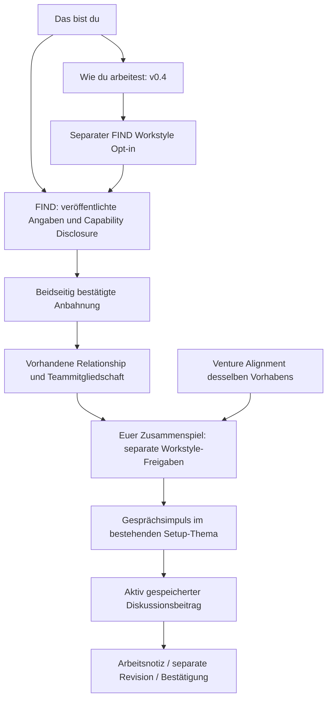

# Phase 9.1 – ALIGN Journey, Versionen und Freigabeverträge

Stand: 4. Oktober 2026. Umsetzung auf `feat/workstyle-reporting-v04`, Ausgangscommit `ea95212bd3fdb96d24b75e535950ee89e781a45b`. Änderungen sind lokal, noch nicht committed oder deployed. Grundlage: [Systemaudit Phase 9.0](phase-9.0-align-system-audit.md). Die bereits vorhandene Auditdatei wurde nicht verändert.

## 1. Ergebnis und vorher/nachher

Die bestehenden Produktbausteine bleiben die Architektur. Die aktuelle Journey führt zur aktuellen Workstyle-Erhebung, zum vorhandenen n-Member-Report und zum bestehenden Founder Setup.

| Bereich | Vorher | Jetzt |
|---|---|---|
| Person / Über dich | Status und CTA auf `founder-profile-v1` | Status ausschließlich aus `founder-workstyle-pretest-8-5a-v3`; aktueller Report unter `/me/profile/workstyle` |
| ALIGN-Navigation / Dashboard | ältere Profilfassung, sieben alte Screens, Paarvergleich | aktueller Workstyle-Einstieg; eigene Venture-Angaben separat; bestehende Teamreports bevorzugt |
| Angenommene Einladung | abhängig von alter Assessment-Version zum Abschluss/Paarreport | vorhandene, autorisierte Teamzuordnung zuerst; ansonsten aktueller Workstyle-Einstieg |
| FIND-Anbahnung | gemeinsamer Bereich erst über alten Report/Matching Workspace | nach beidseitiger bestehender Bestätigung expliziter Button zum bestehenden Relationship-/Teammodell; kein alter Fragebogen/Report als Voraussetzung |
| Homebase | alte Paarreports und Workbooks als regulärer Alignment-Abschnitt | aktueller Report und getrennte Status; frühere Paarreports/Workbooks eingeklappt |
| Teamreport → Setup | allgemeiner Link zur Setup-Übersicht | Bereich → passendes vorhandenes Thema → editierbarer Gesprächsimpuls → explizites Speichern als Diskussion |
| FIND Workstyle | v1-Themendistanzen und älterer Kompatibilitätssignalpfad | eigener v0.4-Opt-in und eng begrenzte beschreibende Bereichshinweise |

Das Diagramm beschreibt die verbundenen Einstiege, keine automatische Datenübernahme. FIND-Opt-in erteilt keine Teamfreigabe; Teammitgliedschaft erteilt keine Antwortfreigabe.

## 2. Versionen und aktuelle Einstiege

Unverändert:

- Instrument `founder-workstyle-pretest-8-5a-v3`
- Itemversion `8.4-v0.4`, Manifest `3.0.0`
- 29 produktfähige Core-Antworten; 23 private Research-/Candidate-Antworten
- Reportmodell `workstyle-report/1.0.0`
- Research-Consent `workstyle_research_v3`
- Venture Alignment `venture-alignment-v1`, unveränderte 42 aktive Items

`features/instruments/workstyle/current.ts` benennt die aktuelle Journey explizit. Der historische globale `CURRENT_INSTRUMENT_ID` wurde **nicht** ausgetauscht: alte Leser benötigen weiterhin ihren eigenen Instrumentvertrag.

Geänderte Einstiege:

- `aboutYouData.ts`, `aboutYou.ts`: aktuelle Erhebung und aktueller Einzelreport.
- `dashboardData.ts`, `AlignCard`, `founderWorkProfileState`: v0.4-Erhebung und Status; keine sieben alten Workstyle-Screens mehr als aktueller Umfang.
- `AlignNav`, `navState`, `ProductShell`: aktueller Workstyle; Venture-Einstieg bleibt eigenständig.
- Dashboard-Aufgaben: aktuelle persönliche Workstyle-Links, historische Values-Aufgaben bleiben aus der aktuellen persönlichen Priorisierung herausgenommen.
- Dashboard-Einladungen: vorhandene aktuelle Teamzuordnung vor altem Report-CTA. Das automatische alte Report-Finalisieren wird für solche zugeordneten Teams nicht mehr aufgerufen.
- Connections und Homebase: aktueller Teamreport vorrangig.
- Einladung fortsetzen/abschließen: bestehende Teamzuordnung wird mit Nutzer-/Mitgliedschaftsprüfung gelesen. Ohne aktuelle Teamzuordnung wird kein älteres Instrument als neue Pflichtstrecke angeboten.
- Aktuelle Pretest-Seite kann bei gültigem Einladungskontext zum bestehenden Teamreport zurückführen.

## 3. Historischer Bestand

`founder-profile-v1`, `founder-compatibility-v1`, Piloten, alte Reportmodelle, Antworten, Snapshots und Workbooks werden nicht gelöscht oder migriert.

- `/founder-alignment/profil`: historische URL bleibt gültig. Mit vorhandenem Altbestand führt sie zum historischen Leser; ohne Altbestand zur aktuellen Erhebung. Sie legt keinen neuen v1-Fragebogen an.
- `/founder-alignment/profil/antworten`: „Frühere Auswertung“; Link zur aktuellen Arbeitsweise.
- `/founder-alignment/vergleich/[partnerId]`: historische Kennzeichnung und aktueller Teamreport-Link bei passendem gemeinsamem Venture.
- Historische Paarreports/Workbooks in der Team-Homebase sind eingeklappt erreichbar.
- Alte Score-Engines bleiben für historische Reports vorhanden. Neue FIND- und aktuelle Teamreportpfade rufen sie nicht auf.
- Alte FIND-Themenpräferenzen bleiben gespeichert. Ihre bisherige aktuelle Eingabemaske wird durch den v0.4-Opt-in abgelöst; die Daten werden nicht umgedeutet.

Der alte `discovery_theme_distances(uuid)`-RPC behält seine Signatur, liefert aber keine Datensätze mehr. Das schließt auch direkte authentifizierte RPC-Aufrufe ohne individuelle Freigabe. Dies betrifft die **Discovery-Auslieferung**, nicht historische Reportleser oder gespeicherte Antworten. Der entsprechende DB-Test prüft jetzt Nichtauslieferung und Bestandserhalt.

## 4. Getrennte Statusverträge

| Status | Datenquelle / Bedeutung |
|---|---|
| Workstyle noch offen / in Arbeit / vorhanden | Eigene aktuelle v0.4-Assessmentzeile; ein leerer angefangener Entwurf gilt als in Arbeit; `submitted_at` als vorhanden |
| Venture Alignment noch offen / in Arbeit / vorhanden | Eigenes `venture-alignment-v1`-Assessment für exakt dieses Team/Venture |
| Teamreport noch nicht verfügbar | Teamgröße oder aktuelle kompatible abgeschlossene Workstyle-Versionen fehlen |
| Teamreport Freigabe fehlt | Aktuelle abgeschlossene Profile vorhanden, aber der vorhandene Produktleser kann nicht alle benötigten Core-Antworten für diesen Leser liefern |
| Teamreport verfügbar | Bestehender Produktleser liefert das Teammodell |
| Setup offen / in Klärung / bestätigte Themen vorhanden | Bestehende `work_status`, `pending_revision_id`, `current_confirmed_revision_id` |

Fehler werden als nicht verfügbar dargestellt. Kein gemeinsamer Vollständigkeitswert, kein Prozentwert. Teamstatus-RPC ist ausschließlich für die bestehende Teamreport-Zielgruppe zugänglich und gibt nur einen aggregierten Status zurück.

## 5. Teamreport- und FIND-Handoffs

`currentJourneyData.ts` liest bestehende `relationships.founder_team_id` und überprüft tatsächliche Mitgliedschaft unter RLS. Keine Teamneuanlage beim Lesen.

Für eine beidseitig bestätigte FIND-Anbahnung schließt `open_discovery_workstyle_team` die bisherige Versionslücke:

1. authentifizierter Teilnehmer des bestehenden `discovery_matching_starts`;
2. Start `ready_for_matching`, bestätigter gemeinsamer Schritt;
3. dazugehöriges angenommenes Intro mit denselben Personen;
4. kein abgebrochener Matching-Kontext;
5. explizite Nutzeraktion;
6. bestehende eindeutige Relationship wiederverwenden/erstellen;
7. bestehendes `ensure_founder_team_for_relationship(..., 'pre_founder')` verwenden.

Wiederholung liefert dasselbe Team. Keine neue Relationship-/Invite-Architektur, kein Workbook-Zwang, keine automatischen Shares, Assessments, Reports oder Vereinbarungen. Die Teamgröße und bestehende 2–4-Grenze bleiben unverändert. Ein FIND-Intro verbindet weiterhin zwei Personen; die spätere Teamgrößenkonsolidierung ist Phase 9.2.

## 6. Report → Founder Setup

`setupHandoff.ts` enthält eine erlaubte, deterministische Themenzuordnung:

| Workstyle-Bereich | Bestehendes Setup-Thema |
|---|---|
| EVI, EXP, EL, AMB | `decision_rights` |
| VOICE | `communication` |
| ORG | `roles_responsibilities` |

Die Frage stammt aus dem bestehenden Produktreportmodell. Die URL transportiert nur den erlaubten Bereichsschlüssel, keine Rohantwort, keine freie Befundkopie. Setup akzeptiert ihn nur, wenn Bereich und Thema zusammenpassen.

Der vorhandene `FounderSetupDiscussionComposer` erhält optional einen editierbaren Ausgangstext. Erst der bestehende Button ruft `create_founder_team_setup_discussion_entry` auf. Arbeitsnotiz, Revision und Bestätigung bleiben separate vorhandene Handlungen. Reload oder GET erzeugen keinen Diskussionsbeitrag und keine Vereinbarung. Advisor bekommen diese Bearbeitungshandoffs nicht aufgrund ihres Reportzugriffs; nur tatsächliche Mitglieder sehen den neuen CTA.

Venture Alignment, R02-Sonderbehandlung bei mehreren Foundern, vorhandene Setup-/Deep-Dive-Handoffs, Commitment Lab, RMM und FITW bleiben fachlich unverändert. Es werden keine Rohdaten aus diesen Modulen in FIND oder automatisch in Setup kopiert.

## 7. FIND Workstyle Opt-in

Keine neue Consent-Tabelle. Drei zusätzliche Felder in der vorhandenen privaten `founder_search_preferences`:

- `workstyle_discovery_enabled`, Standard `false`
- `workstyle_discovery_consent_version`
- `workstyle_discovery_consented_at`

Version: `workstyle_discovery_v1`.

`set_discovery_workstyle_consent(boolean)` schreibt ausschließlich diese Felder für `auth.uid()` und verlangt die bestehende Founder-Berechtigung. Aktivierung setzt Zeit und Version serverseitig. Widerruf deaktiviert und entfernt den aktuellen Consent-Zeitpunkt/Versionswert; es handelt sich um den aktuellen Zweckzustand, kein neu eingeführtes Consent-Ereignisarchiv. Bestehende Suchkriterien und Capability-Einstellungen werden nicht überschrieben.

UI unter `/discovery/suche#workstyle`, DE und EN. Klar beschrieben: freiwillig, nur FIND, abgeleitete Hinweise statt Antworten, beide Personen müssen zustimmen, keine Kompatibilitätszahl, keine Workstyle-Rangfolge, jederzeit widerrufbar. Team-, Advisor- und Forschungseinwilligungen werden nicht übernommen.

## 8. FIND Signalvertrag

`get_discovery_workstyle_signals(uuid)` ist der einzige neue aktuelle Auslieferungsweg:

- authentifizierter Discovery-Founder;
- aktive veröffentlichte Kandidatenansicht;
- beide Personen mit genau diesem Opt-in;
- jeweils neueste abgeschlossene Workstyle-Erhebung **vor** Versionsentscheidung auswählen;
- beide v3, beide Manifest `3.0.0`, Itemversion `8.4-v0.4`;
- exakt 29 Produkt-Core-Zeilen je Person über versionierte Itemdefinitionen;
- ausschließlich `scientific_status=core`, `usage=core`, `research_only=false`, `area_status=development_area`;
- keine Abfrage von Forschungsantworten, Feedback, DEC, FS, Setup, Commitment, RMM, FITW, Advisor-Notizen oder Venture-Finanz-/Risikoantworten.

Pro Item gelten dieselben beschreibenden Bereiche wie im Produktreport: ordinal 1–2 / 3 / 4–5. FC wird als Richtung A/B verglichen, nicht numerisch. Behavioral-Antworten werden für diese konservative Discovery-Projektion noch nicht ausgewertet. Es gibt keine Aggregation zu einem Wert und keine Distanz.

Ein Bereich benötigt mindestens zwei gemeinsam beschriebene Items und mindestens die Hälfte seiner hierfür geeigneten Items. Sonst `INSUFFICIENT_DATA`. Gleiche Bereiche in allen vergleichbaren Situationen ergeben `SIMILAR_PATTERN`; sonst `DISCUSSION_POINT`. Diese Kategorien beschreiben Antwortmuster, keine Eignung oder Norm.

Ausgabeschema: ausschließlich `{ area_key, pattern }`. Die TypeScript-Grenze projiziert diese zwei Felder erneut und verwirft unbekannte Bereiche/Kategorien. Weder Rohwerte noch Item-IDs, individuelle Antwortbereiche, Abstände, Zählwerte, Consent-/Researchmetadaten oder fremde Präferenzen werden ausgeliefert.

Die Hinweise erscheinen in fester Bereichsreihenfolge, maximal zwei pro Suchkarte und ausführlicher auf der Personenseite. Sie beeinflussen weder Sortierung noch praktische Suchkriterien. Fehlende Freigabe wird nicht als Eigenschaft einer bestimmten fremden Person offengelegt. Widerruf wirkt bei jedem neuen Abruf; keine persistierte Signalprojektion und kein anfrageübergreifender Signalcache. Bereits beim Empfänger angezeigter Inhalt kann technisch nicht zurückgeholt werden.

## 9. Security / Freigaben

| Vertrag | Verhalten in Phase 9.1 |
|---|---|
| Teammitgliedschaft | bestehende Tabelle/RLS; keine implizite Antwortfreigabe |
| Workstyle Share / verborgene Items | bestehender Produktleser unverändert; fehlende Core-Freigaben verhindern Report |
| Discovery Workstyle | neuer enger Zweckzustand auf vorhandener Präferenztabelle; keine Übernahme alter Opt-ins |
| Capability Disclosure | unverändert: Areas/Depth/Ownership nur nach bestehendem Vertrag; Evidence und Vorschläge privat |
| Advisor Person / Teamreview | bestehende Grants und Produktleser unverändert |
| Setup Advisor Grant | unverändert, kein automatischer Schreib- oder Rohdatenzugriff |
| Research Consent | unverändert, weder FIND- noch Produkt-Share-Ersatz |

RPCs verwenden `SECURITY DEFINER` mit leerem `search_path` und expliziten Zugriffsprüfungen. Der interne Band-Helfer ist für `public`, `anon` und `authenticated` nicht ausführbar. Neue öffentliche RPCs sind für `anon` nicht freigegeben. Bestehende RLS-Policies wurden nicht gelockert.

## 10. Migration / lokale Anwendung

Neue additive Migration:

`supabase/migrations/20261115120000_discovery_workstyle_contract.sql`

Enthält Consent-Felder, Setter, privaten Band-Helfer, Signal-RPC, Stilllegung der unfreigegebenen alten Discovery-Auslieferung, aggregierten Teamstatus und den bestätigten FIND→Team-Handoff. Die letzten beiden Funktionen schließen zwingende Versions-/Freigabeübergänge, ohne neue Stores einzuführen.

Lokal auf `supabase_db_cofoundery-app` angewandt; anschließend ausdrücklich mit `supabase migration repair 20261115120000 --status applied --local` in der lokalen Migrationshistorie vermerkt. Keine historische Migration geändert, keine alten Antworten umgeschrieben. Kein Remote DB Push.

## 11. Prüfungen

| Prüfung | Ergebnis |
|---|---|
| `npm test` | 2.765 Tests erfolgreich, keine fehlgeschlagenen oder übersprungenen Tests |
| `npx tsc --noEmit` | erfolgreich |
| `npm run lint` | Exit 0, keine Fehler; 43 bestehende Warnungen im Projekt |
| `npm run build` | erfolgreich |
| `npm run db:test` | 141 Dateien, 2.200 pgTAP-Prüfungen, PASS |
| `git diff --check` | erfolgreich |
| Browser Desktop 1280px / Mobile 390px | aktuelle Einstiege, Opt-in, Widerruf, Teamstatus, Handoff geprüft |
| Browser Vier-Founder-Report / PDF | vollständig gerendert, kein horizontaler Seitenüberlauf, PDF erzeugt |
| Browser Setup-Schreibpfad + DB | ein expliziter Diskussionsbeitrag; null neue Revisionen/Vereinbarungen |
| Browser-Konsole | keine Browserexceptions im finalen Durchlauf |

Die unveränderte Report-DB-Suite prüft weiterhin 2/3/4-Founder, Advisor-Grants, Capability Disclosure, Research-Ausschluss und Snapshots. Neue Tests prüfen Zweckgrenze, einseitig unzureichenden Opt-in, Widerruf, versionierten Produkt-Core, gleiche/unterschiedliche Muster, Missing, unveröffentlichte Raw-Payloads, deaktivierte Legacy-Distanzen, keine Wirkung privater Forschungsantworten, fehlenden Versions-Fallback, fremden Zugriff und idempotenten bestätigten FIND-Handoff. UI-/Integrationstests wurden dort aktualisiert, wo sie ausdrücklich die jetzt ersetzte v1-Journey festschrieben; historische Engine-Tests bleiben erhalten.

Testhinweise: Die erste Gesamtdatenbankrunde mit gleichzeitig aktiven Browser-Testprofilen kollidierte mit alten globalen Discovery-Anzahl-Fixtures. Nach Entfernung ausschließlich der neu angelegten Browser-Testkonten lief die vollständige Suite grün. Die Testkonten, Testteams und lokalen Auth-State-Dateiinhalte wurden bereinigt. Bestehende Nutzerdaten wurden nicht gelöscht. Browserartefakte und Logs liegen ausschließlich unter `/tmp/phase91-*`, nicht im Repository.

## 12. Restpunkte / Grenzen

- Reporttexte und Teile der bisherigen ALIGN-/Team-UI sind weiterhin deutsch; der neue FIND-Freigabe- und Hinweisvertrag ist DE/EN. Keine globale Übersetzungsüberarbeitung in dieser Phase.
- Einige Labs und ältere Paarartefakte bleiben ausdrücklich paarbezogen. Kein Pairwise-Hack für größere Teams und keine neue Teamgrößensemantik.
- Angenommene historische Einladungen ohne zugeordnete Founder-Team-Struktur werden nicht still nachträglich einem Venture zugewiesen. Die aktuelle Erhebung ist erreichbar; eine historische Kontextzuordnung wird nicht geraten.
- Behavioral-Items bleiben in FIND bewusst ohne abgeleitetes Signal. Keine neue psychometrische Auswertung.
- Der konservative Bereichshinweis ist kein validierter Prädiktor. Forschungsdaten bleiben ausgeschlossen.
- Alte Suchpräferenz-/Score-Helfer und historische Tabellen sind noch vorhanden, aber aus aktuellen FIND-Auslieferungspfaden entfernt. Archivierung/Löschung folgt separat.
- Manuelle fachliche Endabnahme sowie eine spätere lokale/Remote-Releaseentscheidung bleiben erforderlich. Keine Veröffentlichung Teil dieser Arbeit.

## 13. Vorbereitung Phase 9.2 und 9.3

**Phase 9.2:** Modulweise Teamgrößen und Handoffs konsolidieren. Bestehenden 2–4-Report und n:m-Mitgliedschaften behalten. Historische Kontextzuordnungen explizit behandeln. Paar-Labs ehrlich begrenzen; Advisor-Teamkontexte und Setup-Rechte weiterhin getrennt prüfen.

**Phase 9.3:** Anhand der Deletion Map des Audits das große Legacy Workbook archivieren/entfernen. Historische Leser und Snapshot-Verträge vorher sichern. Das kleine Workbook braucht für die neue Journey keinen Pflichtplatz mehr: Befund → Gesprächsimpuls → Notiz wird bereits durch Report/Setup erfüllt. Eigenständige nützliche Inhalte vor einer Entfernung gesondert entscheiden, keinen neuen Agreementstore bauen.

## 14. Geänderte Dateien

Die folgende Liste enthält die Phase-9.1-Änderungen. Die zuvor bereits ungetrackte Phase-9.0-Auditdatei zählt nicht dazu.

- `docs/research/phase-9/phase-9.1-align-journey-implementation.md`
- `supabase/migrations/20261115120000_discovery_workstyle_contract.sql`
- `supabase/tests/discovery_theme_distances.sql`
- `supabase/tests/discovery_workstyle_contract.sql`
- `web/messages/de/find.json`
- `web/messages/de/navigation.json`
- `web/messages/en/find.json`
- `web/messages/en/navigation.json`
- `web/src/app/(product)/connections/page.tsx`
- `web/src/app/(product)/dashboard/page.tsx`
- `web/src/app/(product)/discovery/[profileId]/page.tsx`
- `web/src/app/(product)/discovery/intros/[introRequestId]/matching/page.tsx`
- `web/src/app/(product)/discovery/page.tsx`
- `web/src/app/(product)/discovery/suche/page.tsx`
- `web/src/app/(product)/founder-alignment/profil/antworten/page.tsx`
- `web/src/app/(product)/founder-alignment/profil/page.tsx`
- `web/src/app/(product)/founder-alignment/vergleich/[partnerId]/page.tsx`
- `web/src/app/(product)/invite/[sessionId]/done/page.tsx`
- `web/src/app/(product)/research/workstyle-pretest/page.tsx`
- `web/src/app/(product)/teams/[teamId]/page.tsx`
- `web/src/app/(product)/teams/[teamId]/setup/[itemKey]/page.tsx`
- `web/src/app/(product)/teams/[teamId]/workstyle/page.tsx`
- `web/src/features/dashboard/__tests__/founderDashboardTasks.test.ts`
- `web/src/features/dashboard/__tests__/founderWorkProfile.test.ts`
- `web/src/features/dashboard/founderDashboardTasks.ts`
- `web/src/features/dashboard/founderWorkProfileState.ts`
- `web/src/features/discovery/FounderDiscoveryCard.tsx`
- `web/src/features/discovery/__tests__/discoverySlice2.test.ts`
- `web/src/features/discovery/discoveryData.ts`
- `web/src/features/find/DiscoveryWorkstyle.tsx`
- `web/src/features/find/DiscoveryWorkstyleConsent.tsx`
- `web/src/features/find/__tests__/matchPoints.test.ts`
- `web/src/features/find/__tests__/workstyleContract.test.ts`
- `web/src/features/find/discoveryWorkstyleActions.ts`
- `web/src/features/find/workstyleSignalData.ts`
- `web/src/features/find/workstyleSignals.ts`
- `web/src/features/instruments/align/AlignCard.tsx`
- `web/src/features/instruments/align/AlignNav.tsx`
- `web/src/features/instruments/align/__tests__/einladungFassung.test.ts`
- `web/src/features/instruments/align/__tests__/nurEineFassung.test.ts`
- `web/src/features/instruments/align/__tests__/umstiegAufDieNeueFassung.test.ts`
- `web/src/features/instruments/align/__tests__/wegeInDerNeuenFassung.test.ts`
- `web/src/features/instruments/align/dashboardData.ts`
- `web/src/features/instruments/align/navState.ts`
- `web/src/features/instruments/v21/__tests__/pilotPagesSayWhatTheyAre.test.ts`
- `web/src/features/instruments/workstyle/current.ts`
- `web/src/features/navigation/ProductShell.tsx`
- `web/src/features/navigation/__tests__/alignMenuOrder.test.ts`
- `web/src/features/onboarding/invitationFlow.ts`
- `web/src/features/profile/__tests__/ueberDich.test.ts`
- `web/src/features/profile/aboutYou.ts`
- `web/src/features/profile/aboutYouData.ts`
- `web/src/features/reporting/workstyle/TeamWorkstyleReport.tsx`
- `web/src/features/reporting/workstyle/setupHandoff.ts`
- `web/src/features/teams/FounderSetupDiscussionComposer.tsx`
- `web/src/features/teams/FounderTeamNavigation.tsx`
- `web/src/features/teams/TeamJourneyStatus.tsx`
- `web/src/features/teams/currentJourneyData.ts`

## Bestätigungen

NO LEGACY USER DATA DELETED

NO RESEARCH DATA EXPOSED

NO REMOTE DB PUSH PERFORMED

NO PRODUCTION DEPLOY PERFORMED
